# Debugging with Thonny

## Programming mistakes

Everyone makes mistakes—even experienced programmers.

Python is good at finding some mistakes, like syntax errors (when the code is written wrong) and run-time errors (when something goes wrong while the program is running).

There is another type of mistake called a **logic error**. This happens when your code runs without crashing, but it does not do what you expected.

For example, type the code below and save it as `buggy_code.py` or download {download}`buggy_code.py<./python_files/buggy_code.py>` file and save it in your lesson folder.

```{literalinclude} ./python_files/buggy_code.py
:linenos:
```
The expected output is `_h_e_l_l_o_`. When you run the program, it actually shows `o_`.

This means there is a logic error.

Logic errors cause unexpected results called **bugs**. **Debugging** is the process of finding and fixing these bugs.

A **debugger** is a tool that helps you track down bugs and see what your program is doing step by step.

Learning how to find and fix bugs is an important skill you will use whenever you write code.

---

## Using Thonny's Debugger
To debug `buggy_code.py`, you need to learn how to use debugging tools.

Thonny has a built-in debugger, but first you need to set it up correctly.

Open the **View** menu and make sure there is a tick next to:

* **Stack**
* **Variables**

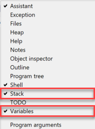

To start using Thonny’s debugger, click the **Debug** button.


### Controlling the debugger

To understand how the debugger works, start by writing a simple program with no bugs.

Type the code below into Thonny and save it as `debug_a.py`:

```{code-block} python
:linenos:
names = ["michelle", "nicole", "simone", "emma"]

for name in names:
    name = name.capitalize()
    print(f"Hello {name} how are you this morning")
```

Now start the debugger in Thonny.

Your Thonny window should now look like the image below:

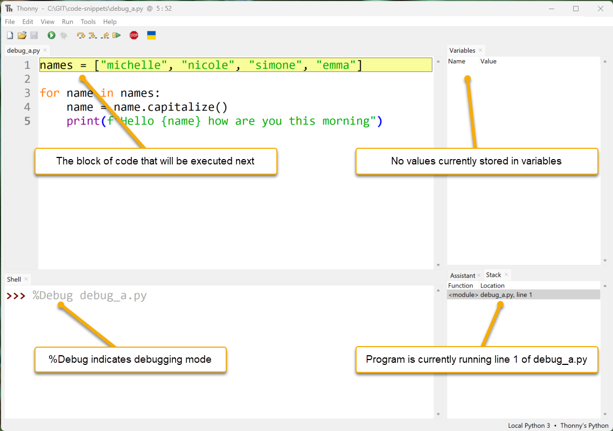

* **Code Panel:** Thonny has paused the program. The yellow line shows the next line of code that will run.
* **Variables Panel:** No variables are shown yet because nothing has been saved to memory.
* **Shell Panel:** `%Debug` is the command used to start the program (`debug_a.py`).
* **Stack Panel:** Shows which part of the program is currently running.

You will also notice that new debugging buttons are now available.

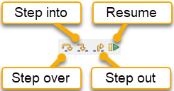

Lets see how they work.

### Step into button

Click the **Step into** button.

Thonny will run the line of code that was highlighted. The new highlighted line shows what Python will run next.

In this case, it is the list `["michelle", "nicole", "simone", "emma"]`.

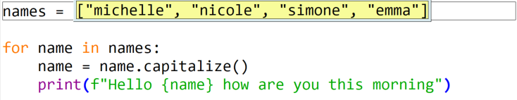

Clicking **Step into** again highlights `"michelle"`. This shows that Python will now evaluating this item.

---

Keep stepping through the code.

The word `"michelle"` will turn blue. This shows that Python has read that value.

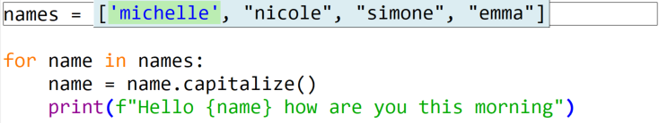

---

After four more clicks on **Step into** (or by pressing **F7**), Python will have read all of the strings.

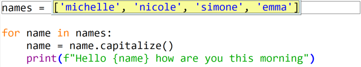

---

The next time you click **Step into**, Python is ready to store the list in the variable `names`.

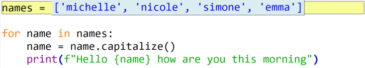

---

The next time you click **Step into**, a new line of code is highlighted. This shows what Python will run next.

The **Variables panel** now shows that `names` stores `["michelle", "nicole", "simone", "emma"]`.

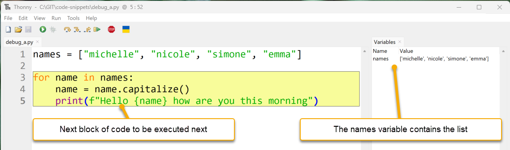

Notice that the highlight covers more than one line. This is because Thonny is showing all the code that belongs to the `for` loop.

Now you can step through the loop one part at a time.

---

Click **Step into**. Thonny will show that the next part of the code to run is `names`. This is the first part of the `for` loop statement.

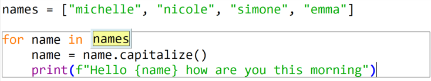

---

Click **Step into** again.

Thonny will replace `names` with the list that is stored inside the `names` variable.

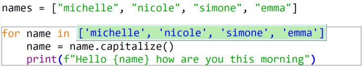

---

Because this is a `for` loop, the next **Step into** reads the first item in the list (`"michelle"`).

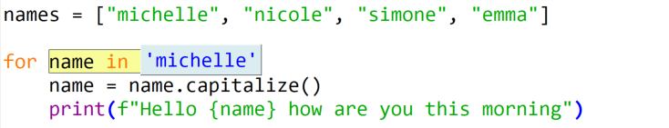

---

Click **Step into** again.

Line 4 will be highlighted. The value `"michelle"` is now stored in the variable `name`, which you can see in the **Variables panel**.

```{warning} Note
Do not mix up `name` and `names`. They look similar, but Python treats them as different.

* `name` is the variable used inside the `for` loop
* `names` is the list that the loop goes through
```

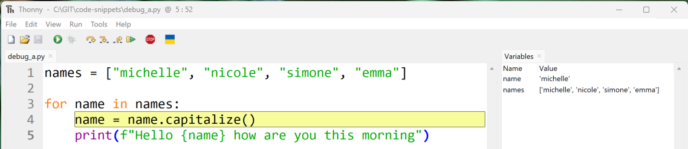

---

The next three times you click **Step into**:

1. it highlights `name.capitalize()`
2. it highlights `name`
3. it replaces `name` with `"michelle"`

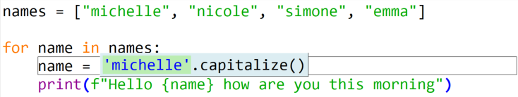

---

The next three times you click **Step into**:

1. it applies the `capitalize()` method to `"michelle"`
2. it changes `"michelle"` to `"Michelle"`
3. it updates the variable `name` to store `"Michelle"`

Line 4 is now finished, so line 5 will be highlighted next.

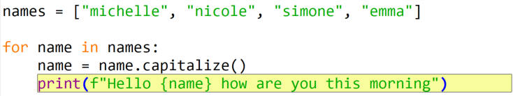

---

The next five times you click Step into show how Python builds an f-string and prints it to the screen.

You will also see that when the print() function runs, it returns a value called None.

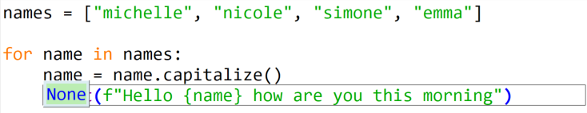

---

One more click on **Step into** takes you back to line 3.

The `for` loop now moves to the next item in the list, which is `"Nicole"`.

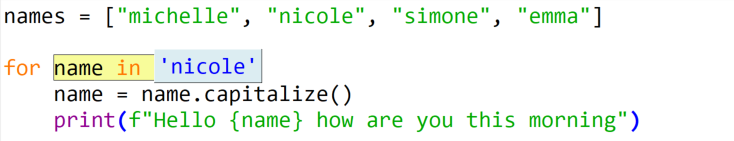

---

Click **Step into** one more time and Python stores `"Nicole"` in `name`.

We will use the next time through the `for` loop to explore how **Step over** works.

---

### Step over button

The **Step over** button runs the highlighted code without showing all the small steps.

When you click **Step over**:

1. it takes the value in `name` (`"nicole"`)
2. it changes it to `"Nicole"`
3. it stores the new value back in `name`


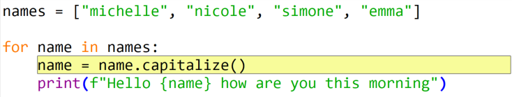

---

Click the **Step over** button and look at the result.

Notice that the value stored in `name` has been updated.

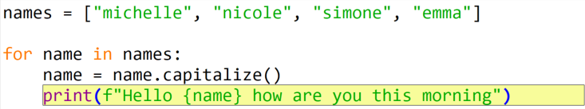

---

Clicking **Step over** again executes `line 5`. The highlight then returns to the `line 3` for statement.

```{hint} When to use Step over
Use **Step over** when you are confident the highlighted code is working properly.

Running code this way can help you find the bug faster because you skip over parts that are not causing problems.
```

Click **Step over** and then **Step into** until your code matches the position shown below.

Now we can look at how **Step out** works.

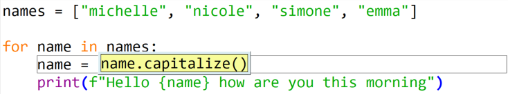

---

### Step out button

The **Step out** button finishes the rest of the current code block.

In the last example, the grey box around line 4 shows that you are inside that line of code.

Click **Step out**, and Thonny will jump back out and highlight all of line 4 again.

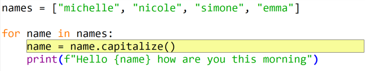

Click **Step out** again to move up one more level.

The debugger is now outside the `for` loop, and the program will finish running.

---

### Resume button and breakpoints

The last button is the **Resume** button. This works with **breakpoints**.

The **Resume** button runs the program until it reaches a breakpoint, then it pauses.

A **breakpoint** is a place where you tell the program to stop.

To add a breakpoint:

* click on the line number where you want the program to pause

Try this now:

* click on line number 4
* a red dot should appear next to the line number

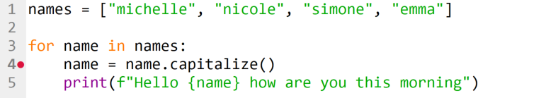

Now click **Debug**.

The program will run and then stop at the **breakpoint**.

At this point, you can look at the **Variables panel** to see the current values.

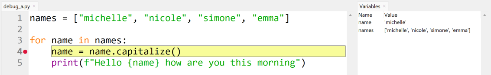

---

Click Resume again.

The program will keep running and then pause at the next breakpoint.

This will be line 4 again, but now on the second time through the for loop.

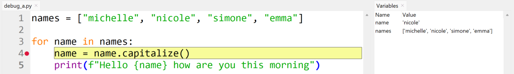

```{hint} Hint
Notice the changed values in the variables panel.
```

Now that you know how to use Thonny’s debugger, go back and debug `buggy_code.py`.

## Debugging a Logic Error

First, let’s look closely at `buggy_code.py`:

```{code-block} python
:linenos:
:emphasize-lines: 1-5, 7-8
def add_underscores(word):
    new_word = "_"
    for index in range(len(word)):
        new_word = word[index] + "_"
    return new_word

phrase = "hello"
print(add_underscores(phrase))
```

### Guess where the bug is located

The first step is to find the part of the code that might have the bug.

You might not know the exact line, so make a good guess about which section could be wrong.

This program has two main parts:

* a function (`lines 1` to `5`)
* the main code

Main code:

* line 7 → creates a variable called `phrase` with the value `"hello"`
* line 8 → prints the result of `add_underscores(phrase)`

Start by looking at the main code section.

```{code-block} python
:linenos:
:lineno-start: 7
phrase = "hello"
print(add_underscores(phrase))
```

Do you think the problem is here? It doesn’t look like it. These two lines seem correct.

So, the bug is probably in the function.

```{code-block} python
:linenos:
def add_underscores(word):
    new_word = "_"
    for index in range(len(word)):
        new_word = word[index] + "_"
    return new_word
```

The first line in the function creates a variable called `new_word` with the value `"_"`. That part looks correct.

So, the bug is likely somewhere inside the `for` loop.

---

### Set a breakpoint to inspect code

Now that you know where the bug is likely to be, add a breakpoint at the start of the `for` loop.

This will let you step through the loop and see exactly what is happening using the debugger.

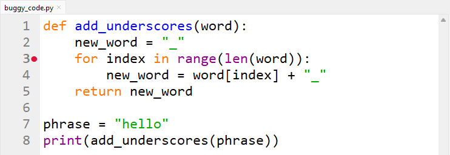

Click the **Debug** button to start the debugger.

Thonny will run the program until it reaches the breakpoint.

Your screen should now look like the image below. You will also notice some new features that you haven’t seen before.

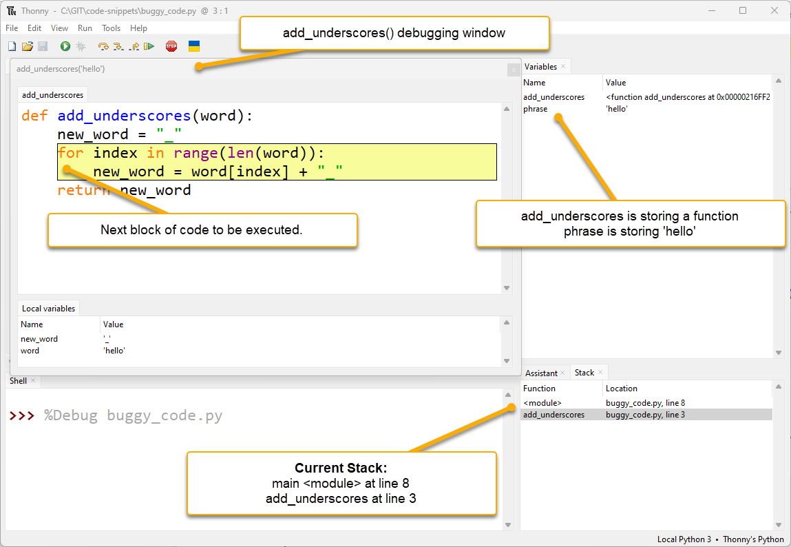

* **extra debugging window:**

  * Thonny opens a new window for the function `add_underscores("hello")`
  * This happens whenever Python starts working inside a function
  * You can see the **local variables** at the bottom of this window
  * **Local variables** are variables that only exist inside that function

* **multiple stack values:**

  * the **Stack panel** now shows two entries

    * `<module>` → the main program
    * `add_underscores` → the function

  * this tells you the program is currently at:

    * line 8 in the main program
    * line 3 inside the `add_underscores` function

```{admonition} Stack timeline
1. Line 8 in the main program calls the `add_underscores` function
2. Python pauses the main program at line 8 and waits for the function to finish
3. When the function finishes, the main program continues from line 8
```

Back to debugging.

Look at the `add_underscores` window. It shows two variables:

* `word` has the value `"hello"`
* `new_word` has the value `"_"`

These are correct so far.

Now, keep stepping through the code.

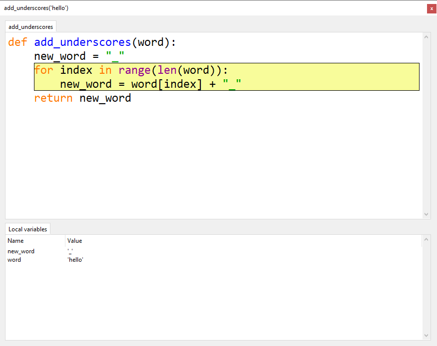

Click:

* **Step into** once
* **Step over** twice

You should now have `new_word = word[index] + "_"` highlighted and ready to run, like in the image below.

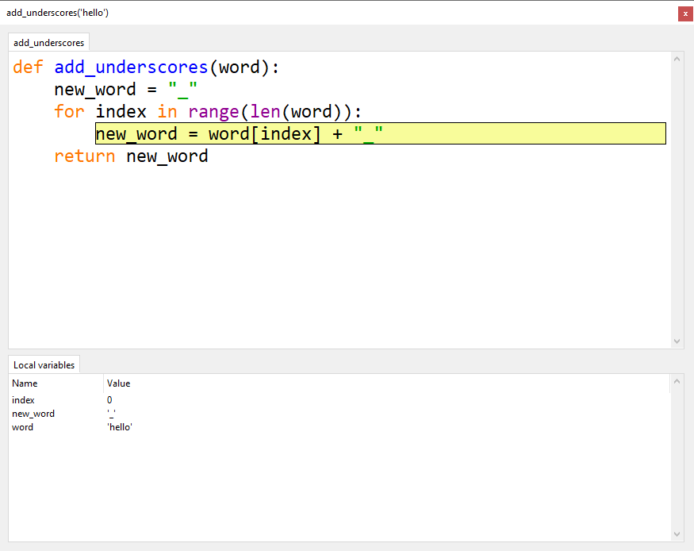

Notice that the local variable `index` is storing `0`.

This is correct for the first time through the loop.

```{hint} Can't see the index variable?
If you cannot see the `index` variable, resize the **Local variables** panel so it is bigger.
```

Now click **Step over** to run `new_word = word[index] + "_"` and look at what happens.

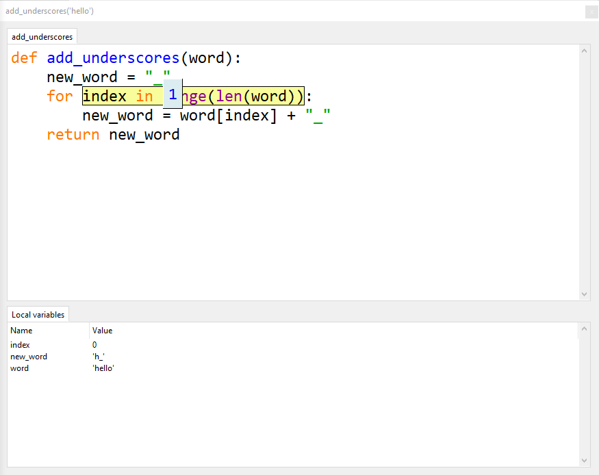

Notice that `new_word` now stores `"h_"`, but we wanted it to store `"_h_"`.

That means part of the value was replaced instead of added to.

**This is the exact place where the bug happens.**

### Investigate the error

Now that you know the bug is in this line:

`new_word = word[index] + "_"`

look at that line more closely to see what Python is doing.

First:

* click **Stop**
* then click **Debug** again

Next, click:

* **Step into** once
* **Step over** twice

You should now have the problem line highlighted and ready to run, like in the image below.


This time, step into the code so you can see each small part of what Python is doing.

Click **Step into** once. So far, everything still looks correct.

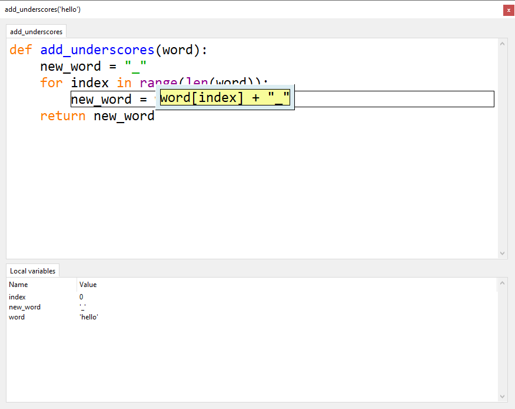

Click **Step into** again. Everything still looks correct.

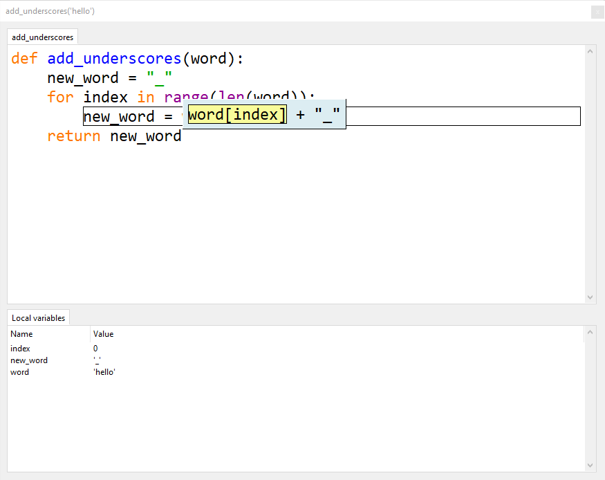

Click **Step into** a third time. Everything still looks correct.

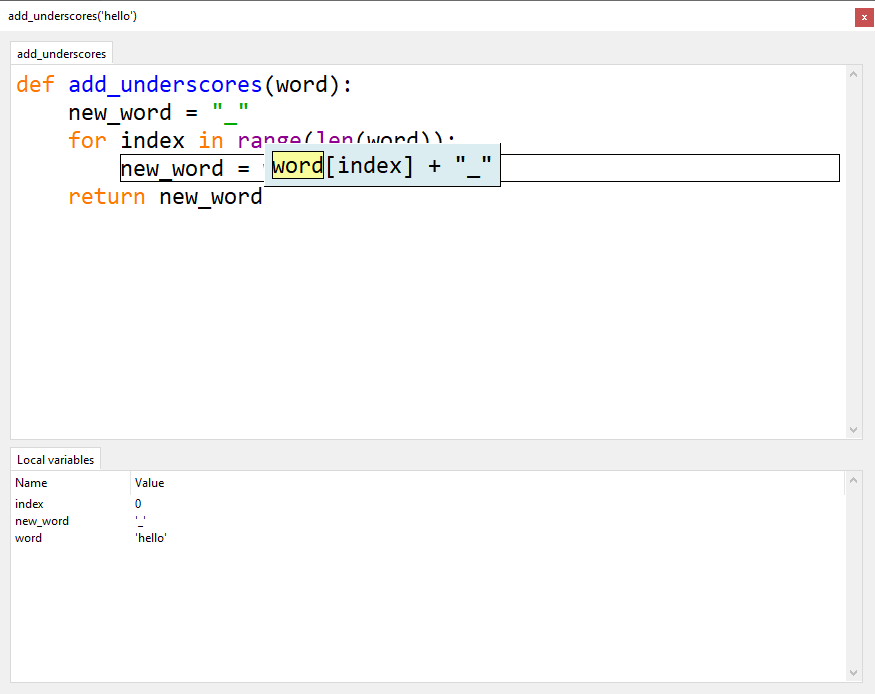

Keep clicking **Step into** and watch what happens in the **Local variables** panel.

Stop when your `add_underscores("hello")` looks like the one below.

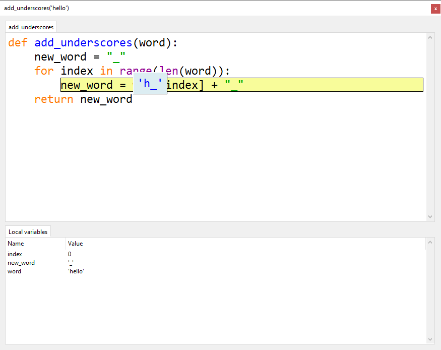

Look closely at the debugging window. You should notice:

* Python is about to store `"h_"` in `new_word`
* this is wrong
* we want it to store `"_h_"` instead

Now you know **exactly** where the bug is, you need to work out why it is happening.

### Fix the error

The `add_underscores()` function is meant to put a `_` between each letter. It should do this by repeatedly adding the next letter and `_` to the value already stored in `new_word`.

But the code is replacing `new_word` each time. This means it loses all the letters that were added before.

To fix this, the current value of `new_word` needs to be added at the front:

`new_word = new_word + word[index] + "_"`

Stop debugging and change the code to this line.

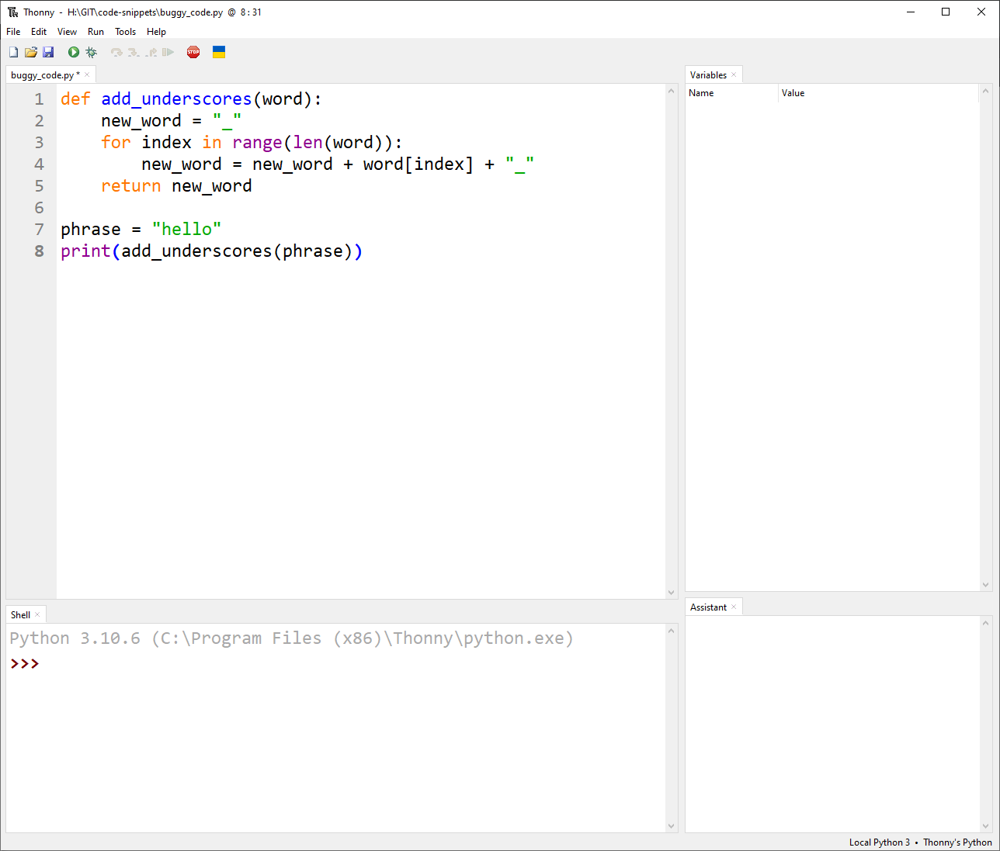

Run the program normally. Does it show `_h_e_l_l_o_`?

If it does, the problem is fixed.

You have successfully found and fixed a bug in your code.