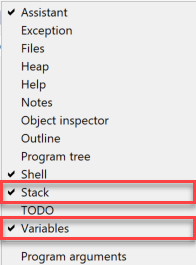
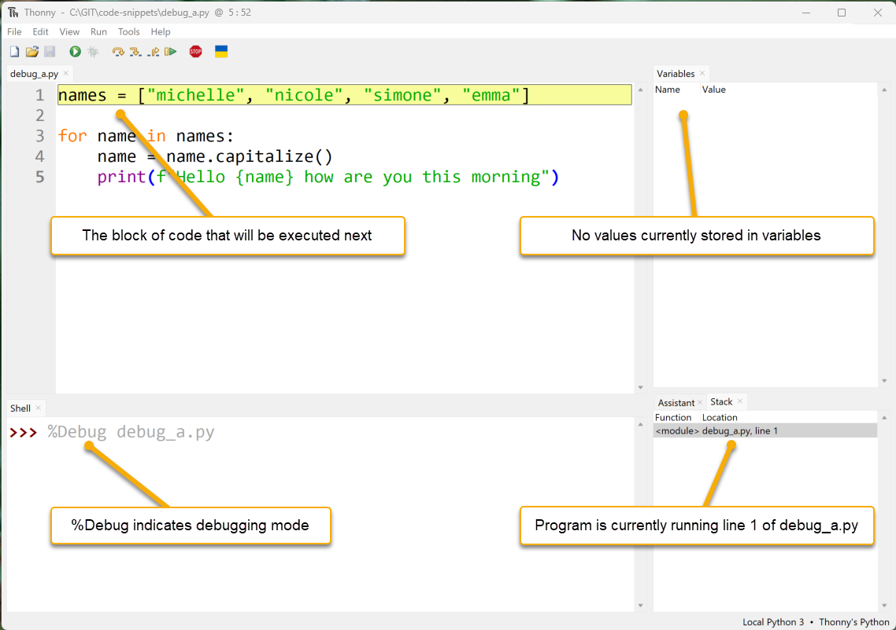
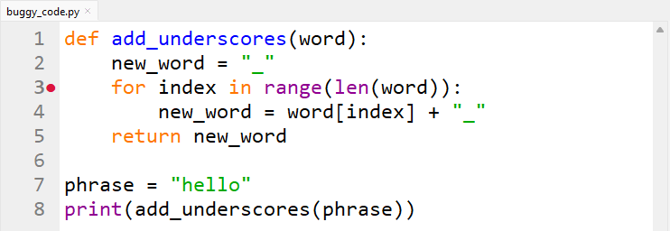
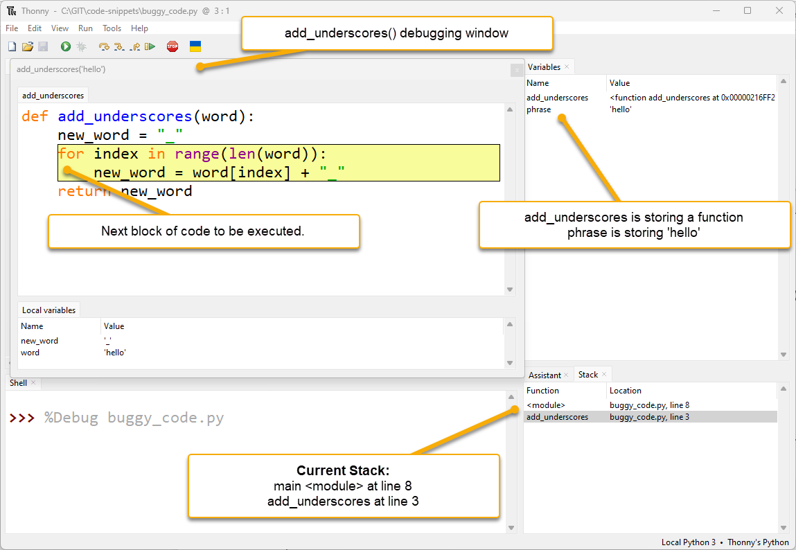
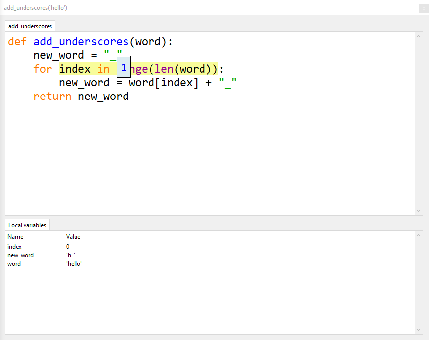
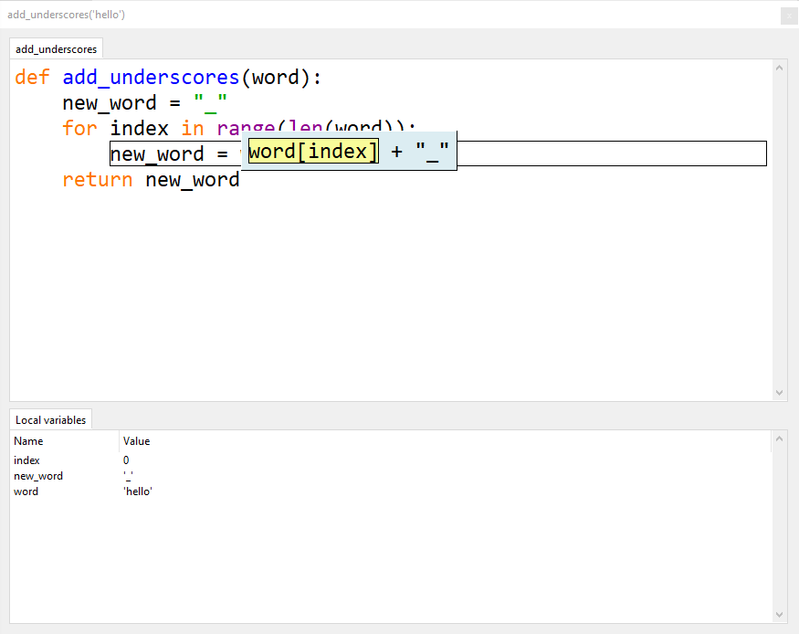
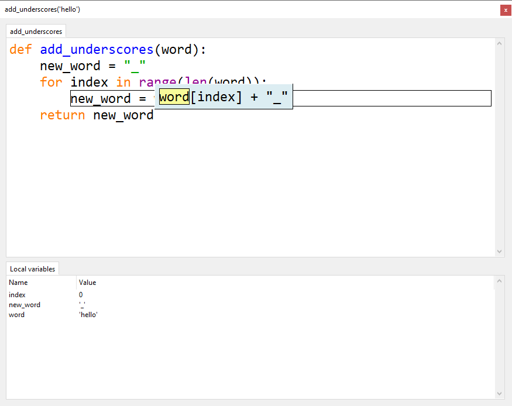
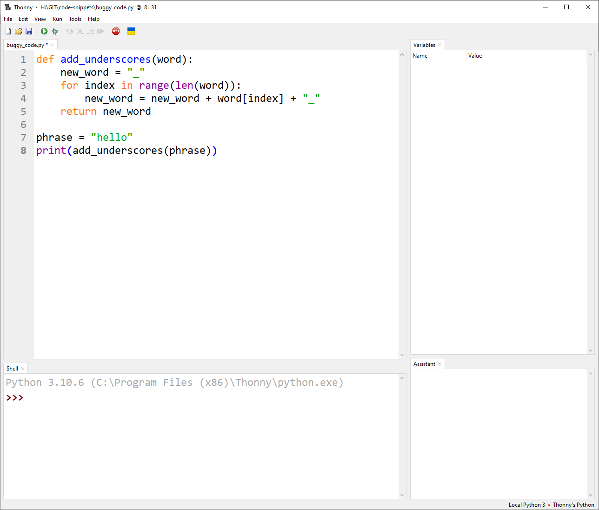

# Debugging with Thonny

## Programming mistakes

Everyone makes mistakes—even seasoned professional developers!

Python is good at catching mistakes like syntax errors and run-time errors. Unfortunately, there is a third type of error that you may have already experienced. **Logic errors** occur when a valid program doesn’t do what the programmer intended.

For example, type the code below and save it has `buggy_code.py`.

For this tutorial download {download}`buggy_code.py<./python_files/buggy_code.py>` file and save it to your lesson folder.

```{literalinclude} ./python_files/buggy_code.py
:linenos:
```

The expected output is `_h_e_l_l_o_`. Run it and you will see it actually outputs `o_`.

Logic errors cause unexpected behaviours called **bugs**. Debugging is process of removing bugs. A **debugger** is a tool that helps the programmer hunt down bugs and understand what's happening.

Knowing how to find and fix bugs in your code is a skill that you will use for your entire coding career!

## Using Thonny's Debugger

To debug `buggy_code.py` we need to understand the debugging tools we have at our disposal. Thonny has a debugger built-in, but before we explore it, we need to make sure you have the correct setup.

Open the **View** menu and ensure there is a tick beside both **Stack** and **Variables**.



To enter into Thonny's Debugger click on the **Debug** button.


### Controlling the debugger

To see how the debugger works, let’s start by writing a simple program without any bugs.

Type the following into Thonny and save it as `debug_a.py`:

```{code-block} python
:linenos:
names = ["michelle", "nicole", "simone", "emma"]

for name in names:
    name = name.capitalize()
    print(f"Hello {name} how are you this morning")
```

Now start Thonny's debugger.

Your Thonny should now look like the image below:



- **Code Panel:** Thonny has paused the execution of the code. The yellow highlight shows the code that Python will execute next.
- **Variables Panel:** Since the program hasn't assigned any values, it shows no variables.
- **Shell Panel:** %Debug launches is the command that launches the program (debug_a.py).
- **Stack Panel:** Shows the current function and module that is running.

Something else has happened, other debugging buttons are now available.


Lets see how they work.

### Step into button

Click the **Step into** button. Thonny will now execute the previous highlighted code block. The new highlighted code indicates the part of the code to Python will execute next.  In this case it is the list `["michelle", "nicole", "simone", "emma"]`.


Clicking **Step into** again highlights `"michelle"`. This shows that Python will now evaluating this item.

---

Continuing and the `"michelle"` turns blue indicating that Python has read it.


---

Four more **Step into** clicks (or pressing **F7** on your keyboard), and Python has read all the strings.


---

The next **Step into** shows that Python is now ready to write the list into the variable `names`.


---

The next **Step into** highlights the next block of code Python will process. The **Variables panel** shows that `names` now stores `["michelle", "nicole", "simone", "emma"]`.  


Notice that the highlight covers more than one line. Thonny is highlighting all the code that is part of the `for` loop. We'll now step through it.

---

Click **Step into** and it shows that the next executed code is `names`. This is the first element of the `for` statement.


---

A further **Step into** replaces `names` with the list stored in `names`.


---

Since this is a for loop, the next **Step into** reads the first element of the list ('michelle').


---

Clicking **Step into** highlights `line 4`. `michelle` is now stored in the `name` variable as displayed in the **Variables panel**.

```{admonition} Note
:class: attention

Do not confuse `name` with `names`. They're very close, but Python is very precise.
```


---

The next three **Step into** clicks:

1. highlights the `name.capitalize()`
2. highlights `name`
3. replaces `name` with `'michelle'`


---

The next three **Step into** clicks:

1. applies the `capitalize()` method to `'michelle'`
2. changes `'michelle'` to `'Michelle'`
3. overwrites the value in `name` with `'Michelle'`

`Line 4` is now complete, so `line 5` is now highlighted.


---

The next five **Step into** clicks show how Python processes an f-string and prints it to the terminal. It also shows that a call to the `print()` function returns a `None` value.


---

One more click on **Step into** returns to `line 3`. The `for` statement, has taken the next element from the names list (`'Nicole'`).


---

Click **Step into** one more time and Python stores `'Nicole'` in `name`.

We will use the next iteration of the `for` loop investigate how **Step over** works.

### Step over button

The **Step over** function processes the highlighted code without going into the details. The next click of **Step over:**

1. takes the value stored in name ('nicole')

2. capitalizes it to 'Nicole'

3. writes it back to name.  


---

Click the **Step over** button and you will see the results below. Notice the value stored in `name`.


---

Clicking **Step over** again executes `line 5`. The highlight then returns to the `line 3` for statement.

```{admonition} When to use Step over
:class: attention

Use **Step over** when you know that the highlighted code is bug free. Executing working code helps find the bug location quicker.
```

Click **Step over** and then **Step into** to move your code to the position below, so we can now look at the **Step out**.


### Step out button

The **Step out** completes the rest of the currently highlighted code. Look back at the last example, and notice the grey box around `line 4`? This box indicates that we have stepped into `line 4` and are processing it. Click **Step out** and Thonny will move back up a level to highlight all `line 4`.


Clicking **Step out** again will move back up one level. The debugger is now to outside the for loop and the program will finish.

### Resume button and breakpoints

The last button we need to look at is the **Resume** button. This works in conjunction with **breakpoints**. The **Resume** button will execute the code until it finds a **breakpoint**, then it will pause**.**

To add a **breakpoint** to your code, click on the line number that you wish to pause the program on.

Let's try this out. Click on the line number 4. A red dot should appear between the number and the code panel (as below):


Now click **Debug**.

Notice that the program runs and then pauses at the **breakpoint**. At this point, you can check the current values of the variables.


---

The next **Resume** click will restart the program. The debugger will pause at the next **breakpoint.** This is also `line 4` on the second iteration of the for loop.


```{admonition} Hint
:class: hint
Notice the changed values in the variables.
```

Now that we know how to control Thonny's debugger, let's go back and debug `buggy_code.py`.

## Debugging a Logic Error

First let's look closely at `buggy_code.py`:

```{code-block} python
:linenos:
:emphasize-lines: 1-5, 7-8
def add_underscores(word):
    new_word = "_"
    for index in range(len(word)):
        new_word = word[index] + "_"
    return new_word

phrase = "hello"
print(add_underscores(phrase))
```

### Guess the bug is location

The first step is to identify the section of code that is likely to contain the bug. You may not be able to identify exactly where the bug. So, make a reasonable guess about which section of your code has an error.

Notice that there are two distinct sections of the program:

- a function definition &rarr; `lines 1` to `5`

- main code block

  - `line 7` &rarr; defines a variable `phrase` with the value `"hello"`

  - `line 8` &rarr; then prints the result of calling `add_underscores(phrase)`

Look at the main section:

```{code-block} python
:linenos:
:lineno-start: 7
phrase = "hello"
print(add_underscores(phrase))
```

Do you think the problem could be here? It doesn’t look like it, right? Everything about those two lines of code looks good. So, the problem must be in the function definition:

```{code-block} python
:linenos:
def add_underscores(word):
    new_word = "_"
    for index in range(len(word)):
        new_word = word[index] + "_"
    return new_word
```

The first line of code inside the function creates a variable `new_word` with the value `"_"`. You’re all good there, so you can conclude that the problem is somewhere in the body of the `for` loop.

### Set a breakpoint to inspect code

Now that we’ve identified where the bug must be, set a breakpoint at the start of the for loop. This way we can trace out exactly what’s happening inside the loop with the debugging tool:



Click the **Debug** button to launch Thonny's debugger. Thonny will run the code until it hits the breakpoint. Your IDE should look like the image below. There are some new features we haven't seen before.



- **additional** **debugging window:**
  - notice that Thonny has launched a new debugging window for `add_underscores('hello')` function.
  - Whenever a Python enters a new scope Thonny will launch a debugging window for that scope.
  - The values stored in the **local variables** are at the bottom of the new window.
  - **Local variables** are variables that only the current function can see.

- **multiple** **stack values:**
  - in the stack panel you will now see two values.
    - first value <module> refers to the main section
    - second value refers to the add_underscores function section

  - This shows us that the program is at:
    - `line 8` in the main program
    - `line 3` of the add_underscores function section.

```{admonition} Stack timeline
:class: attention

1. `line 8` in the main module called the `add_underscores` function
2. Python pauses the main section at `line 8` at wait for the `add_underscores` function to finish
3. When the function finishes, the main section will continue from `line 8` onwards. 
```

Back to debugging. Notice the `add_underscores` window displays the word and new_word variables. Currently, `word` has the value `'hello'` and `new_word` has the value `'_'`, as expected.

Let's look further.


Click:

- **Step into** once
- **Step over** twice

You should end up with `new_word = word[index] + "_"` highlighted and ready to process (like below).


Notice the local variable index is storing 0. This is correct for the first iteration of the loop.

```{admonition} Hint
:class: hint
If you can't see the index variable, you may need to resize the *Local variables* panel.
```

Now click **Step over** to execute `new_word = word[index] + "_"` and have a look at the results.



Notice that new_word is now storing `'h_'`, whereas we want it to be storing `'_h_'`. What happened there? **We have found our error location.**

Now that we know the error is in the new_word = word[index] + "_" code. Let's investigate that code and see exactly what happened.

First click **Stop** and then **Debug** again.

Click:

- **Step into** once
- **Step over** twice

You should now have the problem code highlighted (like below).


This time we will step into the code and see what happens.

First **Step into** and everything looks good.


Second **Step into** everything is still fine.



Third **Step into**, all good.



Keep click **Step into** and follow what is happening in the Local variables. Stop when your `add_underscores('hello')` is in the state below:


Looking closely at the debugging code. You will notice:

- Python is about to assign the value of `'h_'` to  `new_word`
- This is not right!
- We want it to assign `'_h_'` to `new_word`  

Now we know **exactly** where the problem is, we need to work out why this is a problem.

`add_underscores()` is supposed to insert a `_` between each letter. It does this by repetitively concatenating the next letter and `_` to the value stored in new_word.

But our code is overwriting `new_word`. We are loosing all the previously processed letters.

What we need to do is concatenate the current value of `new_word` in front of the processed letter and _.

The line should read `new_word = new_word + word[index] + "_"`

Stop the debugging, make the change to the code below.



Run the program normally. Is the output `_h_e_l_l_o_`?

Problem solved. You have now successfully debugged faulty code.
