# Debugging with Thonny

Everyone makes mistakes, even experienced programmers. In this guide we will learn how to use Thonny's **debugger** to find and fix mistakes in our code.

## Programming mistakes

Python is good at finding some mistakes, like **syntax errors** (when the code breaks Python's rules) and **run-time errors** (when something goes wrong while the program is running).

There is another type of mistake called a **logic error**. This happens when our code runs without crashing, but it doesn't do what we expected.

For example, the program below is in the `guides` folder of the [tutorial files](../index.md#tutorial-files) as `buggy_code.py`.

```python linenums="1"
--8<-- "examples/guides/buggy_code/main.py"
```

The program should show `_h_e_l_l_o_`. When we run it, it actually shows `o_`. This means there is a logic error.

Logic errors cause unexpected results called **bugs**. **Debugging** is the process of finding and fixing bugs. A **debugger** is a tool that helps us track down bugs by showing what our program is doing, step by step.

## Setting up Thonny's debugger

1. Open the **View** menu and make sure there is a tick next to **Stack** and **Variables**.

    These panels show which part of the program is running and what values it has stored.

    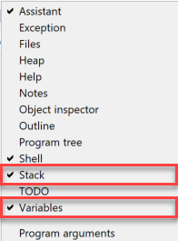

2. To start the debugger, click the **Debug** button.

    

## Controlling the debugger

To learn how the debugger works, let's start with a program that has no bugs. Type the code below into Thonny and save it as `debug_names.py`.

```python linenums="1"
--8<-- "examples/guides/debug_names/main.py"
```

Now click **Debug**. Thonny should look like the image below.

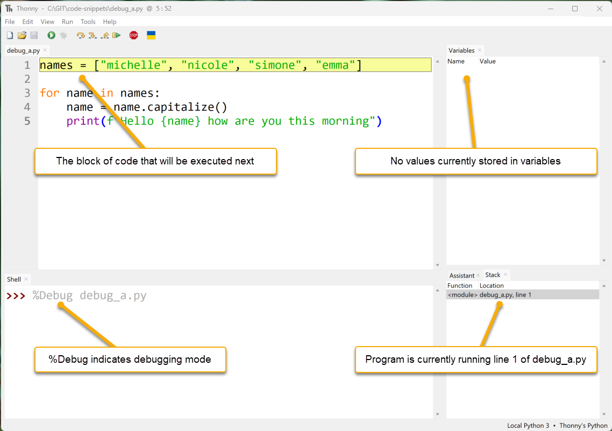

- **Code panel**: Thonny has paused the program. The yellow highlight shows the next code that will run.
- **Variables panel**: no variables are shown yet, because nothing has been stored in memory.
- **Shell panel**: `%Debug` is the command Thonny used to start the program.
- **Stack panel**: shows which part of the program is currently running.

New debugging buttons are now available. Let's see how they work.

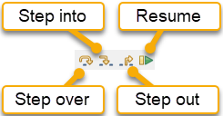

### Step into

1. Click **Step into**.

    Thonny runs the highlighted code. The new highlight shows what Python will run next: the list `["michelle", "nicole", "simone", "emma"]`.

    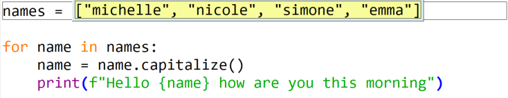

2. Click **Step into** again.

    `"michelle"` is highlighted. Python is about to read this value.

3. Keep stepping.

    `"michelle"` turns blue, which shows that Python has read that value.

    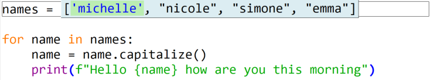

4. Click **Step into** four more times (or press ++f7++).

    Python has now read all of the strings.

    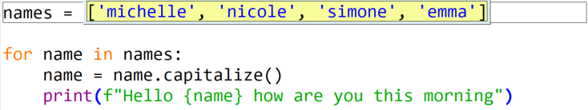

5. Click **Step into** again.

    Python is ready to store the list in the variable `names`.

    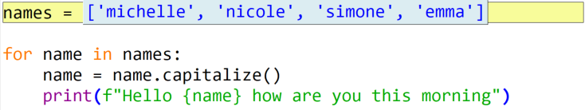

6. Click **Step into** again.

    The **Variables** panel now shows that `names` stores `["michelle", "nicole", "simone", "emma"]`. The highlight covers the whole `for` loop, because Thonny is showing all the code that belongs to it.

    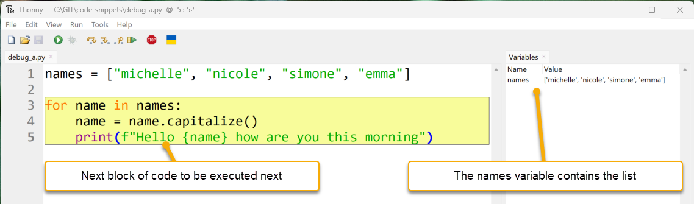

7. Click **Step into**.

    The next part of the code to run is `names`, the first part of the `for` loop statement.

    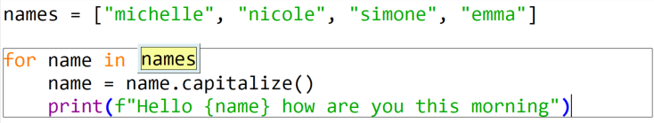

8. Click **Step into** again.

    Thonny replaces `names` with the list stored inside the `names` variable.

    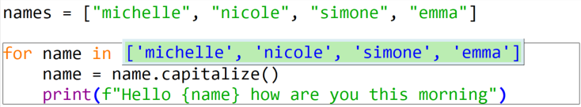

9. Click **Step into** again.

    Because this is a `for` loop, Python reads the first item in the list (`"michelle"`).

    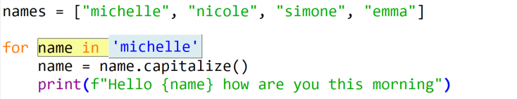

10. Click **Step into** again.

    Line 4 is highlighted. The value `"michelle"` is now stored in the variable `name`, as the **Variables** panel shows.

    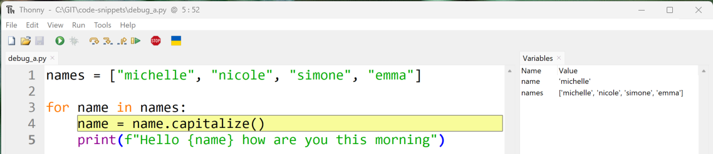

    !!! warning "`name` and `names`"
        Don't mix up `name` and `names`. They look similar, but Python treats them as different variables:

        - `name` is the variable used inside the `for` loop
        - `names` is the list that the loop goes through

11. Click **Step into** three more times.

    Thonny highlights `name.capitalize()`, then `name`, then replaces `name` with `"michelle"`.

    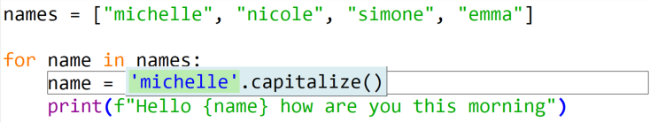

12. Click **Step into** three more times.

    The `capitalize()` method changes `"michelle"` to `"Michelle"`, and the variable `name` is updated to store `"Michelle"`. Line 4 is finished, so line 5 is highlighted next.

    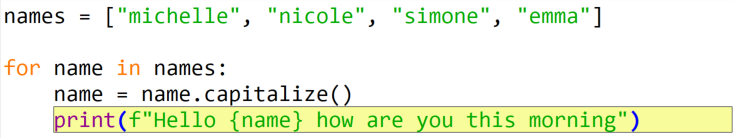

13. Click **Step into** five more times.

    These steps show how Python builds the f-string and prints it in the Shell. When `print()` runs, it gives back a value called `None`.

    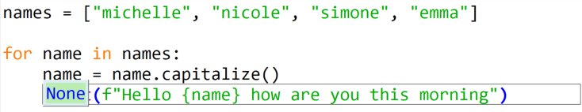

14. Click **Step into** once more.

    We're back at line 3. The `for` loop moves to the next item in the list, `"nicole"`.

    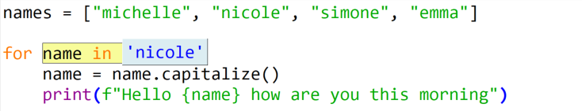

15. Click **Step into** one more time.

    Python stores `"nicole"` in `name`. We'll use this time through the loop to explore **Step over**.

### Step over

**Step over** runs the highlighted code without showing all the small steps.

1. Look at the highlighted line 4. When it runs, it will take the value in `name` (`"nicole"`), change it to `"Nicole"`, and store the new value back in `name`.

    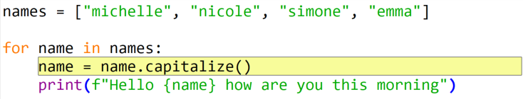

2. Click **Step over**.

    The value stored in `name` has been updated in one step.

    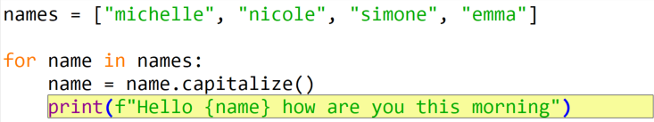

3. Click **Step over** again.

    Line 5 runs, and the highlight returns to the `for` statement on line 3.

    !!! tip "When to use Step over"
        Use **Step over** when you're confident the highlighted code works. Skipping the parts that aren't causing problems helps us find the bug faster.

4. Click **Step over** and then **Step into** until the debugger matches the image below.

    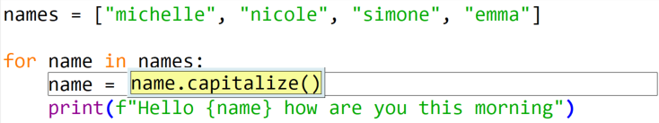

### Step out

**Step out** finishes the rest of the current piece of code.

1. Look at the grey box around line 4. It shows that we're inside that line of code.
2. Click **Step out**.

    Thonny jumps back out and highlights all of line 4 again.

    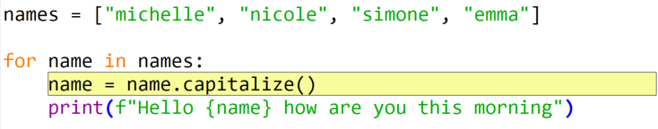

3. Click **Step out** again.

    The debugger moves up one more level, outside the `for` loop, and the program finishes.

### Resume and breakpoints

The **Resume** button works with **breakpoints**. A breakpoint is a place where we tell the program to pause. **Resume** runs the program until it reaches a breakpoint.

1. Click on the line number `4`.

    A red dot appears next to the line number. This is a breakpoint.

    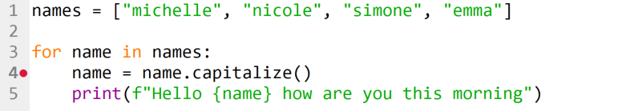

2. Click **Debug**.

    The program runs and pauses at the breakpoint. We can check the current values in the **Variables** panel.

    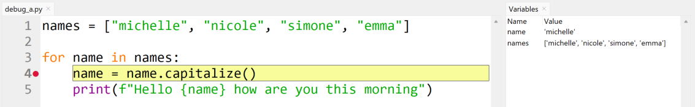

3. Click **Resume**.

    The program keeps running and pauses at the next breakpoint. This is line 4 again, but on the second time through the loop. Notice the changed values in the **Variables** panel.

    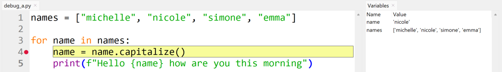

Now that we know how to use Thonny's debugger, let's go back and debug `buggy_code.py`.

## Debugging a logic error

### Guess where the bug is

The first step is to find the part of the code that might have the bug. We might not know the exact line, so we make a good guess about which section could be wrong.

`buggy_code.py` has two main parts:

- a function (lines 1–5)
- the main program (lines 7–8)

Line 7 creates a variable called `phrase` with the value `"hello"`, and line 8 prints the result of `add_underscores(phrase)`. These two lines look correct, so the bug is probably in the function.

The first line inside the function (line 2) creates a variable called `new_word` with the value `"_"`. That looks correct too, so the bug is likely inside the `for` loop.

### Set a breakpoint

1. Add a breakpoint on line 3, the start of the `for` loop.

    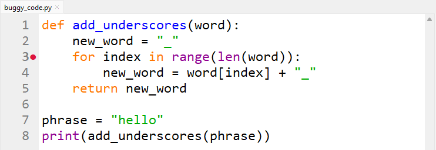

2. Click **Debug**.

    Thonny runs the program until it reaches the breakpoint.

    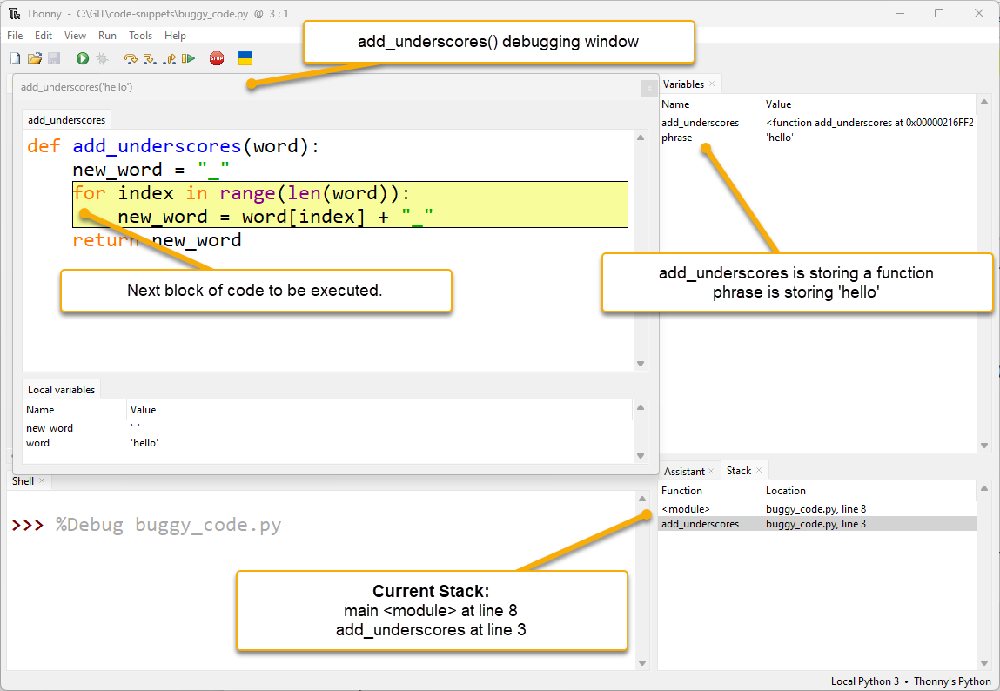

    There are some new features here:

    - **An extra debugging window**: Thonny opens a new window for the function `add_underscores("hello")`. This happens whenever Python starts running a function. The bottom of this window shows the function's **local variables**: variables that only exist inside that function.
    - **Two stack entries**: the **Stack** panel shows `<module>` (the main program) and `add_underscores` (the function). The program is at line 8 in the main program, and line 3 inside the function.

    !!! tip "Stack timeline"
        1. Line 8 in the main program calls the `add_underscores` function.
        2. Python pauses the main program at line 8 and waits for the function to finish.
        3. When the function finishes, the main program continues from line 8.

    The `add_underscores` window shows two variables: `word` is `"hello"` and `new_word` is `"_"`. These are correct so far.

    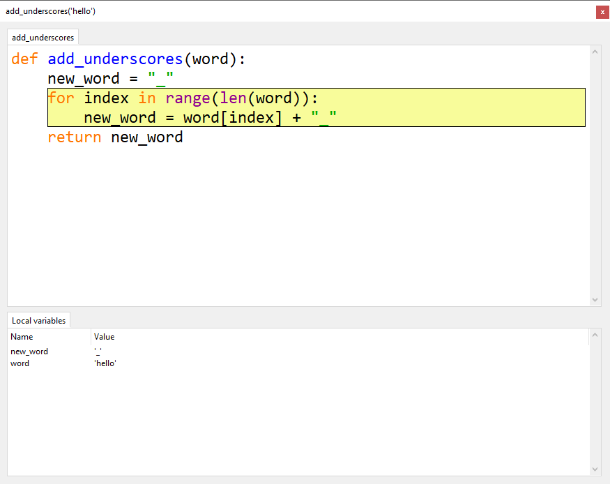

3. Click **Step into** once, then **Step over** twice.

    `new_word = word[index] + "_"` is now highlighted and ready to run. The local variable `index` stores `0`, which is correct for the first time through the loop.

    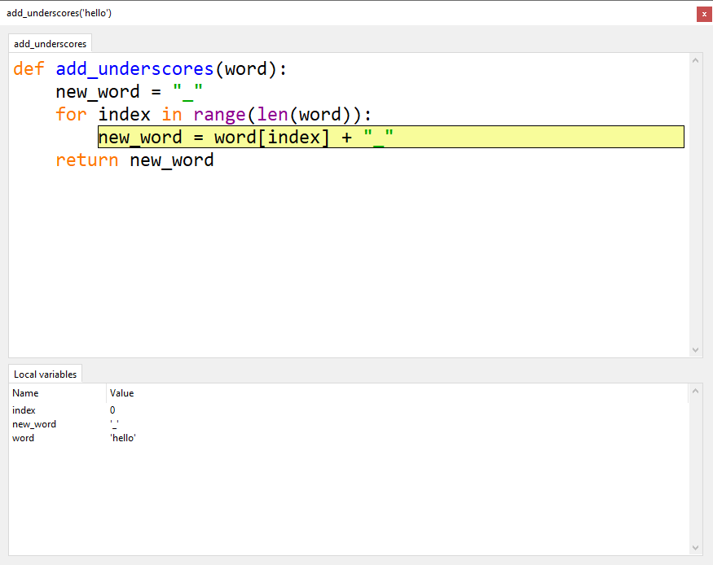

    !!! tip "Can't see the index variable?"
        Make the **Local variables** panel bigger.

4. Click **Step over** to run the line.

    `new_word` now stores `"h_"`, but we wanted `"_h_"`. Part of the value was replaced instead of added to. **This is exactly where the bug happens.**

    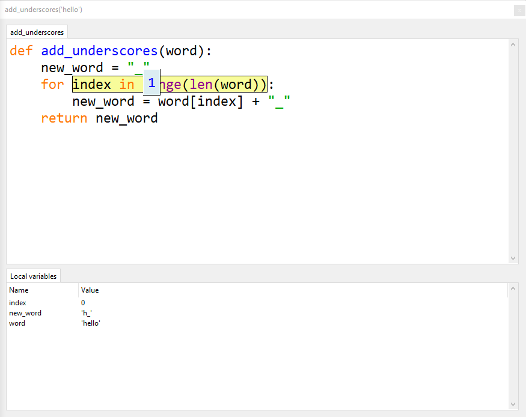

### Investigate the bug

Now we know the bug is in line 4, let's look more closely at what Python is doing there.

1. Click **Stop**, then click **Debug** again.
2. Click **Step into** once, then **Step over** twice, so line 4 is highlighted again.
3. Click **Step into** three times, checking the values each time. Everything still looks correct.

    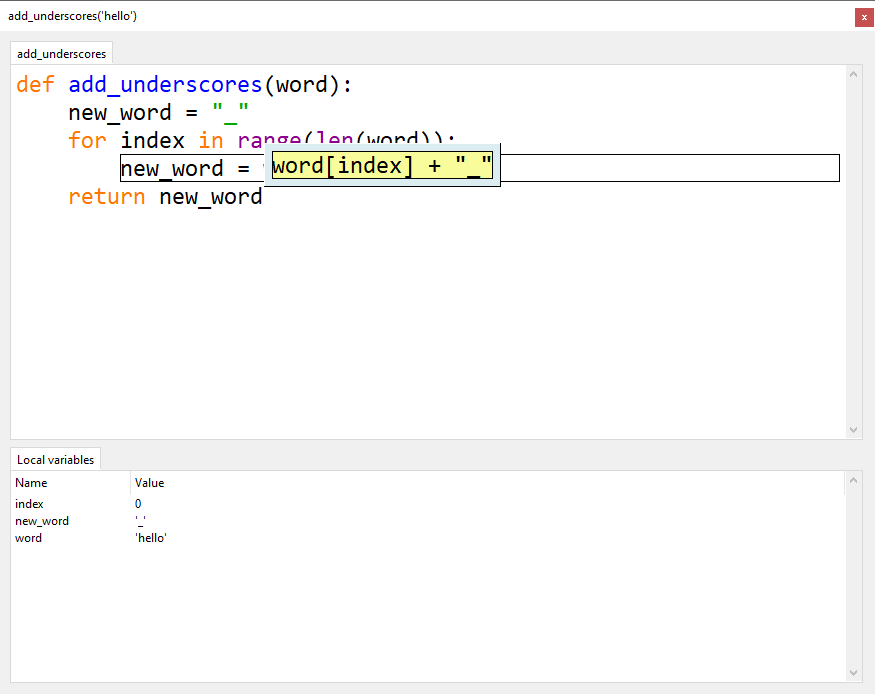

    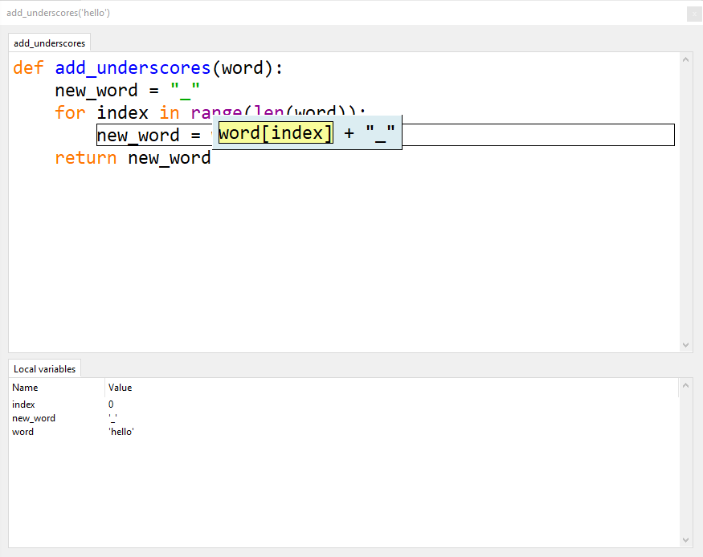

    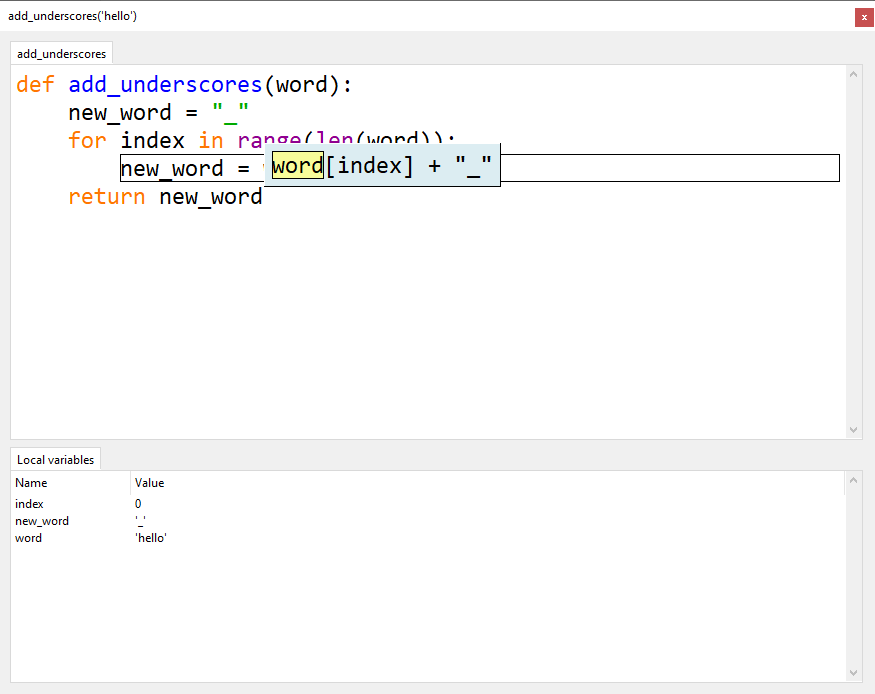

4. Keep clicking **Step into** and watch the **Local variables** panel. Stop when the window looks like the one below.

    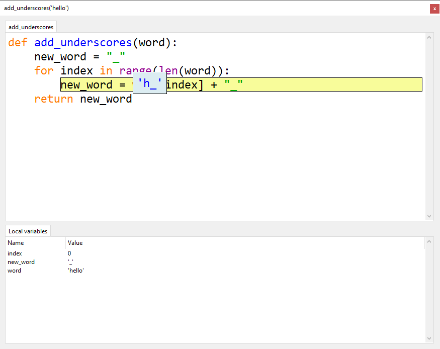

Python is about to store `"h_"` in `new_word`. That's wrong: we want it to store `"_h_"`. Now we know exactly where the bug is, we need to work out why it's happening.

### Fix the bug

The `add_underscores()` function should put a `_` between each letter. It should do this by adding the next letter and a `_` to the value already stored in `new_word`.

But the code replaces `new_word` each time, so it loses all the letters added before. To fix this, we need to add the current value of `new_word` at the front:

```python
new_word = new_word + word[index] + "_"
```

1. Stop debugging and change line 4 to the code above.

    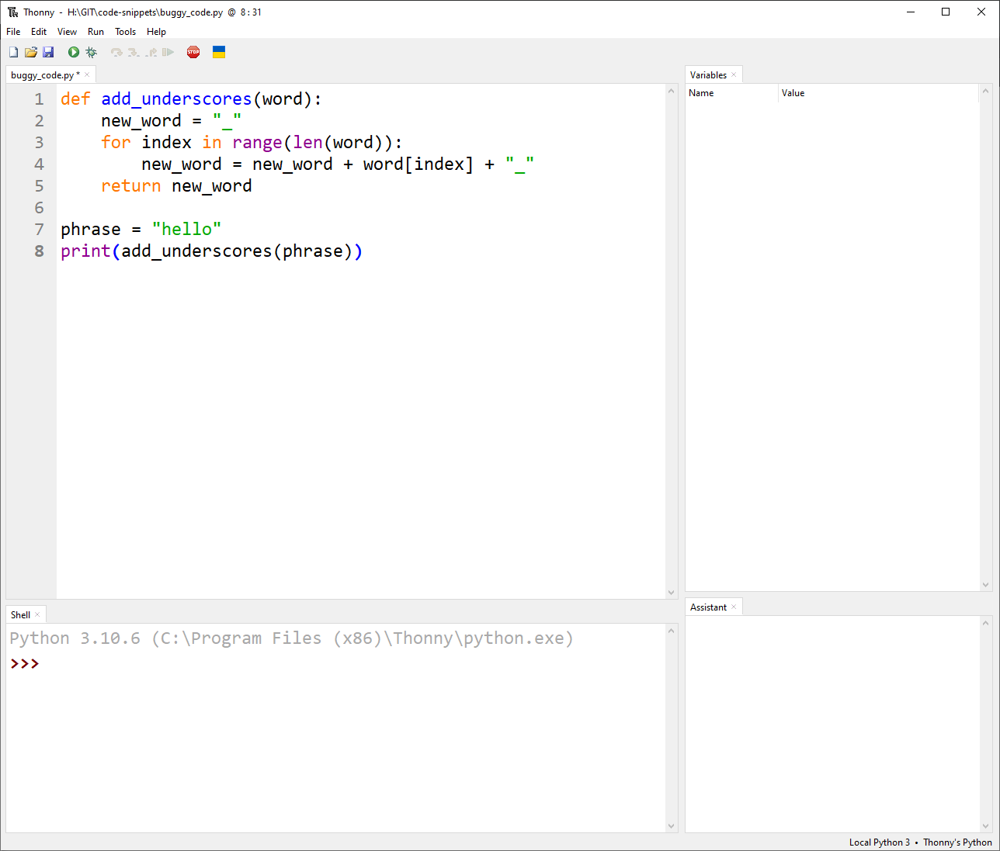

2. Run the program normally.

    The Shell should show `_h_e_l_l_o_`. We have found and fixed a bug.
