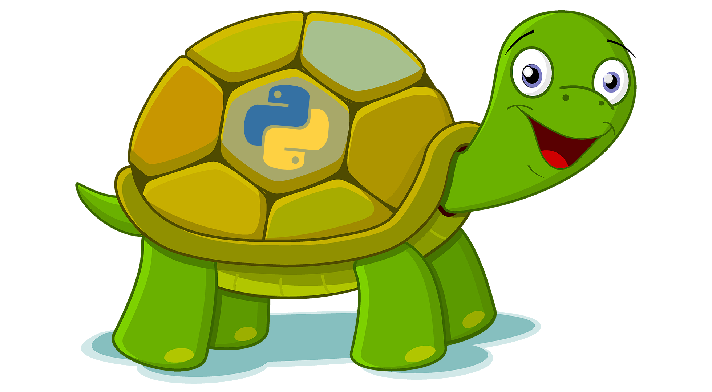

# A Turtle Introduction to Python

{ width="420" }

This website is a simple introduction to Python programming. We use Python's **turtle** module to draw shapes and pictures with code, and **Thonny** to write and run our programs.

## How to use this site

- Work through the lessons in order, starting with [Lesson 1: Thonny Introduction](lessons/lesson_01.md), at your own pace. If you finish early, keep going or try the [Extension Activities](extension.md).
- Your teacher will live code each lesson in class. That's the minimum progress to aim for. If you fall behind, use this site to catch up.
- Each lesson uses **PRIMM**: we **predict** what code will do, **run** it, **investigate** how it works, **modify** it, and finally **make** our own programs in the exercises.

## Callouts

Coloured boxes called **callouts** highlight different kinds of information. Each type of callout has its own colour and icon, so we can tell at a glance what it's for.

!!! learn "Learning intentions"
    This callout is at the top of every lesson. It lists what we will learn in that lesson.

!!! terms "Terminology"
    This callout comes straight after the learning intentions. It lists the new technical terms on the lesson, with a short definition of each. Every term is also on the [Glossary](reference/glossary.md) page.

!!! primm "PRIMM"
    This callout comes after each example program. It asks us to **predict** what the code will do, **run** it, and **investigate** how it works. Sometimes it asks us to **modify** the code.

!!! note "Code explanation"
    This callout comes after each PRIMM callout and gives a line-by-line explanation of the example program. On the lesson pages it starts closed, so we can make our own prediction first. Click its title to open it.

!!! tip "Tip"
    This callout gives extra information, such as definitions, background facts, comparisons and hints.

!!! warning "Warning"
    This callout warns us about mistakes that are easy to make, or things that will stop our program working.

## Code blocks

Programs are shown in **code blocks** like this one:

```python linenums="1" hl_lines="2"
# My first program
print("Hello World")
```

- The **line numbers** on the left match the line numbers used in the Code explanation and in error messages.
- **Highlighted lines** show the lines that are new or have changed since the last version of the program.
- The **copy** button in the top-right corner of a code block copies the code, so we can paste it into Thonny.

Code blocks without colours show what appears in the **Shell** when we run a program.

## Error messages

Error messages are shown in red code blocks like this one:

``` { .text .error linenums="1" }
Traceback (most recent call last):
  File "<string>", line 2, in <module>
NameError: name 'prnt' is not defined
```

Under each error message, the lesson breaks it down line by line, so we learn how to read the error and fix our code.

## Tutorial files

Download the [tutorial files](downloads/turtle_tutorials.zip). The zip has a folder for each lesson, containing every program on that lesson's page and the starter file for each exercise.

To use them:

1. Download and unzip the file into your own folder.
2. Open the lesson folder you need in Thonny (**File** → **Open**).
