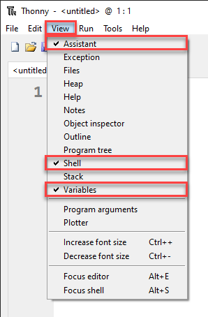
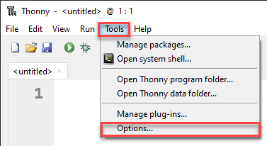
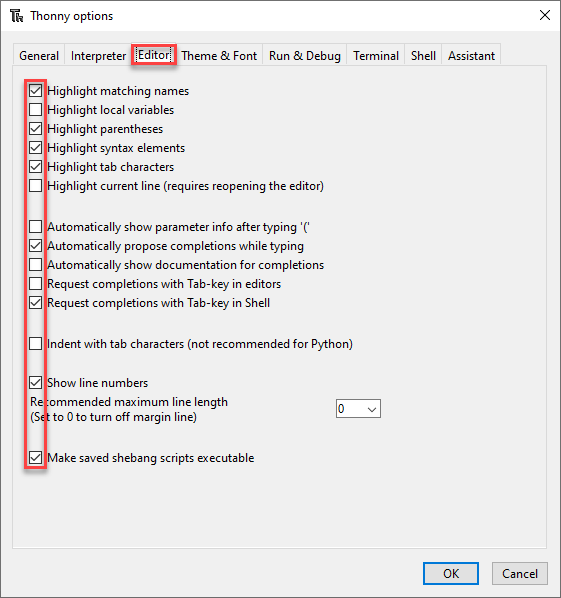
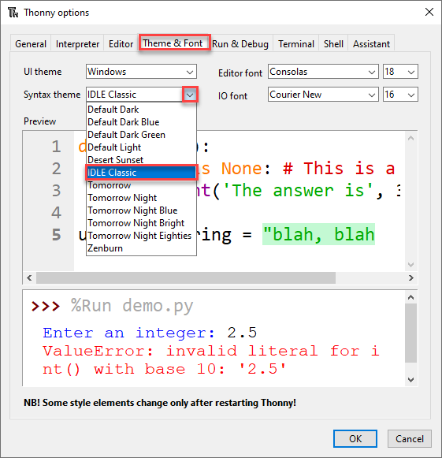
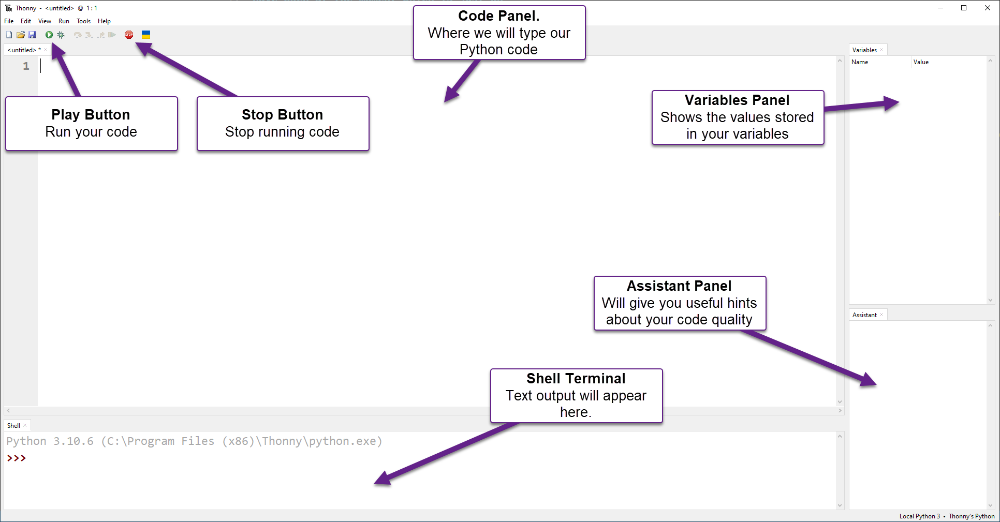

# Lesson 1: Thonny Introduction

!!! learn "In this lesson we will learn"
    - how to set up Thonny, the program we use to write and run Python
    - how to write and run our first program
    - what comments are and why we use them
    - how to read error messages and use them to fix our code

!!! terms "Terminology"
    - **Python** – the text-based programming language we use to write our programs.
    - **Thonny** – a program for writing, running and debugging Python code that is designed for beginners.
    - **script** – a Python program saved as a text file.
    - **user interface** – the screen of a program that we see and use, often shortened to UI.
    - **Shell** – the panel in Thonny that shows what our program prints and any error messages.
    - **comment** – a line starting with `#` that Python ignores, written to help humans understand the code.
    - **built-in function** – a command that Python already knows, such as `print`, which Thonny colours purple.
    - **syntax error** – an error that happens when our code doesn't follow Python's rules.
    - **syntax highlighting** – colouring different parts of our code based on what they do, so it's easier to read and write correctly.
    - **string** – a group of characters, like letters, numbers or symbols, inside quotation marks.
    - **parentheses** – the round brackets `(` and `)`, which must always come in matching pairs.

<iframe width="560" height="315" src="https://www.youtube-nocookie.com/embed/90T-NE_a50E" title="YouTube video player" frameborder="0" allow="accelerometer; autoplay; clipboard-write; encrypted-media; gyroscope; picture-in-picture" allowfullscreen></iframe>

[Video link](https://youtu.be/90T-NE_a50E)

## What is Thonny?

Python is the programming language we will use, and **Thonny** is the program we use to write it.

Think of it like this:

- we use Microsoft Word to write English
- we use Thonny to write Python

Python programs are written as text files called **scripts**. We could write them in any basic text editor. However, programs like Thonny have extra tools that make coding easier, such as:

- colouring different parts of our code so it's easier to read
- helping us find and fix mistakes

For now, think of Thonny as a text editor with helpful extras built in.

!!! tip "Getting Thonny"
    Thonny is made for beginners learning Python. It already includes Python, so it's easy to set up.

    You can download it from [thonny.org](https://thonny.org/).

## Setting up Thonny

Before we look at Thonny's screen (called the **user interface** or **UI**), we need to turn on a few settings so everyone's Thonny looks the same.

1. Open the **View** menu and make sure there is a tick beside **Assistant**, **Shell** and **Variables**.

    These panels show us what our program prints, what it stores and any hints about our mistakes.

    

2. Go to **Tools** → **Options**.

    

3. On the **Editor** tab, make sure the check boxes match the image below.

    

4. On the **Theme & Font** tab, set the **Syntax theme** to **IDLE Classic**.

    This colours our code based on what each part does, which makes it easier to read and to write correctly.

    

5. Click **OK**.

    Thonny should now look the same as the one in the videos.

## The user interface

The image below shows the main parts of Thonny we need to know for now. We will learn more about them later.



## Saving our work

We will write lots of programs in this course, so let's keep them organised:

1. Create a folder for this course, for example `python_turtle`.
2. Inside it, create a folder for each lesson: `lesson_01`, `lesson_02` and so on.
3. Save each program in its lesson's folder, using the file name the lesson gives us.

!!! tip "Tutorial files"
    Every program and exercise starter on this site is in the [tutorial files zip](../index.md#tutorial-files). The files are already sorted into lesson folders.

## Our first program

Our first program is called *Hello World*. It's the first program most people write when they learn to code.

Create a new file, type in the code below, and save it as `hello_world.py`.

```python linenums="1"
--8<-- "examples/lesson_01/hello_world/main.py"
```

### PRIMM

Throughout this course we will use **PRIMM** to help us learn. PRIMM stands for:

- **Predict**: guess what the code will do
- **Run**: run the code and see what happens
- **Investigate**: explore how the code works
- **Modify**: change the code to see what happens
- **Make**: create our own program

Let's try it now.

!!! primm "PRIMM"
    1. **Predict** what you think will happen when we run the code.
    2. **Run** the code by clicking the **Run** button (the green play button) or pressing ++f5++. Did the **Shell** show what you predicted?
    3. Time to **investigate** the code. What does each line do?

??? note "Code explanation"
    - **line 3** → prints `Hello World` in the Shell.

Notice that `# Our first program` doesn't appear in the Shell. When a line starts with `#`, Python treats it as a **comment**. Comments are ignored by the computer. They are there to help humans understand the code.

Also notice that `print` is purple. `print` is a **built-in function**: a command that Python already knows. Thonny colours built-in functions purple so we can spot them.

## Error messages

Now let's **modify** the code and make some mistakes on purpose. This will help us learn how to read error messages.

### Misspelling a command

Remove the `i` from `print` so line 3 says `prnt("Hello World")`, then run the program. The **Shell** shows this error:

``` { .text .error linenums="1" }
Traceback (most recent call last):
  File "<string>", line 3, in <module>
NameError: name 'prnt' is not defined
```

Let's break down that error message:

- **line 1** means "this is what Python just tried to do".
- **line 2** tells us where the error is. In this case, the mistake is on **line 3** of our program.
- **line 3** tells us what went wrong. A `NameError` means Python found a word it doesn't recognise, and it shows us that word: `prnt`.

Fix line 3 so it says `print("Hello World")` again. Notice that `print` turns purple again.

### Missing quotation marks

Remove the two `"` so line 3 says `print(Hello World)`, then run the program. The **Shell** shows a different error:

``` { .text .error linenums="1" }
Traceback (most recent call last):
  File "<string>", line 3
    print(Hello World)
          ^^^^^^^^^^^
SyntaxError: invalid syntax. Perhaps you forgot a comma?
```

- **line 3** shows the line with the mistake.
- **line 4** uses `^` symbols to point to where the problem is.
- **line 5** says it's a `SyntaxError`. This means our code doesn't follow Python's rules. Python tries to guess what went wrong, but its guess can be wrong. Here it suggests a comma, but the real problem is the missing quotation marks.

Put the `"` back. Notice how `"Hello World"` turns green. This is called **syntax highlighting**. The green shows that `"Hello World"` is a **string**. For now, think of a string as a group of characters, like letters, numbers or symbols, inside quotation marks.

### Missing brackets

Remove the `(` and `)` so line 3 says `print "Hello World"`, then run the program:

``` { .text .error linenums="1" }
Traceback (most recent call last):
  File "<string>", line 3
    print "Hello World"
    ^^^^^^^^^^^^^^^^^^^
SyntaxError: Missing parentheses in call to 'print'. Did you mean print(...)?
```

This is another `SyntaxError`. **Parentheses** are the round brackets `(` and `)` that we removed. This time Python's hint is helpful: `Did you mean print(...)?`

### An unclosed bracket

Add back only the opening bracket so line 3 says `print("Hello World"`, then run the program:

``` { .text .error linenums="1" }
Traceback (most recent call last):
  File "<string>", line 3
    print("Hello World"
         ^
SyntaxError: '(' was never closed
```

In Python, every opening bracket `(` needs a matching closing bracket `)`.

Before fixing it, look at line 3 in Thonny. There is a grey highlight starting from the `(`. This shows the bracket was never closed, and it can help us find mistakes before we even run our code.

Fix line 3 so it says `print("Hello World")` again.

!!! tip "Error messages are our friend"
    We will see lots of error messages as we learn to code, and that's normal. Even experienced programmers get errors every day. Error messages tell us what went wrong so we can fix it.

## Exercises

In this course, the exercises are the **make** part of PRIMM. Work through them to make your own code.

Starter files are in the `lesson_01` folder of the tutorial files. Solutions are on the [Exercise Solutions](../reference/solutions.md#lesson-1-thonny-introduction) page.

### Exercise 1

Starter: `lesson_01/ex1_print_name`

Can you change the program so it prints `Hello` and your name instead of `Hello World`?

### Exercise 2

Starter: `lesson_01/ex2_about_me`

Can you write a program that prints three lines about you? It should print:

- your name
- your favourite food
- your favourite game

### Exercise 3

Starter: `lesson_01/ex3_fix_errors`

This program has three mistakes. Can you fix them? Run the program, read the error message, fix the line it points to, and repeat until the program runs.
