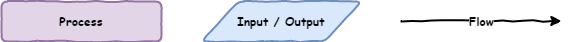
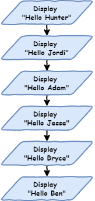
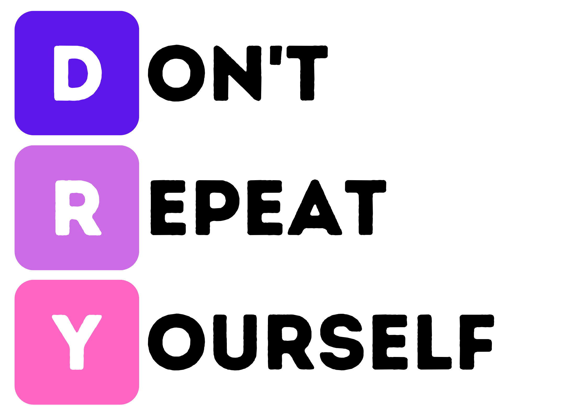
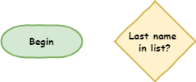
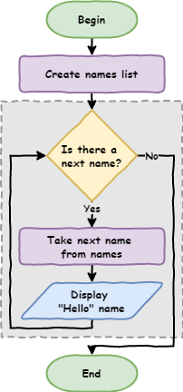
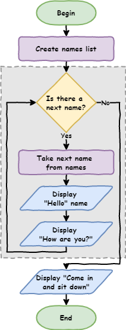

# Lesson 3: Iteration

!!! learn "In this lesson we will learn"
    - why the order of our code matters (sequence)
    - how to draw a program as a flowchart
    - how to use a `for` loop to repeat code
    - how lists and code blocks work
    - how to step through a loop with Thonny's debugger

!!! terms "Terminology"
    - **sequence** – code running one line after the other, from the top of the program to the bottom.
    - **flowchart** – a diagram that uses shapes and arrows to show each step in a program and how it moves from one step to the next.
    - **input** – information that goes into a program, such as the user typing on a keyboard or clicking a mouse.
    - **output** – information that a program sends out, such as text shown on the screen.
    - **scalable** – describes code that still works well as the program gets bigger.
    - **DRY** – short for Don't Repeat Yourself, the principle that we shouldn't write the same code over and over again.
    - **iteration** – repeating the same code again and again, often with a small change each time, also called looping.
    - **for loop** – a loop that repeats its code once for each item in a list or sequence.
    - **control structure** – code that changes the flow of a program, instead of just running from top to bottom.
    - **list** – a collection of items stored in a set order inside `[` and `]`, with commas between them.
    - **element** – one item in a list.
    - **indentation** – spaces at the start of a line (four in Python) that show which code belongs to a loop or other block.
    - **debugger** – a tool that runs our code one step at a time so we can see what it is doing and find mistakes.
    - **code block** – a group of lines indented by the same amount that belong together and run together.

<iframe width="560" height="315" src="https://www.youtube-nocookie.com/embed/_qZzz4lSckk" title="YouTube video player" frameborder="0" allow="accelerometer; autoplay; clipboard-write; encrypted-media; gyroscope; picture-in-picture" allowfullscreen></iframe>

[Video link](https://youtu.be/_qZzz4lSckk)

## Sequence

So far, each line of our code runs one after the other. This is called **sequence**. It's the normal way programs run: the program starts at the top and works its way down, one line at a time.

This movement through the code is called the **flow** of the program, like water flowing through a pipe.

### Introduction to flowcharts

A **flowchart** is a diagram that shows each step in a program and how the program moves from one step to the next. Different shapes represent different parts of the program:

- rectangles show a **process** (something the program does)
- parallelograms show **input** or **output** (getting or showing information)
- arrows show the **flow** (the direction the program moves)



If we wanted a program to say hello to six people, the flowchart would look like this:



Create a new file, type in the code below, and save it as `iteration.py`.

```python linenums="1"
--8<-- "examples/lesson_03/sequence/main.py"
```

!!! primm "PRIMM"
    1. **Predict** what the Shell will show when we run the code.
    2. **Run** the code. Did it match your prediction?
    3. Time to **investigate** the code. What does each line do?

??? note "Code explanation"
    - **lines 3–8** → print a greeting for each person in the Shell, one line at a time, from top to bottom.

The Shell shows:

```text
Hello Hunter
Hello Jordi
Hello Adam
Hello Jesse
Hello Bryce
Hello Ben
```

Because the program runs in sequence, the order of the lines matters. Change the order of the lines so our code matches the code below.

```python linenums="1"
--8<-- "examples/lesson_03/sequence_order/main.py"
```

!!! primm "PRIMM"
    1. **Predict** what the Shell will show now.
    2. **Run** the code. Did the order change?
    3. Time to **investigate** the code. What does each line do?

??? note "Code explanation"
    - **lines 3–8** → print the same six greetings, but in the new order.

Sequence is fine for small programs, but it becomes a problem with bigger ones. Imagine saying hello to 500 or even 1,000 people. That would take a long time to type. And if we wanted to change `Hello` to `Good morning`, we would have to change every single line.

In Digital Technologies, we say this code is not **scalable**: it doesn't work well as the program gets bigger.

## Iteration

Look at lines 3 to 8 again. They're almost the same. The only thing that changes is the name.

This breaks the **DRY** principle. DRY stands for **Don't Repeat Yourself**. It means we shouldn't write the same code over and over again.



One way to avoid repeating ourselves is **iteration** (also called **loops**). A loop repeats the same code again and again, with a small change each time. This is perfect for our program, because we want to repeat `print("Hello", name)` with a different name each time.

## `for` loops

The first loop we will use is the `for` loop. It's the first **control structure** we've used. A control structure changes how the program flows, instead of just running from top to bottom.

Change our code so it matches the code below.

```python linenums="1"
--8<-- "examples/lesson_03/for_loop/main.py"
```

!!! primm "PRIMM"
    1. **Predict** what the Shell will show when we run the code.
    2. **Run** the code. Did it match your prediction?
    3. Time to **investigate** the code. What does each line do?

??? note "Code explanation"
    - **line 3** → creates a list of six names and stores it in `names`.
    - **line 5** → starts a `for` loop that goes through each item in `names`, storing the current item in `name`.
    - **line 6** → prints `Hello` followed by the current name each time the loop repeats.

Line 3 creates a **list**. A list works like a real-life list:

- it has a number of items, called **elements**
- the elements are in a set order
- `[` and `]` show where the list starts and ends
- a comma (`,`) separates each element
- we give the list a name, just like our turtle or window

Line 5 is how we write a `for` loop in Python:

- `for` is a special word that starts the loop
- `in names` tells Python to go through each element in the `names` list
- `name` stores the element the loop is currently using
- `:` tells Python that the indented lines below belong to the loop

Line 6 is **indented**. The indentation shows which code repeats in the loop. Indents should be four spaces. In Thonny, pressing ++tab++ adds four spaces for us.

### `for` loop flowchart

To draw a `for` loop as a flowchart, we need two more symbols:

- **terminators** show the start and end of the program
- **decisions** are questions the program asks. The answer changes the path the program takes.



Here is the flowchart for our `for` loop. The shapes inside the dotted box repeat once for each element in the list.



!!! tip "Dotted box"
    The dotted box helps us see the `for` loop. It's not a normal flowchart symbol.

### Tracing with the debugger

Another way to understand a `for` loop is to use Thonny's **debugger**. A debugger lets us run our code one step at a time and see what happens.

Start the debugger by clicking the bug icon next to the **Run** button.


Keep pressing ++f7++ and Thonny will move through the code one step at a time. Watch the values in the **Variables** panel as you do this.

!!! tip "Learning more about the debugger"
    The [Debugging with Thonny](../guides/debugging.md) guide explains the debugger's features in more detail.

## Code blocks

Indented lines that belong together are called a **code block**. Let's see how that works. Add line 7 so our code matches the code below.

```python linenums="1" hl_lines="7"
--8<-- "examples/lesson_03/code_block/main.py"
```

!!! primm "PRIMM"
    1. **Predict** what the Shell will show when we run the code.
    2. **Run** the code. Did it match your prediction?
    3. Time to **investigate** the code. What does each line do?

??? note "Code explanation"
    - **line 3** → creates a list of six names and stores it in `names`.
    - **line 5** → starts a `for` loop that goes through each name in `names`.
    - **line 6** → prints `Hello` followed by the current name.
    - **line 7** → prints `How are you?` each time the loop repeats.

The Shell shows:

```text
Hello Hunter
How are you?
Hello Jordi
How are you?
Hello Adam
How are you?
Hello Jesse
How are you?
Hello Bryce
How are you?
Hello Ben
How are you?
```

**All** of the code in the code block repeats. Every line in a code block must be indented by the same number of spaces.

What happens if a line isn't indented? Add line 9 so our code matches the code below. Make sure line 9 is **not** indented.

```python linenums="1" hl_lines="9"
--8<-- "examples/lesson_03/after_loop/main.py"
```

!!! primm "PRIMM"
    1. **Predict** what the Shell will show when we run the code.
    2. **Run** the code. Did it match your prediction?
    3. Time to **investigate** the code. What does each line do?

??? note "Code explanation"
    - **line 3** → creates a list of six names and stores it in `names`.
    - **line 5** → starts a `for` loop that goes through each name in `names`.
    - **lines 6–7** → print a greeting and `How are you?` for each name.
    - **line 9** → prints `Come in and sit down` once, after the loop has finished.

The Shell shows:

```text
Hello Hunter
How are you?
Hello Jordi
How are you?
Hello Adam
How are you?
Hello Jesse
How are you?
Hello Bryce
How are you?
Hello Ben
How are you?
Come in and sit down
```

Because line 9 isn't indented, it isn't part of the `for` loop, so it runs **after** the loop has finished. The flowchart for our updated code looks like this:



## Exercises

In this course, the exercises are the **make** part of PRIMM. Work through them to make your own code.

Starter files are in the `lesson_03` folder of the tutorial files. Solutions are on the [Exercise Solutions](../reference/solutions.md#lesson-3-iteration) page.

### Exercise 1

Starter: `lesson_03/ex1_greet_friends`

Can you change the program so it says hello to your friends instead? Use a list called `friends` and a loop variable called `friend`.

### Exercise 2

Starter: `lesson_03/ex2_school_greeting`

Can you change the program so it greets the class at the start of a lesson? It should:

- print `Good morning` and the name of each person
- ask each person to get their laptop out
- print `Let's start the lesson` once, after everyone has been greeted

### Exercise 3

Starter: `lesson_03/ex3_indent`

What happens if we indent the last line, `print("Come in and sit down")`, so it lines up with the two `print` lines inside the loop? Why do you think this happens?
