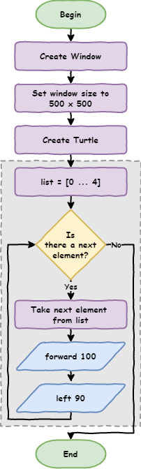

# Lesson 4: Range

!!! learn "In this lesson we will learn"
    - how to use `range` to make a sequence of numbers
    - how to use `range` in a `for` loop
    - how to use loops to draw shapes with less code

<iframe width="560" height="315" src="https://www.youtube-nocookie.com/embed/SpyHWIDWY5M" title="YouTube video player" frameborder="0" allow="accelerometer; autoplay; clipboard-write; encrypted-media; gyroscope; picture-in-picture" allowfullscreen></iframe>

[Video link](https://youtu.be/SpyHWIDWY5M)

## Looping through numbers

Loops also work with lists of numbers. Create a new file, type in the code below, and save it as `number_list.py`.

```python linenums="1"
--8<-- "examples/lesson_04/number_list/main.py"
```

!!! primm "PRIMM"
    1. **Predict** what the Shell will show when we run the code.
    2. **Run** the code. Did it match your prediction?
    3. Time to **investigate** the code. What does each line do?

??? note "Code explanation"
    - **line 1** → creates a list of the numbers 1 to 10 and stores it in `number_list`.
    - **line 3** → starts a `for` loop that goes through each number in `number_list`.
    - **line 4** → prints the current number.

## Introducing `range`

What if we want to print all the numbers from 1 to 100? Do we really want to type all of them?

Luckily, Python has the `range` function. It makes a sequence of numbers for us. Change line 1 so our code matches the code below.

```python linenums="1" hl_lines="1"
--8<-- "examples/lesson_04/range/main.py"
```

!!! primm "PRIMM"
    1. **Predict** what the Shell will show when we run the code.
    2. **Run** the code. Did it match your prediction?
    3. Time to **investigate** the code. What does each line do?

??? note "Code explanation"
    - **line 1** → uses `range` to make the numbers from 1 to 100, and stores them in `number_list`.
    - **line 3** → starts a `for` loop that goes through each number in `number_list`.
    - **line 4** → prints the current number.

Let's look closely at `range(1, 101)`:

- `1` is the first number in the sequence
- `101` is the first number **not** included, so the sequence stops at 100

This might seem confusing, but we will see why it's useful in the next lesson.

We can make our code shorter by using `range` directly inside the `for` loop. Change our code so it matches the code below.

```python linenums="1"
--8<-- "examples/lesson_04/range_in_loop/main.py"
```

!!! primm "PRIMM"
    1. **Predict** whether the Shell will show anything different this time.
    2. **Run** the code. Did it match your prediction?
    3. Time to **investigate** the code. What does each line do?

??? note "Code explanation"
    - **line 1** → starts a `for` loop that goes through each number from 1 to 100.
    - **line 2** → prints the current number.

## Loops with turtle

A code block can hold any type of code, including turtle code. Create a new file, type in the code below, and save it as `turtle_loop.py`.

```python linenums="1"
--8<-- "examples/lesson_04/turtle_loop/main.py"
```

!!! primm "PRIMM"
    1. **Predict** what the turtle will draw.
    2. **Run** the code. Did it do what you expected?
    3. Time to **investigate** the code. Change one thing at a time so you can clearly see what each change does.

??? note "Code explanation"
    - **line 1** → imports the turtle module.
    - **lines 3–4** → create a 500 × 500 pixel window.
    - **line 6** → creates a turtle called `my_ttl`.
    - **line 8** → starts a `for` loop that repeats 100 times.
    - **line 9** → moves `my_ttl` forward 100 steps.
    - **line 10** → moves `my_ttl` back 100 steps to where it started.
    - **line 11** → turns `my_ttl` 3 degrees to the left, so the next line points in a slightly different direction.

!!! primm "PRIMM"
    Time to **modify** the code. Can you make the turtle go all the way around?

    A full turn is `360` degrees, so the turns need to add up to `360`. For example, we could use:

    - `36` repeats of `10` degrees
    - `72` repeats of `5` degrees
    - `120` repeats of `3` degrees

## Exercises

In this course, the exercises are the **make** part of PRIMM. Work through them to make your own code.

Starter files are in the `lesson_04` folder of the tutorial files. Solutions are on the [Exercise Solutions](../reference/solutions.md#lesson-4-range) page.

### Exercise 1

Starter: `lesson_04/ex1_square`

Can you add a `for` loop to the starter so the turtle draws a square, using only 3 more lines of code? A square has 4 sides, so the loop needs to repeat 4 times.

!!! tip "Hint"
    This flowchart shows the steps our loop needs.

    

### Exercise 2

Starter: `lesson_04/ex2_triangle`

Can you add a `for` loop to the starter so the turtle draws an equilateral triangle, using only 3 more lines of code?

### Exercise 3

Starter: `lesson_04/ex3_hexagon`

Can you add a `for` loop to the starter so the turtle draws a hexagon, using only 3 more lines of code?

### Exercise 4

Starter: `lesson_04/ex4_circle`

Can you add a `for` loop to the starter so the turtle draws a circle, using only 3 more lines of code? Each time the loop repeats, the turtle should:

- move forward a small amount
- turn a small angle

### Exercise 5

Starter: `lesson_04/ex5_your_design`

Can you use `for` loops to draw something interesting? You could try:

- a spiral
- a star
- a shape repeated in a pattern
- shapes that grow bigger each time

Experiment by changing how far the turtle moves, how much it turns and how many times the loop runs.
