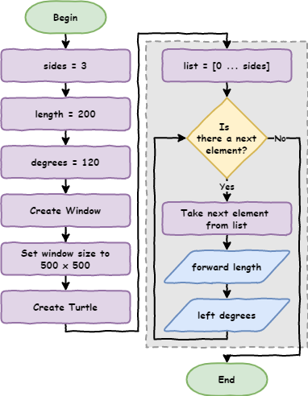
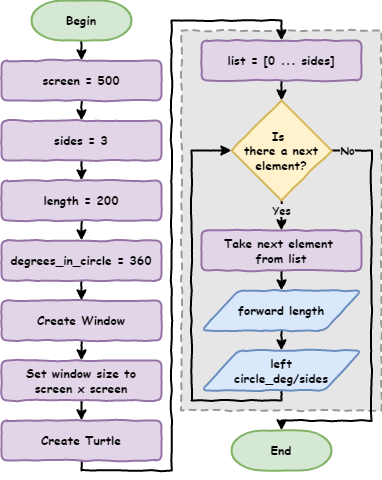

# Lesson 5: Variables

!!! learn "In this lesson we will learn"
    - the most common way to use `range`
    - why magic numbers make code hard to read and change
    - how to store values in variables
    - how to let Python do calculations for us
    - how to name variables and constants

!!! terms "Terminology"
    - **loop variable** – the variable in a `for` loop that stores the item or number the loop is currently using.
    - **magic number** – a number written straight into our code with no name to explain what it means.
    - **variable** – a named place, like a labelled box, that stores a value our program can use and change.
    - **case sensitive** – treating capital and lowercase letters as different, so `age` and `Age` are two different names.
    - **single point of truth** – keeping each value in one place, so changing it there changes it everywhere it is used.
    - **constant** – a variable whose value never changes while the program runs, written in capital letters in Python.
    - **naming convention** – an agreed habit for naming things that makes code easier to read, but doesn't cause an error if we break it.
    - **snake case** – writing names in lowercase letters with `_` instead of spaces, like `side_length`.

<iframe width="560" height="315" src="https://www.youtube-nocookie.com/embed/mG1O_JamxjQ" title="YouTube video player" frameborder="0" allow="accelerometer; autoplay; clipboard-write; encrypted-media; gyroscope; picture-in-picture" allowfullscreen></iframe>

[Video link](https://youtu.be/mG1O_JamxjQ)

## Conventional `range`

Before we start on variables, let's learn the most common way to use `range`. Earlier, we used code like this to print four numbers. Create a new file, type in the code below, and save it as `counting.py`.

```python linenums="1"
--8<-- "examples/lesson_05/count_1_to_4/main.py"
```

!!! primm "PRIMM"
    1. **Predict** what the Shell will show when we run the code.
    2. **Run** the code. Did it match your prediction?
    3. Time to **investigate** the code. What does each line do?

??? note "Code explanation"
    - **line 1** → starts a `for` loop that counts from 1 to 4, storing the current number in `index`.
    - **line 2** → prints the current number.

!!! tip "What is `index`?"
    We can give the loop variable any name, but when it's just counting it's common to call it `index`.

If we only care about **how many times** the loop repeats, we can count from `0` instead. Change line 1 so our code matches the code below.

```python linenums="1" hl_lines="1"
--8<-- "examples/lesson_05/count_from_0/main.py"
```

!!! primm "PRIMM"
    1. **Predict** what the Shell will show now.
    2. **Run** the code. Did it match your prediction?
    3. Time to **investigate** the code. What does each line do?

??? note "Code explanation"
    - **line 1** → starts a `for` loop that counts from 0 to 3.
    - **line 2** → prints the current number.

The loop still runs four times. The only difference is that it starts counting from `0`.

If we don't tell `range` where to start, it starts at `0`. So we can leave the `0` out. Change line 1 so our code matches the code below.

```python linenums="1" hl_lines="1"
--8<-- "examples/lesson_05/range_default/main.py"
```

!!! primm "PRIMM"
    1. **Predict** whether the Shell will show anything different.
    2. **Run** the code. Did it match your prediction?
    3. Time to **investigate** the code. What does each line do?

??? note "Code explanation"
    - **line 1** → starts a `for` loop that repeats 4 times, counting from 0 to 3.
    - **line 2** → prints the current number.

This is the most common way to use `range` in Python: `range(4)` means "repeat 4 times".

## Replace magic numbers

Here is one solution to [Lesson 4](lesson_04.md) Exercise 1, using `range(4)`. There are many correct answers. Create a new file, type in the code below, and save it as `shapes.py`.

```python linenums="1"
--8<-- "examples/lesson_05/square/main.py"
```

!!! primm "PRIMM"
    1. **Predict** what the turtle will draw.
    2. **Run** the code. Did it match your prediction?
    3. Time to **investigate** the code. What does each line do?

??? note "Code explanation"
    - **line 1** → imports the turtle module.
    - **lines 3–4** → create a 500 × 500 pixel window.
    - **line 5** → creates a turtle called `my_ttl`.
    - **line 7** → starts a `for` loop that repeats 4 times.
    - **line 8** → moves `my_ttl` forward 100 steps.
    - **line 9** → turns `my_ttl` 90 degrees to the left.

What do we need to change so the turtle draws a triangle with sides that are `200` long? Try to work it out before looking at the code below. Then change our code so it matches.

```python linenums="1" hl_lines="7-9"
--8<-- "examples/lesson_05/triangle/main.py"
```

!!! primm "PRIMM"
    1. **Predict** what the turtle will draw.
    2. **Run** the code. Did it match your prediction?
    3. Time to **investigate** the code. Which numbers did we change, and what does each one mean?

??? note "Code explanation"
    - **line 1** → imports the turtle module.
    - **lines 3–4** → create a 500 × 500 pixel window.
    - **line 5** → creates a turtle called `my_ttl`.
    - **line 7** → starts a `for` loop that repeats 3 times, once for each side.
    - **line 8** → moves `my_ttl` forward 200 steps, the length of each side.
    - **line 9** → turns `my_ttl` 120 degrees to the left.

We changed three numbers:

- `4` → `3` is the number of sides
- `100` → `200` is the length of each side
- `90` → `120` is how many degrees the turtle turns

Numbers written straight into our code like this are called **magic numbers**. They're not a good idea:

- someone reading our code won't know what `3`, `200` or `120` are for without working it out
- if our program drew 1,000 squares and we wanted triangles instead, we would have to change 3,000 numbers

To write better code, we replace magic numbers with **variables**. A variable is like a labelled box where we store a value. Change our code so it matches the code below.

```python linenums="1" hl_lines="3-5 11-13"
--8<-- "examples/lesson_05/variables/main.py"
```

!!! primm "PRIMM"
    1. **Predict** what the turtle will draw.
    2. **Run** the code. Did it match your prediction?
    3. Time to **investigate** the code. What does each line do?

??? note "Code explanation"
    - **line 1** → imports the turtle module.
    - **line 3** → creates a variable called `sides` and stores `3` in it.
    - **line 4** → creates a variable called `length` and stores `200` in it.
    - **line 5** → creates a variable called `degrees` and stores `120` in it.
    - **lines 7–8** → create a 500 × 500 pixel window.
    - **line 9** → creates a turtle called `my_ttl`.
    - **line 11** → starts a `for` loop that uses the value in `sides`, so it works the same as `range(3)`.
    - **line 12** → moves `my_ttl` forward by the value in `length`, so it works the same as `forward(200)`.
    - **line 13** → turns `my_ttl` left by the value in `degrees`, so it works the same as `left(120)`.

Here is the flowchart for our program:



!!! tip "Naming rules"
    Python has some rules for naming variables:

    - names can only use letters, numbers and `_` (underscore)
    - names can't have spaces
    - names can't start with a number
    - names are case sensitive, so `age` and `Age` are different variables

## Single point of truth

Now that we're using variables, the values for `sides`, `length` and `degrees` always come from one place: the start of our program. If we change the value of `sides`, it changes everywhere `sides` is used. This is called a **single point of truth**.

Change our code so it draws a hexagon with sides that are `100` long.

```python linenums="1" hl_lines="3-5"
--8<-- "examples/lesson_05/hexagon/main.py"
```

!!! primm "PRIMM"
    1. **Predict** what the turtle will draw.
    2. **Run** the code. Did it match your prediction?
    3. Time to **investigate** the code. What does each line do?

??? note "Code explanation"
    - **line 1** → imports the turtle module.
    - **lines 3–5** → store the number of sides, the side length and the turning angle for a hexagon.
    - **lines 7–9** → create the window and the turtle.
    - **lines 11–13** → draw the shape using the values stored in the variables.

## No "meat space" calculations

How did we know the turtle needed to turn `60` degrees for a hexagon? We might have worked it out in our head or used a calculator. Both have problems: we might make a mistake in our head, and a calculator takes extra time. (**Meat space** is a joke name for the real world, outside the computer.)

Instead, we can get Python to do the calculation. The turning angle is `360` divided by the number of sides. Change line 5 so our code matches the code below.

```python linenums="1" hl_lines="5"
--8<-- "examples/lesson_05/calculate_degrees/main.py"
```

!!! primm "PRIMM"
    1. **Predict** whether the turtle will draw anything different.
    2. **Run** the code. Did it match your prediction?
    3. Time to **investigate** the code. What does each line do?

??? note "Code explanation"
    - **line 1** → imports the turtle module.
    - **line 3** → stores `6` in `sides`.
    - **line 4** → stores `100` in `length`.
    - **line 5** → divides `360` by the value in `sides` and stores the answer (`60.0`) in `degrees`.
    - **lines 7–9** → create the window and the turtle.
    - **lines 11–13** → draw the shape using the values stored in the variables.

!!! tip "Python calculations"
    Python can do lots of maths for us. `/` means divide, `*` means multiply, `+` means add and `-` means subtract. To see them all, check out the [W3Schools Python arithmetic operators page](https://www.w3schools.com/python/gloss_python_arithmetic_operators.asp).

## Remove unnecessary variables

Another good habit is to remove variables we don't really need. Do we need `degrees`, or could we do the calculation inside the `for` loop?

Delete line 5, then change the last line of the loop to `my_ttl.left(360 / sides)`. Our code should now match the code below.

```python linenums="1" hl_lines="12"
--8<-- "examples/lesson_05/no_degrees/main.py"
```

!!! primm "PRIMM"
    1. **Predict** whether the turtle will draw anything different.
    2. **Run** the code. Did it match your prediction?
    3. Time to **investigate** the code. What does each line do?

??? note "Code explanation"
    - **line 1** → imports the turtle module.
    - **lines 3–4** → store the number of sides and the side length.
    - **lines 6–8** → create the window and the turtle.
    - **line 10** → starts a `for` loop that repeats once for each side.
    - **line 11** → moves `my_ttl` forward by the value in `length`.
    - **line 12** → works out the turning angle (`360` divided by `sides`) and turns `my_ttl` left by that amount.

## Constants

Are there any more magic numbers in our code? Look carefully before reading on.

There are two: the `500` for the window size, and the `360` in our calculation. Change our code so it matches the code below.

```python linenums="1" hl_lines="3 6 9 14"
--8<-- "examples/lesson_05/constants/main.py"
```

!!! primm "PRIMM"
    1. **Predict** whether the turtle will draw anything different.
    2. **Run** the code. Did it match your prediction?
    3. Time to **investigate** the code. What does each line do?

??? note "Code explanation"
    - **line 1** → imports the turtle module.
    - **line 3** → stores the window size, `500`, in `screen`.
    - **lines 4–5** → store the number of sides and the side length.
    - **line 6** → stores `360`, the number of degrees in a full turn, in the constant `CIRCLE_DEG`.
    - **lines 8–9** → create a window that is `screen` pixels wide and `screen` pixels high.
    - **line 10** → creates a turtle called `my_ttl`.
    - **line 12** → starts a `for` loop that repeats once for each side.
    - **line 13** → moves `my_ttl` forward by the value in `length`.
    - **line 14** → turns `my_ttl` left by `CIRCLE_DEG` divided by `sides`.

We named `CIRCLE_DEG` in capital letters because its value never changes, no matter what shape we draw. Variables like this are called **constants**, and in Python we write their names in capital letters.

The flowchart for this code now looks like this:



!!! tip "Naming conventions"
    Python has naming **rules** and naming **conventions**, and they're not the same:

    - if we break a naming rule, our program crashes with an error
    - if we break a naming convention, our program still works, but our code is harder to read

    The naming conventions for variables are:

    - use clear names that explain what the value is: `d = 30` is bad, `degrees = 30` is better, `degrees_celsius = 30` is best
    - use **snake case** for names with more than one word: lowercase letters with `_` instead of spaces, like `this_is_snake_case`
    - use ALL CAPITAL LETTERS for constants
    - don't use names Python already uses, like `print`, `for` or `range`

## Exercises

In this course, the exercises are the **make** part of PRIMM. Work through them to make your own code.

Starter files are in the `lesson_05` folder of the tutorial files. Solutions are on the [Exercise Solutions](../reference/solutions.md#lesson-5-variables) page.

### Exercise 1

Starter: `lesson_05/ex1_square`

Can you change the values of the variables, without changing any other code, so the turtle draws a square?

### Exercise 2

Starter: `lesson_05/ex2_circle`

Can you change the values of the variables, without changing any other code, so the turtle draws a circle?

### Exercise 3

Starter: `lesson_05/ex3_pentagon`

Can you change the values of the variables, without changing any other code, so the turtle draws a pentagon (a shape with five equal sides)?
