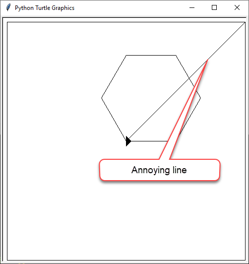
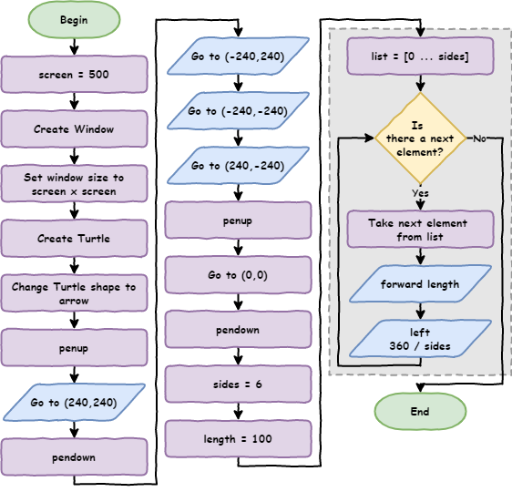

# Lesson 6: Coordinates

!!! learn "In this lesson we will learn"
    - how to organise our code so it's easy to read and maintain
    - how the turtle's screen coordinates work
    - how to move the turtle to an exact position with `goto()`
    - how to move without drawing using `penup()` and `pendown()`

<iframe width="560" height="315" src="https://www.youtube-nocookie.com/embed/F4ajxJwXH58" title="YouTube video player" frameborder="0" allow="accelerometer; autoplay; clipboard-write; encrypted-media; gyroscope; picture-in-picture" allowfullscreen></iframe>

[Video link](https://youtu.be/F4ajxJwXH58)

## Maintainability


*[Code Quality](https://xkcd.com/1513/) by Randall Munroe, xkcd, CC BY-NC 2.5.*

**Maintainability** means how easy our code is for other people to read and understand. This matters because the other person could be:

- someone helping us fix our code
- our teacher marking our work
- us, coming back to it six months later

Let's tidy up our code with two good habits:

- group code based on what it does
- use comments to say what each group is for

Change the code in `shapes.py` so it matches the code below. Then save it as `coordinates.py` (**File** → **Save as…**).

```python linenums="1"
--8<-- "examples/lesson_06/tidy/main.py"
```

!!! primm "PRIMM"
    1. **Predict** whether the turtle will draw anything different.
    2. **Run** the code. Did it match your prediction?
    3. Time to **investigate** the code. How is it organised?

??? note "Code explanation"
    - **line 1** → imports the turtle module.
    - **lines 4–6** → store the window size and create a 500 × 500 pixel window.
    - **line 9** → creates a turtle called `my_ttl`.
    - **line 10** → gives `my_ttl` the arrow shape.
    - **lines 13–15** → store the number of sides, the side length and the degrees in a full turn.
    - **line 18** → starts a `for` loop that repeats once for each side.
    - **line 19** → moves `my_ttl` forward by the value in `length`.
    - **line 20** → turns `my_ttl` left by `CIRCLE_DEG` divided by `sides`.

Anyone reading our program can now quickly find the code for setting up the screen, creating the turtle, setting the shape values and drawing the shape.

## How turtle coordinates work

Think of the turtle window as a piece of graph paper made of pixels. Our window is 500 pixels wide and 500 pixels high. The turtle uses:

- `x` for left and right (horizontal)
- `y` for up and down (vertical)

We describe a position with two numbers written like `(x, y)`: the `x` value first, then the `y` value. These are called **coordinates**.

The turtle's coordinates start from the **centre** of the window. So in our 500 × 500 window:

- `x` goes from `-250` on the left to `250` on the right
- `y` goes from `-250` at the bottom to `250` at the top
- the centre of the window is `(0, 0)`


In summary:

- moving right (→) makes `x` bigger
- moving left (←) makes `x` smaller
- moving up (↑) makes `y` bigger
- moving down (↓) makes `y` smaller

!!! tip "Tuples"
    Pairs of values written in brackets, like `(200, 125)`, are called **tuples**. A tuple is like a list, with one big difference: we can change a list, but we **can't** change a tuple. Something that can't be changed is called **immutable**.

Now that we understand coordinates, we can tell the turtle to go to an exact position.

## Using `goto()` to draw

Make these changes in `coordinates.py`:

- add `my_ttl.goto(0, 125)` on line 17
- add a `#` to the start of the lines under `# draw shape`

```python linenums="1" hl_lines="17 20-22"
--8<-- "examples/lesson_06/goto/main.py"
```

!!! primm "PRIMM"
    1. **Predict** what the turtle will do.
    2. **Run** the code. Did it match your prediction?
    3. Time to **investigate** the code. What does each line do?

??? note "Code explanation"
    - **line 1** → imports the turtle module.
    - **lines 4–6** → create a 500 × 500 pixel window.
    - **lines 9–10** → create a turtle called `my_ttl` with the arrow shape.
    - **lines 13–15** → store the shape values.
    - **line 17** → moves `my_ttl` straight to the position where `x` is `0` and `y` is `125`.

Adding `#` to the start of the loop lines turns them into comments, so Python ignores them. This is called **commenting out** code. It's useful when we're testing or fixing our program, because we can switch code off without deleting it.

!!! primm "PRIMM"
    Time to **modify** the code. Can you make the turtle visit each point shown in the coordinates diagram above?

## Draw a border

Change `coordinates.py` so it matches the code below. Remember to remove the `#` from the start of the loop lines.

```python linenums="1" hl_lines="12-18"
--8<-- "examples/lesson_06/border/main.py"
```

!!! primm "PRIMM"
    1. **Predict** what the turtle will draw. Draw it on paper if that helps.
    2. **Run** the code. Did it match your prediction?
    3. Time to **investigate** the code. Change parts of it and see what happens.

??? note "Code explanation"
    - **line 1** → imports the turtle module.
    - **lines 4–6** → create a 500 × 500 pixel window.
    - **lines 9–10** → create a turtle called `my_ttl` with the arrow shape.
    - **line 13** → moves `my_ttl` to the top-right corner of the border.
    - **lines 14–17** → move `my_ttl` to the top-left, bottom-left, bottom-right and top-right corners, drawing the four sides of the border.
    - **line 18** → moves `my_ttl` back to the centre of the window.
    - **lines 21–23** → store the shape values.
    - **lines 26–28** → draw the hexagon.

## Using `penup()` and `pendown()`

We have a border around our drawing, but there are two lines we don't want: one from the centre out to the corner, and one from the corner back to the centre.



When we write on paper, we lift our pen to move without drawing, then put it back down to keep writing. The turtle can do the same with `penup()` and `pendown()`.

Add lines 13, 15, 20 and 22 so our code matches the code below.

```python linenums="1" hl_lines="13 15 20 22"
--8<-- "examples/lesson_06/penup/main.py"
```

!!! primm "PRIMM"
    1. **Predict** what the turtle will draw. This flowchart may help.

        

    2. **Run** the code. Did it match your prediction?
    3. Time to **investigate** the code. What does each line do?

??? note "Code explanation"
    - **line 1** → imports the turtle module.
    - **lines 4–6** → create a 500 × 500 pixel window.
    - **lines 9–10** → create a turtle called `my_ttl` with the arrow shape.
    - **line 13** → lifts the pen, so `my_ttl` won't draw while it moves.
    - **line 14** → moves `my_ttl` to the top-right corner without drawing.
    - **line 15** → puts the pen down, so `my_ttl` draws again.
    - **lines 16–19** → draw the four sides of the border.
    - **line 20** → lifts the pen.
    - **line 21** → moves `my_ttl` back to the centre without drawing.
    - **line 22** → puts the pen down again.
    - **lines 25–27** → store the shape values.
    - **lines 30–32** → draw the hexagon.

## Exercises

In this course, the exercises are the **make** part of PRIMM. Work through them to make your own code.

Starter files are in the `lesson_06` folder of the tutorial files. Solutions are on the [Exercise Solutions](../reference/solutions.md#lesson-6-coordinates) page.

### Exercise 1

Starter: `lesson_06/ex1_house`

Can you draw a house made up of several shapes, using the turtle commands you've learnt? Try to keep your code DRY (Don't Repeat Yourself) by using loops where you can.
