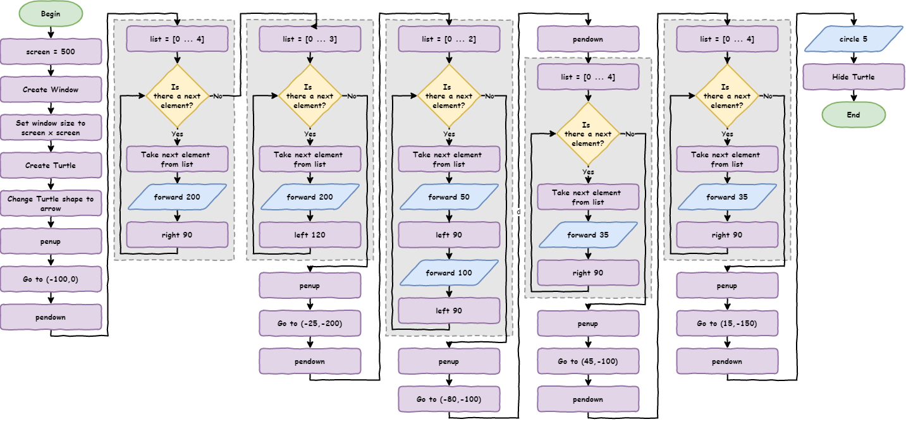
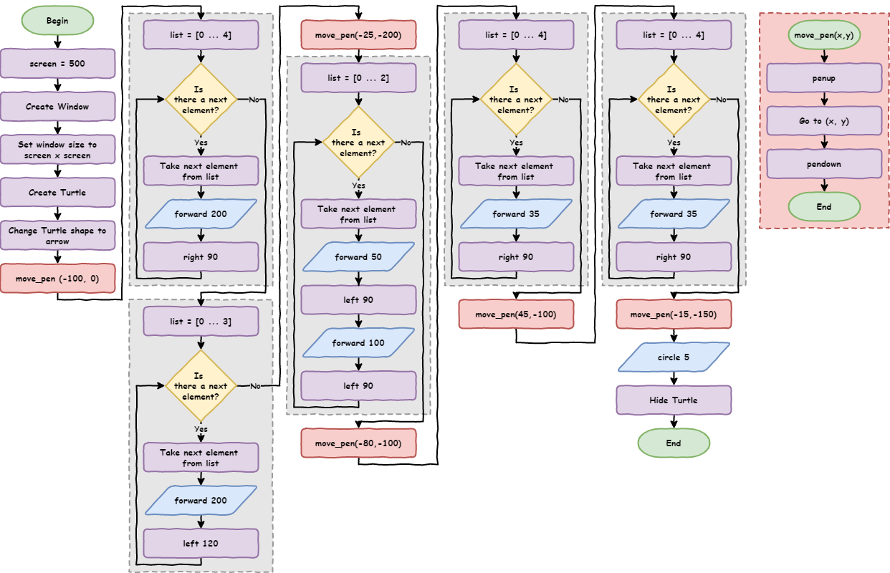
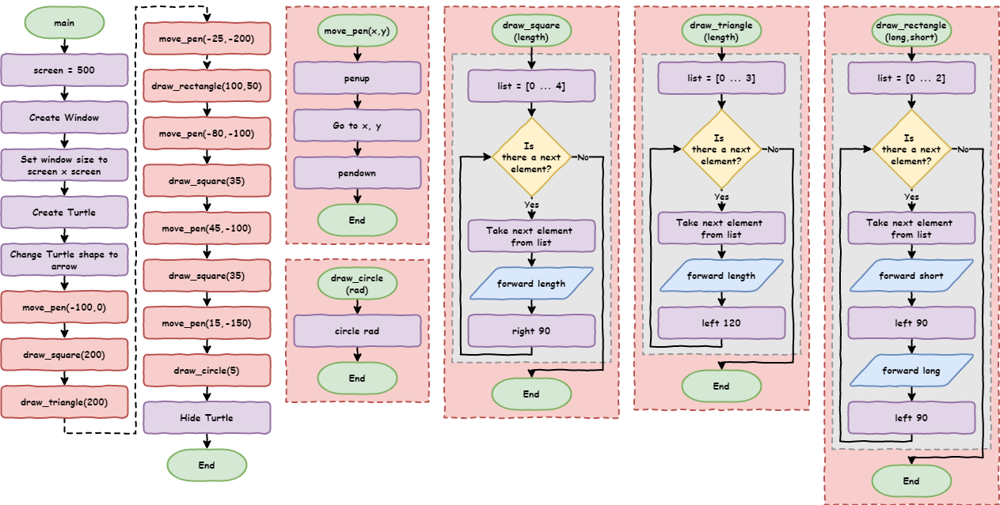

# Lesson 7: Functions

!!! learn "In this lesson we will learn"
    - what functions are and why they're useful
    - how to define and call our own functions
    - how to pass arguments into a function
    - how to show functions in a flowchart

!!! terms "Terminology"
    - **function** – a named block of code that we can run again and again whenever we need it.
    - **call** – to run a function by using its name, after which the program comes back to where it was.
    - **define** – to create a function with `def`, giving it a name and a code block that Python remembers but doesn't run yet.
    - **argument** – a value we send into a function or method when we call it.
    - **parameter** – a variable name in a function definition that receives a value sent into the function.
    - **algorithm** – step-by-step instructions for solving a problem, like a recipe.

<iframe width="560" height="315" src="https://www.youtube-nocookie.com/embed/ZQNU29m5pHY" title="YouTube video player" frameborder="0" allow="accelerometer; autoplay; clipboard-write; encrypted-media; gyroscope; picture-in-picture" allowfullscreen></iframe>

[Video link](https://youtu.be/ZQNU29m5pHY)

## What are functions?

**Functions** are named blocks of code that we can use again and again in our program.

So far, our code has run once from top to bottom. Even a loop only runs once: it just repeats the code inside it before moving on. A function works differently:

- we take a group of code and move it somewhere else
- we give that group of code a name
- we can then use (or **call**) that code whenever we need it

When our program calls a function, it jumps to that block of code, runs it, and then comes back to where it was.

To see how this works, we'll start with a solution to [Lesson 6](lesson_06.md) Exercise 1. Here is its flowchart:



Type the code below into a new file, or open `house.py` from the `lesson_07` folder of the [tutorial files](../index.md#tutorial-files). Save it as `house.py`.

```python linenums="1"
--8<-- "examples/lesson_07/house/main.py"
```

!!! primm "PRIMM"
    1. **Predict** what kind of house the code will draw.
    2. **Run** the code. Did it match your prediction?
    3. Time to **investigate** the code. Which parts repeat? Read the comments carefully: they can help you spot the repeated parts.

??? note "Code explanation"
    - **line 1** → imports the turtle module.
    - **lines 4–6** → create a 500 × 500 pixel window.
    - **lines 9–10** → create a turtle called `my_ttl` with the arrow shape.
    - **lines 13–15** → lift the pen, move to `(-100, 0)` and put the pen down.
    - **lines 18–20** → draw a square with sides 200 long, for the walls.
    - **lines 23–25** → draw a triangle with sides 200 long, for the roof.
    - **lines 28–30** → lift the pen, move to `(-25, -200)` and put the pen down.
    - **lines 33–37** → draw a rectangle 50 wide and 100 high, for the door.
    - **lines 40–42** → lift the pen, move to `(-80, -100)` and put the pen down.
    - **lines 45–47** → draw a square with sides 35 long, for the first window.
    - **lines 50–52** → lift the pen, move to `(45, -100)` and put the pen down.
    - **lines 55–57** → draw another square with sides 35 long, for the second window.
    - **lines 60–62** → lift the pen, move to `(15, -150)` and put the pen down.
    - **line 65** → draws a small circle, for the door handle.
    - **line 66** → hides the turtle.

There are two main things that repeat:

- moving the pen
- drawing a shape

When this code was written, parts were copied and pasted, then some numbers were changed. Copying and pasting is a strong sign that we should use a **function**. Functions help us follow the DRY principle (**Don't Repeat Yourself**) by putting repeated code in one place, so we can reuse it instead of copying it.

## Creating functions

Let's make a function for moving the pen:

1. Copy the first `# move pen` code (lines 13–15) to the top of the program, under `import turtle`.
2. Turn it into a function called `move_pen` by adding `def move_pen():` above it and indenting it.
3. Replace the original `# move pen` code with a call to the function: `move_pen()`.

Change our code so it matches the code below.

```python linenums="1" hl_lines="4-7 19"
--8<-- "examples/lesson_07/move_pen/main.py"
```

!!! primm "PRIMM"
    1. **Predict** whether the house will look any different.
    2. **Run** the code. Did it match your prediction?
    3. Time to **investigate** the code. What does each line do?

??? note "Code explanation"
    - **line 1** → imports the turtle module.
    - **line 4** → **defines** a function called `move_pen`. Python remembers this code but doesn't run it yet.
    - **lines 5–7** → are the function's code block, which runs whenever `move_pen()` is called: lift the pen, move to `(-100, 0)` and put the pen down.
    - **lines 11–13** → create a 500 × 500 pixel window.
    - **lines 16–17** → create a turtle called `my_ttl` with the arrow shape.
    - **line 19** → **calls** `move_pen`, so the program jumps to line 4, runs the function, then comes back and carries on from line 19.
    - **lines 22–70** → work the same as before.

Let's look closely at line 4, `def move_pen():`:

- `def` is the special word that creates (**defines**) a function
- `move_pen` is the function's name. Good names make our code easy to understand without comments.
- `()` is where we can pass values into the function (we'll do this next)
- `:` tells Python that an indented code block follows

The indentation works the same as a `for` loop: the indented lines are the function's code block, and they should be indented four spaces.

## Passing arguments

Our function works for the first pen movement, but not for the others. Why? Because the coordinates `(-100, 0)` are fixed magic numbers. We need a way to give the function different coordinates each time we call it.

We do that with **arguments**: values we send into a function when we call it.

1. Change line 4 to `def move_pen(x, y):` so the function accepts two values.
2. Change line 6 to `my_ttl.goto(x, y)` so it uses those values.
3. Change line 19 to `move_pen(-100, 0)` so it sends two values into the function.

```python linenums="1" hl_lines="4 6 19"
--8<-- "examples/lesson_07/arguments/main.py"
```

!!! primm "PRIMM"
    1. **Predict** whether the house will look any different.
    2. **Run** the code. Did it match your prediction?
    3. Time to **investigate** the code. Use the debugger to step through the program one line at a time.

??? note "Code explanation"
    - **line 1** → imports the turtle module.
    - **line 4** → defines `move_pen` so it needs two values when it's called, stored in `x` and `y`.
    - **line 5** → lifts the pen.
    - **line 6** → moves `my_ttl` to the position stored in `x` and `y`.
    - **line 7** → puts the pen down.
    - **lines 11–13** → create a 500 × 500 pixel window.
    - **lines 16–17** → create a turtle called `my_ttl` with the arrow shape.
    - **line 19** → calls `move_pen`, setting `x` to `-100` and `y` to `0`.
    - **lines 22–70** → work the same as before.

!!! tip "Arguments and parameters"
    People sometimes use **arguments** and **parameters** to mean the same thing, but they're slightly different:

    - **arguments** are the values we send into a function, like `-100` and `0`
    - **parameters** are the variable names in the function that receive those values, like `x` and `y`

Now replace each of the other `# move pen` sections with a call to `move_pen()`, using that section's coordinates.

```python linenums="1" hl_lines="19 31 40 47 54"
--8<-- "examples/lesson_07/all_move_pen/main.py"
```

!!! primm "PRIMM"
    1. **Predict** whether the house will look any different.
    2. **Run** the code to make sure the house is still drawn correctly.
    3. Time to **investigate** the code. How many lines shorter is it?

??? note "Code explanation"
    - **line 1** → imports the turtle module.
    - **line 4** → defines `move_pen` with the parameters `x` and `y`.
    - **lines 5–7** → lift the pen, move to `(x, y)` and put the pen down.
    - **lines 11–13** → create a 500 × 500 pixel window.
    - **lines 16–17** → create a turtle called `my_ttl` with the arrow shape.
    - **line 19** → moves the pen to the start of the walls.
    - **lines 22–29** → draw the walls and the roof.
    - **line 31** → moves the pen to the start of the door.
    - **lines 34–38** → draw the door.
    - **line 40** → moves the pen to the first window.
    - **lines 43–45** → draw the first window.
    - **line 47** → moves the pen to the second window.
    - **lines 50–52** → draw the second window.
    - **line 54** → moves the pen to the door handle.
    - **line 57** → draws the door handle.
    - **line 58** → hides the turtle.

Our program has gone from 66 lines to 58 lines.

!!! tip "Testing tips"
    - Test your code often. Every time you make a change, run it.
    - Don't change too many things at once, or it will be harder to find mistakes.
    - Once a function works, you don't need to test it again unless you change it.
    - If all your functions work, any problem must be somewhere else in your code.

## Functions in flowcharts

Flowcharts show the steps of a solution, called an **algorithm**.

!!! tip "What are algorithms?"
    Algorithms are step-by-step instructions for solving a problem. A cake recipe is an algorithm for baking a cake. The steps for long division are an algorithm. In programming, our code is the algorithm the computer follows.

When a program is made of smaller parts, like functions, each part is its own algorithm. So:

- we draw a separate flowchart for each function
- the **terminator** at the top of a function's flowchart shows the function's name, while the main program starts with **Begin**
- when the main program calls a function, we show the call in a coloured process block (red in our flowcharts) so it's easy to see



## Shape functions

Drawing shapes repeats too. Let's make a function to draw squares:

1. Copy one of the `# draw square` sections to the top of the program, under the `move_pen` function.
2. Turn it into a function called `draw_square` that takes the side length as a parameter.
3. Replace all the `# draw square` sections with calls to `draw_square()`.

!!! tip "Where should functions go?"
    Put function definitions at the top of the program, just after the `import` lines. There are two reasons:

    - if a function isn't defined before we call it, our program crashes with a `NameError`
    - keeping all our functions together makes them easy to find

Once you've made the changes, our code should match the code below.

```python linenums="1" hl_lines="10-13 26 43 45"
--8<-- "examples/lesson_07/draw_square/main.py"
```

!!! primm "PRIMM"
    1. **Predict** whether the house will look any different.
    2. **Run** the code. Did it match your prediction?
    3. Time to **investigate** the code. What does each line do?

??? note "Code explanation"
    - **line 1** → imports the turtle module.
    - **lines 4–7** → define `move_pen`, which moves the pen to `(x, y)` without drawing.
    - **line 10** → defines a function called `draw_square` with one parameter, `length`.
    - **line 11** → starts a `for` loop that repeats 4 times.
    - **line 12** → moves `my_ttl` forward by the value in `length`.
    - **line 13** → turns `my_ttl` 90 degrees to the right.
    - **lines 17–19** → create a 500 × 500 pixel window.
    - **lines 22–23** → create a turtle called `my_ttl` with the arrow shape.
    - **line 25** → moves the pen to the start of the walls.
    - **line 26** → draws the walls as a square with sides 200 long.
    - **lines 29–31** → draw the roof.
    - **line 33** → moves the pen to the start of the door.
    - **lines 36–40** → draw the door.
    - **line 42** → moves the pen to the first window.
    - **line 43** → draws the first window as a square with sides 35 long.
    - **line 44** → moves the pen to the second window.
    - **line 45** → draws the second window as a square with sides 35 long.
    - **line 46** → moves the pen to the door handle.
    - **line 49** → draws the door handle.
    - **line 50** → hides the turtle.

Our program is now 50 lines long, and the main part is much easier to read.

There are still three sections that could be functions: `# draw triangle`, `# draw rectangle` and `# draw circle`. Turning them into functions would make the code easier to read, and make it easier to add more shapes later.

Can you turn all three into functions? Remember to test each function as you make it. When you've finished, our code should match the code below.

```python linenums="1" hl_lines="16-19 22-27 30-31 45 47 53"
--8<-- "examples/lesson_07/all_functions/main.py"
```

!!! primm "PRIMM"
    1. **Predict** whether the house will look any different.
    2. **Run** the code. Did it match your prediction?
    3. Time to **investigate** the code. What does each line do?

??? note "Code explanation"
    - **line 1** → imports the turtle module.
    - **lines 4–7** → define `move_pen`, which moves the pen to `(x, y)` without drawing.
    - **lines 10–13** → define `draw_square`, which draws a square with sides `length` long.
    - **line 16** → defines a function called `draw_triangle` with one parameter, `length`.
    - **lines 17–19** → draw a triangle with sides `length` long.
    - **line 22** → defines a function called `draw_rectangle` with two parameters, `long` and `short`.
    - **lines 23–27** → draw a rectangle with long sides `long` and short sides `short`.
    - **line 30** → defines a function called `draw_circle` with one parameter, `radius`.
    - **line 31** → draws a circle with the radius stored in `radius`.
    - **lines 35–37** → create a 500 × 500 pixel window.
    - **lines 40–41** → create a turtle called `my_ttl` with the arrow shape.
    - **lines 43–45** → move the pen and draw the walls and roof.
    - **lines 46–47** → move the pen and draw the door.
    - **lines 48–51** → move the pen and draw the two windows.
    - **lines 52–53** → move the pen and draw the door handle.
    - **line 54** → hides the turtle.

The program is now 54 lines long. It's a little longer than the last version, because each function has its own definition, but it's:

- easier to read
- easier to test and fix
- easier to change: drawing another window is now just two lines

One of the best ways to see the improvement is to compare the flowcharts.



## Exercises

In this course, the exercises are the **make** part of PRIMM. Work through them to make your own code.

Starter files are in the `lesson_07` folder of the tutorial files. Solutions are on the [Exercise Solutions](../reference/solutions.md#lesson-7-functions) page.

### Exercise 1

Starter: `lesson_07/ex1_face`

Can you rewrite this program so it uses functions? It should:

- have a `move_pen` function that takes `x` and `y` values
- have functions to draw a filled circle and a filled rectangle, which take their size and fill colour as parameters
- still draw the same face

### Exercise 2

Starter: `lesson_07/ex2_car`

Can you draw a car using turtle? Use functions so you Don't Repeat Yourself.
