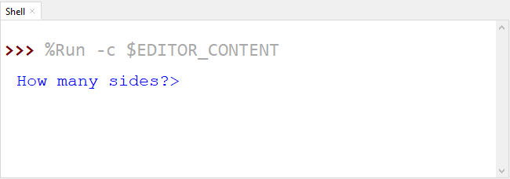
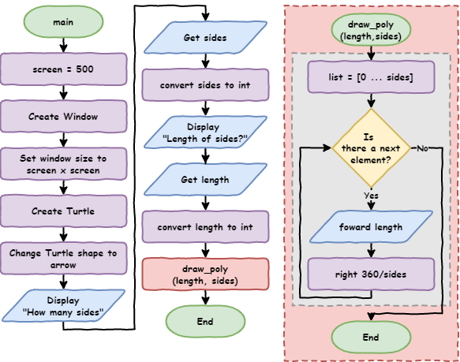

# Lesson 8: User Input

!!! learn "In this lesson we will learn"
    - how to get input from the user with `input()`
    - what data types are and why they matter
    - how to change a value from one data type into another

!!! terms "Terminology"
    - **interactive** – describes a program that lets the user give it information while it runs, instead of changing the code.
    - **data type** – the kind of value something is, such as a number or text, which tells Python what it can do with that value.
    - **integer** – a whole number written without a decimal point, like `1` or `25`, called `int` in Python.
    - **floating point number** – a number with a decimal point, like `1.0` or `3.5`, called `float` in Python.
    - **Boolean** – a data type that can only be `True` or `False`, called `bool` in Python.

<iframe width="560" height="315" src="https://www.youtube-nocookie.com/embed/HUEgYhYAuB0" title="YouTube video player" frameborder="0" allow="accelerometer; autoplay; clipboard-write; encrypted-media; gyroscope; picture-in-picture" allowfullscreen></iframe>

[Video link](https://youtu.be/HUEgYhYAuB0)

## Drawing any shape

Type the code below into a new file, or open `draw_poly.py` from the `lesson_08` folder of the [tutorial files](../index.md#tutorial-files). Save it as `draw_poly.py`.

```python linenums="1"
--8<-- "examples/lesson_08/draw_poly/main.py"
```

!!! primm "PRIMM"
    1. **Predict** what the turtle will draw.
    2. **Run** the code. Did it match your prediction?
    3. Time to **investigate** the code. What does each line do?

??? note "Code explanation"
    - **line 1** → imports the turtle module.
    - **line 4** → defines a function called `draw_poly` with two parameters, `length` and `sides`.
    - **line 5** → starts a `for` loop that repeats once for each side.
    - **line 6** → moves `my_ttl` forward by the value in `length`.
    - **line 7** → turns `my_ttl` right by `360` divided by `sides`.
    - **lines 11–13** → create a 500 × 500 pixel window.
    - **lines 16–17** → create a turtle called `my_ttl` with the turtle shape.
    - **line 19** → stores `9` in `sides`.
    - **line 20** → stores `100` in `length`.
    - **line 22** → calls `draw_poly` to draw a shape with 9 sides that are 100 long.

!!! primm "PRIMM"
    Time to **modify** the code. Part of the shape goes off the screen. Can you change the code so the shape fits in the window?

Changing `length` from `100` to `80` fixes it. That's easy for us, because we know how to code. But what about someone who doesn't? How can we let the user choose the shape without changing the code?

## Making our program interactive

The easiest way to make our program interactive is with the `input` function. It asks the user a question in the **Shell** and waits for them to type an answer.

Change lines 19 and 20 so our code matches the code below.

```python linenums="1" hl_lines="19-20"
--8<-- "examples/lesson_08/input/main.py"
```

!!! primm "PRIMM"
    1. **Predict** what will happen when we run the code.
    2. **Run** the code. When it asks, type `3` for the sides and `100` for the length. Did you expect a question to appear in the Shell? Did you expect an error?
    3. Time to **investigate** the code. What does each line do?

??? note "Code explanation"
    - **line 1** → imports the turtle module.
    - **lines 4–7** → define `draw_poly`, which draws a shape with `sides` sides that are `length` long.
    - **lines 11–13** → create a 500 × 500 pixel window.
    - **lines 16–17** → create a turtle called `my_ttl` with the turtle shape.
    - **line 19** → shows the question `How many sides?>` in the Shell, waits for the user to type an answer, and stores the answer in `sides`.
    - **line 20** → asks `How long are the sides?>` and stores the answer in `length`.
    - **line 22** → calls `draw_poly` with the user's answers.



The Shell shows this error:

``` { .text .error linenums="1" }
Traceback (most recent call last):
  File "<string>", line 22, in <module>
  File "<string>", line 5, in draw_poly
TypeError: 'str' object cannot be interpreted as an integer
```

This is a `TypeError`. To understand it, we need to learn about **data types**.

## Data types

Values in Python have different types. The four main types we will use are:

- **integers** (`int`) store whole numbers, written without a decimal point, like `1` or `25`
- **floating point numbers** (`float`) store numbers with a decimal point, like `1.0` or `3.5`. `1` is an integer, but `1.0` is a float.
- **strings** (`str`) store text: letters, numbers and symbols inside `" "` or `' '`. Numbers can be strings, like a phone number `"0432 789 367"`, but we can't do maths with strings.
- **Booleans** (`bool`) can only be `True` or `False`

Data types tell Python what it can do with a value. For example, we can do maths with numbers, but not with text.

Let's look at the error again:

``` { .text .error linenums="1" }
Traceback (most recent call last):
  File "<string>", line 22, in <module>
  File "<string>", line 5, in draw_poly
TypeError: 'str' object cannot be interpreted as an integer
```

- **line 4** tells us **what** went wrong. Always read the last line first. Python expected an integer (`int`), but it got a string (`str`) instead.
- **line 2** tells us the problem started on line 22 of our program, where we called `draw_poly`.
- **line 3** tells us the error happened on line 5, inside `draw_poly`: `for index in range(sides):`. The `range` function needs a whole number, but `sides` is a string.

Where did `sides` come from? Line 19: `sides = input("How many sides?> ")`. The user typed `3`, which looks like a number. So why is it a string?

Because **everything we get from `input()` is a string**, even if it looks like a number. To fix this, we need to change the string into a number.

## Converting data types

Python has built-in functions that change a value from one data type to another. If we have a variable called `value`:

- `str(value)` changes it into a string
- `int(value)` changes it into an integer
- `float(value)` changes it into a float

There's more to learn about this later, but that's all we need for now.

Let's put the `input()` inside `int()`, so the user's answer is changed into an integer. Change lines 19 and 20 so our code matches the code below.

```python linenums="1" hl_lines="19-20"
--8<-- "examples/lesson_08/convert/main.py"
```

!!! primm "PRIMM"
    1. **Predict** what will happen when we run the code.
    2. **Run** the code. Did it match your prediction?
    3. Time to **investigate** the code. Try different values for the sides and length. What values make the turtle draw a circle? What happens if you type a decimal, like `3.5`, or a word, like `dog`?

??? note "Code explanation"
    - **line 1** → imports the turtle module.
    - **lines 4–7** → define `draw_poly`, which draws a shape with `sides` sides that are `length` long.
    - **lines 11–13** → create a 500 × 500 pixel window.
    - **lines 16–17** → create a turtle called `my_ttl` with the turtle shape.
    - **line 19** → asks `How many sides?>`, changes the answer into an integer, and stores it in `sides`.
    - **line 20** → asks `How long are the sides?>`, changes the answer into an integer, and stores it in `length`.
    - **line 22** → calls `draw_poly` with the user's numbers.

Here is the program as a flowchart. Notice that input and output use the same shape, but with different labels.



!!! primm "PRIMM"
    Time to **modify** the code. Can you change the questions so they're clearer for the user?

## Exercises

In this course, the exercises are the **make** part of PRIMM. Work through them to make your own code.

Starter files are in the `lesson_08` folder of the tutorial files. Solutions are on the [Exercise Solutions](../reference/solutions.md#lesson-8-user-input) page.

### Exercise 1

Starter: `lesson_08/ex1_count_up`

Can you write a program that asks the user for a number, then counts up to that number? For example, if the user types `5`, it should print `1`, `2`, `3`, `4` and `5`.
