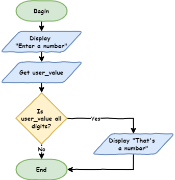
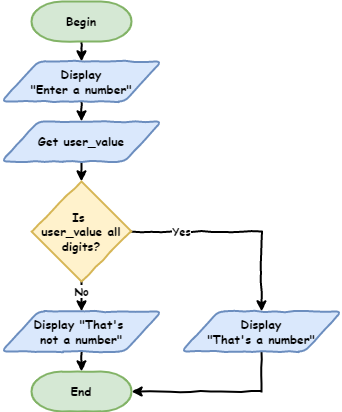
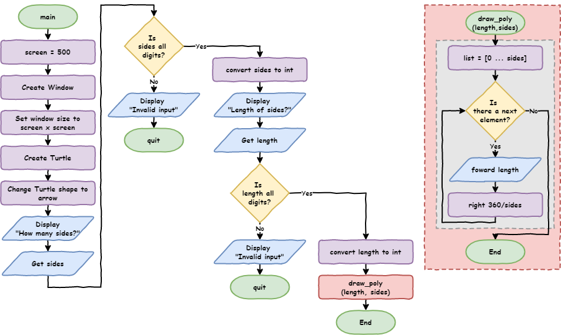
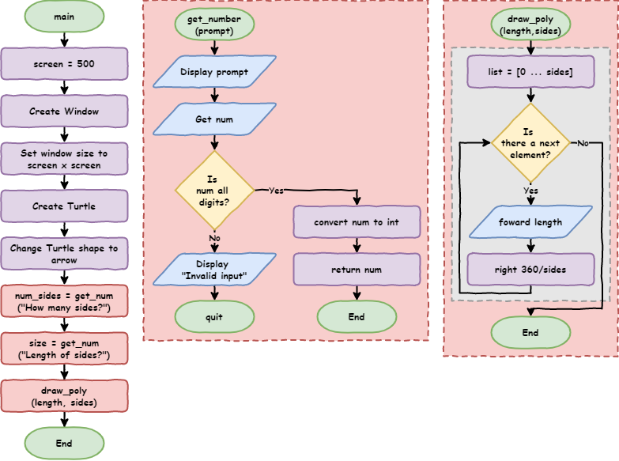
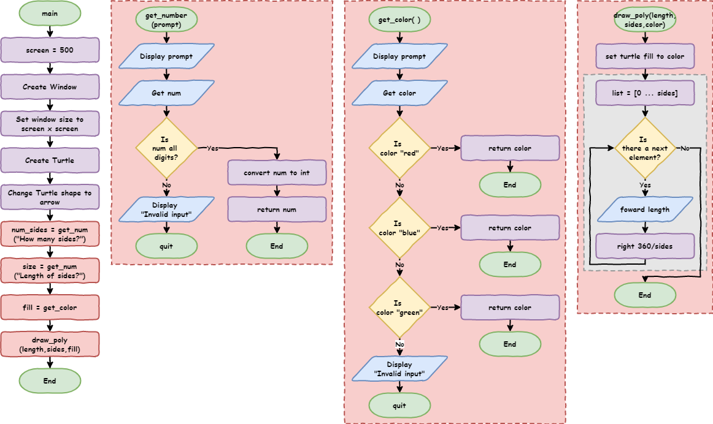

# Lesson 9: Branching

!!! learn "In this lesson we will learn"
    - how to check whether the user typed a number
    - how to make decisions with `if`, `else` and `elif`
    - how to refactor repeated code into a function that returns a value
    - how to fill shapes with colour

!!! terms "Terminology"
    - **branching** – letting a program choose between different paths depending on what is happening.
    - **method** – a function that belongs to an object or value, written after a dot, such as `name.upper()`.
    - **if statement** – code that makes a decision by running its indented block only when its condition is `True`.
    - **condition** – a check that gives back either `True` or `False`.
    - **else** – the part of an `if` statement that runs when none of the conditions are `True`.
    - **refactoring** – changing our code to make it better without changing what it does.
    - **return** – to send a value back from a function to the code that called it, which also ends the function.
    - **elif** – short for else if, a part of an `if` statement that checks another condition when the conditions before it were `False`.

<iframe width="560" height="315" src="https://www.youtube-nocookie.com/embed/fGEz4QNXpEE" title="YouTube video player" frameborder="0" allow="accelerometer; autoplay; clipboard-write; encrypted-media; gyroscope; picture-in-picture" allowfullscreen></iframe>

[Video link](https://youtu.be/fGEz4QNXpEE)

## Branching

**Branching** lets our program choose between different paths, depending on what is happening. To see why we need it, let's start with the shape program from [Lesson 8](lesson_08.md). Open `draw_poly.py` and save it as `shape_choices.py`, or open `shape_input.py` from the `lesson_09` folder of the [tutorial files](../index.md#tutorial-files).

```python linenums="1"
--8<-- "examples/lesson_09/shape_input/main.py"
```

!!! primm "PRIMM"
    1. **Predict** what will happen if the user types `dog` when asked for the number of sides.
    2. **Run** the code and type `dog`. Did it match your prediction?
    3. Time to **investigate** the code. What does each line do?

??? note "Code explanation"
    - **line 1** → imports the turtle module.
    - **lines 4–7** → define `draw_poly`, which draws a shape with `sides` sides that are `length` long.
    - **lines 11–13** → create a 500 × 500 pixel window.
    - **lines 16–17** → create a turtle called `my_ttl` with the turtle shape.
    - **line 20** → asks for the number of sides, changes the answer into an integer, and stores it in `sides`.
    - **line 21** → asks for the side length, changes the answer into an integer, and stores it in `length`.
    - **line 23** → calls `draw_poly` with the user's numbers.

The Shell shows this error:

``` { .text .error linenums="1" }
Traceback (most recent call last):
  File "<string>", line 20, in <module>
ValueError: invalid literal for int() with base 10: 'dog'
```

On line 20, the program tries to change the word `dog` into an integer. But `dog` isn't a number, so Python doesn't know how to change it, and the program crashes.

To fix this, we need to check that the user has typed a whole number **before** we change it into an integer.

## Checking for numbers

Create a new file, type in the code below, and save it as `number_check.py`.

```python linenums="1"
--8<-- "examples/lesson_09/isdigit/main.py"
```

!!! primm "PRIMM"
    1. **Predict** what will happen when we run the code twice: first typing `10`, then typing `dog`.
    2. **Run** the code twice. Did it match your prediction?
    3. Time to **investigate** the code. What does each line do?

??? note "Code explanation"
    - **line 1** → asks the user to enter a number and stores their answer, as a string, in `user_value`.
    - **line 3** → prints `True` if every character in `user_value` is a digit, or `False` if it isn't.

Remember, anything we get from `input` is a string. Strings have built-in tools called **methods** that help us work with them. The `isdigit` method checks whether every character in a string is a digit (`0` to `9`). It gives back `True` if they are, and `False` if they aren't.

!!! tip "String methods"
    Python has lots of useful string methods. The [W3Schools Python string methods page](https://www.w3schools.com/python/python_ref_string.asp) is a good place to explore them.

Now we can tell whether the user typed a number. Next, we need to tell the computer what to do with that answer.

## The `if` statement

Change `number_check.py` so it matches the code below.

```python linenums="1" hl_lines="3-4"
--8<-- "examples/lesson_09/if/main.py"
```

!!! primm "PRIMM"
    1. **Predict** what will happen when we run the code twice: first typing `10`, then typing `dog`.
    2. **Run** the code twice. Did it match your prediction?
    3. Time to **investigate** the code. What does each line do?

??? note "Code explanation"
    - **line 1** → asks the user to enter a number and stores their answer in `user_value`.
    - **line 3** → checks whether `user_value` is made up only of digits.
    - **line 4** → prints `That's a number`, but only if the check on line 3 is `True`.

Line 3 is an `if` statement:

- `if` tells Python to make a decision
- `user_value.isdigit()` is the **condition**: a check that gives back either `True` or `False`
- `:` tells Python that the indented lines below belong to the `if` statement
- the indented code only runs if the condition is `True`, so `10` prints the message and `dog` skips it

Flowcharts use the diamond-shaped **decision** symbol for the condition in an `if` statement, the same symbol we used for `for` loops.



Right now, the program only does something when the input **is** a number. What about when it isn't?

## The `if` … `else` statement

Add lines 5 and 6 so our code matches the code below.

```python linenums="1" hl_lines="5-6"
--8<-- "examples/lesson_09/if_else/main.py"
```

!!! primm "PRIMM"
    1. **Predict** what will happen when we run the code twice: first typing `10`, then typing `dog`.
    2. **Run** the code twice. Did it match your prediction?
    3. Time to **investigate** the code. Use the debugger to step through it twice, once with `10` and once with `dog`. Watch which path the program takes.

??? note "Code explanation"
    - **line 1** → asks the user to enter a number and stores their answer in `user_value`.
    - **line 3** → checks whether `user_value` is made up only of digits.
    - **line 4** → prints `That's a number` if the check is `True`…
    - **line 5** → …otherwise…
    - **line 6** → …prints `That's not a number`.

`else` is linked to the `if` statement above it. It runs when the `if` condition is `False`. Here is the flowchart:



## Using `if` … `else` to catch errors

Let's use `if` … `else` to stop our shape program crashing. Go back to `shape_choices.py` and change the `sides` code so our code matches the code below.

```python linenums="1" hl_lines="20-25"
--8<-- "examples/lesson_09/check_sides/main.py"
```

!!! primm "PRIMM"
    1. **Predict** what will happen when we type `dog` for the sides now.
    2. **Run** the code. Try a number first, then `dog`. Did it match your prediction?
    3. Time to **investigate** the code. What does each line do?

??? note "Code explanation"
    - **line 1** → imports the turtle module.
    - **lines 4–7** → define `draw_poly`, which draws a shape with `sides` sides that are `length` long.
    - **lines 11–13** → create a 500 × 500 pixel window.
    - **lines 16–17** → create a turtle called `my_ttl` with the turtle shape.
    - **line 20** → asks for the number of sides and stores the answer, as a string, in `sides`.
    - **line 21** → checks whether `sides` is made up only of digits.
    - **line 22** → if it is, changes `sides` into an integer…
    - **line 23** → …otherwise…
    - **line 24** → …tells the user their input is invalid…
    - **line 25** → …and stops the program.
    - **line 27** → asks for the side length, changes it into an integer, and stores it in `length`.
    - **line 29** → calls `draw_poly` with the user's numbers.

Now do the same for `length`, so our code matches the code below.

```python linenums="1" hl_lines="27-32"
--8<-- "examples/lesson_09/check_both/main.py"
```

!!! primm "PRIMM"
    1. **Predict** what will happen in each of these situations:
        - a valid number of sides and a valid length
        - a valid number of sides and an invalid length
        - an invalid number of sides and a valid length
        - an invalid number of sides and an invalid length
    2. **Run** the code four times to test each situation. Did it match your predictions?
    3. Time to **investigate** the code. What does each line do?

??? note "Code explanation"
    - **line 1** → imports the turtle module.
    - **lines 4–7** → define `draw_poly`, which draws a shape with `sides` sides that are `length` long.
    - **lines 11–13** → create a 500 × 500 pixel window.
    - **lines 16–17** → create a turtle called `my_ttl` with the turtle shape.
    - **lines 20–25** → ask for the number of sides, and either change it into an integer or stop the program.
    - **line 27** → asks for the side length and stores the answer, as a string, in `length`.
    - **line 28** → checks whether `length` is made up only of digits.
    - **line 29** → if it is, changes `length` into an integer…
    - **line 30** → …otherwise…
    - **line 31** → …tells the user their input is invalid…
    - **line 32** → …and stops the program.
    - **line 34** → calls `draw_poly` with the user's numbers.



!!! tip "Testing branches"
    When we test code with branches, we need to test **every** possible path. Test each `if` statement with a `True` condition and with a `False` condition. This program has four possible paths, so we need four tests.

## Refactoring our code

Our code doesn't pass the DRY test. Lines 20–25 and lines 27–32 do the same three things:

1. ask the user for input
2. check whether the input is only digits
3. either change it into an integer or stop the program

The only differences are the question shown to the user and the variable name. This is a good chance to **refactor** our code by using a function.

!!! tip "What is refactoring?"
    **Refactoring** means changing our code **without changing what it does**. We do it to make our code better, for example easier to read, fix and improve later.

Add a `get_number` function under `draw_poly`, then replace the `# get user input` code with two calls to it. Our code should match the code below.

```python linenums="1" hl_lines="10-16 29-30"
--8<-- "examples/lesson_09/get_number/main.py"
```

!!! primm "PRIMM"
    1. **Predict** whether the program will work any differently.
    2. **Run** the code. When we refactor, the program should work exactly the same, so test all four situations again.
    3. Time to **investigate** the code. What does each line do?

??? note "Code explanation"
    - **line 1** → imports the turtle module.
    - **lines 4–7** → define `draw_poly`, which draws a shape with `sides` sides that are `length` long.
    - **line 10** → defines a function called `get_number` with one parameter, `prompt`: the question to show the user.
    - **line 11** → shows the question in `prompt` and stores the user's answer in `num`.
    - **line 12** → checks whether `num` is made up only of digits.
    - **line 13** → if it is, changes `num` into an integer and **returns** it: sends it back to the code that called the function, and ends the function…
    - **line 14** → …otherwise…
    - **line 15** → …tells the user their input is invalid…
    - **line 16** → …and stops the program.
    - **lines 20–22** → create a 500 × 500 pixel window.
    - **lines 25–26** → create a turtle called `my_ttl` with the turtle shape.
    - **line 29** → calls `get_number` with the question `How many sides?>`, and stores the number it returns in `sides`.
    - **line 30** → calls `get_number` with the question `How long are the sides?>`, and stores the number it returns in `length`.
    - **line 32** → calls `draw_poly` with the user's numbers.

`return` is new. It sends a value back to the code that called the function, then ends the function. Here is the flowchart:



## Playing with colour

Let's add a new feature: colour. The turtle's `color` method takes two values: the colour of the line, then the colour used to fill the shape.

!!! tip "Colour or color?"
    Python uses US spelling for its built-in commands, so we must write `color`. If we use Australian spelling (`colour`), our program will crash. For our own variables and functions we can choose either spelling, but it's best to stay consistent.

Change `draw_poly` and the last line so our code matches the code below.

```python linenums="1" hl_lines="4-6 10 35"
--8<-- "examples/lesson_09/colour/main.py"
```

!!! primm "PRIMM"
    1. **Predict** what the turtle will draw.
    2. **Run** the code. Did it match your prediction?
    3. Time to **investigate** the code. What does each line do?

??? note "Code explanation"
    - **line 1** → imports the turtle module.
    - **line 4** → defines `draw_poly` with a third parameter, `color`.
    - **line 5** → sets the line colour to black and the fill colour to the value in `color`.
    - **line 6** → tells the turtle to start filling the shape it draws.
    - **lines 7–9** → draw the shape.
    - **line 10** → tells the turtle to stop drawing the shape and fill it in.
    - **lines 13–19** → define `get_number`, which asks a question and returns a whole number, or stops the program.
    - **lines 23–25** → create a 500 × 500 pixel window.
    - **lines 28–29** → create a turtle called `my_ttl` with the turtle shape.
    - **lines 32–33** → ask for the number of sides and the side length.
    - **line 35** → draws the shape, filled in red.

!!! tip "Turtle colours"
    Turtle knows lots of colour names. Here is a [list of the named colours](https://cs111.wellesley.edu/labs/lab02/colors) we can use.

Now let's let the user choose the fill colour: `red`, `blue` or `green`. If they type anything else, we need to catch the error.

`if` … `else` only gives us two paths: one for `True` and one for `False`. Here we need more than two. For that, we use `elif`.

## The `if` … `elif` … `else` statement

`elif` is short for "else if". It lets our program choose between many options, not just two.

Add a `get_color` function and change the `# get user input` code and the last line so our code matches the code below.

```python linenums="1" hl_lines="22-32 47 49"
--8<-- "examples/lesson_09/get_color/main.py"
```

!!! primm "PRIMM"
    1. **Predict** what will happen when we type `Blue`, then when we type `purple`.
    2. **Run** the code with each colour. Did it match your predictions?
    3. Time to **investigate** the code. What does each line do?

??? note "Code explanation"
    - **line 1** → imports the turtle module.
    - **lines 4–10** → define `draw_poly`, which draws a filled shape.
    - **lines 13–19** → define `get_number`, which asks a question and returns a whole number, or stops the program.
    - **line 22** → defines a function called `get_color`.
    - **line 23** → asks the user for a fill colour, changes their answer to lowercase with the `lower` method, and stores it in `color`. So `Red`, `RED` and `rEd` all become `red`.
    - **line 24** → checks whether `color` is `"red"`. `==` means "is equal to".
    - **line 25** → if it is, returns `color` and ends the function…
    - **line 26** → …otherwise, checks whether `color` is `"blue"`…
    - **line 27** → …and if it is, returns `color`…
    - **line 28** → …otherwise, checks whether `color` is `"green"`…
    - **line 29** → …and if it is, returns `color`…
    - **line 30** → …otherwise, when none of the checks were `True`…
    - **line 31** → …tells the user their input is invalid…
    - **line 32** → …and stops the program.
    - **lines 36–38** → create a 500 × 500 pixel window.
    - **lines 41–42** → create a turtle called `my_ttl` with the turtle shape.
    - **lines 45–46** → ask for the number of sides and the side length.
    - **line 47** → calls `get_color` and stores the colour it returns in `fill`.
    - **line 49** → draws the shape, filled with the chosen colour.



### How `if` … `elif` … `else` works

- `if`
    - always comes first
    - is required, and there can only be one
    - checks the first condition
- `elif`
    - comes after the `if` and before the `else`
    - is optional, and there can be as many as we need
    - is only checked if all the conditions before it were `False`
- `else`
    - always comes last
    - is optional, and there can only be one
    - runs if none of the conditions were `True`

## Exercises

In this course, the exercises are the **make** part of PRIMM. Work through them to make your own code.

Starter files are in the `lesson_09` folder of the tutorial files. Solutions are on the [Exercise Solutions](../reference/solutions.md#lesson-9-branching) page.

### Exercise 1

Starter: `lesson_09/ex1_security_guard`

Amy needs a security guard for her party. Can you write a program that asks for a person's name, then:

- lets them in if their name is `Amy`
- politely tells everyone else to go away

### Exercise 2

Starter: `lesson_09/ex2_friends`

Amy's friend Bruce is coming too. Can you change your security guard program so it lets in Amy, lets in her friend (stored in the `friend` variable), and politely tells everyone else to go away?

### Exercise 3

Starter: `lesson_09/ex3_shape_position`

Can you finish the `move_pen` function so the user can choose where the shape is drawn? It should:

- ask the user for the `x` and `y` position using `get_number`
- lift the pen, move to that position and put the pen down

!!! tip "Negative numbers"
    In this starter, `get_number` uses `num.lstrip("-").isdigit()`. `lstrip("-")` removes a minus sign from the start of the string before checking it, so the user can type negative positions like `-100`.
