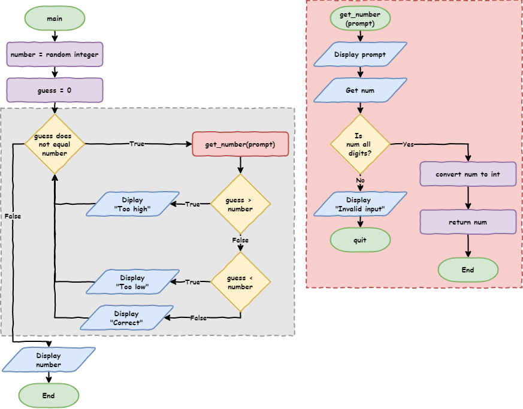
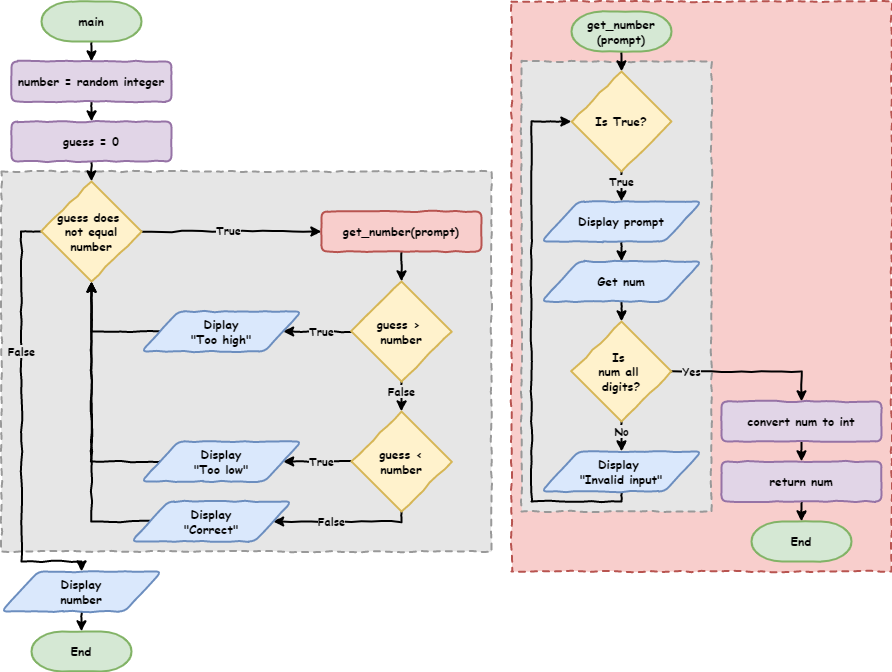

# Lesson 10: While Loops

!!! learn "In this lesson we will learn"
    - the difference between definite and indefinite iteration
    - how to make Python pick random numbers
    - how to use comparison operators
    - how to use a `while` loop to repeat until something happens
    - how to keep asking the user until they give a valid answer

!!! terms "Terminology"
    - **while loop** – a loop that keeps repeating its code while its condition is `True`.
    - **definite iteration** – a loop where we know how many times it will run, usually written as a `for` loop.
    - **indefinite iteration** – a loop where we don't know how many times it will run, usually written as a `while` loop.
    - **count-controlled loop** – a loop that runs a set number of times, like a `for` loop.
    - **condition-controlled loop** – a loop that runs until a condition changes, like a `while` loop.
    - **comparison operator** – a symbol such as `==`, `!=`, `>` or `<` that compares two values and gives back `True` or `False`.
    - **infinite loop** – a loop whose condition is always `True`, so it never stops on its own.
    - **break** – a command that exits a loop straight away.

<iframe width="560" height="315" src="https://www.youtube-nocookie.com/embed/A9j7N6kLL1U" title="YouTube video player" frameborder="0" allow="accelerometer; autoplay; clipboard-write; encrypted-media; gyroscope; picture-in-picture" allowfullscreen></iframe>

[Video link](https://youtu.be/A9j7N6kLL1U)

## Two types of loops

Python has two types of loops. We've already used the `for` loop. Now we'll learn about the `while` loop. They match two different ways of repeating code:

- **definite iteration** is when we **know** how many times the loop will run. We use a `for` loop, because it runs a set number of times.
- **indefinite iteration** is when we **don't know** how many times the loop will run. We use a `while` loop, because it keeps going while something is `True`.

Think about dealing cards:

- In Uno, each player gets 7 cards, so we deal 7 times. This is **definite** iteration.
- In Snap, we keep dealing until the deck is empty, and we don't know how many cards each player will get. This is **indefinite** iteration.

So:

- a `for` loop runs a set number of times (**count controlled**)
- a `while` loop runs until a condition changes (**condition controlled**)

To see how `while` loops work, let's build a number guessing game.

## Number guessing game

Type the code below into a new file, or open `one_guess.py` from the `lesson_10` folder of the [tutorial files](../index.md#tutorial-files). Save it as `guessing_game.py`.

```python linenums="1"
--8<-- "examples/lesson_10/one_guess/main.py"
```

!!! primm "PRIMM"
    1. **Predict** what will happen when we run the code.
    2. **Run** the code. Did it match your prediction?
    3. Time to **investigate** the code. What does each line do?

??? note "Code explanation"
    - **line 1** → imports the `random` module, so we can use its random number tools.
    - **lines 4–10** → define `get_number`, which asks a question and returns a whole number, or stops the program.
    - **line 13** → picks a random whole number from 1 to 100 (including both 1 and 100) and stores it in `number`.
    - **line 15** → asks the user to guess the number and stores their guess in `guess`.
    - **line 17** → checks whether `guess` is equal to `number`.
    - **line 18** → if it is, prints `Correct!`…
    - **line 19** → …otherwise…
    - **line 20** → …prints `Incorrect.` and shows the number.

!!! tip "The random module"
    The **random** module has lots of functions for getting random values. To see them all, visit the [W3Schools Python random module page](https://www.w3schools.com/python/module_random.asp).

`==` is a **comparison operator**. It compares two values and gives back `True` or `False`.

!!! tip "Comparison operators"
    | Operator | Meaning |
    | :---: | --- |
    | `==` | checks if two values are the same |
    | `!=` | checks if two values are different |
    | `>` | checks if the left value is greater than the right value |
    | `<` | checks if the left value is less than the right value |
    | `>=` | checks if the left value is greater than or equal to the right value |
    | `<=` | checks if the left value is less than or equal to the right value |

## A better game

With only one guess, the game isn't much fun. Let's give the player **10 guesses**. That means repeating code, which is **iteration**. We **know** it will repeat 10 times, so this is definite iteration, and we use a `for` loop.

Change our code so it matches the code below.

```python linenums="1" hl_lines="15 17-23 25"
--8<-- "examples/lesson_10/ten_guesses/main.py"
```

!!! primm "PRIMM"
    1. **Predict** what will happen when we run the code.
    2. **Run** the code. Did it match your prediction?
    3. Time to **investigate** the code. What does each line do?

??? note "Code explanation"
    - **line 1** → imports the `random` module.
    - **lines 4–10** → define `get_number`, which asks a question and returns a whole number, or stops the program.
    - **line 13** → picks a random whole number from 1 to 100 and stores it in `number`.
    - **line 15** → tells the user they have 10 guesses.
    - **line 17** → starts a `for` loop that repeats 10 times.
    - **line 18** → asks the user for a guess and stores it in `guess`.
    - **line 20** → checks whether `guess` is equal to `number`.
    - **line 21** → if it is, prints `Correct!`…
    - **line 22** → …otherwise…
    - **line 23** → …prints `Incorrect. Try again`.
    - **line 25** → shows the number after all 10 guesses are finished.

## An even better game

This version is better, but players don't learn anything from their earlier guesses. Let's give them hints by telling them if their guess is **too high** or **too low**. Change the `if` … `else` into an `if` … `elif` … `else` so our code matches the code below.

```python linenums="1" hl_lines="20-25"
--8<-- "examples/lesson_10/hints/main.py"
```

!!! primm "PRIMM"
    1. **Predict** what will happen when:
        - the guess is too high
        - the guess is too low
        - the guess is correct
        - all 10 guesses are used without finding the number
    2. **Run** the code several times until you've seen all four. Did they match your predictions?
    3. Time to **investigate** the code. What does each line do?

??? note "Code explanation"
    - **line 1** → imports the `random` module.
    - **lines 4–10** → define `get_number`, which asks a question and returns a whole number, or stops the program.
    - **line 13** → picks a random whole number from 1 to 100 and stores it in `number`.
    - **line 15** → tells the user they have 10 guesses.
    - **line 17** → starts a `for` loop that repeats 10 times.
    - **line 18** → asks the user for a guess and stores it in `guess`.
    - **line 20** → checks whether `guess` is greater than `number`…
    - **line 21** → …and if it is, prints `Guess is too high`…
    - **line 22** → …otherwise, checks whether `guess` is less than `number`…
    - **line 23** → …and if it is, prints `Guess is too low`…
    - **line 24** → …otherwise, when the guess is neither too high nor too low…
    - **line 25** → …prints `Correct!`.
    - **line 27** → shows the number after the loop has finished.

!!! tip "Testing tip"
    To make testing easier, add a line that prints `number` just after it's chosen. Once you've finished testing, comment that line out so it doesn't spoil the game.

Did you notice the problem? When the user guesses the number, the game says `Correct!`… and then keeps asking for more guesses. That's because a `for` loop always runs a set number of times, no matter what.

We want the game to stop as soon as the correct number is guessed. We need a loop that keeps going **until something happens**: indefinite iteration, using a `while` loop.

## Using a `while` loop

Make these changes so our code matches the code below:

- replace line 15 with `guess = 0`
- change the `for` loop on line 17 to `while guess != number:`

```python linenums="1" hl_lines="15 17"
--8<-- "examples/lesson_10/while_loop/main.py"
```

!!! primm "PRIMM"
    1. **Predict** what will happen when:
        - the guess is too high
        - the guess is too low
        - the guess is correct
    2. **Run** the code. Did it match your predictions?
    3. Time to **investigate** the code. What does each line do?

??? note "Code explanation"
    - **line 1** → imports the `random` module.
    - **lines 4–10** → define `get_number`, which asks a question and returns a whole number, or stops the program.
    - **line 13** → picks a random whole number from 1 to 100 and stores it in `number`.
    - **line 15** → gives `guess` a starting value of `0`, so the `while` condition can be checked before the user has guessed.
    - **line 17** → starts a `while` loop that keeps repeating while `guess` is not equal to `number`.
    - **line 18** → asks the user for a guess and stores it in `guess`.
    - **lines 20–25** → print `Guess is too high`, `Guess is too low` or `Correct!`.
    - **line 27** → shows the number once the loop has finished.

Let's look closely at line 17, `while guess != number:`:

- `guess != number` is the loop's **condition**. It's `True` when the guess is **not** the number, and `False` when it is.
- `while` tells Python to keep repeating the indented code **while** the condition is `True`.

And line 15, `guess = 0`:

- the `while` condition uses `guess` before the user has entered anything, so `guess` needs a starting value, or the program will crash
- the starting value must **not** be the same as the random number, or the loop won't run at all
- the random number is between 1 and 100, so `0` guarantees the loop runs at least once



## Using `while` to catch errors

The game is better now, but there's still a problem. If the user types something that isn't a number, the game ends straight away. That's frustrating if they've already made a few guesses.

We can fix this with a `while` loop inside `get_number`, so it keeps asking until the user types a valid number. Change `get_number` so our code matches the code below.

```python linenums="1" hl_lines="5-10"
--8<-- "examples/lesson_10/keep_asking/main.py"
```

!!! primm "PRIMM"
    1. **Predict** what will happen when we type `dog` as a guess.
    2. **Run** the code. Test a guess that's too high, too low, correct, and not a number. Did it match your predictions?
    3. Time to **investigate** the code. What does each line do?

??? note "Code explanation"
    - **line 1** → imports the `random` module.
    - **line 4** → defines `get_number` with one parameter, `prompt`.
    - **line 5** → starts a `while` loop whose condition is always `True`, so it repeats until the function returns.
    - **line 6** → shows the question in `prompt` and stores the user's answer in `num`.
    - **line 7** → checks whether `num` is made up only of digits.
    - **line 8** → if it is, changes `num` into an integer and returns it, which ends the function and the loop…
    - **line 9** → …otherwise…
    - **line 10** → …tells the user their input is invalid, and the loop asks again.
    - **line 13** → picks a random whole number from 1 to 100 and stores it in `number`.
    - **line 15** → gives `guess` a starting value of `0`.
    - **line 17** → starts a `while` loop that keeps repeating while `guess` is not equal to `number`.
    - **line 18** → asks the user for a guess and stores it in `guess`.
    - **lines 20–25** → print `Guess is too high`, `Guess is too low` or `Correct!`.
    - **line 27** → shows the number once the loop has finished.

`while True:` is called an **infinite loop**, because its condition is always `True`. Usually an infinite loop is a mistake, but here we're using it on purpose. We can leave the loop with:

- `break`, which exits the loop
- `return`, which exits the function, and so the loop too

The program now keeps asking until the user types a valid number, instead of crashing.



## Exercises

In this course, the exercises are the **make** part of PRIMM. Work through them to make your own code.

Starter files are in the `lesson_10` folder of the tutorial files. Solutions are on the [Exercise Solutions](../reference/solutions.md#lesson-10-while-loops) page.

### Exercise 1

Starter: `lesson_10/ex1_keep_asking`

Can you change the `get_number` and `get_color` functions so they keep asking until the user types a valid answer, instead of stopping the program?
