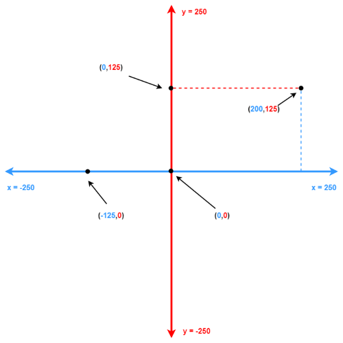

# Lesson 12: Mouse Input

!!! learn "In this lesson we will learn"
    - how to make the turtle respond to mouse clicks
    - how to use `if`, `elif` and `else` with Boolean operators to decide what happens
    - how to use coordinates to work out where the user clicked

There is no video for this lesson.

## Mouse input in turtle

So far, the user has only typed input into the **Shell**. But turtle can also take input from the mouse (and even the keyboard).

Type the code below into a new file, or open `mouse_dots.py` from the `lesson_12` folder of the [tutorial files](../index.md#tutorial-files). Save it as `mouse_dots.py`.

```python linenums="1"
--8<-- "examples/lesson_12/mouse_dots/main.py"
```

!!! primm "PRIMM"
    1. **Predict** what will happen when we run the code and click in the turtle window.
    2. **Run** the code, then click in different parts of the turtle window. Watch the Shell too. Did it match your prediction?
    3. Time to **investigate** the code. What does each line do?

??? note "Code explanation"
    - **line 1** → imports the turtle module.
    - **line 4** → defines a function called `set_scene`, which gets the window ready.
    - **line 5** → makes a window 800 pixels wide and 600 pixels high.
    - **line 6** → tells turtle to run the `draw_dot` function whenever the mouse is clicked in the window.
    - **line 7** → sets `my_ttl` to its fastest speed, so the lines appear straight away.
    - **line 8** → starts a `for` loop that repeats twice.
    - **lines 9–10** → draw a line 400 long, from the centre to the side of the window, and back again.
    - **line 11** → turns `my_ttl` 90 degrees to the right.
    - **lines 12–13** → draw a line 300 long, from the centre to the top or bottom of the window, and back again.
    - **line 14** → turns `my_ttl` 90 degrees to the right.
    - **line 15** → lifts the pen, so `my_ttl` won't draw a line when it moves to a click.
    - **line 18** → defines a function called `draw_dot` with two parameters, `x` and `y`: the position of the mouse click.
    - **line 19** → prints the click's `x` and `y` position in the Shell.
    - **line 20** → stores `"orange"` in `color`.
    - **line 21** → stores `10` in `size`.
    - **line 22** → moves `my_ttl` to the click's position.
    - **line 23** → draws a dot where `my_ttl` is, using the size in `size` and the colour in `color`.
    - **line 26** → creates a turtle called `my_ttl`.
    - **line 27** → calls `set_scene` to set up the window.
    - **line 28** → hides `my_ttl`.
    - **line 29** → keeps the window open and waiting for mouse clicks.

Python runs this program in a different order from the way it's written:

1. **Lines 26–29** run first: they create the turtle, set up the window, hide the turtle and wait for clicks.
2. **Lines 4–15**, the `set_scene` function, run when line 27 calls it. The four lines it draws split the window into four sections, called **quadrants**.
3. **Lines 18–23**, the `draw_dot` function, run every time we click. We never call `draw_dot` ourselves: line 6 tells turtle to call it for us, and turtle always sends it the click's `x` and `y` position.

!!! primm "PRIMM"
    Time to **modify** the code. What happens if you comment out line 15? Why?

## Exercises

In this course, the exercises are the **make** part of PRIMM. Work through them to make your own code.

Right now, every dot is orange. In these exercises, the quadrant we click in will decide the dot's colour. To do this, we'll need:

- `if`, `elif` and `else` statements
- comparison operators
- Boolean operators

We also need to remember how turtle coordinates work: `(0, 0)` is the centre, `x` is bigger to the right, and `y` is bigger towards the top.



Starter files are in the `lesson_12` folder of the tutorial files. Solutions are on the [Exercise Solutions](../reference/solutions.md#lesson-12-mouse-input) page.

### Exercise 1

Starter: `lesson_12/ex1_top_right`

Can you add an `if` statement to `draw_dot`, after `color = "orange"`, so the dot is red when we click in the top-right quadrant? To make the dot red, use `color = "red"`.

!!! tip "Hint"
    Look at the coordinates diagram. What is true about `x` and `y` for every point in the top-right quadrant? We need to check both, so we'll need a Boolean operator.

### Exercise 2

Starter: `lesson_12/ex2_if_else`

Can you use `if` and `else` so the dot is red when we click in the top-right quadrant, and green when we click anywhere else?

### Exercise 3

Starter: `lesson_12/ex3_quadrants`

Can you use `if`, `elif` and `else` so each quadrant has its own colour? The dot should be:

- red in the top-right quadrant
- blue in the top-left quadrant
- yellow in the bottom-left quadrant
- green in the bottom-right quadrant
