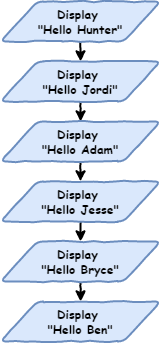
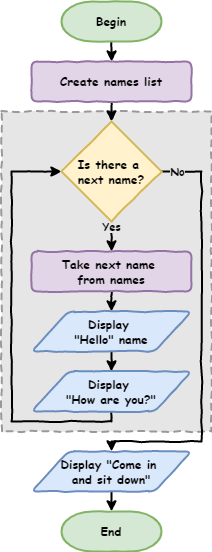

# Python Turtle

Lesson 2

---

## Topics

- iteration and how to it to reduce your code length
- flowcharts and how to use them to represent program algorithms
- how to write Python programs using `for` loops
- how to use a Thonny's debugger to trace `for` loops
- how to use the `range` function to generate lists of numbers

---

## Part 1

*Iteration introduction*

---

### Story so far

Executing each line of code one after another.

**Sequential** programming &rarr; default movement

Movement of program &rarr; **the flow** of the program

---

### Introduction to flowcharts

**Flowchart** &rarr; diagram to show the flow of computer programs.

They show:

- each process in the program
- the program moving from one process to the next


---

Program to say hello to six people



---

### Transfer flowchart

Create a **lesson_2_pt_1.py**

``` python
# our iteration program

print("Hello Hunter")
print("Hello Jordi")
print("Hello Adam")
print("Hello Jesse")
print("Hello Bryce")
print("Hello Ben")
```

Sequential flow: `line 1` &rarr; `line 8`

**Predict** and **run**.

---

**Shell** should show:

```
Hello Hunter
Hello Jordi
Hello Adam
Hello Jesse
Hello Bryce
Hello Ben
```

---

Change the order &rarr; code will run differently

``` python
# our iteration program

print("Hello Jesse")
print("Hello Bryce")
print("Hello Ben")
print("Hello Hunter")
print("Hello Jordi")
print("Hello Adam")
```

Predict what this code will produce.

---

**Shell** should show:

```
Hello Jesse
Hello Bryce
Hello Ben
Hello Hunter
Hello Jordi
Hello Adam
```

---

Sequential becomes a problem with bigger programs

- say hello to 500 people, or 1,000 people or more!
- decided to say `"good morning"` rather than `"hello"`

Ok for a small program, but becomes a problem

> Digital Technologies terminology &rarr; not **scalable**.

---

### Iteration

Notice a lot of repetition

Almost the same &rarr; only the name changing

``` python
# our iteration program

print("Hello Jesse")
print("Hello Bryce")
print("Hello Ben")
print("Hello Hunter")
print("Hello Jordi")
print("Hello Adam")
```

Against the **DRY** programming principle

---


---

Use **iteration** to not-repeat-yourself

Often called **loops**

Repeats code with slight difference

We want to repeat the code `print("Hello", name)` with a different name each time.

The `for` loop is the first loop we use

A **control structure** &rarr; causes the program to deviate from flow

---

Make your code as below:

``` python
# our iteration program

names = ["Hunter", "Jordi", "Adam", "Jesse", "Bryce", "Ben"]

for name in names:
    print("Hello", name)
```

**Predict** what you think will happen then **run** the code

---

**Investigate** by unpacking the code:

- `names = ["Hunter", "Jordi", "Adam", "Jesse", "Bryce", "Ben"]` &rarr; list
  - just like a real world list
  - `[` indicates the beginning and `]` indicates the end
  - `"Hunter"`, `"Jordi"`, `"Adam"`, `"Jesse"`, `"Bryce"`, `"Ben"` 
    - items in the list
    - called **elements**
  - elements separated by commas (`,`)
  - `names =` gives the list a name
    - this list is called `names`

---

- `for name in names:` &rarr; how we create a `for` loop
  - `for` &rarr; keyword identifying the beginning of `for` loop
  - `in names` &rarr; repeat the code below using each element of the `names` list
  - `name` &rarr; the current `names` element in use
  - `:` rarr; indented code block follows

---

- `print("Hello", name)` &rarr; indented.
  - indentation &rarr; the code to be repeated
    - can be many lines.
    - multi-line indented code &rarr; **code block**.
    - should be four spaces
  - `print("Hello", name)`
    - print `Hello` to the **Shell** 
    - print the current `names` element in use

---

#### For loop flowchart

Two more flowchart symbols:


---

Flowchart for our first `for` loop


---

#### Tracing with debugger

Use Thonny's debugger to see how the `for` loop works

Launch debugger &rarr; click bug beside play button


Keep pressing **F7** on your keyboard

Note values in the **Variables** panel

---

### Code blocks

Multi-line indented code &rarr; **code block**

All indented code will repeat

``` python
# our iteration program

names = ["Hunter", "Jordi", "Adam", "Bryce", "Ben"]

for name in names:
    print("Hello", name)
    print("How are you?")
```

**Predict** then **run**

---

**Shell** should have:

```
Hello Hunter
How are you?
Hello Jordi
How are you?
Hello Adam
How are you?
Hello Jesse
How are you?
Hello Bryce
How are you?
Hello Ben
How are you?
```

**All** the code block is repeated:

- all code at the same indentation level is repeated
- important to ensure the whole code block uses the same number of spaces

---

What if we remove indentation?

Add `print("Come in and sit down")` to the end.

Don't indent it.

``` python
# our iteration program

names = ["Hunter", "Jordi", "Adam", "Bryce", "Ben"]

for name in names:
    print("Hello", name)
    print("How are you?")

print("Come in and sit down")
```

**Predict** and **run** your code.

---

Your **Shell** should show.

```
Hello Hunter
How are you?
Hello Jordi
How are you?
Hello Adam
How are you?
Hello Jesse
How are you?
Hello Bryce
How are you?
Hello Ben
How are you?
Come in and sit down
```

`print("Come in and sit down")` is not repeated

Runs after the `for` loop is finished

---



---

## Part 2

*List numbers and Range*

---

### Introducing `range`

You can also run loops over lists of numbers.

New file **lesson_2_pt_2a.py**:

``` python
number_list = [1, 2, 3, 4, 5, 6, 7, 8, 9, 10]

for number in number_list:
    print(number)
```

How about `print` the numbers between 1 and 100? 

---

Python's  `range` function &rarr; makes list between two numbers

Change your code:

``` python
number_list = range(1, 101)

for number in number_list:
    print(number)
```

PRIMM

- **Predict** what you think will happen
- **Run** the code an see how close your prediction was
- Let's **investigate** the code.

---

`number_list = range(1, 101)`

- `range` &rarr; create a list of numbers
- `1` &rarr; first number in the list
- `101` &rarr; first number **not** in the list

Make the code shorter &rarr; use `range` inside the `for` statement

``` python
for number in range(1, 101):
    print(number)
```

---

### Use for Turtle

Code blocks contain any code &rarr; including Turtle code

New file &rarr; **lesson_2_pt_2b.py**:

``` python
import turtle

window = turtle.Screen()
window.setup(500, 500)

my_ttl = turtle.Turtle()

for number in range(1, 101):
    my_ttl.forward(100)
    my_ttl.backward(100)
    my_ttl.left(3)
```

---

PRIMM:

- **Predict** what you think will happen, and then **run** the code. Did it do what you predicted?
- **Investigate** the code by changing aspect of the code.
- **Modify** the code so that is makes a complete circle.

---

## Exercises

Exercises are the **make** component of the PRIMM model

Complete exercises 1 to 5