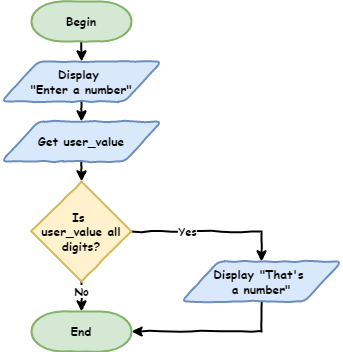
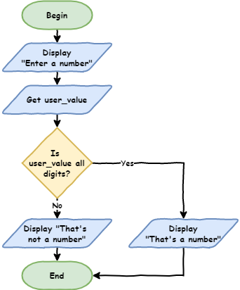
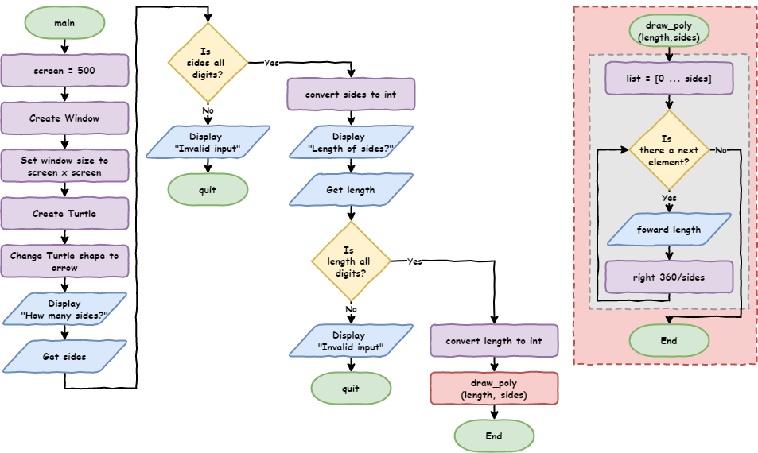
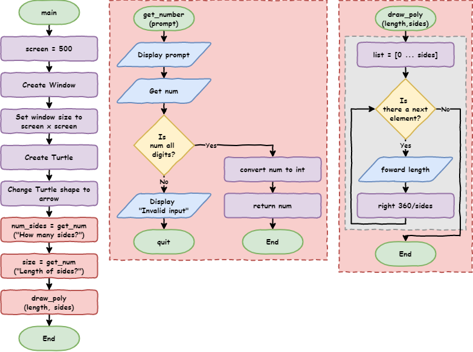
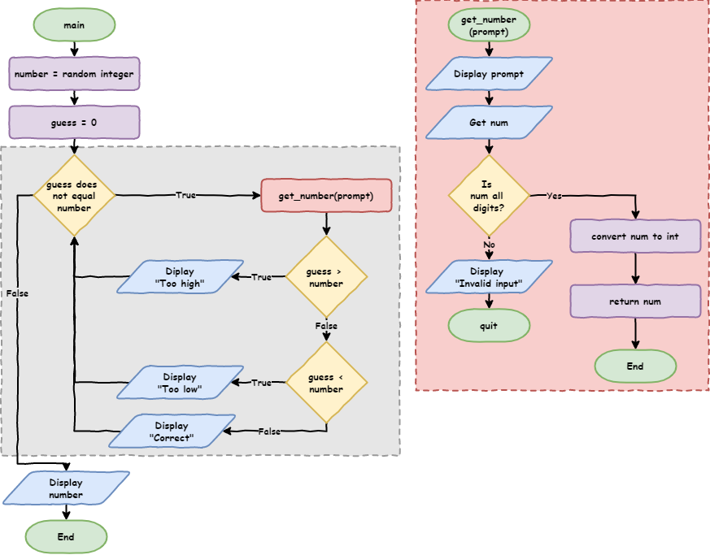

# Python Turtle

Lesson 5

---

Topics

- how to capturing errors
- what are branching control structures (`if` statements)
- how and when to use `if` ... `elif` ... `else` in Python
- the difference between definite and indefinite iteration
- how and when to use `where` loops in Python
- how to generate random numbers in Python

---

## Part 1

*Branching*

---

### Branching control structure

Allows program flow to take alternative paths.

Open **lesson_4_pt_2.py** file &rarr; Save as **lesson_5_pt_1a.py**.

---

``` python
import turtle


def draw_poly(length, sides):
    for i in range(sides):
        my_ttl.forward(length)
        my_ttl.right(360 / sides)


# setup window
screen = 500
window = turtle.Screen()
window.setup(screen, screen)

# create instance of turtle
my_ttl = turtle.Turtle()
my_ttl.shape("turtle")

num_sides = int(input("How many sides?> "))
size = int(input("Length of sides?> "))

draw_poly(size, num_sides)
```

---

**Run** the program, &rarr; enter `dog`.

```
Traceback (most recent call last):
  File "<string>", line 19, in <module>
ValueError: invalid literal for int() with base 10: 'dog'
```

`num_sides = int(input("How many sides?> "))`

- trying to convert `dog` in integer
- `dog` is not a whole number &rarr; error

Need to checkuser has entered a whole number

---

New file &rarr; Save as **lesson_5_pt_1b.py**

``` python
user_value = input("Enter a number: ")

print(user_value.isdigit())
```

- **Predict** for two runs of the code:
  - first &rarr; enter `10`
  - second &rarr; enter `dog`
- **Run** the code. Did it follow your predictions?

---

### Investigate the code

Python inputs are strings

Strings special operations (**methods**). 

`isdigit` method &rarr; `True` when **all** characters are digits

> Many string methods &rarr; [**W3Schools' Python String Methods**](https://www.w3schools.com/python/ref_string_isdigit.asp)

Can tell input is a number &rarr; make computer respond

---

### The `if` statement

Adjusts **lesson_5_pt_1b.py**

``` python
user_value = input("Enter a number: ")

if user_value.isdigit():
    print("That's a number")
```

- **Predict** for two runs of the code:
  - first &rarr; enter `10`
  - second &rarr; enter `dog`
- **Run** the code. Did it follow your predictions?

---

### Investigate code - Flowchart

Condition symbol (diamond) also used for `if` statements



---

### Investigate code - Breakdown

- `if user_value.isdigit():` &rarr; defines the `if` statement
  - `if` &rarr; keyword
  - `user_value.isdigit()` &rarr; **conditional**
    - return `True` or `False`
  - `:` &rarr; indented code block coming
  - indented code block &rarr; only run when conditional returns `True`
- `print("That's a number")`
  - will run when `user_value.isdigit()` is `True`

---

### The `if` ... `else` statement

How to respond when `user_value.isdigit()` returns `False`?

Adjust **lesson_5_pt_1b.py**

``` python
user_value = input("Enter a number: ")

if user_value.isdigit():
    print("That's a number")
else:
    print("That's not a number")
```

- **Predict** for two runs of the code:
  - first &rarr; enter `10`
  - second &rarr; enter `dog`
- **Run** the code. Did it follow your predictions?

---

### Investigate code - Flowchart



---

### Investigate code - Breakdown

- `else:`
  - uses `if` statement condition
  - when `user_value.isdigit()` is `False` &rarr; run indented code block
  - `:` &rarr; indented code block coming
- `print("That's not a number")`
  - will run when `user_value.isdigit()` returns `False`

Use the **debugger** with inputs of `10` and `dog`

---

### Using `if` ... `else` to capture errors

**lesson_5_pt_1a.py** &rarr; adjust `# get user input` section

``` python
# get user input
num_sides = input("How many sides?> ")
if num_sides.isdigit():
    num_sides = int(num_sides)
else:
    print("Invalid input")
    quit()

size = input("Length of sides?> ")
if size.isdigit():
    size = int(size)
else:
    print("Invalid input")
    quit()
```

---

``` python
import turtle


def draw_poly(length, sides):
    for i in range(sides):
        my_ttl.forward(length)
        my_ttl.right(360 / sides)


# setup window
screen = 500
window = turtle.Screen()
window.setup(screen, screen)

# create instance of turtle
my_ttl = turtle.Turtle()
my_ttl.shape("turtle")

# get user input
num_sides = input("How many sides?> ")
if num_sides.isdigit():
    num_sides = int(num_sides)
else:
    print("Invalid input")
    quit()

size = input("Length of sides?> ")
if size.isdigit():
    size = int(size)
else:
    print("Invalid input")
    quit()

draw_poly(size, num_sides)
```

---

- **Predict** for these scenarios:
  - valid `sides` value and valid `size` value
  - valid `sides` value and invalid `size` value
  - invalid `sides` value and valid `size` value
  - invalid `sides` value and invalid `size` value
- **Run** the code. Did it follow your prediction?

More testing tips

- Testing branching code &rarr; test all possible paths
- Test `if` statements for `True` and `False` conditions

---

### Investigate code - Flowchart



---

### Investigate code - Breakdown

- `# get user input` &rarr; code structure comment
- `num_sides = input("How many sides?> ")` &rarr; user input assigned to `num_sides`
- `if num_sides.isdigit():` &rarr; if `num_sides` only contains numbers execute:
  - `num_sides = int(size)`:
    - converts `num_sides` value to integer
    - reassigns integer to `num_sides`
- `else:` &rarr; if `num_sides.isdigit()` returns `false` execute:
  - `print("Invalid input")` &rarr; informs the user of mistake
  - `quit()` &rarr; exits the program

---

### Refactor Code - DRY

Does the code pass DRY test?

Definite repetition.

1. asks the user for input
2. checks if that input is all numbers
3. either converts or quits the program depending on the `if` statement.

Prefect opportunity to **refactor** code with a function.

Refactoring &rarr; changing code **without changing the way it works**

- efficiency &rarr; uses less computing resources
- maintainability &rarr; easier to understand, fix, update and enhance

---

Add function:

``` python
def get_number(prompt):
    num = input(prompt)
    if num.isdigit():
        return int(num)
    else:
        print("Invalid input")
        quit()
```

Replace code in `# get user input` section with:

``` python
# get user input
num_sides = get_number("How many sides?> ")
size = get_number("Length of sides?> ")
```

---

``` python
import turtle


def draw_poly(length, sides):
    for i in range(sides):
        my_ttl.forward(length)
        my_ttl.right(360 / sides)


def get_number(prompt):
    num = input(prompt)
    if num.isdigit():
        return int(num)
    else:
        print("Invalid input")
        quit()


# setup window
screen = 500
window = turtle.Screen()
window.setup(screen, screen)

# create instance of turtle
my_ttl = turtle.Turtle()
my_ttl.shape("turtle")

# get user input
num_sides = get_number("How many sides?> ")
size = get_number("Length of sides?> ")

draw_poly(size, num_sides)
```

---

Refactoring code &rarr; test that code still works the same

**Run** code &rarr; test all possible branches:

- valid `sides` value and valid `size` value
- valid `sides` value and invalid `size` value
- invalid `sides` value and valid `size` value
- invalid `sides` value and invalid `size` value

---

### Investigate code - Flowchart



---

### Investigate code - Breakdown

- `get_number` function
  - `def get_number(prompt):` &rarr; defines function with argument `prompt`:
  - `num = input(prompt)`
    - displays `prompt` 
    - assigns user input to `num`
  - `if num.isdigit():` &rarr; when `num` only contains numbers execute
    - `return int(num)`
      - converts `num` value to integer
      - sends value to main program
      - ends the function
  - `else:` &rarr; if `num` does not contain only numbers execute:
    - `print("Invalid input")` &rarr; informs user of error
    - `quit()` &rarr; exit program

---

### Investigate code - Breakdown (cont.)

- `num_sides = get_number("How many sides?> ")` &rarr; calls `get_number` function
  - `get_number()` &rarr; calls function
  - `"How many sides?> "` &rarr; provides prompt string
  - `num_sides =` assigns returned value to `num_sides`
- `size = get_number("Length of sides?> ")` &rarr; calls the `get_number` function
  - `get_number()` &rarr; calls the function
  - `"Length of sides?> "` &rarr; provides prompt string
  - `size =` assigns returned value to `size`

---

### Playing with colour

`color` method &rarr; change line and fill colours

`color` accepts two arguments:

- first argument &rarr; line colour
- second argument &rarr; fill colour

---

``` python
def draw_poly(length, sides, color):
    my_ttl.color("black", color)
    my_ttl.begin_fill()
    for i in range(sides):
        my_ttl.forward(length)
        my_ttl.right(360 / sides)
    my_ttl.end_fill()
```

``` python
draw_poly(size, num_sides, "red")
```

- **Predict** and **run** the code

---

### Investigate code - breakdown

- `def draw_poly(length, sides, color):` &rarr; accept third argument `color`
- `my_ttl.color("black",color)` &rarr; sets the turtle colour
  - line colour &rarr; `"black"`
  - fill colour &rarr; the value in the `color` argument
- `draw_poly(size, num_sides, "red")` &rarr; provide fill colour

Turtle colours &rarr; named, RBG and Hexadecimal colours

**[List of all the named colours](https://cs111.wellesley.edu/labs/lab02/colors)**

---

Let the user choose fill colour &rarr; `red`, `blue` or `green`

Need to capture the error &rarr; `if` statement

But `if` ... `else` &rarr; only allows two branches &rarr; we need four


---

### The `if` ... `elif` ... `else` statement

`elif` statement &rarr; `else` + `if` statement

Allows branching between multiple blocks of code

Create function to choose between `red`, `blue` and `green`

``` python
def get_color():
    color = input("Fill colour (red, blue, green)?> ").lower()
    if color == "red":
        return color
    elif color == "blue":
        return color
    elif color == "green":
        return color
    else:
        print("Invalid input")
        quit()
```

---

``` python
import turtle


def draw_poly(length, sides, color):
    my_ttl.color("black", color)
    my_ttl.begin_fill()
    for i in range(sides):
        my_ttl.forward(length)
        my_ttl.right(360 / sides)
    my_ttl.end_fill()


def get_number(prompt):
    num = input(prompt)
    if num.isdigit():
        return int(num)
    else:
        print("Invalid input")
        quit()


def get_color():
    color = input("Fill colour (red, blue, green)?> ").lower()
    if color == "red":
        return color
    elif color == "blue":
        return color
    elif color == "green":
        return color
    else:
        print("Invalid input")
        quit()
```

---

``` python
# setup window
screen = 500
window = turtle.Screen()
window.setup(screen, screen)

# create instance of turtle
my_ttl = turtle.Turtle()
my_ttl.shape("turtle")

# get user input
num_sides = get_number("How many sides?> ")
size = get_number("Length of sides?> ")
fill = get_color()

draw_poly(size, num_sides, fill)
```

- **Predict** what will happen then **run** code

---

### Investigate code

- `color = input("Fill colour (red, blue, green)?> ").lower()`
  - `lower()` &rarr; string method &rarr; converts all letters to lowercase
- `if color == "red":` &rarr; tests if user input `"red"`
- `elif color == "blue":`
  - executed when `color == "red"` returns `False`
  - then checks if user input `"blue"`
- `Line 28`: `elif color == "green":`
  - executed when `color == "red"` and `color == "blue"` both return `False`
  - checks if the value of `color` is `"green"`
- `else:`
  - executed when `color == "red"`, `color == "blue"` and `color == "green"` all return `False`

---


---

### if...elif...else structure

- `if` component
  - always at **beginning**
  - only **compulsory** component
  - **only be one** `if`
- `elif` component
  - after `if` statement and before `else` statement
  - is **optional**
  - as many `elif` components as needed
  - executed when **all** the prior conditions are `False`

---

### if...elif...else structure (cont.)

- `else` component
  - always at **the end**
  - is **optional**
  - **only be one** `else`
  - executed when **all** the prior conditions are `False`

---

## Exercises

Exercises are the **make** component of the PRIMM model

Complete exercises 1 to 3

---

## Tutorial 2: 

*While Loop*

---

Two types of loops &rarr; different types of iteration

- **definite iteration** &rarr; count controlled
  - **do know** how many times it will loop
  - uses `for` loops
- **indefinite iteration** &rarr; condition controlled
  - **don't know** how many it will loop
  - uses `while` loops

Card dealing analogy:

- Dealing for Uno &rarr; **definite** iteration
- Dealing for Snap &rarr; **indefinite** iteration

---

### Number guessing game

``` python
import random


def get_number(prompt):
    num = input(prompt)
    if num.isdigit():
        return int(num)
    else:
        print("Invalid input")
        quit()


number = random.randint(1, 100)

guess = get_number("Guess a number between 1 and 100> ")

if guess == number:
    print("Correct!")
else:
    print("Incorrect. The number was", number)
```

- **Predict** and **run** the code

---

### What is the random module?

**Random** module &rarr; functions that produce random results

[**W3Schools Python Random Module page**](https://www.w3schools.com/python/module_random.asp).


---

### Investigate code - Breakdown

- `import random` &rarr; needed to access `random` functions
- `get_number` function &rarr; same as previous
- `number = random.randint(1,100)`
  - `random.randint(1,100)` &rarr; random integer between `1` and `100`
  - `number =` &rarr; assign random integer to `number`
- `guess = get_number("Guess a number between 1 and 100> ")` &rarr; same as previous
- `Line 17`: `if guess == number:`
  - `==` symbol &rarr; **comparison operator** &rarr; checks if values the same

---

### Comparison operators

**Comparison operator** &rarr; compare two values &rarr; returns Boolean

Python's condition testing uses many comparison operators:

| Operator | Meaning |
| :--: | --|
| `==` | checks if two values are the same (equal to) |
| `!=` | checks if two values are not the same (not equal to) |
| `>` | checks if the left value is greater than the right value |
| `<` | checks if the left value is less than the right value |
| `>=` | checks if the left value is greater than or equal to the right value |
| `<=` | checks if the left value is less than or equal to the right value |

---

Not a good game &rarr; one-in-one-hundred chance of winning.

Adjust code to allow ten guesses &rarr; sounds like iteration.

What kind? 

Know how many times it needs to loop (10) &rarr; definite iteration

Definite iteration &rarr; `for` loop

---

``` python
import random


def get_number(prompt):
    num = input(prompt)
    if num.isdigit():
        return int(num)
    else:
        print("Invalid input")
        quit()


number = random.randint(1, 100)

print("You have 10 turns to guess a number between 1 and 100")

for turn in range(10):
    guess = get_number("Guess a number between 1 and 100> ")

    if guess == number:
        print("Correct!")
    else:
        print("Incorrect. Try again")

print("The number was", number)
```

**Predict** and **run** the code

---

Better but not great

One-in-ten chance and each guess is a stab in the dark.

Give the user hints &rarr; guess is too high or too low

Change `if` ... `else` statement

``` python
if guess > number:
        print("Guess is too high")
    elif guess < number:
        print("Guess is too low")
    else:
        print("Correct!")
```

---


A lot of coding without testing &rarr; time to test

Ensure testing cover all branches

1. guess is too high
2. guess is too low
3. guess is correct
4. all 10 guess used up without guessing the number

- **Predict** and **run** for all four branches

---

Problem when correct before ten guesses?

- prints `Correct!` 
- continues to ask for guesses

**Definite** iteration &rarr; has to run ten times

Need **indefinite** iteration &rarr; loops until the user is correct

---
### Using a `while` loop

``` python
number = random.randint(1, 100)

guess = 0

while guess != number:
    guess = get_number("Guess a number between 1 and 100> ")

    if guess > number:
        print("Guess is too high")
    elif guess < number:
        print("Guess is too low")
    else:
        print("Correct!")

print("The number was", number)
```

---

**Predict** and **run** code for all branches:

1. guess is too high
2. guess is too low
3. guess is correct
4. all 10 guess used up without guessing the number

---

- `while guess != number:` &rarr; create `while` loop
  - `guess != number` &rarr; loop condition
    - when `guess` and `number` **not** the same &rarr; return `True`
- `guess = 0`
  - `while` statement uses `guess` before user input &rarr; error
  - need to assign `guess` a value before `while` statement
    condition is tested
  - why `0`?

---



---

### Using `while` to enhance our error capture

User provides non-integer input &rarr; game ends

Loop until user provide valid input

Adjust your `get_number` function

``` python
def get_number(prompt):
    while True:
        num = input(prompt)
        if num.isdigit():
            return int(num)
        else:
            print("Invalid input")
```

---

``` python
import random


def get_number(prompt):
    while True:
        num = input(prompt)
        if num.isdigit():
            return int(num)
        else:
            print("Invalid input")


number = random.randint(1, 100)

guess = 0

while guess != number:
    guess = get_number("Guess a number between 1 and 100> ")

    if guess > number:
        print("Guess is too high")
    elif guess < number:
        print("Guess is too low")
    else:
        print("Correct!")

print("The number was", number)
```

---

**Predict** and **run** code for all branches:

1. guess is too high
2. guess is too low
3. guess is correct
4. all 10 guess used up without guessing the number

---

- `while True:` &rarr; **infinite loop**
  - can be cause by errors
  - can be 'broken out' of &rarr; `break` or `return` statement
- `return int(num)`
- `while` loop infinite & within a function
  - keep asking for input until it executes `return`.
  - `return` ends the function &rarr; exits `while` loop

---


---

## Exercises

Exercises are the **make** component of the PRIMM model

Complete exercise 4