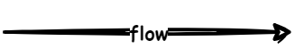
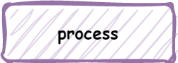
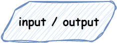
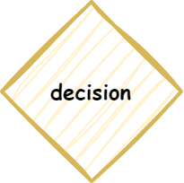
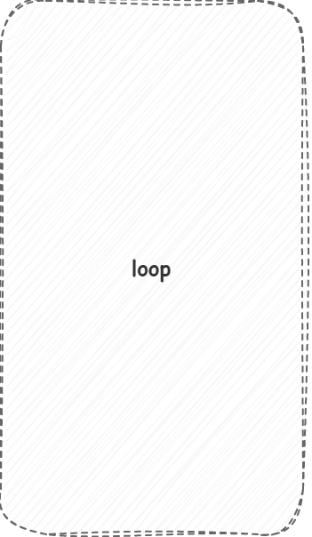
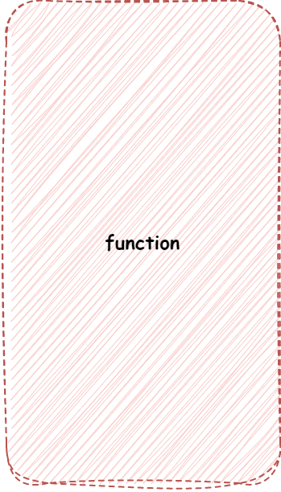
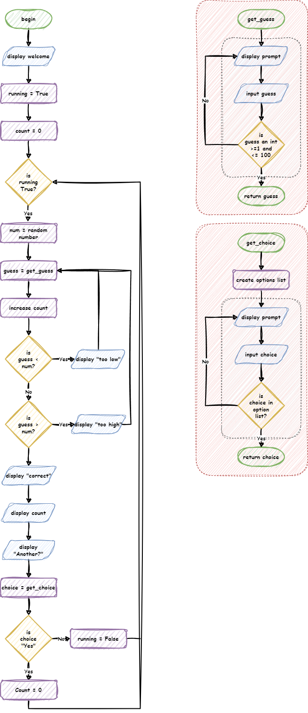

# Flowcharts

A flowchart is a diagram that uses different shapes and arrows to show the steps in a process or how to solve a problem.

In programming, we use flowcharts to plan out algorithms, which are step-by-step instructions for solving a problem.

## Symbols

Different shapes in a flowchart each have a special meaning.

Each shape shows a different type of step in a program.

### Flow arrows

Flow arrows show the path the program takes through the flowchart.

They only go in one direction, which is shown by the arrowhead.

---

### Process blocks

Process blocks show the steps where your code does something in order.

For example:

* setting values for variables
* doing calculations
* running functions

They are shown as a rectangle with a short description inside.

Flows:

* inflow arrows – must have at least one, but can have more than one
* outflow arrows – must have one, and only one

---

### Terminal blocks

Terminal blocks show where a process starts and ends.

They are drawn as rounded rectangles.

* For a main program, they say **“Start”** or **“End”**
* For a function, they show the function name or what value it returns

Flows:

* start terminal inflow arrows – none
* start terminal outflow arrows – must have one, and only one
* end terminal inflow arrows – must have one, and only one
* end terminal outflow arrows – none

---

### Input/Output (IO) blocks

Input/Output (IO) blocks show when information moves between the real world and the program.

**Input** is when information goes into the program, such as:

* typing on a keyboard
* using a mouse
* using a gamepad or joystick
* recording with a camera
* recording with a microphone

**Output** is when the computer sends information out, such as:

* showing text or images on a screen
* playing sound
* making vibrations
* printing on paper

IO blocks are drawn as parallelograms, with a short description of the input or output inside.

Flows:

* inflow arrows – must have at least one, but can have more than one
* outflow arrows – must have one, and only one

---

### Decision blocks

Decision blocks ask a question and then split the path based on the answer.

They are drawn as a diamond, with the question written inside.

Decision blocks are the only shape that can have more than one path coming out. Each arrow should be labelled with the answer (like “yes” or “no”) that follows that path.

Flows:

* inflow arrows – must have one, and only one
* outflow arrows – must have at least one, but can have more than one

---

## Additional symbols

In this course, we have also used two extra symbols to help show how flowcharts work:

* loop indicator
* function indicator

You do not have to use these symbols, but you can use them if they help make your flowcharts easier to understand.

### Loop indicator

The loop indicator is a grey box with dashed lines.

It goes around a loop and shows which steps are repeated. It starts or ends at the decision block that checks the loop condition.

---

### Function indicator

The function indicator is a red box with dashed lines.

It goes around a function. The function’s **start** is at the top, and the **end** is at the bottom.

No flow arrows should go into or out of the function indicator.

---

## Example

Below is a flowchart for a number guessing game. 

The game requirements are:

- Generate a random number between 1 and 100
- Ask the user to guess the number
- If the number is incorrect, it tells the user if they guessed too high or two low
- If the number is correct, it tells the user how many guesses they had.
- Validate user input to ensure incorrect types cannot be entered
- Only accept numbers between 1 and 100
- Ask the user to play again

