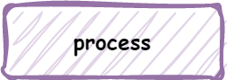
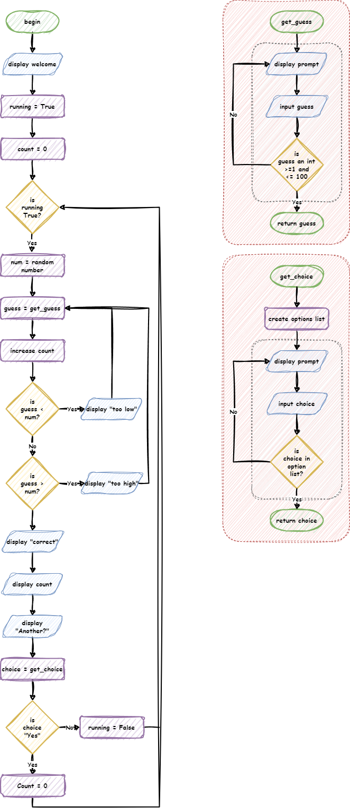

# Flowcharts

A flowchart is a type of diagram that uses different types of boxes and arrows to show the steps in a process or how to solve a problem. In programming we use flowcharts to map out algorithms.

## Symbols

The different boxes have meanings in a flowchart. Each represent different processes in our program.

### Flow arrows

Flow arrows represent the path the program take through the flowchart. Flows only go in one direction, as indicated by the arrow head.

### Process blocks

Process blocks contain all the internal sequential commands of your code.

For example:

- assigning variables
- performing calculations
- calling functions

They are represented using a rectangle with with the description inside.

Flows:

- **inflow arrows** - must have at least one, but can have many.
- **outflow arrows** - must have one and can only have one.

### Terminal blocks

Terminal blocks start and end a process.

They are represented using a rounded rectangle. If starting or ending a main program, they contain the words "Start" or "End". If starting or ending a function, they contain the name of the functions or the return value.

Flows:

- **start terminal inflow arrows** - can only have none
- **start terminal outflow arrows** - must have one and can only have one
- **end terminal inflow arrows** - must have one and can only have one
- **end terminal outflow arrows** - can only have none

### Input/Output (IO) blocks

IO blocks involved the transfer of information between the real world and the program.

**Input** is when information is entered into the program and can involve:

- typing
- mouse actions
- gamepad or joystick actions
- camera recording
- microphones recording

**Output** is when the computer renders information for the outside world and can involved:

- displaying images and text on screen
- creating sound
- haptic vibrations
- printing on paper

Input / output blocks are represented using parallelograms, with text explaining what is being inputted or outputted.

Flows:

- **inflow arrows** - must have at least one, but can have many.
- **outflow arrows** - must have one and can only have one.

### Decision blocks

Decision blocks ask a question and then split the flow according to the answer.

They are represented with a diamond, with the question being tested.

Decision blocks are the only block that can have multiple outflow arrows. Each outflow arrow should be labelled with the answer that will lead down it's path.

Flows:

- **inflows** - must have one and can only have one
- **outflows** - must have one, but can have many

## Additional symbols

Throughout this course we have used two additional symbols to help visualise how the flowcharts run:

- Loop indicator
- Function indicator

You are not expected to use these symbols, but you are welcomed to use them to make your flowcharts more readable.

### Loop indicator

The loop indicator is a grey box with dashed lines. It surrounds a loop, and will either start or end with the loop condition's decision block.

### Function indicator

The function indicator is a red box with dashed lines. It surrounds a function, with the functions starting terminal at the top and end terminal at the bottom. No flow arrows should enter or exit the function indicator.

## Example

Below is a flowchart for a number guessing game. 

The game requirements are:

- Generate a random number between 1 and 100
- Ask the user to guess the number
- If the number is incorrect, it tells the user if they guessed too high or two low
- If the number is correct, it tells the user how many guesses they had.
- Validate user input to ensure incorrect types cannot be entered
- Only accept numbers between 1 and 100
- Ask the user to play again

