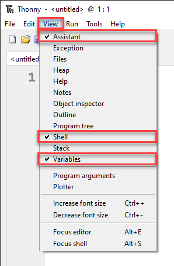
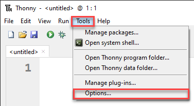
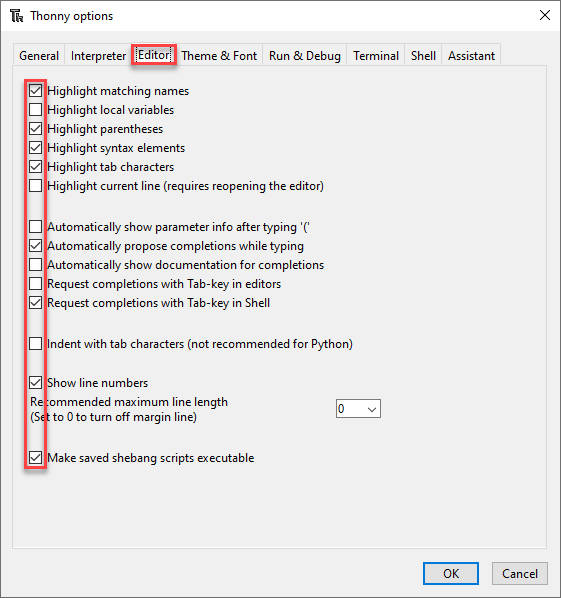
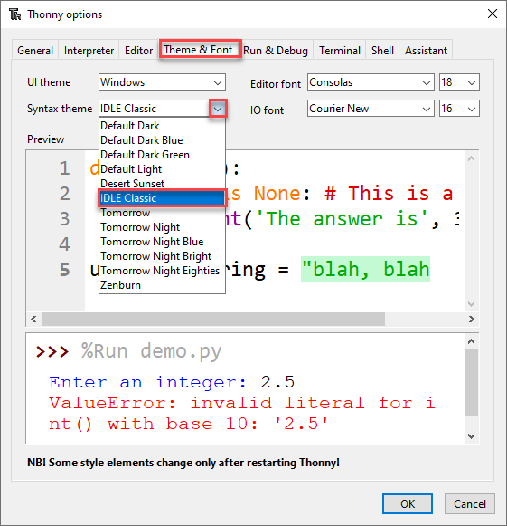
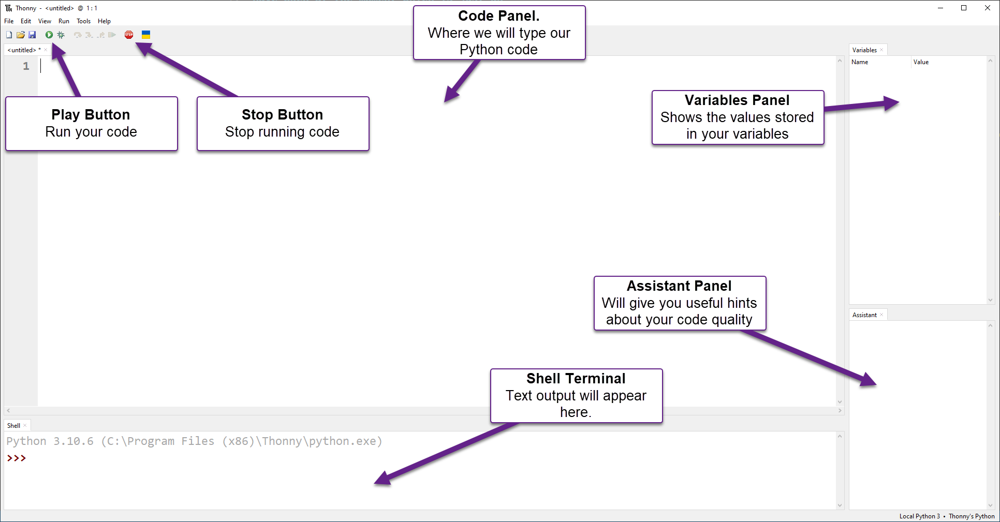

# Python Turtle - Lesson 1

```{topic} In this lesson you will learn:
- how to set up your coding workspace
- how to run your first program
- how to write comments in Python
- how to understand and fix error messages
- how to use modules in your code
- how to make a simple turtle program
```

## Part 1: Thonny Introduction

<iframe width="560" height="315" src="https://www.youtube-nocookie.com/embed/90T-NE_a50E" title="YouTube video player" frameborder="0" allow="accelerometer; autoplay; clipboard-write; encrypted-media; gyroscope; picture-in-picture" allowfullscreen></iframe>

[Video link](https://youtu.be/90T-NE_a50E)

### What is Thonny

Welcome to your first Python Turtle lesson. In this lesson, you will learn how to use Thonny, the program we’ll use to write and run our code. You will also explore some basic Python code and how it is written.

```{hint} Thonny
We will use **Thonny** to write our code.

Thonny is a program made for beginners to help you learn Python. It already includes Python, so it’s easy to set up.

You can download it from [**thonny.org**](https://thonny.org/).
```

Python is the programming language we will use, and **Thonny** is the program we use to write it.

Think of it like this:

* You use Microsoft Word to write English
* You use Thonny to write Python

Python programs are written as text files called **scripts**. You could write them in any basic text editor.

However, programs like Thonny have extra tools that make coding easier, such as:

* Colouring different parts of your code so it’s easier to read
* Helping you find and fix mistakes

For now, just think of Thonny as a text editor with helpful extras built in.

---

### Setting up Thonny

Before we look at Thonny’s screen (called the User Interface or **UI**), we need to turn on a few settings so everyone’s program looks the same.

#### View Menu
First, go to the **View** menu and make sure there is a tick beside **Assistant**, **Shell** and **Variable**.



#### Option Menu

Next go to **Tools** &rarr; **Options**



On the **Editor** tab make sure that your check-boxes are the same as the image below.



Finally, go to the **Theme and Font** tab and make sure the **Syntax theme** is set to **IDLE Classic**.

This setting changes the colours of your code based on what each part does.

This makes your code easier to read and helps you write it correctly.



Now click **OK** and your Thonny should look the same as the one in the videos.

---

### The User Interface

The image below shows the main parts of Thonny that you need to know for now. We will learn more about it later. 



---

### First Program

For your first program, you will make a simple program called *hello world*.

This is the first program most people write when learning to code.

Type the following code into the Code panel:

```{code-block} python
:linenos:
# Our First Program

print("Hello World")
```

#### PRIMM

Throughout this course, you will use the **PRIMM** process to help you learn.

**PRIMM** stands for:

* **Predict** – guess what the code will do
* **Run** – run the code and see what happens
* **Investigate** – explore how the code works
* **Modify** – change the code to see what happens
* **Make** – create your own program

This process helps you learn step by step and encourages you to be curious about how code works.

Let's run through the **PRIMM** process now

```{note} Predict
Before you run the code, you need to **predict** what will happen.

Have a guess about what you think the code will do before you run it.
```

```{note} Run
Now **run** the code by clicking the **Play button** (or press *F5* on your keyboard).

Your **Shell** should now show `Hello World`.

Did this match what you predicted?
```

```{note} Investigate
Let’s **investigate** what happened.

First, notice that only `Hello World` appears in the terminal.
The program skips the first line: `# Our First Program`. Why?

* When a line starts with `#`, Python treats it as a **comment**
* Comments are ignored by the computer
* Comments are there to help humans understand the code

Now look at **line 3**. The word `print` is in purple.

* This shows that `print` is a special word in Python
* A special word (called a keyword) is like a command that tells the computer what to do
```

````{note} Modify
Now you are going to **modify** the code and create some errors on purpose. This will help you learn how to read and understand error messages.

* Remove the `n` from `print` so it says `prit("Hello World")`
* Run the code again and see what happens

You should now see an error message in your **Shell**:

```{code-block} error
:linenos:
Traceback (most recent call last):
  File "<string>", line 3, in <module>
NameError: name 'prnt' is not defined
```

Let’s break down that error message:

* **Line 1**: `Traceback (most recent call last):`
  This means “this is what Python just tried to do.”

* **Line 2**: `File "<string>", line 3, in <module>`
  This tells you where the error is.
  In this case, the mistake is on **line 3**.

* **Line 3**: `NameError: name 'prnt' is not defined`
  This tells you what went wrong.

  * A `NameError` means Python found a word it doesn’t recognise
  * It also shows the word it doesn’t understand: `prnt`

---

Go back to **line 3** and fix it so it says `print("Hello World")` again.
Notice that `print` turns purple again.

Now keep investigating:

* Remove the two `"` so it says `print(Hello World)`
* Run the program again

Your **Shell** will now show a different error:

```{code-block} error
:linenos:
Traceback (most recent call last):
  File "<string>", line 3
    print(Hello World)
          ^^^^^^^^^^^
SyntaxError: invalid syntax. Perhaps you forgot a comma?
```

Let’s break down this error message:

* **Line 3**: shows the line with the mistake: `print(Hello World)`
* **Line 4**: the `^` symbols point to where the problem is in the line
* **Line 5**: `SyntaxError: invalid syntax. Perhaps you forgot a comma?`

  * A `SyntaxError` means your code does not follow Python’s rules
  * Python tries to guess what went wrong, but its suggestion can be incorrect

---

Change **line 3** back to `print("Hello World")`.

Notice how `"Hello World"` turns green. This is called **syntax highlighting**.
It shows that `Hello World` is a type of value called a **string**.

For now, think of a string as a group of characters (like letters, numbers, or symbols). You will learn more about strings later.

Now continue the **investigation**:

* Remove the `(` and `)` so it says `print Hello World`
* Run the program again

Your **Shell** will show another error:

```{code-block} error
:linenos:
Traceback (most recent call last):
  File "<string>", line 3
    print "Hello World"
    ^^^^^^^^^^^^^^^^^^^
SyntaxError: Missing parentheses in call to 'print'. Did you mean print(...)?
```
Let’s break down this error message:

* This is a different type of `SyntaxError` called `Missing parentheses in call to 'print'`
* Parentheses are the curved brackets `(` and `)` that you removed
* This time, Python’s hint is helpful: `Did you mean print(...)?`

---

Next, add back the opening bracket `(` so the line now says `print("Hello World"`.

Run the program again and you will see a different error message.

```{code-block} error
:linenos:
Traceback (most recent call last):
  File "<string>", line 3
    print ("Hello World"
          ^
SyntaxError: '(' was never closed
```
Let’s break down this error message:

* The error tells you that you did not close your bracket

  * In Python, every opening bracket `(` must have a matching closing bracket `)`

* Before fixing **line 3**, look at Thonny:

  * You should see a grey highlight starting from the `(`
  * This shows that the bracket was not closed
  * This can help you find mistakes before you run your code

---

Fix **line 3** so it says `print("Hello World")` again.

You have now finished modifying the code and have seen some error messages.

As you keep learning to code, you will see many more error messages. That is normal.

Even experienced programmers get errors. There is a common idea in programming: **error messages are your friend**.
They help you understand what went wrong so you can fix it.
````

## Part 2: Introducing turtle

<iframe width="560" height="315" src="https://www.youtube-nocookie.com/embed/CBrm4-ECyMI" title="YouTube video player" frameborder="0" allow="accelerometer; autoplay; clipboard-write; encrypted-media; gyroscope; picture-in-picture" allowfullscreen></iframe>

[Video link](https://youtu.be/CBrm4-ECyMI)

### First turtle program

Now start your first Turtle program.

* Click the **New** button
* Type the code into the new file
* Save the file as **`lesson_1_pt_1.py`**

```{code-block} python
:linenos:
# Our first turtle program
```

Python starts with a small set of built-in commands (called **functions**).
It can also use extra groups of commands called **modules**.

One of these modules is **Turtle**.

To use a module, you need to tell Python by using the `import` command.

* Always put `import` lines at the very top of your program

Your code should look like this:


```{code-block} python
:linenos:
:emphasize-lines: 3
# Our first turtle program

import turtle
```

---

### Create a turtle

What is a turtle? A turtle is a small arrow on the screen that you can control and move around.

Before you can use the turtle, you need to create one.

On **line 5**, type:
`my_ttl = turtle.Turtle()`

Here’s what that code means:

* `turtle.Turtle()` tells Python:

  * use the **turtle** module you imported
  * run the `Turtle()` command to create a turtle

* `my_ttl =` gives your turtle a name

You can choose any name you like. The name `my_ttl` is just an example.

* Your name must be one word (no spaces)
* If you change the name, you must use that same name everywhere in your code

Your code should now look like this:

```{code-block} python
:linenos:
:emphasize-lines: 5
# Our first turtle program

import turtle

my_ttl = turtle.Turtle()
```

---

### Make your turtle move

Now you are going to make the turtle move.

On **line 7**, type:
`my_ttl.forward(100)`

This tells the turtle to move forward 100 steps.

Your code should now look like this:

```{code-block} python
:linenos:
:emphasize-lines: 7
# Our first turtle program

import turtle

my_ttl = turtle.Turtle()

my_ttl.forward(100)
```

```{note} Predict
You are about to run your first turtle program.

Before you do, **predict** what you think will happen.

Have a guess about what the turtle will do.
```

```{note} Run
Now run the program and see if it matches your prediction.

You might have guessed that the turtle would move to the right, but did you expect it to leave a line behind it?
```

```{note} Investigate
Just like with *Hello World*, **investigate** the code.

Change parts of the code and see what happens.
```
```{note} Modify
Finally, **modify** the code so the turtle draws lines of different lengths.
```
---

### Changing the turtle environment

Now change the Turtle setup so it looks the same on every computer.

First, make the Turtle window the same size.

Update your code so it matches the example, especially **lines 5 and 6**:

```{code-block} python
:linenos:
:emphasize-lines: 5-6
# Our first turtle program

import turtle

window = turtle.Screen()
window.setup(500, 500)

my_ttl = turtle.Turtle()

my_ttl.forward(100)
```

Let’s look at these changes.

In the turtle module, the window is called a **Screen**.
**Line 5** creates a screen, just like you created a turtle:

* `turtle.Screen()` tells Python:

  * use the **turtle** module
  * run the `Screen()` command to create a screen

* `window =` gives the screen the name `window`

On **line 6**, this code sets the size of the window:

* `window.setup(500, 500)` makes the window 500 pixels wide and 500 pixels high


```{hint} What are pixels?
Your screen is made up of lots of tiny dots. If you look very closely, you might be able to see them. These are called **pixels**.

You might also see screen sizes written like 1920 × 1080.
This means:

* 1,920 pixels wide
* 1,080 pixels high

You will learn more about pixels later in the course.
```

Think of pixels as how we measure movement on the screen.
When you write `forward(100)`, it means move forward **100 pixels**.

Now you will make another change to how the turtle looks.

Add **line 9** from the code below to your program.

```{code-block} python
:linenos:
:emphasize-lines: 9
# Our first turtle program

import turtle

window = turtle.Screen()
window.setup(500, 500)

my_ttl = turtle.Turtle()
my_ttl.shape("turtle")

my_ttl.forward(100)
```

Do you want to **predict** what this change will do?

Run the code and check if your guess was correct.

---

### Change direction

Now that your window size is set and your turtle is ready, it’s time to do more drawing.

At the bottom of your code, add these two lines:

* `my_ttl.left(90)`
* `my_ttl.forward(100)`

Your code should now look like this:

```{code-block} python
:linenos:
:emphasize-lines: 12-13
# Our first turtle program

import turtle

window = turtle.Screen()
window.setup(500, 500)

my_ttl = turtle.Turtle()
my_ttl.shape("turtle")

my_ttl.forward(100)
my_ttl.left(90)
my_ttl.forward(100)
```

```{note} Predict
What do you think this code will do?

* Be as specific as you can
* Draw what you think will happen on a piece of paper
```

```{note} Run
Now run the program and check if it matches your prediction.

Did the turtle draw the same thing as your picture?
```

```{note} Investigate
Try changing the numbers inside the brackets and see what happens.
```

## Exercises

In this course, the exercises are the **make** component of the **PRIMM** model. So work through the following exercises to **make** your own code.

````{question} Exercise 1
Download the **{download}`lesson_1_ex_1.py<./python_files/lesson_1_ex_1.py>`** file and save it in your lesson folder.

After `line 10`, write code that will create a square.

The starting code is shown below:

```{literalinclude} ./python_files/lesson_1_ex_1.py
:linenos:
:emphasize-lines: 10
```
````

---

````{question} Exercise 2

Download the **{download}`lesson_1_ex_2.py<./python_files/lesson_1_ex_2.py>`** file and save it in your lesson folder.

After `line 10`, write code that will create an equlateral triangle.

The starting code is shown below:

```{literalinclude} ./python_files/lesson_1_ex_2.py
:linenos:
:emphasize-lines: 10
```
````

---

````{question} Exercise 3

Download the **{download}`lesson_1_ex_3.py<./python_files/lesson_1_ex_3.py>`** file and save it in your lesson folder. 

After `line 10` write code that will create a hexagon.

The starting code is shown below:

```{literalinclude} ./python_files/lesson_1_ex_3.py
:linenos:
:emphasize-lines: 10
```
````