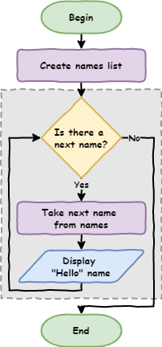

# Python Turtle - Lesson 2

```{topic} In this lesson you will learn:

- about iteration and how to it to reduce your code length
- about flowcharts and how to use them to represent program algorithms
- how to write Python programs using `for` loops
- how to use a Thonny's debugger to trace `for` loops
- how to use the `range` function to generate lists of numbers
```

## Part 1: Iteration introduction

<iframe width="560" height="315" src="https://www.youtube-nocookie.com/embed/_qZzz4lSckk" title="YouTube video player" frameborder="0" allow="accelerometer; autoplay; clipboard-write; encrypted-media; gyroscope; picture-in-picture" allowfullscreen></iframe>

[Video link](https://youtu.be/_qZzz4lSckk)

So far with our programming Python has been executing each line of our code one after another. This is called **sequential** and is the default way programs work. They start at the top and move through the code one line after another. The movement is called **the flow** of the program (like water, or electricity).

### Introduction to flowcharts

There is a special diagram used to show the flow of computer program. It's called a **flowchart**. Flowcharts show each process in a program and how the program moves from one process to the next. We use:

- rectangles symbolise processes
- parallelograms symbolise inputs or outputs
- arrows represent the flow


If we wanted a program to say hello to six people, you would show it in a flowchart like this:


Create a new file in Thonny and call it **lesson_2_pt_1.py**. Transfer this flowchart code to Python by entering the following code.

```{code-block} python
:linenos:
# our iteration program

print("Hello Hunter")
print("Hello Jordi")
print("Hello Adam")
print("Hello Jesse")
print("Hello Bryce")
print("Hello Ben")
```

Since the flow is sequential, Python will start at `line 1` and work its way down to `line 8`. 

Run it and see. The following should print to your **Shell**.

```
Hello Hunter
Hello Jordi
Hello Adam
Hello Jesse
Hello Bryce
Hello Ben
```

If you change the order of the code the program will run differently.

```{code-block} python
:linenos:
# our iteration program

print("Hello Jesse")
print("Hello Bryce")
print("Hello Ben")
print("Hello Hunter")
print("Hello Jordi")
print("Hello Adam")
```

This code will produce the following results.

```
Hello Jesse
Hello Bryce
Hello Ben
Hello Hunter
Hello Jordi
Hello Adam
```

Sequential programming is ok. It starts to become a problem when you deal with bigger programs. You don't want to have to type everything out.

Imagine if I want to say hello to 500 people, or 1,000 people or more, how tedious will it be to type each line out? There is also other limitations.

What if I decided to say `"good morning"` rather than `"hello"`? I would have to change every single line of code.

This might be ok for a small program, but it starts to become a problem in dealing with larger and larger programs. In Digital Technologies we would say that his is not **scalable**.

### Iteration

If you look at the code you will notice that there is a lot of repetition. `Lines 3` to `8` are almost the same, with only the name changing each time.

```{code-block} python
:linenos:
:emphasize-lines: 3-8
# our iteration program

print("Hello Jesse")
print("Hello Bryce")
print("Hello Ben")
print("Hello Hunter")
print("Hello Jordi")
print("Hello Adam")
```

This clashes with the DRY programming principle.


One method for not repeating yourself, is to use **iteration** (often called **loops**). They repeat the same code with a slight change each time. This would be perfect for our use, as we want to repeat the code `print("Hello", name)` with a different name each time.

### For loops

The first loop we will use is the `for` loop. This is the first **control structure** we have used. Control structures cause the program to deviate from the default sequential flow.

Change your code, so it is the same as the code below.

```{code-block} python
:linenos:
# our iteration program

names = ["Hunter", "Jordi", "Adam", "Jesse", "Bryce", "Ben"]

for name in names:
    print("Hello", name)
```

Ok, let's run the code, but don't forget PRIMM, and make sure you **predict** what you think will happen before you **run** the code.

So let's **investigate** by unpacking the code:

- `Line 3` is something we haven't seen before.
  - Called a **list** and it works like a real world list.
    - Consist of a number of items.
    - Items are in a specific order.
  - The `[` and `]` indicate the beginning and the end of the list.
  - `"Hunter"`, `"Jordi"`, `"Adam"`, `"Jesse"`, `"Bryce"`, `"Ben"` are the items in the list. Items are called **elements**.
  - The elements are separated with commas (`,`).
  - A list needs a name (like our turtle and window). 
    - We use `names =` to call the list `names`.
- `Line 5` is also new, and it is the how we create `for` loops in Python.
  - `for` is a keyword identifying this as the beginning of a `for` loop.
  - `in names` tells Python to repeat the code below using each element of the `names` list.
  - `name` refers to the current `names` element in use.
  - `:` tells Python that an indented code block follows.
- `Line 6` is a bit changed as well, it's indented.
  - The indentation below the `for` loop identifies the code that needs to repeat.
    - Indentations can be many lines.
    - Multi-line indented code is called a **code block**.
    - Indents should be four spaces.
      - Note, in Thonny you can use the `tab` key because Thonny inserts four spaces instead of a `tab` character.
  - `print("Hello", name)` tells Python to:
    - print `Hello` to the **Shell** 
    - followed by current `names` element in use.

#### For loop flowchart

A bit confusing? Let's try looking at it in a flowchart.

Before we do, we need to learn about two more flowchart symbols:

- **Terminators**: these represent the beginning and end of your code
- **Decisions**: these are questions the program need to answer. This will result in the flow splitting into multiple branches.


Now let's look at the `for` loop flowchart. The symbols within the dotted box are the `for` loop.

```{admonition} Dotted box
:class: hint
The dotted box has is to help you identify the `for` loop structure. It is not a normal flowchart symbol.
```



#### Tracing with debugger

One last way we can see how the `for` loop works is to use Thonny's debugger.

```{admonition} What are debuggers?
Debuggers are powerful tools for understanding what happens when you run your code, and Thonny's debugger is not exception. The [](debugging.md) tutorial goes into it's features in greater detail.
```

Launch the debugger by clicking the bug beside the play button.


Keep pressing **F7** on your keyboard and Thonny will take you step by step through the code. Take note of the values in the **Variables** panel.

We'll learn more about how to use the debugger later in the course.

### Code blocks

Earlier we said that multi-line indented code is called a code block. Let's have a look at how that works.

Change your code so it is the same as below.

```{code-block} python
:linenos:
:emphasize-lines: 7
# our iteration program

names = ["Hunter", "Jordi", "Adam", "Bryce", "Ben"]

for name in names:
    print("Hello", name)
    print("How are you?")
```

**Predict** what you think the code will do and then **run** it.

In your **Shell** you should have.

```
Hello Hunter
How are you?
Hello Jordi
How are you?
Hello Adam
How are you?
Hello Jesse
How are you?
Hello Bryce
How are you?
Hello Ben
How are you?
```

Notice **all** the code block is repeated. That means all the lines of code, at the same level of indentation, are repeated with the `for` loop. It is important to ensure that the whole code block uses the same number of spaces to indent.

What happens if we remove the indentation?

Change your code by adding `print("Come in and sit down")` to the end. Make sure you remove the indentation, so you code looks like the code below.

```{code-block} python
:linenos:
:emphasize-lines: 8
# our iteration program

names = ["Hunter", "Jordi", "Adam", "Bryce", "Ben"]

for name in names:
    print("Hello", name)
    print("How are you?")

print("Come in and sit down")
```

**Predict** and **run** your code.

Your **Shell** should show.

```
Hello Hunter
How are you?
Hello Jordi
How are you?
Hello Adam
How are you?
Hello Jesse
How are you?
Hello Bryce
How are you?
Hello Ben
How are you?
Come in and sit down
```

Notice that `print("Come in and sit down")` is not repeated. Since it is not indented, it is not considered part of the `for` loop and is run after the `for` loop is finished.

The flowchart for your latest code would look like:


## Part 2: List numbers and Range

<iframe width="560" height="315" src="https://www.youtube-nocookie.com/embed/SpyHWIDWY5M" title="YouTube video player" frameborder="0" allow="accelerometer; autoplay; clipboard-write; encrypted-media; gyroscope; picture-in-picture" allowfullscreen></iframe>

[Video link](https://youtu.be/SpyHWIDWY5M)

### Introducing `range`

You can also run loops over lists of numbers.

Create a new file and call it **lesson_2_pt_2a.py** then try the code below.

```{code-block} python
:linenos:
number_list = [1, 2, 3, 4, 5, 6, 7, 8, 9, 10]

for number in number_list:
    print(number)
```

But what if we want `print` the numbers between 1 and 100? Do you want to type all those numbers out?

Luckily, Python has a function called `range`. It makes list between two given numbers.

Change your code to the code below.

```{code-block} python
:linenos:
:emphasize-lines: 1
number_list = range(1, 101)

for number in number_list:
    print(number)
```

PRIMM

- **Predict** what you think will happen
- **Run** the code an see how close your prediction was
- Let's **investigate** the code.

Unpacking the code:

- `range` tells Python to create a list of numbers
- `1` is the first number in that list
- `101` is the first number **not** in that list. This can be confusing but we will learn why later on.

We can make our code a bit shorter by using the `range` function directly inside the `for` loop statement.

```{code-block} python
:linenos:
for number in range(1, 101):
    print(number)
```

### Use for Turtle

Code blocks can contain any code, including Turtle code. So let try it.

Create a new file called **lesson_2_pt_2b.py** and type in the code below.

```{code-block} python
:linenos:
import turtle

window = turtle.Screen()
window.setup(500, 500)

my_ttl = turtle.Turtle()

for number in range(1, 101):
    my_ttl.forward(100)
    my_ttl.backward(100)
    my_ttl.left(3)
```

PRIMM:

- **Predict** what you think will happen, and then **run** the code. Did it do what you predicted?
- **Investigate** the code by changing aspect of the code.
- **Modify** the code so that is makes a complete circle.

## Exercises

In this course, the exercises are the **make** component of the PRIMM model. So work through the following exercise and make your own code.

### Exercise 1

Download **{download}`lesson_2_ex_1.py<./python_files/lesson_2_ex_1.py>`** file and save it to your lesson folder. Below is its code.

```{literalinclude} ./python_files/lesson_2_ex_1.py
:linenos:
:emphasize-lines: 7-9
```

After `line 9`, as the comments says, write code that will create a square but only use 3 lines to do this (hint: try a `for` loop). The following flowchart should assist.


### Exercise 2

Download **{download}`lesson_2_ex_2.py<./python_files/lesson_2_ex_2.py>`** file and save it to your lesson folder. Below is its code.

```{literalinclude} ./python_files/lesson_2_ex_2.py
:linenos:
:emphasize-lines: 7-9
```

After `line 9`, as the comments says, write code that will create a triangle but only use 3 lines to do this.

### Exercise 3

Download **{download}`lesson_2_ex_3.py<./python_files/lesson_2_ex_3.py>`** file and save it to your lesson folder. Below is its code.

```{literalinclude} ./python_files/lesson_2_ex_3.py
:linenos:
:emphasize-lines: 7-9
```

After `line 9`, as the comments says, write code that will create a hexagon but only use 3 lines to do this.

### Exercise 4

Download **{download}`lesson_2_ex_4.py<./python_files/lesson_2_ex_4.py>`** file and save it to your lesson folder. Below is its code.

```{literalinclude} ./python_files/lesson_2_ex_4.py
:linenos:
:emphasize-lines: 7-9
```

After `line 9`, as the comments says, write code that will create a circle but only use 3 lines to do this.

### Exercise 5

Download **{download}`lesson_2_ex_5.py<./python_files/lesson_2_ex_5.py>`** file and save it to your lesson folder. Below is its code.

```{literalinclude} ./python_files/lesson_2_ex_5.py
:linenos:
:emphasize-lines: 7-9
```

After `line 9` write some code to draw something cool using `for` loops.
