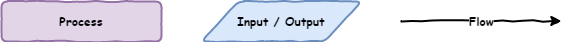
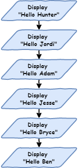
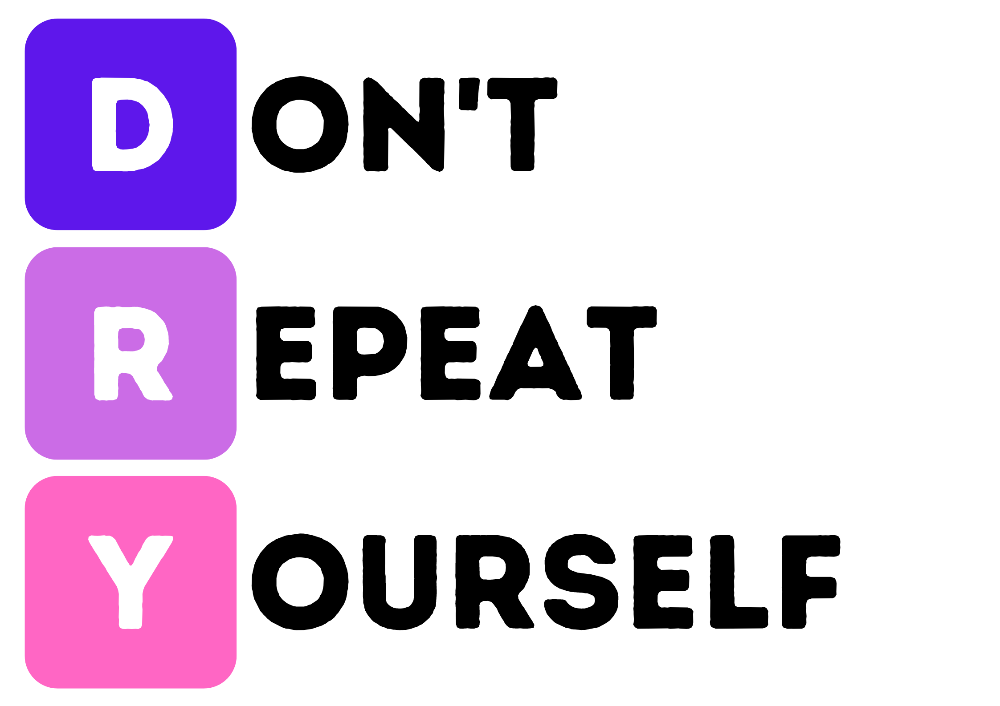
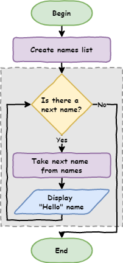
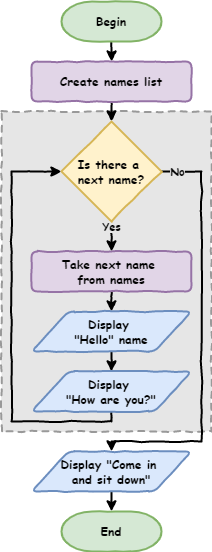
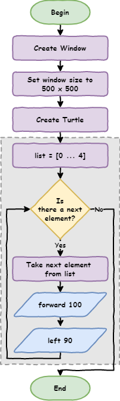

# Python Turtle - Lesson 2

```{topic} In this lesson you will learn:
* learn what repetition (iteration) is and how it can make your code shorter and easier
* learn what flowcharts are and how they help show how a program works step by step
* learn how to write Python programs using `for` loops to repeat actions
* learn how to use Thonny’s debugger to step through a `for` loop and see what happens
* learn how to use the `range` function to create a list of numbers
```

## Part 1: Iteration introduction

<iframe width="560" height="315" src="https://www.youtube-nocookie.com/embed/_qZzz4lSckk" title="YouTube video player" frameborder="0" allow="accelerometer; autoplay; clipboard-write; encrypted-media; gyroscope; picture-in-picture" allowfullscreen></iframe>

[Video link](https://youtu.be/_qZzz4lSckk)

So far, when we write Python code, each line runs one after the other.

This is called **sequential** execution. It is the normal way programs run.

The program starts at the top and works its way down, one line at a time.

This movement through the code is called the **flow** of the program (like water flowing through a pipe or electricity moving through a wire).

### Introduction to flowcharts

There is a special type of diagram used to show how a program works. It is called a **flowchart**.

A flowchart shows each step in a program and how the program moves from one step to the next.

We use different shapes to represent different parts of the program:

* rectangles show a process (something the program does)
* parallelograms show input or output (getting or showing information)
* arrows show the flow (the direction the program moves)



If we wanted a program to say hello to six people, you would show it in a flowchart like this:



If we wanted a program to say hello to six people, we could show it using a flowchart like this:

The flowchart would have six steps, each one telling the program to say “Hello”.

Each step would be in a rectangle (a process), and arrows would connect them to show the order.

So the flow would go from one “say Hello” step to the next, six times in total.

```{code-block} python
:linenos:
# our iteration program

print("Hello Hunter")
print("Hello Jordi")
print("Hello Adam")
print("Hello Jesse")
print("Hello Bryce")
print("Hello Ben")
```

Because the program runs in order (sequential), Python will start at `line 1` and go down to `line 8`, one line at a time.

Run the program and see what happens.

You should see the output appear in the **Shell**.

```
Hello Hunter
Hello Jordi
Hello Adam
Hello Jesse
Hello Bryce
Hello Ben
```

If you change the order of the code, the program will behave differently.

This is because Python runs each line from top to bottom, so the order of the lines matters.

```{code-block} python
:linenos:
# our iteration program

print("Hello Jesse")
print("Hello Bryce")
print("Hello Ben")
print("Hello Hunter")
print("Hello Jordi")
print("Hello Adam")
```

This code will give the following output.

```
Hello Jesse
Hello Bryce
Hello Ben
Hello Hunter
Hello Jordi
Hello Adam
```

Sequential programming is fine for small programs, but it becomes a problem with bigger ones.

You don’t want to type every line again and again.

Imagine if you had to say hello to 500 people, or even 1,000 people. That would take a long time to type. There are other problems too.

What if you wanted to change `"hello"` to `"good morning"`? You would have to change every single line of code.

This might be okay for small programs, but it becomes difficult with bigger programs.

In Digital Technologies, we say this is not **scalable** (it does not work well as the program gets bigger).

---

### Iteration

If you look at the code, you will see that a lot of it repeats.

`Lines 3` to `8` are almost the same. The only thing that changes is the name each time.

```{code-block} python
:linenos:
:emphasize-lines: 3-8
# our iteration program

print("Hello Jesse")
print("Hello Bryce")
print("Hello Ben")
print("Hello Hunter")
print("Hello Jordi")
print("Hello Adam")
```

This breaks the **DRY** programming principle.

DRY stands for **Don’t Repeat Yourself**.

It means you should not write the same code over and over again.



One way to avoid repeating yourself is to use iteration (also called loops).

Loops repeat the same code again and again, with a small change each time.

This is perfect for our example, because we want to repeat the line
print("Hello", name)
but use a different name each time.

---

### For loops

The first loop we will use is called a `for` loop.

This is the first **control structure** we have used.

A control structure changes how the program flows, instead of just running from top to bottom in order.

Update your code so it matches the code below.

```{code-block} python
:linenos:
# our iteration program

names = ["Hunter", "Jordi", "Adam", "Jesse", "Bryce", "Ben"]

for name in names:
    print("Hello", name)
```

```{note} Predict and Run
Now run the code.

But remember to use PRIMM:

Predict what you think will happen
then Run the code to check your ideas.
```

```{note} Investigate
Let’s **investigate** the code step by step:

* `Line 3` is something new.

  * It is called a **list**, and it works like a real-life list.

    * It has a number of items.
    * The items are in a specific order.
  * The `[` and `]` show where the list starts and ends.
  * `"Hunter"`, `"Jordi"`, `"Adam"`, `"Jesse"`, `"Bryce"`, `"Ben"` are the items in the list. These items are called **elements**.
  * Each element is separated by a comma (`,`).
  * A list needs a name, just like our turtle or window.

    * We use `names =` to give the list the name `names`.

* `Line 5` is also new. This is how we make a `for` loop in Python.

  * `for` is a special word that starts the loop.
  * `in names` tells Python to go through each item in the `names` list.
  * `name` is the current item the loop is using.
  * `:` tells Python that the next lines (which are indented) belong to the loop.

* `Line 6` looks a bit different because it is indented.

  * The indentation shows which code will repeat in the loop.

    * There can be more than one indented line.
    * These lines together are called a **code block**.
    * Indents should be four spaces.

      * In Thonny, pressing the `Tab` key will add four spaces for you.
  * `print("Hello", name)` tells Python to:

    * print `Hello` to the **Shell**
    * then print the current name from the list
```

#### For loop flowchart

Feeling a bit confusing? Let’s look at it using a flowchart.

Before that, we need to learn two more symbols:

* **Terminators**: these show the start and end of the program
* **Decisions**: these are questions the program asks

  * The answer will change the path the program takes (it can go in different directions)


Now let’s look at the flowchart for the `for` loop.

The shapes inside the dotted box show the `for` loop.

These steps repeat again and again, once for each item in the list.

```{hint} Dotted box
The dotted box has is to help you identify the `for` loop structure. It is not a normal flowchart symbol.
```



#### Tracing with debugger

One last way to understand how a `for` loop works is to use Thonny’s debugger.

```{hint} What are debuggers?
Debuggers are powerful tools that help you see what happens when your code runs. Thonny’s debugger is one of these tools.

The [](debugging.md) tutorial explains its features in more detail.
```

Start the debugger by clicking the bug icon next to the play button.


Keep pressing **F7** on your keyboard, and Thonny will move through the code one step at a time.

Watch the values in the **Variables** panel as you do this.

We will learn more about using the debugger later in the course.

---

### Code blocks

Earlier, we said that indented code over multiple lines is called a code block.

Let’s see how that works.

Change your code so it matches the code below.

```{code-block} python
:linenos:
:emphasize-lines: 7
# our iteration program

names = ["Hunter", "Jordi", "Adam", "Bryce", "Ben"]

for name in names:
    print("Hello", name)
    print("How are you?")
```

**Predict** what you think the code will do, then **run** it to check.

In your **Shell**, you should see:

```
Hello Hunter
How are you?
Hello Jordi
How are you?
Hello Adam
How are you?
Hello Jesse
How are you?
Hello Bryce
How are you?
Hello Ben
How are you?
```

Notice that **all** of the code in the code block repeats.

This means every line that is indented the same amount will run again in the `for` loop.

It is important that all lines in the code block use the same number of spaces for indentation.

What do you think will happen if we remove the indentation?

Change your code by adding
`print("Come in and sit down")`
to the end.

Make sure this new line is **not indented**, so your code looks like the example below.

```{code-block} python
:linenos:
:emphasize-lines: 9
# our iteration program

names = ["Hunter", "Jordi", "Adam", "Bryce", "Ben"]

for name in names:
    print("Hello", name)
    print("How are you?")

print("Come in and sit down")
```
**Predict** what will happen, then **run** your code.

Your **Shell** should show:

```
Hello Hunter
How are you?
Hello Jordi
How are you?
Hello Adam
How are you?
Hello Jesse
How are you?
Hello Bryce
How are you?
Hello Ben
How are you?
Come in and sit down
```

Notice that `print("Come in and sit down")` does **not** repeat.

Because it is not indented, it is not part of the `for` loop.

This means it runs **after** the loop has finished.

The flowchart for your updated code would look like this:



## Part 2: List numbers and Range

<iframe width="560" height="315" src="https://www.youtube-nocookie.com/embed/SpyHWIDWY5M" title="YouTube video player" frameborder="0" allow="accelerometer; autoplay; clipboard-write; encrypted-media; gyroscope; picture-in-picture" allowfullscreen></iframe>

[Video link](https://youtu.be/SpyHWIDWY5M)

### Introducing `range`

You can also use loops with lists of numbers.

Create a new file and name it **lesson_2_pt_2a.py**, then try the code below.

```{code-block} python
:linenos:
number_list = [1, 2, 3, 4, 5, 6, 7, 8, 9, 10]

for number in number_list:
    print(number)
```
But what if you want to `print` all the numbers from 1 to 100? Do you really want to type all of them?

Luckily, Python has something called the `range` function. It creates a list of numbers for you between two values.

Change your code so it matches the code below.

```{code-block} python
:linenos:
:emphasize-lines: 1
number_list = range(1, 101)

for number in number_list:
    print(number)
```

```{note} Predict
**Predict** what you think will happen
```

```{note} Run
**Run** the code to check your ideas.
```

```{note} Investigate
* Let’s **investigate** the code.

Unpacking the code:

* `range` tells Python to create a list of numbers
* `1` is the first number in the list
* `101` is the first number **not included** in the list

  * This might seem confusing, but we will learn why later
```

````{note} Modify
We can make our code shorter by using the `range` function directly inside the `for` loop.

```{code-block} python
:linenos:
for number in range(1, 101):
    print(number)
```
````

---

### Use for Turtle

Code blocks can include any type of code, including Turtle code. So let’s try it.

Create a new file called **lesson_2_pt_2b.py** and type in the code below.

```{code-block} python
:linenos:
import turtle

window = turtle.Screen()
window.setup(500, 500)

my_ttl = turtle.Turtle()

for number in range(1, 101):
    my_ttl.forward(100)
    my_ttl.backward(100)
    my_ttl.left(3)
```

```{note} Predict and Run
**Predict** what you think will happen, then **run** the code.

Did it do what you expected?
```

```{note} Investigate 
Investigate the code by changing different parts of it.

Try changing one thing at a time so you can clearly see what each change does.
```

```{note} Modify
Change the code so the turtle turns a little each time and repeats enough times to go all the way around.

A full circle is `360` degrees, so your repeated turns need to add up to `360`.

For example, you could use:

* `36` repeats of `10` degrees
* `72` repeats of `5` degrees
* `120` repeats of `3` degrees

Test different values until the turtle draws a complete circle.
```

## Exercises

In this course, the exercises are the **make** component of the PRIMM model. So work through the following exercise and make your own code.

````{question} Exercise 1

Download **{download}`lesson_2_ex_1.py<./python_files/lesson_2_ex_1.py>`** file and save it in your lesson folder. The starting code is shown below:

After `line 9`, follow the comment and write code to draw a square, but only use **3 lines**.

Hint: use a `for` loop to repeat the same steps.

A square has 4 sides, so your loop should repeat 4 times.

Use the flowchart to help guide your thinking.



The starting code is shown below:

```{literalinclude} ./python_files/lesson_2_ex_1.py
:linenos:
:emphasize-lines: 7-9
```
````

---

````{question} Exercise 2
Download **{download}`lesson_2_ex_2.py<./python_files/lesson_2_ex_2.py>`** file and save it in your lesson folder. 

After `line 9`, follow the comment and write code to draw a triangle using only **3 lines**.

A triangle has 3 sides, so your loop should repeat 3 times.

This will make the turtle draw a complete triangle.

The starting code is shown below:

```{literalinclude} ./python_files/lesson_2_ex_2.py
:linenos:
:emphasize-lines: 7-9
```
````

---

````{question} Exercise 3

Download **{download}`lesson_2_ex_3.py<./python_files/lesson_2_ex_3.py>`** file and save in to your lesson folder. 

After `line 9`, follow the comment and write code to draw a hexagon using only **3 lines**.

A hexagon has 6 sides.

The starting code is shown below:

```{literalinclude} ./python_files/lesson_2_ex_3.py
:linenos:
:emphasize-lines: 7-9
```
````


---

````{question} Exercise 4
Download **{download}`lesson_2_ex_4.py<./python_files/lesson_2_ex_4.py>`** file and save it in your lesson folder. 

After `line 9`, follow the comment and write code to draw a circle using only **3 lines**.

A circle can be made by drawing lots of small lines and turning a little each time.

Your loop should repeat many times.
Each time, the turtle should:

* move forward a small amount
* turn a small angle

This will make the turtle draw a shape that looks like a circle.

The starting code is shown below:

```{literalinclude} ./python_files/lesson_2_ex_4.py
:linenos:
:emphasize-lines: 7-9
```
````

---

````{question} Exercise 5
Download **{download}`lesson_2_ex_5.py<./python_files/lesson_2_ex_5.py>`** file and save it in your lesson folder. 

After `line 9`, write your own code to draw something interesting using `for` loops.

You could try ideas like:

* a spiral (keep turning a little more each time)
* a star pattern
* multiple shapes repeated in a pattern
* shapes that grow bigger each time

Experiment by changing:

* how far the turtle moves
* how much it turns
* how many times the loop runs

Try different ideas and see what you can create.

The starting code is shown below:

```{literalinclude} ./python_files/lesson_2_ex_5.py
:linenos:
:emphasize-lines: 7-9
```
````


