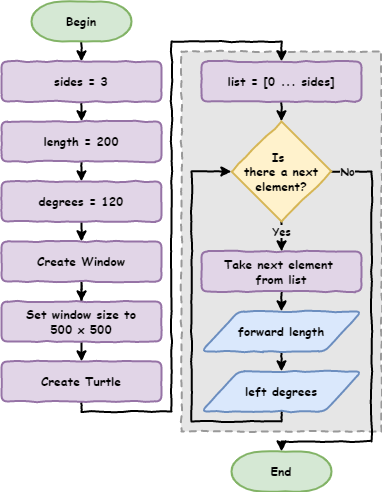
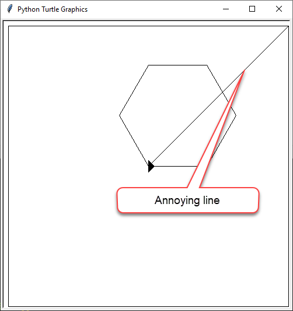

# Python Turtle - Lesson 3

```{topic} In this lesson you will learn:

- about storing values in variables
- when and how to use variables
- about screen coordinates
- how to use coordinates to move the turtle
- how to move the turtle without drawing a line
```

## Part 1: Variables

<iframe width="560" height="315" src="https://www.youtube-nocookie.com/embed/mG1O_JamxjQ" title="YouTube video player" frameborder="0" allow="accelerometer; autoplay; clipboard-write; encrypted-media; gyroscope; picture-in-picture" allowfullscreen></iframe>

[Video link](https://youtu.be/mG1O_JamxjQ)

### Conventional range

Before we start looking at variables, we need to use `range` in a more conventual way.

Previously, we would use the following code to print four numbers.

```{code-block} python
:linenos:
for index in range(1, 5):
    print(index)
```

```{admonition} What is index?

`index` is a programming convention that represents a counter in a loop. You can call it anything you want, but the convention is to call it `index`.
```

If you run the code you get the following.

```{code-block}
1
2
3
4
```

If we were only concerned about the number of times a loop iterates, we could use the following.

```{code-block} python
:linenos:
:emphasize-lines: 1
for index in range(0, 4):
    print(number)
```

This will produce:

```
0
1
2
3
```

The loop still has four iterations. The difference is, it starts counting at `0`.

If the `range` function is not given a starting number, it will start at `0`.

So we could just use the following.

```{code-block} python
:linenos:
:emphasize-lines: 1
for index in range(4):
    print(number)
```

This is the way that `range` is conventionally used in Python.

### Replace magic numbers

Below is **a** solution for lesson 2 exercise 1 (there are many possible solutions).

Create a new file named **lesson_3_pt_1.py** and enter this code.

```{code-block} python
:linenos:
import turtle

window = turtle.Screen()
window.setup(500, 500)
my_ttl = turtle.Turtle()

for index in range(4):
    my_ttl.forward(100)
    my_ttl.left(90)
```

What do we need to change in the code sot the turtle draws a triangle with a length of `200` for each side?

Try and work it out before looking at the code below.

```{code-block} python
:linenos:
:emphasize-lines: 7-9
import turtle

window = turtle.Screen()
window.setup(500, 500)
my_ttl = turtle.Turtle()

for index in range(3):
    my_ttl.forward(200)
    my_ttl.left(120)
```

What values did we change and what do those numbers represent?

- `4` &rarr; `3` representing the number sides.
- `100` &rarr; `200` representing the length of the sides.
- `90` &rarr; `120` representing the degrees the Turtle has to turn.

If I wanted to make a hexagon, or any other shape, I would need to change these values each time.

In programming these are called **magic numbers**. A magic number is a **hard coded** value that appears in a program.

Magic numbers are not good. If someone else were to look at my code, they would need to work out what the `3`, `200` and `120` meant. Additionally, imagine my program drew 1000 squares. If I wanted to change these to triangles, I would have to make 3000 edits.

---

To write better code we remove magic numbers by giving them labels called **variables**.

Adjust your code in **lesson_3_pt_1.py** to match the code below.

```{code-block} python
:linenos:
:emphasize-lines: 3-5, 11-13
import turtle

sides = 3
length = 200
degrees = 120

window = turtle.Screen()
window.setup(500, 500)
my_ttl = turtle.Turtle()

for index in range(sides):
    my_ttl.forward(length)
    my_ttl.left(degrees)
```

PRIMM

- **Predict** what will happen when you run the code
- **Run** the code and see if your predictions were correct.
- `sides`, `length` and `degrees` are all **variables**. Let's **investigate** their use in the code.

First, the flowchart for our adjusted program:



Code breakdown:

- `sides = 3` creates the variable `sides` and assigns the value of `3` to it.
- `length = 200` creates the variable `length` and assigns the value of `200` to it.
- `degress = 120` creates the variable `degrees` and assigns the value of `120` to it.
- `for i in range(sides):` substitutes `sides` with the value assigned to it so that the line becomes `for index in range(3)`.
- `my_ttl.forward(length)` substitutes `length` with the value assigned to it. The line becomes `my_ttl.forward(200)`.
- `my_ttl.left(degrees)` substitutes `degrees` with the value assigned to it. The line becomes `my_ttl.left(120)`.

```{admonition} Naming rules

Python has very specific rules for what names you can use for variables:

- names can only contain letters, numbers and the `_` character
- names cannot contain spaces
- names cannot start with a number
- names are case sensitive (eg. `age` is not the same as `Age`)
```

Now that we are using variables, we can copy the `for` loop and use it as many times as we want. The values for `sides`, `length`, and `degrees` will always use the values we assigned to the at the beginning.

In programming this is called a **single point of truth**. This means, if we change the value assigned to `sides`, we can change the value for uses of the variable `sides`. Same for `length` and `degrees`.

---

Change **lesson_3_pt_1.py**  so it draws a hexagon with a side length of 100.

Your code should look like:

```{code-block} python
:linenos:
:emphasize-lines: 3-5
import turtle

sides = 6
length = 100
degrees = 60

window = turtle.Screen()
window.setup(500, 500)
my_ttl = turtle.Turtle()

for index in range(sides):
    my_ttl.forward(length)
    my_ttl.left(degrees)
```

### No 'meat space' calculations

In creating our hexagon, how did we know that degrees needed to be 60?

You may have worked it out in your head or used a calculator. There are flaws on both approaches.

- head calculations can be incorrect
- getting a calculator is a waste of time

We can use Python to do the calculations.

```{admonition} Python calculations
:class: seealso

Python has a wide range of arithmetic operations. 

To see them all, check out **[W3Schools's Python Arithmetic Operators page](https://www.w3schools.com/python/gloss_python_arithmetic_operators.asp)**
```

The value assigned to `degrees` is `360` divided by the number assigned to `sides`. In code we would write that as `degrees = 360 / sides`

Let's put that into our code at `line 5`:

```{code-block} python
:linenos:
:emphasize-lines: 5
import turtle

sides = 6
length = 100
degrees = 360 / sides

window = turtle.Screen()
window.setup(500, 500)
my_ttl = turtle.Turtle()

for index in range(sides):
    my_ttl.forward(length)
    my_ttl.left(degrees)
```

### Remove unnecessary variables

Another good programming practice is to remove unnecessary variables.

Do we need the `degrees` variable? Could we place the calculation inside the `for` loop instead?

If we remove `line 5` by moving the calculation to `line 10`, our code will look like the following.

```{code-block} python
:linenos:
:emphasize-lines: 10
import turtle

sides = 6
length = 100

window = turtle.Screen()
window.setup(500, 500)
my_ttl = turtle.Turtle()

for index in range(360 / sides):
    my_ttl.forward(length)
    my_ttl.left(degrees)
```

Are there any more **magic numbers**? See if you can find any more.

```{code-block} python
:linenos:
:emphasize-lines: 3, 6, 9, 14
import turtle

screen = 500
sides = 6
length = 100
CIRCLE_DEG = 360

window = turtle.Screen()
window.setup(screen, screen)
my_ttl = turtle.Turtle()

for index in range(sides):
    my_ttl.forward(length)
    my_ttl.left(CIRCLE_DEG / sides)
```

The flowchart for this code now looks like:


In `line 6` we have created another variable called `CIRCLE_DEG` and assigned it `360`. We have capitalised the name because the value of `360` will never change, no matter what shape we wish to draw. We call variables whose values doesn't change **constants**. In Python's naming conventions we capitalise constants.


```{admonition} Naming conventions

Python's naming conventions are different from the naming rules. If you break a naming rule, your program will cause a **syntax error**. If you break naming convention your program will still work.

In programming we use naming conventions to make your code easier to read and understand.

Variable naming conventions:

- Use descriptive names that explains the value stored in them
    - `d = 30` &rarr; bad
    - `degrees = 30` &rarr; better
    - `degrees_celsius = 30` &rarr; best
- Use snake case for multiple word names:
    - replace the spaces with the `_` character
    - only use lower case letters
    - `this_is_snake_case`
- CAPTIALIZE names of constants (variables whose value will not change)
- Do not use the names of keywords (eg. `print`, `for`, etc)
```

## Part 1 Exercises

In this course, the exercises are the **make** component of the PRIMM model. Work through the following exercises and make your own code.

### Exercise 1

Download **{download}`lesson_3_ex_1.py<./python_files/lesson_3_ex_1.py>`** file and save it to your lesson folder. Below is its code.

```{literalinclude} ./python_files/lesson_3_ex_1.py
:linenos:
:emphasize-lines: 3-5
```

Follow the instructions in the comments and change the code so it draws a square

### Exercise 2 

Download **{download}`lesson_3_ex_2.py<./python_files/lesson_3_ex_2.py>`** file and save it to your lesson folder. Below is its code.

```{literalinclude} ./python_files/lesson_3_ex_2.py
:linenos:
:emphasize-lines: 3-5
```

Follow the instructions in the comments and change the code so it draws a circle

### Exercise 3

Download **{download}`lesson_3_ex_3.py<./python_files/lesson_3_ex_3.py>`** file and save it to your lesson folder. Below is its code.

```{literalinclude} ./python_files/lesson_3_ex_3.py
:linenos:
:emphasize-lines: 3-5
```

Follow the instructions in the comments and change the code so it draws a pentagon.

## Part 2: Coordinates

<iframe width="560" height="315" src="https://www.youtube.com/embed/F4ajxJwXH58" title="YouTube video player" frameborder="0" allow="accelerometer; autoplay; clipboard-write; encrypted-media; gyroscope; picture-in-picture" allowfullscreen></iframe>

[Video link](https://youtu.be/F4ajxJwXH58)

### Maintainability


**Maintainability** refers to how easy your code is to understand for other programmers. This is important. The other programmer may be:

- someone trying to help you

- your teacher trying to mark your work

- even your future self in six months' time

Before we keep going, we should tidy the code up by implementing some good coding principles.

We will:

- group code under their functionality (what they do)
- use comments to signpost this functionality

Adjust your code in **lesson_3_pt_1.py** so it looks like the code below

```{code-block} python
:linenos:
import turtle

# set up screen
screen = 500
window = turtle.Screen()
window.setup(screen, screen)

# create turtle instance
my_ttl = turtle.Turtle()
my_ttl.shape("arrow")

# shape parameters
sides = 6
length = 100
DEGREES_IN_CIRCLE = 360

# draw the shape
for index in range(sides):
    my_ttl.forward(length)
    my_ttl.left(DEGREES_IN_CIRCLE / sides)
```

Anyone who reads the program will know where the code is that deals with the functionality of:

- setting up the screen
- creating the turtle instance
- defining the shape parameters
- drawing the shape

Save the file as **lesson_3_pt_2.py** (**File** &rarr; **Save as...**).

### How Turtle coordinates work

Imagine the Turtle window as a piece of graph paper that measured in pixels. Our screen is set to 500px wide and 500px high (px is the recognised abbreviation for pixels). Turtle uses x to represent horizontal values, and y to represent vertical values. So, we could instead say the window's `x = 500` and its `y = 500`

In computing, we would represent these coordinates as `(500, 500)` where the first value is `x` and the second values is `y`.


```{admonition} What's an immutable tuple?

Values like `(500,500)` are called **tuples**. Tuples are like a list that we learnt about in lesson 2. The main difference is that you can change the values in a list, but you can't change the values in a tuple.

In computer science, if you can't change a value of something, it is called **immutable**. We would say that tuples are immutable.

Tuples start with `(`, end with `)` and a `,` separates the elements.
```

For our Turtle window of `(500,500)` we have `x` values ranging from `-250` to `250` and `y` values also ranging from `-250` to `250`.

It looks like this:


Important to note:

- the centre of the screen is the origin of `(0,0)`
- moving up from the centre, the `y` value increases to a maximum of `250` which is `500 / 2`
- moving down from the centre, the `y` value decreases to a minimum of `-250`
- starting from the centre and moving left `x` increases in value to a maximum of `250`
- starting from the centre and moving right `x` decreases to a minimum of `-250`
- every pixel in the window can be referred to by a combination of it's `x` value and `y` value. For example the `(200,125)`.

In summary:

- &uarr; increases `y`
- &darr; decreases `y`
- &rarr; increases `x`
- &larr; decreases `x`

Now that we know coordinates we can tell our turtle to go to a specific coordinates.

### Using `goto()` to draw

Make the following adjustments in **lesson_3_pt_2.py**:

- add `my_ttl.goto(0,125)` to `line 16`
- put a `#` in front of `lines 19` to `21`

```{code-block} python
:linenos:
:emphasize-lines: 16, 18-21
import turtle

# set up screen
screen = 500
window = turtle.Screen()
window.setup(screen, screen)

# create turtle instance
my_ttl = turtle.Turtle()
my_ttl.shape("arrow")

# shape parameters
sides = 6
length = 100

my_ttl.goto(0, 125)

# draw shape
# for index in range(sides):
#    my_ttl.forward(length)
#    my_ttl.left(360 / sides)
```

PRIMM

- **Predict** what you think will happen
- **Run** the code. Did it do what you predicted?

- **Investigate** the by unpacking the changes:
  - `line 16` `my_ttl.goto(0,125)` tells your turtle to move to the position of `x = 0` and `y = 125`.
  
  - the `#` at the beginning of `lines 19` to `21` turns the code into comments, which means Python will ignore them. This practice is called **commenting out** code. It can be useful for debugging.
  
- **Modify** the code so that your turtle moves to all the points in the coordinates diagram above.

---

Change **lesson_3_pt_2.py** so that it looks like same as below.

```{code-block} python
:linenos:
:emphasize-lines: 12-18
import turtle

# set up screen
screen = 500
window = turtle.Screen()
window.setup(screen, screen)

# create turtle instance
my_ttl = turtle.Turtle()
my_ttl.shape("arrow")

# draw boarder
my_ttl.goto(240, 240)
my_ttl.goto(-240, 240)
my_ttl.goto(-240, -240)
my_ttl.goto(240, -240)
my_ttl.goto(240, 240)
my_ttl.goto(0, 0)

# shape parameters
sides = 6
length = 100

# draw shape
for index in range(sides):
    my_ttl.forward(length)
    my_ttl.left(360 / sides)
```

PRIMM:

- **Predict** what you think will happen, and then **run** the code. Did it do what you predicted?
- **Investigate** the code by changing aspect of the code.

### Using `penup` and `pendown`

Now we have a border around our drawing. There is an annoying line where the turtle moves from the centre of the window to the border. Luckily, we can get rid of it.



When we write, we do not leave trailing lines because we lift our pen up to move. We then put our pen back down to keep writing. Turtle can do the same this with its `penup` and `pendown` functions.

Change you code by adding the code below on `lines 13`, `15`, `19`, and `21`

```{code-block} python
:linenos:
:emphasize-lines: 13, 15, 19, 21
import turtle

# set up screen
screen = 500
window = turtle.Screen()
window.setup(screen, screen)

# create turtle instance
my_ttl = turtle.Turtle()
my_ttl.shape("arrow")

# draw boarder
my_ttl.penup()
my_ttl.goto(240, 240)
my_ttl.pendown()
my_ttl.goto(-240, 240)
my_ttl.goto(-240, -240)
my_ttl.goto(240, -240)
my_ttl.penup()
my_ttl.goto(0, 0)
my_ttl.pendown()

# shape parameters
sides = 6
length = 100

# draw shape
for index in range(sides):
    my_ttl.forward(length)
    my_ttl.left(360 / sides)
```

**Predict** what you think will happen, then **run** the code.

Here is the flowchart to help with your prediction.


## Part 2 Exercise

In this course, the exercises are the **make** component of the PRIMM model. So work through the following exercise and make your own code.

### Exercise 4

Download **{download}`lesson_3_ex_4.py<./python_files/lesson_3_ex_4.py>`** file and save it to your lesson folder. Below is its code.

```{literalinclude} ./python_files/lesson_3_ex_4.py
:linenos:
:emphasize-lines: 12-15
```

Follow the instructions in the comments and use your turtle knowledge to draw a house. Remember to apply the DRY principle.
