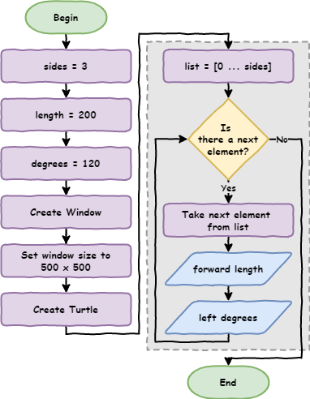
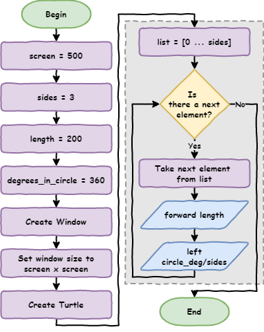
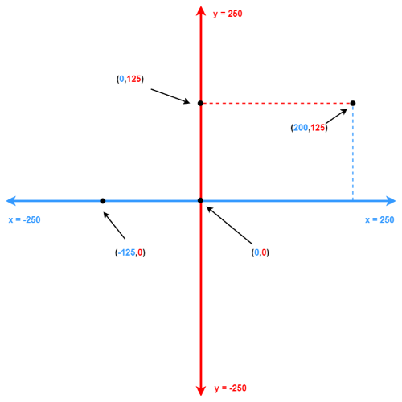
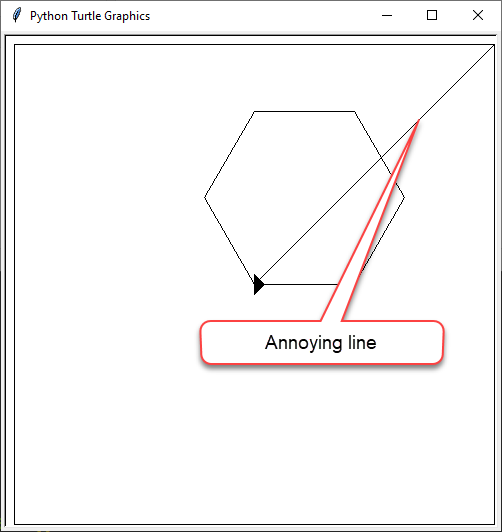
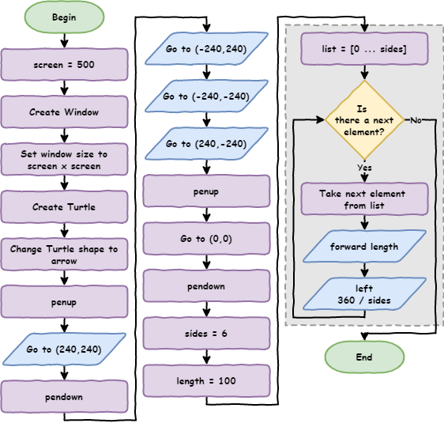

# Python Turtle - Lesson 3

```{topic} In this lesson you will learn:
* how to store information in variables (like saving a value in a named box)
* when to use variables and how they help your code
* what screen coordinates are (how we describe positions on the screen)
* how to use coordinates to move the turtle to a specific spot
* how to move the turtle without drawing a line (lifting the pen up)
```

## Part 1: Variables

<iframe width="560" height="315" src="https://www.youtube-nocookie.com/embed/mG1O_JamxjQ" title="YouTube video player" frameborder="0" allow="accelerometer; autoplay; clipboard-write; encrypted-media; gyroscope; picture-in-picture" allowfullscreen></iframe>

[Video link](https://youtu.be/mG1O_JamxjQ)

### Conventional range

Before we start learning about variables, we need to use `range` in a more common way.

Earlier, we used code like this to print four numbers.

```{code-block} python
:linenos:
for index in range(1, 5):
    print(index)
```

```{hint} What is index?
`index` is a programming convention that represents a counter in a loop. You can call it anything you want, but the convention is to call it `index`.
```

When you run the code, this is what you will see.

```{code-block}
1
2
3
4
```

If we only care about how many times the loop repeats, we can use this instead.

```{code-block} python
:linenos:
:emphasize-lines: 1
for index in range(0, 4):
    print(index)
```

This will give you:

```
0
1
2
3
```

The loop still runs four times. The difference is that it starts counting from `0`.

If we don’t tell the `range` function where to start, it will automatically start at `0`.

So we can just use this instead.

```{code-block} python
:linenos:
:emphasize-lines: 1
for index in range(4):
    print(index)
```

This is the most common way to use `range` in Python.

---

### Replace magic numbers

Here is one possible solution for Lesson 2 Exercise 1 (there are many correct answers).

Create a new file called **lesson_3_pt_1.py** and type in this code.

```{code-block} python
:linenos:
import turtle

window = turtle.Screen()
window.setup(500, 500)
my_ttl = turtle.Turtle()

for index in range(4):
    my_ttl.forward(100)
    my_ttl.left(90)
```

What do we need to change in the code so the turtle draws a triangle with each side being `200` long?

Try to figure it out yourself before looking at the code below.

```{code-block} python
:linenos:
:emphasize-lines: 7-9
import turtle

window = turtle.Screen()
window.setup(500, 500)
my_ttl = turtle.Turtle()

for index in range(3):
    my_ttl.forward(200)
    my_ttl.left(120)
```
What numbers did we change, and what do they mean?

* `4` → `3` means the number of sides
* `100` → `200` means how long each side is
* `90` → `120` means how many degrees the turtle turns

If you wanted to draw a hexagon, or any other shape, you would have to keep changing these numbers every time.

In programming, these numbers are called **magic numbers**. A magic number is a value written directly into the code.

Magic numbers are not a good idea. If someone else reads your code, they won’t know what `3`, `200`, or `120` are for without figuring it out.

Also, imagine your program draws 1000 squares. If you wanted to change them all to triangles, you would have to change numbers 3000 times.

To write better code, we replace magic numbers with names called **variables**.

A variable is like a labelled box where you store a value, so your code is easier to read and change.

Update your code in **lesson_3_pt_1.py** so it matches the code below.

```{code-block} python
:linenos:
:emphasize-lines: 3-5, 11-13
import turtle

sides = 3
length = 200
degrees = 120

window = turtle.Screen()
window.setup(500, 500)
my_ttl = turtle.Turtle()

for index in range(sides):
    my_ttl.forward(length)
    my_ttl.left(degrees)
```

```{note} Predict
Try to guess what will happen when you run the code.
```

```{note} Run
**Run** the code and check if your prediction was correct.
```

`sides`, `length`, and `degrees` are all **variables**. Let’s explore how they are used in the code.

First, here is the flowchart for our updated program:



```{note} Investigate
* `sides = 3` creates a variable called `sides` and stores the value `3` in it.
* `length = 200` creates a variable called `length` and stores the value `200` in it.
* `degrees = 120` creates a variable called `degrees` and stores the value `120` in it.
* `for i in range(sides):` uses the value in `sides`, so it works the same as `for i in range(3):`
* `my_ttl.forward(length)` uses the value in `length`, so it becomes `my_ttl.forward(200)`
* `my_ttl.left(degrees)` uses the value in `degrees`, so it becomes `my_ttl.left(120)`

```

```{hint} Naming rules
Python has some clear rules for naming variables:

* names can only use letters, numbers, and `_` (underscore)
* names cannot have spaces
* names cannot start with a number
* names are case sensitive (for example, `age` is different from `Age`)
```

---
### Single point of truth

Now that we are using variables, we can copy the `for` loop and use it as many times as we want. The values for `sides`, `length`, and `degrees` will always come from what we set at the start.

In programming, this is called a **single point of truth**. This means if we change the value of `sides`, it updates everywhere `sides` is used. The same is true for `length` and `degrees`.

Change **lesson_3_pt_1.py** so it draws a hexagon with each side being 100 long.

Your code should look like:

```{code-block} python
:linenos:
:emphasize-lines: 3-5
import turtle

sides = 6
length = 100
degrees = 60

window = turtle.Screen()
window.setup(500, 500)
my_ttl = turtle.Turtle()

for index in range(sides):
    my_ttl.forward(length)
    my_ttl.left(degrees)
```

---

### No 'meat space' calculations
When we made our hexagon, how did we know the turtle needed to turn `60` degrees?

You might have worked it out in your head or used a calculator. Both of these have problems:

* you might make a mistake doing it in your head
* using a calculator takes extra time

Instead, we can get Python to do the calculation for us.

```{hint} Python calculations
Python can do lots of different maths calculations for you.

To see them all, check out **[W3Schools's Python Arithmetic Operators page](https://www.w3schools.com/python/gloss_python_arithmetic_operators.asp)**
```

The value for `degrees` is worked out by dividing `360` by the number of `sides`.

In Python, we write this as:
`degrees = 360 / sides`

Let’s add this into our code on `line 5`:

```{code-block} python
:linenos:
:emphasize-lines: 5
import turtle

sides = 6
length = 100
degrees = 360 / sides

window = turtle.Screen()
window.setup(500, 500)
my_ttl = turtle.Turtle()

for index in range(sides):
    my_ttl.forward(length)
    my_ttl.left(degrees)
```

---

### Remove unnecessary variables
Another good habit in programming is to remove variables that we don’t really need.

Do we actually need the `degrees` variable? Could we just do the calculation inside the `for` loop instead?

If we remove `line 5` and move the calculation to `line 10`, our code would look like this.

```{code-block} python
:linenos:
:emphasize-lines: 10
import turtle

sides = 6
length = 100
degrees = 360 / sides

window = turtle.Screen()
window.setup(500, 500)
my_ttl = turtle.Turtle()

for index in range(sides):
    my_ttl.forward(length)
    my_ttl.left(degrees)
```

Are there any more **magic numbers** in the code?

Look carefully and see if you can spot any.

```{code-block} python
:linenos:
:emphasize-lines: 3, 6, 9, 14
import turtle

screen = 500
sides = 6
length = 100
CIRCLE_DEG = 360

window = turtle.Screen()
window.setup(screen, screen)
my_ttl = turtle.Turtle()

for index in range(sides):
    my_ttl.forward(length)
    my_ttl.left(CIRCLE_DEG / sides)
```

The flowchart for this code now looks like this:



In `line 6`, we created a new variable called `CIRCLE_DEG` and gave it the value `360`.

We wrote the name in capital letters because this value will never change, no matter what shape we draw.

Variables like this are called **constants** (values that stay the same).

In Python, we use capital letters to name constants.

```{hint} Naming conventions
Python has **naming rules** and **naming conventions**, and they are not the same.

* If you break a naming **rule**, your program will crash with a **syntax error**
* If you break a naming **convention**, your program will still work, but your code may be harder to read

We use naming conventions to make code easier for people to understand.

### Variable naming conventions

* Use clear names that explain what the value is

  * `d = 30` → bad
  * `degrees = 30` → better
  * `degrees_celsius = 30` → best

* Use **snake case** for names with more than one word

  * use `_` instead of spaces
  * only use lowercase letters
  * example: `this_is_snake_case`

* Use **ALL CAPITAL LETTERS** for constants (values that do not change)

* Do not use Python keywords as variable names (like `print` or `for`)
```

### Part 1 Exercises

In this course, the exercises are the **make** part of the PRIMM model. Work through the exercises and write your own code.

````{question} Exercise 1
Download **{download}`lesson_3_ex_1.py<./python_files/lesson_3_ex_1.py>`** file and save it in your lesson folder. 

Read the comments in the code and change it so the turtle draws a square.

The starting code is shown below:

```{literalinclude} ./python_files/lesson_3_ex_1.py
:linenos:
:emphasize-lines: 3-5
```
````

---

````{question} Exercise 2
Download **{download}`lesson_3_ex_2.py<./python_files/lesson_3_ex_2.py>`** file and save it in your lesson folder. 

Read the comments in the code and change it so the turtle draws a circle.

The starting code is shown below:

```{literalinclude} ./python_files/lesson_3_ex_2.py
:linenos:
:emphasize-lines: 3-5
```
````

---

````{question} Exercise 3
Download **{download}`lesson_3_ex_3.py<./python_files/lesson_3_ex_3.py>`** file and save it in your lesson folder. 

Read the comments in the code and change it so the turtle draws a **pentagon**.

The starting code is shown below:

```{literalinclude} ./python_files/lesson_3_ex_3.py
:linenos:
:emphasize-lines: 3-5
```
````

## Part 2: Coordinates

<iframe width="560" height="315" src="https://www.youtube.com/embed/F4ajxJwXH58" title="YouTube video player" frameborder="0" allow="accelerometer; autoplay; clipboard-write; encrypted-media; gyroscope; picture-in-picture" allowfullscreen></iframe>

[Video link](https://youtu.be/F4ajxJwXH58)

### Maintainability


**Maintainability** means how easy your code is for other people to read and understand. This matters because the other person could be:

* someone helping you fix your code
* your teacher marking your work
* even you, coming back to it six months later

Before we continue, we should tidy up the code by using some good coding habits.

We will:

* group code based on what it does
* use comments to show what each part is for

Change your code in **lesson_3_pt_1.py** so it matches the code below.

```{code-block} python
:linenos:
import turtle

# set up screen
screen = 500
window = turtle.Screen()
window.setup(screen, screen)

# create turtle instance
my_ttl = turtle.Turtle()
my_ttl.shape("arrow")

# shape parameters
sides = 6
length = 100
DEGREES_IN_CIRCLE = 360

# draw the shape
for index in range(sides):
    my_ttl.forward(length)
    my_ttl.left(DEGREES_IN_CIRCLE / sides)
```

Anyone reading the program will be able to quickly find the code for:

* setting up the screen
* creating the turtle
* setting the shape values
* drawing the shape

Save the file as **lesson_3_pt_2.py** (**File** → **Save as...**).

---

### How Turtle coordinates work

Think of the Turtle window like a piece of graph paper made of pixels.

Our screen is 500 pixels wide and 500 pixels high (`px` means pixels).
Turtle uses:

* `x` for left and right (horizontal)
* `y` for up and down (vertical)

So we can say the window size is:

* `x = 500`
* `y = 500`

In computing, we write this as a coordinate like this: `(500, 500)`
The first number is `x`, and the second number is `y`.

```{hint} What's an immutable tuple?
Values like `(500, 500)` are called **tuples**.

A tuple is similar to a **list** you learnt about earlier, but there is one big difference:

* you can change a list
* you **cannot** change a tuple

In computer science, something that cannot be changed is called **immutable**.
So, tuples are **immutable**.

Tuples:

* start with `(`
* end with `)`
* use `,` to separate each value

```

For our Turtle window `(500, 500)`, the coordinates are centred in the middle of the screen.

This means:

* `x` values go from `-250` to `250` (left to right)
* `y` values go from `-250` to `250` (down to up)

So the centre of the screen is `(0, 0)`.

It looks like this:



Important things to know:

* the centre of the screen is `(0, 0)`
* moving up from the centre, `y` gets bigger (up to `250`)
* moving down from the centre, `y` gets smaller (down to `-250`)
* moving right from the centre, `x` gets bigger (up to `250`)
* moving left from the centre, `x` gets smaller (down to `-250`)
* every spot on the screen can be described using `(x, y)` coordinates, like `(200, 125)`

### In summary:

* ↑ increases `y`
* ↓ decreases `y`
* → increases `x`
* ← decreases `x`

Now that we understand coordinates, we can tell the turtle to move to a specific position on the screen.

---

### Using `goto()` to draw

Make these changes in **lesson_3_pt_2.py**:

* add `my_ttl.goto(0, 125)` on line 16
* add a `#` at the start of lines 19 to 21


```{code-block} python
:linenos:
:emphasize-lines: 16, 18-21
import turtle

# set up screen
screen = 500
window = turtle.Screen()
window.setup(screen, screen)

# create turtle instance
my_ttl = turtle.Turtle()
my_ttl.shape("arrow")

# shape parameters
sides = 6
length = 100

my_ttl.goto(0, 125)

# draw shape
# for index in range(sides):
#    my_ttl.forward(length)
#    my_ttl.left(360 / sides)
```

```{note} Predict
Try to guess what you think will happen.
```

```{note} Run
**Run** the code and check if your prediction was correct.
```

```{note} Investigate
**Investigate** what changed:

* `line 16` `my_ttl.goto(0, 125)` tells the turtle to move to the position `x = 0` and `y = 125`

* the `#` at the start of lines 19 to 21 turns those lines into comments, so Python ignores them. This is called **commenting out** code and is useful when testing or fixing your program
```

```{note} Modify
**Change** the code so your turtle moves to all the points shown in the coordinate diagram above.
```

---

### Draw a border

Change **lesson_3_pt_2.py** so that it looks like same as below.

```{code-block} python
:linenos:
:emphasize-lines: 12-18
import turtle

# set up screen
screen = 500
window = turtle.Screen()
window.setup(screen, screen)

# create turtle instance
my_ttl = turtle.Turtle()
my_ttl.shape("arrow")

# draw boarder
my_ttl.goto(240, 240)
my_ttl.goto(-240, 240)
my_ttl.goto(-240, -240)
my_ttl.goto(240, -240)
my_ttl.goto(240, 240)
my_ttl.goto(0, 0)

# shape parameters
sides = 6
length = 100

# draw shape
for index in range(sides):
    my_ttl.forward(length)
    my_ttl.left(360 / sides)
```

```{note} Predict and Run
Try to guess what you think will happen, then **run** the code. Did it happen the way you expected?
```

```{note} Investigate
**Investigate** the code by changing parts of it and seeing what happens.
```

---

### Using `penup` and `pendown`

Now we have a border around our drawing. There is an extra line where the turtle moves from the centre to the edge, which we don’t want.

We can fix this.



When we write on paper, we lift our pen to move without drawing a line. Then we put it back down to keep writing.

The turtle can do the same thing using `penup()` and `pendown()`.

Change your code by adding the lines below to lines `13`, `15`, `19`, and `21`.

```{code-block} python
:linenos:
:emphasize-lines: 13, 15, 19, 21
import turtle

# set up screen
screen = 500
window = turtle.Screen()
window.setup(screen, screen)

# create turtle instance
my_ttl = turtle.Turtle()
my_ttl.shape("arrow")

# draw boarder
my_ttl.penup()
my_ttl.goto(240, 240)
my_ttl.pendown()
my_ttl.goto(-240, 240)
my_ttl.goto(-240, -240)
my_ttl.goto(240, -240)
my_ttl.penup()
my_ttl.goto(0, 0)
my_ttl.pendown()

# shape parameters
sides = 6
length = 100

# draw shape
for index in range(sides):
    my_ttl.forward(length)
    my_ttl.left(360 / sides)
```

```{note} Predict and Run
Try to guess what you think will happen, then **run** the code. Did it happen the way you expected? 

Here is a flowchart to help you predict what will happen.


```

### Part 2 Exercise

In this course, the exercises are the **make** part of the PRIMM model. Work through the exercise and write your own code.

````{question} Exercise 4
Download **{download}`lesson_3_ex_4.py<./python_files/lesson_3_ex_4.py>`** file and save it in your lesson folder. 

Read the comments and use what you know about Turtle to draw a house.

Try to keep your code **DRY**, which means **Don’t Repeat Yourself**. This means you should avoid writing the same code again and again when there is a simpler way.

The starting code is shown below:

```{literalinclude} ./python_files/lesson_3_ex_4.py
:linenos:
:emphasize-lines: 12-16
```
````