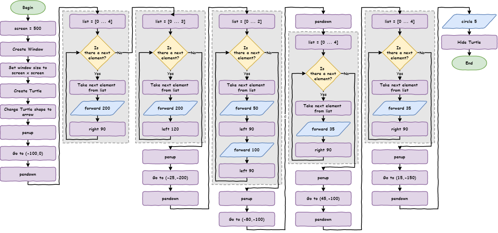
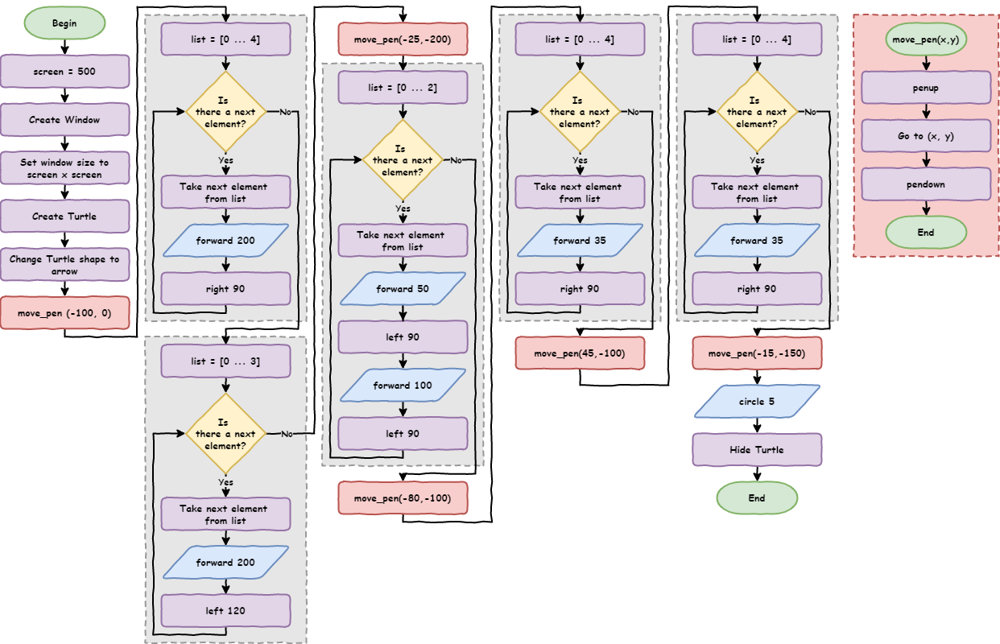
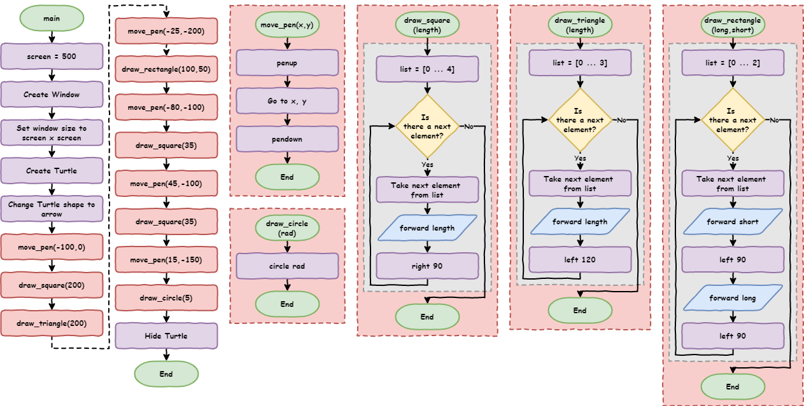
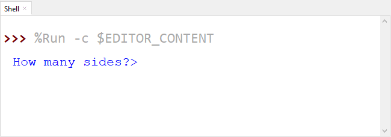
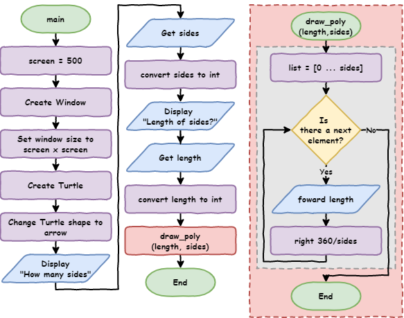

# Python Turtle - Lesson 4

```{topic} In this lesson you will learn:
* how to break your code into smaller, easier-to-manage parts
* when and how to use functions in Python to organise your code
* how to get input (answers) from a user in your program
* what different data types are and how they store information
* how to change one data type into another
```

## Part 1: Functions

<iframe width="560" height="315" src="https://www.youtube.com/embed/ZQNU29m5pHY" title="YouTube video player" frameborder="0" allow="accelerometer; autoplay; clipboard-write; encrypted-media; gyroscope; picture-in-picture" allowfullscreen></iframe>

[Video link](https://youtu.be/ZQNU29m5pHY)

### What are functions?

**Functions** are blocks of code that you can use again and again in your program.

So far, your code has only run once from top to bottom. Even when you use a loop, the loop itself only runs once — it just repeats the code inside it before moving on.

A function works differently.

With a function:

* you take a group of code and move it somewhere else
* you give that group of code a name
* you can then use (or **call**) that code whenever you need it

This means you don’t have to write the same code over and over again.

When your program **calls** a function, it jumps to that block of code, runs it, and then comes back to continue the program.

To see how this works, we will start with a solution for **lesson_3_ex_4.py**.

Here is the flowchart for the solution:



Here is the code. You can either type it into a new file, or download the **{download}`lesson_4_pt_1.py<./python_files/lesson_4_pt_1.py>`** file.

```{literalinclude} ./python_files/lesson_4_pt_1.py
:linenos:
```

```{note} Predict
**Predict** what kind of house the code will draw
```

```{note} Run
**Run** the code and check if it matches what you predicted
```

Remember the DRY principle (**Don’t Repeat Yourself**). Look at the code and think about this:

* Does the code repeat the same instructions?
* Are there parts that look very similar?

**Hint:** Read the comments carefully — they can help you spot the repeated parts.

```{literalinclude} ./python_files/lesson_4_pt_1.py
:linenos:
:emphasize-lines: 17, 22, 27, 32, 37, 44, 49, 54, 59, 64, 69
```

In this code, there are two main things that repeat:

* moving the pen
* drawing the shape

When this code was written, parts were copied and pasted, then some numbers were changed.

Copying and pasting is a strong sign that a **function** should be used.

Why?

Because functions help you follow the **DRY principle (Don’t Repeat Yourself)** by:

* putting repeated code in one place
* letting you reuse it instead of copying it again and again

---

### Creating functions

Let’s see how this works.

1. Take all the **move pen code** and put it together in one place.

   * Below, the first set of move pen code (`lines 17 to 20` in the old code) has been copied
   * It has been moved to the top (`lines 4 to 7`)
   * Then it has been turned into a function
2. Replace the original code with a **call** to the function (`line 24`)

Change your code so it matches the example below:

```{code-block} python
:linenos:
:emphasize-lines: 4-7, 24
import turtle


def move_pen():
    my_ttl.penup()
    my_ttl.goto(-100, 0)
    my_ttl.pendown()


# set up screen
screen = 500
window = turtle.Screen()
window.setup(screen, screen)

# create turtle instance
my_ttl = turtle.Turtle()
my_ttl.shape("arrow")

##################################
## Using the tutrle command you ##
## have learnt, draw a house.   ##
##################################

move_pen()

# draw square
for index in range(4):
    my_ttl.forward(200)
    my_ttl.right(90)

# draw triangle
for index in range(3):
    my_ttl.forward(200)
    my_ttl.left(120)

# move pen
my_ttl.penup()
my_ttl.goto(-25, -200)
my_ttl.pendown()

# draw rectangle
for index in range(2):
    my_ttl.forward(50)
    my_ttl.left(90)
    my_ttl.forward(100)
    my_ttl.left(90)

# move pen
my_ttl.penup()
my_ttl.goto(-80, -100)
my_ttl.pendown()

# draw square
for index in range(4):
    my_ttl.forward(35)
    my_ttl.right(90)

# move pen
my_ttl.penup()
my_ttl.goto(45, -100)
my_ttl.pendown()

# draw square
for index in range(4):
    my_ttl.forward(35)
    my_ttl.right(90)

# move pen
my_ttl.penup()
my_ttl.goto(15, -150)
my_ttl.pendown()

# draw circle
my_ttl.circle(5)
my_ttl.hideturtle()
```

```{note} Predict and Run
**Predict** what you think will happen, then **run** the code and check your prediction
```

```{note} Investigate
Now let’s **investigate** the code step by step:

* `Line 4`: `def move_pen():` creates the function

  * This is called **defining** a function
  * The program reads the code and remembers it, but does not run it yet
  * `def` is the keyword used to create a function
  * `move_pen` is the name of the function

    * This is how the program knows what to run when you call it
    * Good names make your code easier to understand without comments
  * `()` is where you can pass values into the function (you’ll learn this soon)
  * `:` tells Python that a block of code will follow

* `Lines 5 to 7` are indented

  * This is the code that will run when the function is called
  * Indentation works the same as in a `for` loop

    * you can have multiple lines
    * this group of lines is called a **block**
    * use four spaces for indentation

* `Line 24`: `move_pen()` calls the function

  * The program jumps to `line 4` and runs the function code
  * When it finishes, it goes back to `line 24` and continues running the rest of the program
```

---

### Passing arguments

This works for the first pen movement, but it will not work for the others.

Why not?

Because the coordinates are still fixed numbers, **magic numbers**. If you wanted the pen to move somewhere else, you would have to make a new function each time.

That is not very useful.

What we really need is a way to give the function different coordinates each time we use it.

We can do that with **arguments**.

**Arguments** are values that you send into a function when you call it. This lets one function do the same job in different places, instead of making lots of nearly identical functions.

Looking at the `move_pen` function, the fixed numbers need to be removed.


```{code-block} python
:linenos:
:lineno-start: 4
:emphasize-lines: 3
def move_pen():
    my_ttl.penup()
    my_ttl.goto(-100, 0)
    my_ttl.pendown()
```

What do the two numbers in `my_ttl.goto(-100, 0)` mean?

They are the **x** and **y** positions on the screen.

So instead of using fixed numbers, we can replace them with **variables**.

```{code-block} python
:linenos:
:lineno-start: 4
:emphasize-lines: 3
def move_pen():
    my_ttl.penup()
    my_ttl.goto(x, y)
    my_ttl.pendown()
```

How do we give values to `x` and `y`? We use **arguments**.

1. Change the function to `def move_pen(x, y):` so it can **accept** two values
2. Change the function call to `move_pen(-100, 0)` to send two values into the function

```{note} Investigate
Let’s break that down:

* `def move_pen(x, y):` means:

  * The function needs two values when it is called
  * The first value will be stored in `x`
  * The second value will be stored in `y`

* `move_pen(-100, 0)` means:

  * Run the `move_pen` function
  * Set `x` to `-100`
  * Set `y` to `0`
```

Your code should now match the example below:

```{code-block} python
:linenos:
:emphasize-lines: 4, 24
import turtle


def move_pen(x, y):
    my_ttl.penup()
    my_ttl.goto(x, y)
    my_ttl.pendown()


# set up screen
screen = 500
window = turtle.Screen()
window.setup(screen, screen)

# create turtle instance
my_ttl = turtle.Turtle()
my_ttl.shape("arrow")

##################################
## Using the tutrle command you ##
## have learnt, draw a house.   ##
##################################

move_pen(-100, 0)

# draw square
for index in range(4):
    my_ttl.forward(200)
    my_ttl.right(90)

# draw triangle
for index in range(3):
    my_ttl.forward(200)
    my_ttl.left(120)

# move pen
my_ttl.penup()
my_ttl.goto(-25, -200)
my_ttl.pendown()

# draw rectangle
for index in range(2):
    my_ttl.forward(50)
    my_ttl.left(90)
    my_ttl.forward(100)
    my_ttl.left(90)

# move pen
my_ttl.penup()
my_ttl.goto(-80, -100)
my_ttl.pendown()

# draw square
for index in range(4):
    my_ttl.forward(35)
    my_ttl.right(90)

# move pen
my_ttl.penup()
my_ttl.goto(45, -100)
my_ttl.pendown()

# draw square
for index in range(4):
    my_ttl.forward(35)
    my_ttl.right(90)

# move pen
my_ttl.penup()
my_ttl.goto(15, -150)
my_ttl.pendown()

# draw circle
my_ttl.circle(5)
my_ttl.hideturtle()
```

```{note} Predict and Run
**Predict** what the code will do now, then **run** it to see if you were correct
```

```{note} Investigate
**Investigate** the code by using the debugger and stepping through the program one line at a time.
```

```{admonition} Arguments vs Parameters
In programming, people sometimes use **arguments** and **parameters** to mean the same thing. That’s usually okay, but they are slightly different:

* **arguments** are the values you send into a function
* **parameters** are the variable names in the function that receive those values
```

---

Go through your code and replace the remaining `# move pen` sections with a `move_pen()` call.

Your code should now match the example below:

```{code-block} python
:linenos:
:emphasize-lines: 24, 36, 45, 52, 59
import turtle


def move_pen(x, y):
    my_ttl.penup()
    my_ttl.goto(x, y)
    my_ttl.pendown()


# set up screen
screen = 500
window = turtle.Screen()
window.setup(screen, screen)

# create turtle instance
my_ttl = turtle.Turtle()
my_ttl.shape("arrow")

##################################
## Using the tutrle command you ##
## have learnt, draw a house.   ##
##################################

move_pen(-100, 0)

# draw square
for index in range(4):
    my_ttl.forward(200)
    my_ttl.right(90)

# draw triangle
for index in range(3):
    my_ttl.forward(200)
    my_ttl.left(120)

move_pen(-25, -200)

# draw rectangle
for index in range(2):
    my_ttl.forward(50)
    my_ttl.left(90)
    my_ttl.forward(100)
    my_ttl.left(90)

move_pen(-80, -100)

# draw square
for index in range(4):
    my_ttl.forward(35)
    my_ttl.right(90)

move_pen(45, -100)

# draw square
for index in range(4):
    my_ttl.forward(35)
    my_ttl.right(90)

move_pen(15, -150)

# draw circle
my_ttl.circle(5)
my_ttl.hideturtle()
```

```{note} Run
**Run** the code to make sure the house is still drawn correctly.

Notice that the number of lines has gone down from `71` to `63`.
```

```{hint} Testing tips
* It is important to test your code often
* Every time you make a change, test it
* Don’t change too many things at once, or it will be harder to find mistakes
* If a function works correctly, you don’t need to test it again unless you change it
* If all your functions work, any problem must be somewhere else in your code
```

---

### Functions in Flowcharts

Flowcharts don’t show a whole program. They show the steps of a solution (an algorithm).

```{admonition} What are algorithms?
Algorithms are step-by-step instructions used to solve a problem.

* A cake recipe is an algorithm for baking a cake
* The steps for long division in maths are an algorithm
* In programming, your code is the algorithm the computer follows
```

When a program is made up of smaller parts (like functions), each part is its own algorithm.

* Create a flowchart for each algorithm
* Show where one algorithm calls another

In a flowchart:

* The **terminator shape** shows the name of the algorithm
* **Main** is the starting point of the program

When a function is called:

* Use the **procedure symbol** to show the call
* These are often highlighted (for example, in red) so they are easy to see



---

### Shape functions

Earlier, we noticed that drawing shapes also repeats. Now let’s make a function to draw squares.

From your current code:

* Copy one of the `# draw square` sections and move it to the top
* Turn it into a function called `draw_square`
* Make the function take a value for the side length of the square
* Replace all the `# draw square` sections with calls to `draw_square`

```{admonition} Where should I place functions?
Function definitions should be placed at the top of your code, just after the `import` statements.

There are two reasons for this:

* If a function is not defined before you call it, your program will crash with a `NameError`
* Keeping all your functions at the top makes them easier to find and understand, which makes your code easier to maintain
```

Once you have created the `draw_square` function and updated your code, it should look like this:

```{code-block} python
:linenos:
:emphasize-lines: 10-13, 31, 48, 50
import turtle


def move_pen(x, y):
    my_ttl.penup()
    my_ttl.goto(x, y)
    my_ttl.pendown()


def draw_square(length):
    for index in range(4):
        my_ttl.forward(length)
        my_ttl.right(90)


# set up screen
screen = 500
window = turtle.Screen()
window.setup(screen, screen)

# create turtle instance
my_ttl = turtle.Turtle()
my_ttl.shape("arrow")

##################################
## Using the tutrle command you ##
## have learnt, draw a house.   ##
##################################

move_pen(-100, 0)
draw_square(200)

# draw triangle
for index in range(3):
    my_ttl.forward(200)
    my_ttl.left(120)

move_pen(-25, -200)

# draw rectangle
for index in range(2):
    my_ttl.forward(50)
    my_ttl.left(90)
    my_ttl.forward(100)
    my_ttl.left(90)

move_pen(-80, -100)
draw_square(35)
move_pen(45, -100)
draw_square(35)
move_pen(15, -150)

# draw circle
my_ttl.circle(5)
my_ttl.hideturtle()
```

Your code is now only 55 lines long.

---

There is no repeated code left in the main part of the program, but there are still three large code sections.

Notice that the rest of the code is now easier to read.

Next, turn these code sections into functions:

* `# draw triangle`
* `# draw rectangle`
* `# draw circle`

This gives you two benefits:

* It makes the code easier to read and maintain
* It makes it easier to add more rectangles, triangles, and circles later

See if you can turn all three code sections into functions.

Remember to test each function as you make it.

When you finish, your code should look like this:

```{code-block} python
:linenos:
:emphasize-lines: 16-19, 22-27, 30-31, 50, 52, 58
import turtle


def move_pen(x, y):
    my_ttl.penup()
    my_ttl.goto(x, y)
    my_ttl.pendown()


def draw_square(length):
    for index in range(4):
        my_ttl.forward(length)
        my_ttl.right(90)


def draw_triangle(length):
    for index in range(3):
        my_ttl.forward(length)
        my_ttl.left(120)


def draw_rectangle(long, short):
    for index in range(2):
        my_ttl.forward(short)
        my_ttl.left(90)
        my_ttl.forward(long)
        my_ttl.left(90)


def draw_circle(rad):
    my_ttl.circle(rad)


# set up screen
screen = 500
window = turtle.Screen()
window.setup(screen, screen)

# create turtle instance
my_ttl = turtle.Turtle()
my_ttl.shape("arrow")

##################################
## Using the tutrle command you ##
## have learnt, draw a house.   ##
##################################

move_pen(-100, 0)
draw_square(200)
draw_triangle(200)
move_pen(-25, -200)
draw_rectangle(100, 50)
move_pen(-80, -100)
draw_square(35)
move_pen(45, -100)
draw_square(35)
move_pen(15, -150)
draw_circle(5)
my_ttl.hideturtle()
```

That’s your final code:

* Reduced from `71` lines to `59` lines
* Easier to read
* Easier to test and fix errors

One of the best ways to see the improvement is by looking at the flowchart.



### Part 1 Exercises

In this course, the exercises are the **make** part of the PRIMM model. Work through the following exercises and create your own code.

````{question} Exercise 1
Download **{download}`lesson_4_ex_1.py<./python_files/lesson_4_ex_1.py>`** file and save it in your lesson folder. 

Follow the instructions in the comments and adapt the code so it uses functions.

The starting code is shown below:

```{literalinclude} ./python_files/lesson_4_ex_1.py
:linenos:
:emphasize-lines: 12-14
```
````

---

````{question} Exercise 2
Download **{download}`lesson_4_ex_2.py<./python_files/lesson_4_ex_2.py>`** file and save it in your lesson folder. 

Follow the instructions in the comments and write a program that draws a car.

The starting code is shown below:

```{literalinclude} ./python_files/lesson_4_ex_2.py
:linenos:
:emphasize-lines: 12-16
```
````

## Part 2: User Input

<iframe width="560" height="315" src="https://www.youtube.com/embed/HUEgYhYAuB0" title="YouTube video player" frameborder="0" allow="accelerometer; autoplay; clipboard-write; encrypted-media; gyroscope; picture-in-picture" allowfullscreen></iframe>

[Video link](https://youtu.be/HUEgYhYAuB0)

### Introduction

Download the **{download}`lesson_4_pt_2.py<./python_files/lesson_4_pt_2.py>`** file and save it in your lesson folder.

```{literalinclude} ./python_files/lesson_4_pt_2.py
:linenos:
```

```{note} Predict
**Predict** what you think will happen
```

```{note} Run
**Run** the code and compare it to your prediction
```

```{note} Modify
**Modify** the code so the shape fits inside the window
```

When you run the code, part of the shape goes off the screen. This is not a big problem. You can fix it by changing the length from `100` to `80`.

That is easy for you because you know how to code. But what about someone who doesn’t?

How can we make our program interactive so a user can choose things without changing the code?

---

### Making your program interactive

The easiest way to make your program interactive is to use the `input` command. It asks the user a question in the **Shell** and waits for an answer.

Make these changes:

* Change `line 19` to `sides = input("How many sides? > ")`
* Change `line 20` to `length = input("How long are the sides? > ")`

Your code should now look like this:

```{code-block} python
:linenos:
:emphasize-lines: 19-20
import turtle


def draw_poly(length, sides):
    for index in range(sides):
        my_ttl.forward(length)
        my_ttl.right(360 / sides)


# setup window
screen = 500
window = turtle.Screen()
window.setup(screen, screen)

# create instance of turtle
my_ttl = turtle.Turtle()
my_ttl.shape("turtle")

sides = input("How many sides?> ")
length = input("How long are the sides?> ")

draw_poly(length, sides)
```

```{note} Predict
**Predict** what you think will happen
```

```{note} Run
* **Run** the code. Did it match your prediction?

  * Did you expect:

    * a **question (prompt)** to appear in the **Shell**?
    * the program to show an **error**?
```




```{code-block} error
:linenos:
Traceback (most recent call last):
  File "<string>", line 22, in <module>
  File "<string>", line 5, in draw_poly
TypeError: 'str' object cannot be interpreted as an integer
```

```{note} Investigate
Let’s **investigate** by:

  * breaking down the code we changed
  * explaining the error

Looking at `line 19` (line 20 works the same way):

* `input` tells Python to wait for the user to type something in the **Shell**
* `("How many sides? > ")` is the **question (prompt)** shown to the user
* `sides =` stores what the user types into the variable `sides`

Now for the error. This is a `TypeError`.

To understand why it happens, you need to learn about **data types**.
```

---

### Data types

Variables in Python can store different types of data. The four main types you will use are:

* **integer numbers** (`int`)

  * store whole numbers
  * written without a decimal (e.g. `1`, `25`)

* **floating point numbers** (`float`)

  * store numbers with decimals
  * written with a decimal point (e.g. `1.0`, `3.5`)
  * for example, `1` is an integer, but `1.0` is a float

* **strings** (`str`)

  * store text (letters, numbers, and symbols)
  * must start and end with `" "` or `' '`
  * numbers can be strings (e.g. a phone number like `0432 789 367`)
  * strings are not used for maths

* **Booleans** (`bool`)

  * can only be `True` or `False`

Data types help Python understand what it can do with a value.
For example, you can do maths with numbers, but not with text.

Each data type also has its own special tools called **methods**, which you will learn about later.

Now, let’s look at the error again:

```{code-block} error
:linenos:
Traceback (most recent call last):
  File "<string>", line 22, in <module>
  File "<string>", line 5, in draw_poly
TypeError: 'str' object cannot be interpreted as an integer
```

```{note} Investigate
Breaking down the error:

* Error on `line 4`: `TypeError: 'str' object cannot be interpreted as an integer`

  * This means two data types are involved: **string** and **integer**
  * Python expected a number, but got text instead

* `Traceback`:

  * Always read the **last line first**
  * It tells you where the error happened

* Error on `line 3` points to this code on `line 5`:
  `for index in range(sides):`

  * The `range()` function needs a number
  * But `sides` is being treated as a **string**

* Where did `sides` come from?

  * `line 19`: `sides = input("How many sides? > ")`
  * The user typed `3`, which looks like a number
```

So why is it a string?

Because **everything entered using `input()` is stored as a string**, even if it looks like a number.

How do we fix this?

We need to **convert the data type** from a string into a number.

---

### Converting data types
There are built-in functions that let you change one data type into another (except for Booleans).

If you have a variable called `var`:

* change `var` → string using `str(var)`
* change `var` → integer using `int(var)`
* change `var` → float using `float(var)`

There is more to learn about this later, but this is all you need for now.

Now update your code:

* take the values from `input()` (which are strings)
* convert them into integers using `int()`

Here is the final version shown as a flowchart.
Notice that input and output use the same shape, but with different labels.



Here is the finished code, with the changes made on `lines 19` and `20`:

```{code-block} python
:linenos:
:emphasize-lines: 19-20
import turtle


def draw_poly(length, sides):
    for index in range(sides):
        my_ttl.forward(length)
        my_ttl.right(360 / sides)


# setup window
screen = 500
window = turtle.Screen()
window.setup(screen, screen)

# create instance of turtle
my_ttl = turtle.Turtle()
my_ttl.shape("turtle")

sides = int(input("How many sides?> "))
length = int(input("Length of sides?> "))

draw_poly(length, sides)
```

```{note} Predict and Run
**Predict** what you think will happen then **run** your code and check if your prediction was correct
```

```{note} Investigate
**Investigate** by trying different values for `sides` and `length`:

* draw different shapes
* what values make the turtle draw a circle?
* what happens if you enter a decimal (float) or text (string)?
```

```{note} Modify
**Modify** your code to use different questions (prompts)
```

### Part 2 Exercise

In this course, the exercises are the **make** component of the PRIMM model. Work through the following exercises and make your own code.

````{question} Exercise 3
Download **{download}`lesson_4_ex_3.py<./python_files/lesson_4_ex_3.py>`** file and save it in your lesson folder. 

Follow the instructions in the comments and use your Python knowledge to create a count up app. Remember to apply the DRY principle

The starting code is shown below:

```{literalinclude} ./python_files/lesson_4_ex_3.py
:linenos:
:emphasize-lines: 1-4
```
````
