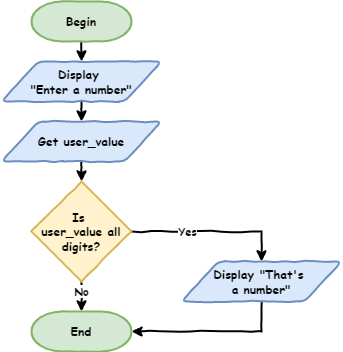
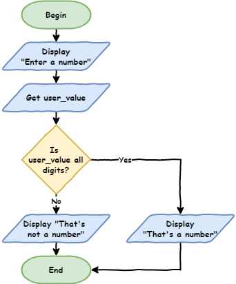
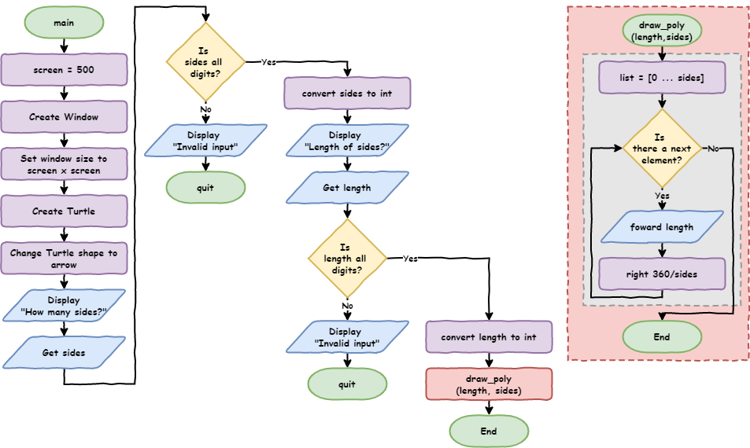
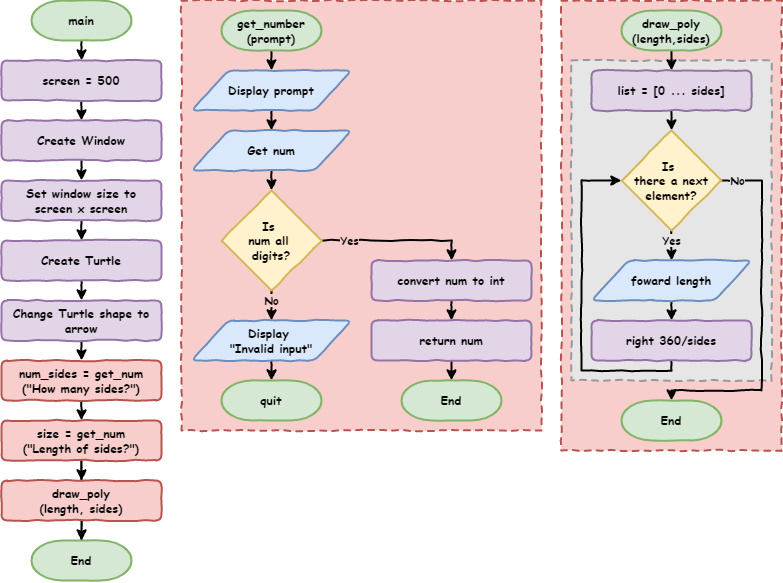
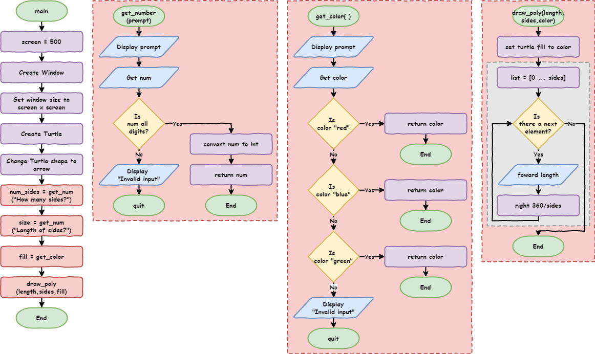
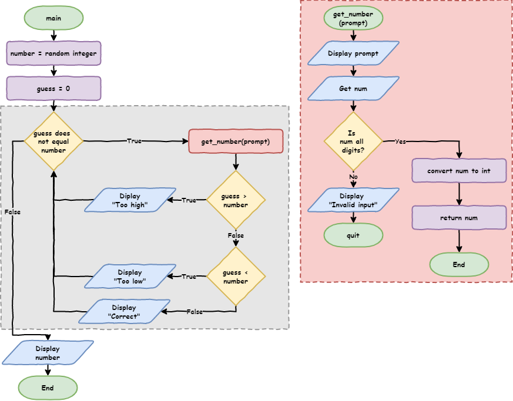
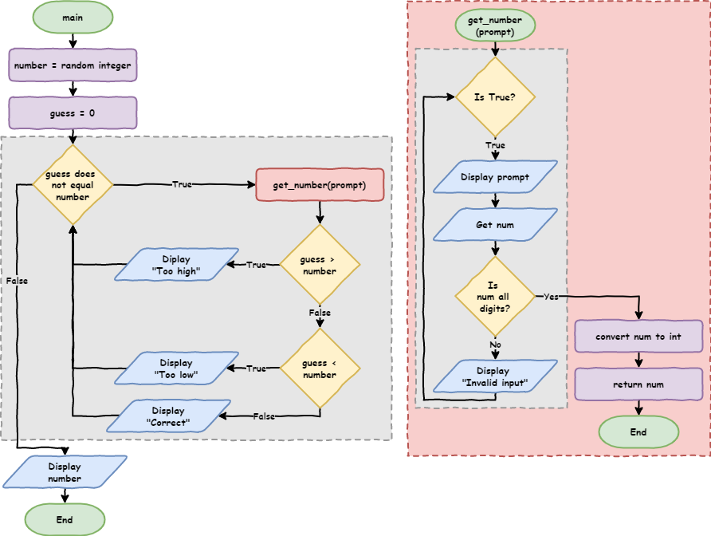

# Python Turtle - Lesson 5

```{topic} In this lesson you will learn:
* how to find and understand errors in your code
* what decision-making code is (`if` statements)
* how and when to use `if`, `elif`, and `else` in Python
* the difference between loops that run a set number of times and loops that keep going until something happens
* how and when to use `while` loops in Python
* how to make Python pick random numbers
```

## Part 1: Branching

<iframe width="560" height="315" src="https://www.youtube.com/embed/fGEz4QNXpEE" title="YouTube video player" frameborder="0" allow="accelerometer; autoplay; clipboard-write; encrypted-media; gyroscope; picture-in-picture" allowfullscreen></iframe>

[Video link](https://youtu.be/fGEz4QNXpEE)

### Branching control structure

Branching lets your program choose between different paths, depending on what is happening.

To understand this, let’s look at a real example.

We are going to use the file called **lesson_4_pt_2.py**. You can either:

* save your old file as a copy called **lesson_5_pt_1a.py**, or
* download the **{download}`lesson_5_pt_1a.py<./python_files/lesson_5_pt_1a.py>`** file instead.

```{literalinclude} ./python_files/lesson_5_pt_1a.py
:linenos:
```

Run the program.

When it asks you to enter a number, type the word `dog`.

This will cause an error below to happen.


```{code-block} error
:linenos:
Traceback (most recent call last):
  File "<string>", line 19, in <module>
ValueError: invalid literal for int() with base 10: 'dog'
```

This error happens because on `line 19`, the program is trying to turn the word `dog` into a number.

But `dog` is not a number, so Python doesn’t know how to convert it, and the program crashes.

To fix this, we need to check that the user has typed a whole number **before** we try to convert it into an integer.

---

### Showing variable types

Create a new file.

Type in the code shown below, then save the file as **lesson_5_pt_1b.py**.


```{code-block} python
:linenos:
user_value = input("Enter a number: ")

print(user_value.isdigit())
```

```{note} Predict
**Predict** what you think will happen when you run the code two times:

* first time, type `10`
* second time, type `dog`
```

```{note} Run
**Run** the code.

Did it do what you thought it would do?
```

```{note} Investigate
Let’s **investigate** the code.

Remember, anything you type into Python using `input` is treated as text (a string).

Strings have built-in tools called **methods** that help us work with them.

One of these methods is called `isdigit`.

The `isdigit` method checks if all the characters in a string are numbers.

* It returns `True` if they are all digits
* It returns `False` if they are not
```

```{hint} String Methods
Python has many useful string methods. If you want to explore them [**W3Schools' Python String Methods**](https://www.w3schools.com/python/python_ref_string.asp) is a good place to start.
```

Now we can check if the user has typed a number or not.

Next, we need to tell the computer what to do based on that result.

---

### The `if` statement

Change your **lesson_5_pt_1b.py** code so it matches the code below.

```{code-block} python
:linenos:
:emphasize-lines: 3-4
user_value = input("Enter a number: ")

if user_value.isdigit():
    print("That's a number")
```

```{note} Predict
**Predict** what you think will happen when you run the code two times:

* first time, type `10`
* second time, type `dog`
```

```{note} Run
**Run** the code.

Did it do what you thought it would do?
```

```{note} Investigate
* Let's **investigate** that code.

**Flowcharts**

Flowcharts are useful for showing how a program makes decisions.

We have already used the diamond shape (called a condition) in our `for` loops.

The same diamond shape is also used to show the conditions in `if` statements.

Code flowchart:



**Code breakdown:**

* `Line 3`: `if user_value.isdigit():`

  * This is an `if` statement.
  * `if` tells Python to make a decision.
  * The next part is called a **condition**.

    * A condition checks something and gives back either `True` or `False`.
    * Here, the condition is `user_value.isdigit()`
    * From earlier:

      * `10` → `True`
      * `dog` → `False`
  * The line ends with `:`

    * This tells Python that the next lines will be part of this `if` statement.
  * The indented code underneath will only run if the condition is `True`:

    * `10` → `True` → run the indented code
    * `dog` → `False` → skip the indented code

* `Line 4`: `print("That's a number")`

  * This line is inside the `if` statement (because it is indented).
  * It only runs if `user_value.isdigit()` is `True`
```

Right now, the program only does something when the input **is a number**.

But what about when the input is **not a number**?

---

### The `if` ... `else` statement

Change your **lesson_5_pt_1b.py** code by adding `lines 5` and `6` shown below.

```{code-block} python
:linenos:
:emphasize-lines: 5-6
user_value = input("Enter a number: ")

if user_value.isdigit():
    print("That's a number")
else:
    print("That's not a number")
```

```{note} Predict
**Predict** what you think will happen when you run the code two times:

* first time, type `10`
* second time, type `dog`
```

```{note} Run
**Run** the code.

Did it do what you thought it would do?
```

```{note} Investigate
Let’s **investigate** the code.

Here is the flowchart for the code:



**Code breakdown:**

* `Lines 3` and `4` work the same as before.

* `Line 5` - `else:`

  * The `else` is linked to the `if` statement.
  * It runs when the `if` condition is `False`.
  * In this case, it means: if `user_value.isdigit()` is `False`, run the code below.
  * The `:` tells Python that an indented block of code is coming next.

* `Line 6` - `print("That's not a number")`

  * This line is inside the `else` block (because it is indented).
  * It only runs when `user_value.isdigit()` is `False`

To look at the code more closely, step through it using the **debugger**.

Test it two times:

* first, enter `10`
* then, enter `dog`

Watch what happens on each line as the program decides which path to follow.

---

### Using `if` ... `else` to capture errors

Go back to **lesson_5_pt_1a.py**.

Change `line 19` so it matches the code shown below.

```{code-block} python
:linenos:
# get user input
num_sides = input("How many sides?> ")
if num_sides.isdigit():
    num_sides = int(num_sides)
else:
    print("Invalid input")
    quit()
```

Your code should now look like the example shown below.

```{code-block} python
:linenos:
:emphasize-lines: 19-25
import turtle


def draw_poly(length, sides):
    for i in range(sides):
        my_ttl.forward(length)
        my_ttl.right(360 / sides)


# setup window
screen = 500
window = turtle.Screen()
window.setup(screen, screen)

# create instance of turtle
my_ttl = turtle.Turtle()
my_ttl.shape("turtle")

# get user input
num_sides = input("How many sides?> ")
if num_sides.isdigit():
    num_sides = int(num_sides)
else:
    print("Invalid input")
    quit()

size = input("Length of sides?> ")

draw_poly(size, num_sides)
```

Then change `line 27` so it matches the code shown below.

```{code-block} python
:linenos:
size = input("Length of sides?> ")
if size.isdigit():
    size = int(size)
else:
    print("Invalid input")
    quit()
```

Your code should now look like the example shown below.

```{code-block} python
:linenos:
:emphasize-lines: 27-32
import turtle


def draw_poly(length, sides):
    for i in range(sides):
        my_ttl.forward(length)
        my_ttl.right(360 / sides)


# setup window
screen = 500
window = turtle.Screen()
window.setup(screen, screen)

# create instance of turtle
my_ttl = turtle.Turtle()
my_ttl.shape("turtle")

# get user input
num_sides = input("How many sides?> ")
if num_sides.isdigit():
    num_sides = int(num_sides)
else:
    print("Invalid input")
    quit()

size = input("Length of sides?> ")
if size.isdigit():
    size = int(size)
else:
    print("Invalid input")
    quit()

draw_poly(size, num_sides)
```

Let’s test the code and check if it works.

```{note} Predict
**Predict** what you think will happen when you run the code in these situations:

* valid `sides` value and valid `size` value
* valid `sides` value and invalid `size` value
* invalid `sides` value and valid `size` value
* invalid `sides` value and invalid `size` value
```

```{note} Run
**Run** the code. Did it do what you expected?
```

```{hint} More testing tips
* When testing branching code you need to test all possible paths.
* Test `if` statements for both `True` conditions and `False` conditions.
* This code had four possible branches so we needed to test all four of them
```

```{note} Investigate
Let’s **investigate** the code.

Here is the flowchart for the code:



**Code breakdown:**

* `Line 19`: `# get user input` → a comment to help organise the code
* `Line 20`: `num_sides = input("How many sides?> ")` → asks the user for input and stores it in `num_sides`
* `Line 21`: `if num_sides.isdigit():` → checks if `num_sides` is made up of only numbers
  * if this is `True`, the next indented lines will run
* `Line 22`: `num_sides = int(num_sides)` → changes `num_sides` from text into a number
* `Line 23`: `else:` → runs if `num_sides` is **not** a number
* `Line 24`: `print("Invalid input")` → tells the user something went wrong
* `Line 25`: `quit()` → stops the program
* `Line 27`: `size = input("Length of sides?> ")` → asks the user for another input and stores it in `size`
* `Line 28`: `if size.isdigit():` → checks if `size` is made up of only numbers
  * if this is `True`, the next indented lines will run
* `Line 29`: `size = int(size)` → changes `size` from text into a number
* `Line 30`: `else:` → runs if `size` is **not** a number
* `Line 31`: `print("Invalid input")` → tells the user something went wrong
* `Line 32`: `quit()` → stops the program
```

---

### Refactor Code - DRY

When we look at our code, it does **not** pass the DRY test.

DRY means **Don’t Repeat Yourself**.
Our `# get user input` section from `line 17` to `30` repeats the same pattern twice.

Both parts of the code:

1. ask the user for input
2. check if the input is only numbers
3. either change it into an integer or stop the program

The only things that change are:

* the message shown to the user

  * `Line 20` → `"How many sides?> "`
  * `Line 27` → `"Length of sides?> "`
* the variable name being used

  * `Lines 20` to `25` → `num_sides`
  * `Lines 27` to `32` → `size`

This makes it a good chance to **refactor** the code by using a function.

```{hint} What is refactoring?
Refactoring means changing your code **without changing what it does**.

We do this to make the code better.

* **Efficient code** uses fewer resources (like processing power, storage, or internet).
* **Maintainable code** is easier to read, understand, fix, and improve later.
```

To refactor our code, add the function shown below at `line 10` in your code.

```{code-block} python
def get_number(prompt):
    num = input(prompt)
    if num.isdigit():
        return int(num)
    else:
        print("Invalid input")
        quit()
```

Then delete the code under `# get user input` from `lines 19` to `32`.

Replace it with two calls to the function instead.

```{code-block} python
# get user input
num_sides = get_number("How many sides?> ")
size = get_number("Length of sides?> ")
```

At the end, your code should look like the example shown below.

```{code-block} python
:linenos:
:emphasize-lines: 10-16, 28-30
import turtle


def draw_poly(length, sides):
    for i in range(sides):
        my_ttl.forward(length)
        my_ttl.right(360 / sides)


def get_number(prompt):
    num = input(prompt)
    if num.isdigit():
        return int(num)
    else:
        print("Invalid input")
        quit()


# setup window
screen = 500
window = turtle.Screen()
window.setup(screen, screen)

# create instance of turtle
my_ttl = turtle.Turtle()
my_ttl.shape("turtle")

# get user input
num_sides = get_number("How many sides?> ")
size = get_number("Length of sides?> ")

draw_poly(size, num_sides)
```

```{note} Run
When you refactor code, it is important to ensure the code still works the same. So **run** the code to ensure that it still works the same way. 

Remember to test all 4 possible branches:

* valid `sides` value and valid `size` value
* valid `sides` value and invalid `size` value
* invalid `sides` value and valid `size` value
* invalid `sides` value and invalid `size` value
```

```{note} Investigate
If your code still works the same, let’s **investigate** the new code you added.

Here is the flowchart for that code:



**Code breakdown:**

* The `get_number` function:

  * `def get_number(prompt):` → creates a new function with one input called `prompt`

    * we saw earlier that the prompt text was different in each part of the code
    * using `prompt` means we can change the message each time we use the function

  * `num = input(prompt)` → shows the prompt to the user and stores what they type in `num`

  * `if num.isdigit():` → checks if `num` is made up of only numbers

  * `return int(num)` → changes `num` into a number and sends it back to the main program

    * `return` is new
    * it sends a value back and then stops the function

  * `else:` → runs if `num` is **not** a number

  * `print("Invalid input")` → tells the user their input is wrong

  * `quit()` → stops the program

* `num_sides = get_number("How many sides?> ")` → uses the function

  * `get_number()` → runs the function
  * `"How many sides?> "` → is the message shown to the user
  * `num_sides =` → stores the value returned from the function

* `size = get_number("Length of sides?> ")` → uses the function again

  * `get_number()` → runs the function
  * `"Length of sides?> "` → is the message shown to the user
  * `size =` → stores the value returned from the function
```

---

### Playing with colour

Let’s add a new feature to our program.

With Turtle, you can change the colour of your shapes and lines using the `color` method.

The `color` method takes two inputs:

* first input → the colour of the line
* second input → the colour used to fill the shape

```{hint} Spelling colour / color
Python uses US spelling for its built-in functions.

If you use Australian spelling (like `colour`), your program will cause an error.

When naming your own variables and functions, you can choose either spelling.

However, it is best to stay consistent.
Using the same spelling every time helps prevent mistakes.
```

Now let’s change the colour of the shape.

Update your code by making changes to:

* `Line 5`
* `Line 6`
* `Line 35`

```{code-block} python
:linenos:
:emphasize-lines: 4-6, 10, 35
import turtle


def draw_poly(length, sides, color):
    my_ttl.color("black", color)
    my_ttl.begin_fill()
    for i in range(sides):
        my_ttl.forward(length)
        my_ttl.right(360 / sides)
    my_ttl.end_fill()


def get_number(prompt):
    num = input(prompt)
    if num.isdigit():
        return int(num)
    else:
        print("Invalid input")
        quit()


# setup window
screen = 500
window = turtle.Screen()
window.setup(screen, screen)

# create instance of turtle
my_ttl = turtle.Turtle()
my_ttl.shape("turtle")

# get user input
num_sides = get_number("How many sides?> ")
size = get_number("Length of sides?> ")

draw_poly(size, num_sides, "red")
```

```{note} Predict and Run
**Predict** what you think will happen when you run the code

Then **run** the code

Did it do what you thought it would do?
```

```{note} Investigate
Let’s **investigate** the code.

**Code breakdown:**

* `def draw_poly(length, sides, color):` → the function now takes three inputs, including `color`

* `my_ttl.color("black", color)` → sets the turtle’s colours

  * line colour → `"black"`
  * fill colour → the value stored in `color`
```

```{hint} Turtle colours
Turtle lets you use colour names to change how things look.

You can also use RGB and Hex colours, but you don’t need those yet.

Using simple colour names is enough for now.


**[Here is a list of all the named colours](https://cs111.wellesley.edu/labs/lab02/colors)**.
```

Now that we can change the colour, we can let the user choose a fill colour.

We want them to choose from:

* `red`
* `blue`
* `green`

We also need to handle mistakes.
If the user types something else, we need to catch that error.

An `if ... else` only gives us two choices:

* one for `True`
* one for `False`

But here we need more than two choices.

To handle this, we use `elif`.

`elif` lets us check multiple conditions, one after another.

---

### The `if` ... `elif` ... `else` statement

The `elif` statement is like combining `else` and `if`.

It lets your program choose between many different options, not just two.

The best way to understand it is to use it in your code.

Create a function that lets the user choose a fill colour:

* `red`
* `blue`
* `green`

Update your code so it matches the example below.

Make changes to:

* `Lines 22` to `32`
* `Line 47`
* `Line 49`

```{code-block} python
:linenos:
:emphasize-lines: 22-32, 47, 49
import turtle


def draw_poly(length, sides, color):
    my_ttl.color("black", color)
    my_ttl.begin_fill()
    for i in range(sides):
        my_ttl.forward(length)
        my_ttl.right(360 / sides)
    my_ttl.end_fill()


def get_number(prompt):
    num = input(prompt)
    if num.isdigit():
        return int(num)
    else:
        print("Invalid input")
        quit()


def get_color():
    color = input("Fill colour (red, blue, green)?> ").lower()
    if color == "red":
        return color
    elif color == "blue":
        return color
    elif color == "green":
        return color
    else:
        print("Invalid input")
        quit()


# setup window
screen = 500
window = turtle.Screen()
window.setup(screen, screen)

# create instance of turtle
my_ttl = turtle.Turtle()
my_ttl.shape("turtle")

# get user input
num_sides = get_number("How many sides?> ")
size = get_number("Length of sides?> ")
fill = get_color()

draw_poly(size, num_sides, fill)
```

```{note} Predict and Run
**Predict** what you think will happen when you run the code.

Then **run** the code.

Did it do what you thought it would do?
```

```{note} Investigate
* Let’s **investigate** the code.

There are some new ideas to understand:

* `Line 23`: `color = input("Fill colour (red, blue, green)?> ").lower()`

  * `lower()` is new
  * it is a string method
  * it changes all letters to lowercase
  * this means `Red`, `RED`, or `rEd` will all become `red`

* `Line 24`: `if color == "red":`

  * checks if the user typed `"red"`

* `Line 25`: `return color`

  * sends the value of `color` (here it would be `"red"`) back to the main program
  * then stops the function

* `Line 26`: `elif color == "blue":`

  * runs only if the first `if` was `False`
  * checks if the user typed `"blue"`

* `Line 27`: `return color`

  * sends `"blue"` back to the main program
  * then stops the function

* `Line 28`: `elif color == "green":`

  * runs only if the first two checks were `False`
  * checks if the user typed `"green"`

* `Line 29`: `return color`

  * sends `"green"` back to the main program
  * then stops the function

* `Line 30`: `else:`

  * runs if none of the options (`red`, `blue`, `green`) were correct

* `Line 31` and `Line 32`

  * work the same as before
  * show an error message and stop the program

**Code flowchart:**


```

The `if` ... `elif` ... `else` statement is very useful and flexible.

You will use it in many different ways, so let’s look at the rules for how it works.

#### if...elif...else structure
The full structure of an `if` ... `elif` ... `else` statement works like this:

* the `if` part

  * always comes first
  * is required (you must have it)
  * there can only be one `if`
  * it checks the first condition

* the `elif` part

  * comes after the `if` and before the `else`
  * is optional (you don’t have to use it)
  * you can have as many `elif` parts as you need
  * it only runs if all the earlier conditions are `False`

* the `else` part

  * always comes last
  * is optional
  * there can only be one `else`
  * it runs if none of the other conditions were `True`

### Part 1 Exercises

In this course, the exercises are the **make** component of the PRIMM model. So work through the following exercises and make your own code.

````{question} Exercise 1
Download **{download}`lesson_5_ex_1.py<./python_files/lesson_5_ex_1.py>`** file and save it in your lesson folder. 

Follow the instructions in the comments and use your Python knowledge to create a password checker. Remember to apply the DRY principle

The starting code is shown below:

```{literalinclude} ./python_files/lesson_5_ex_1.py
:linenos:
:emphasize-lines: 3-7
```
````

---

````{question} Exercise 2
Download **{download}`lesson_5_ex_2.py<./python_files/lesson_5_ex_2.py>`** file and save it in your lesson folder. 

Follow the instructions in the comments and use your Python knowledge to create an enhanced password checker. Remember to apply the DRY principle

The starting code is shown below:

```{literalinclude} ./python_files/lesson_5_ex_2.py
:linenos:
:emphasize-lines: 5-10
```
````

---

````{question} Exercise 3
Download **{download}`lesson_5_ex_3.py<./python_files/lesson_5_ex_3.py>`** file and save it in your lesson folder. 

Follow the instructions in the comments (check `line 41`) and use your Python knowledge to enhance our shape drawing code. Remember to apply the DRY principle.

The starting code is shown below:

```{literalinclude} ./python_files/lesson_5_ex_3.py
:linenos:
:emphasize-lines: 41
```
````

## Part 2: While Loop

<iframe width="560" height="315" src="https://www.youtube.com/embed/A9j7N6kLL1U" title="YouTube video player" frameborder="0" allow="accelerometer; autoplay; clipboard-write; encrypted-media; gyroscope; picture-in-picture" allowfullscreen></iframe>

[Video link](https://youtu.be/A9j7N6kLL1U)

In Python, there are two types of loops.
We have already used the `for` loop. Now we will learn about the `while` loop.

These two loops match two different ways of repeating code:

* **definite iteration**

  * used when you **know** how many times the loop will run
  * uses a `for` loop because it runs a set number of times

* **indefinite iteration**

  * used when you **don’t know** how many times the loop will run
  * uses a `while` loop because it keeps going while something is `True`

**Example using card games:**

* Dealing cards in Uno:

  * each player gets 7 cards
  * you deal cards 7 times
  * this is **definite** iteration

* Dealing cards in Snap:

  * you don’t know how many cards each player will get
  * you keep dealing until the deck is empty
  * this is **indefinite** iteration

**Summary:**

* `for` loop → runs a set number of times (count controlled)
* `while` loop → runs until a condition changes (condition controlled)

To understand `while` loops, let’s look at a number guessing game.

### Number guessing game

Download the **{download}`lesson_5_pt_2.py<./python_files/lesson_5_pt_2.py>`** file and save it in your lesson folder.

The starting code is shown below:

```{literalinclude} ./python_files/lesson_5_pt_2.py
:linenos:

```

```{note} Predict and Run
* **Predict** what you think will happen when you run the code

* **Run** the code

* Did it do what you thought it would do?
```

```{hint} What is the random module?
The **random** module lets Python create random results.

It includes different tools (functions) you can use to get random values.

To see all the available functions, visit the [**W3Schools Python Random Module page**](https://www.w3schools.com/python/module_random.asp).
```

```{note} Investigate - Code breakdown
* `Line 1`: `import random`

  * we need this so we can use random number tools
  * we will use a function called `randint`

* `Lines 4` to `10`

  * this is the same `get_number` function you used before

* `Line 13`: `number = random.randint(1,100)`

  * `random.randint(1,100)`

    * picks a random whole number between `1` and `100`
    * both `1` and `100` are included
  * `number =`

    * stores that random number in the variable `number`

* `Line 15`: `guess = get_number("Guess a number between 1 and 100> ")`

  * asks the user to guess a number
  * uses the `get_number` function to make sure it is valid
  * stores the result in `guess`

* `Line 17`: `if guess == number:`

  * checks if the guess is the same as the random number
  * `==` means “is equal to”
  * this is a **comparison operator**
  * if they are the same, the code inside the `if` will run

* `Line 19`: `else:`

  * runs if the guess is **not** the same as the random number
  * the code inside `else` will run instead
```

```{hint} Comparison operators
A **comparison operator** compares two values and gives back either `True` or `False`.

Python uses these comparison operators:

| Operator | Meaning                                                              |
| :------: | -------------------------------------------------------------------- |
|   `==`   | checks if two values are the same                                    |
|   `!=`   | checks if two values are different                                   |
|    `>`   | checks if the left value is greater than the right value             |
|    `<`   | checks if the left value is less than the right value                |
|   `>=`   | checks if the left value is greater than or equal to the right value |
|   `<=`   | checks if the left value is less than or equal to the right value    |
```

---

### Better game

Right now, the game only gives you one guess, so it’s not very fun.

Let’s improve it by giving the player **10 guesses**.

This means the code needs to repeat something. That is called **iteration**.

Which type of iteration is it?

* we **know** how many times it will run (10 times)
* so this is **definite iteration**
* definite iteration uses a `for` loop

Update your code so it matches the example below.

```{code-block} python
:linenos:
:emphasize-lines: 15, 17-23, 25
import random


def get_number(prompt):
    num = input(prompt)
    if num.isdigit():
        return int(num)
    else:
        print("Invalid input")
        quit()


number = random.randint(1, 100)

print("You have 10 turns to guess a number between 1 and 100")

for turn in range(10):
    guess = get_number("Guess a number between 1 and 100> ")

    if guess == number:
        print("Correct!")
    else:
        print("Incorrect. Try again")

print("The number was", number)
```

```{note} Predict and Run
* **Predict** what you think will happen when you run the code
* **Run** the code
* Did it do what you thought it would do?
```

```{note} Investigate - Code breakdown
* `line 15` → add instructions to tell the user they have 10 guesses
* `lines 17` to `23` → put the guessing code inside a `for` loop so it runs 10 times
* `line 23` → remove the part that shows the number too early
* `line 25` → show the number **after** all 10 guesses are finished
```

---

### Even Better Game

This version is better, but it is still not very fun.

Each guess is random, and the player doesn’t learn anything from previous guesses.

Let’s improve it by giving hints:

* tell the user if their guess is **too high**
* or **too low**

To do this, change the `if ... else` into an `if ... elif ... else` on `lines 20` to `25`.

This will let the program give different feedback depending on the guess.


```{code-block} python
:linenos:
:emphasize-lines: 20-25
import random


def get_number(prompt):
    num = input(prompt)
    if num.isdigit():
        return int(num)
    else:
        print("Invalid input")
        quit()


number = random.randint(1, 100)

print("You have 10 turns to guess a number between 1 and 100")

for turn in range(10):
    guess = get_number("Guess a number between 1 and 100> ")

    if guess > number:
        print("Guess is too high")
    elif guess < number:
        print("Guess is too low")
    else:
        print("Correct!")

print("The number was", number)
```

We’ve written a lot of code, so now we need to test it properly.

Run your program multiple times until you see all four outcomes:

1. the guess is too high
2. the guess is too low
3. the guess is correct
4. all 10 guesses are used and the number is still not found

To make testing easier, you can temporarily show the random number:

* add a line to print the number
* once you finish testing, comment that line out so it doesn’t show during normal use

```{note} Predict and Run
* **Predict** what you think will happen when:

  1. the guess is too high
  2. the guess is too low
  3. the guess is correct
  4. all 10 guesses are used and the number is still not found

* Then **run** the code

* Did it do what you thought it would do?
```

Did you notice the problem?

When the user guesses the correct number, the game says `Correct!`…
but it keeps asking for more guesses.

This happens because we used a `for` loop.
A `for` loop will always run a set number of times (in this case, 10), no matter what.

What we actually want is for the game to **stop as soon as the correct number is guessed**.

This means we need a different type of loop:

* one that keeps going **until something happens**

This is called **indefinite iteration**, and we use a `while` loop for this.

---

### Using a `while` loop
Update your code so it matches the example below.

Make these changes:

* `line 15` → add `guess = 0`
* `line 17` → change the `for` loop to `while guess != number:`

```{code-block} python
:linenos:
:emphasize-lines: 15, 17
import random


def get_number(prompt):
    num = input(prompt)
    if num.isdigit():
        return int(num)
    else:
        print("Invalid input")
        quit()


number = random.randint(1, 100)

guess = 0

while guess != number:
    guess = get_number("Guess a number between 1 and 100> ")

    if guess > number:
        print("Guess is too high")
    elif guess < number:
        print("Guess is too low")
    else:
        print("Correct!")

print("The number was", number)
```

```{note} Predict and Run
* **Predict** what you think will happen when:

  1. the guess is too high
  2. the guess is too low
  3. the guess is correct
  4. all 10 guesses are used and the number is still not found

* Then **run** the code

* Did it do what you thought it would do?
```

```{note} Investigate
Let’s **investigate** the new code to understand how a `while` loop works.

**Code breakdown:**

* `Line 17`: `while guess != number:`

  * `guess != number` → this is the **condition** for the loop
  * it checks if the guess is different from the number

    * returns `True` when they are **not the same**
    * returns `False` when they are the same
  * `while` tells Python to keep repeating the code below **while the condition is True**

* `Line 15`: `guess = 0`

  * the variable `guess` is used in the `while` condition before the user enters anything

  * if we don’t give it a value first, the program will crash

  * we need to give `guess` a starting value before the loop

  * this starting value must **not** be the same as the random number

    * if it is the same, the loop will not run at all

  * we use `0` because the random number is between `1` and `100`

    * this guarantees `guess != number` is `True` the first time
    * so the loop will run and ask the user for input

**Code flowchart:**


```
---

### Using `while` to enhance our error capture

The game is better now, but there is still a problem.

If the user types something that is not a number, the game ends straight away.
This is not very user-friendly, especially if they have already made a few guesses.

We can fix this by using a `while` loop inside the `get_number` function.

This will keep asking the user for input **until they enter a valid number**.

Update your `get_number` function so it matches the code shown below.

```{code-block} python
:linenos:
:emphasize-lines: 5-10
import random


def get_number(prompt):
    while True:
        num = input(prompt)
        if num.isdigit():
            return int(num)
        else:
            print("Invalid input")


number = random.randint(1, 100)

guess = 0

while guess != number:
    guess = get_number("Guess a number between 1 and 100> ")

    if guess > number:
        print("Guess is too high")
    elif guess < number:
        print("Guess is too low")
    else:
        print("Correct!")

print("The number was", number)
```

```{note} Predict and Run
* **Predict** what you think will happen when:

  1. the guess is too high
  2. the guess is too low
  3. the guess is correct
  4. you eneter a non-number value

* Then **run** the code

* Did it do what you thought it would do?
```

```{note} Investigate
Let’s **investigate** the new code to understand how this `while` loop works.

**Code breakdown:**

* `Line 5`: `while True:`

  * this is called an **infinite loop** because the condition is always `True`
  * this means the loop will keep running forever
  * usually this is a mistake, but here we are using it on purpose
  * we can stop the loop by using:

    * `break` → exits the loop
    * `return` → exits the function (which also stops the loop)

* `Lines 6` to `10`

  * these lines are the same as before
  * they now sit inside the `while` loop, so they repeat

* Important part (`Line 8`):

  * the loop will keep asking for input again and again

  * it only stops when the user enters a valid number

  * when the input is valid:

    * the value is turned into an integer
    * `return` sends it back to the main program
    * the function ends, which also stops the loop

This means the program will **keep asking until the user gets it right**, instead of crashing.

Code flowchart:


```

### Part 2 Exercise

In this course, the exercises are the **make** component of the PRIMM model. So work through the following exercises and make your own code.

````{question} Exercise 4
Download **{download}`lesson_5_ex_4.py<./python_files/lesson_5_ex_4.py>`** file and save it in your lesson folder. 

Follow the instructions in comments and make changes to the `get_number` and `get_colour` functions so they capture user input errors.

The starting code is shown below:

```{literalinclude} ./python_files/lesson_5_ex_4.py
:linenos:
:emphasize-lines: 13-16, 28-31
```
````