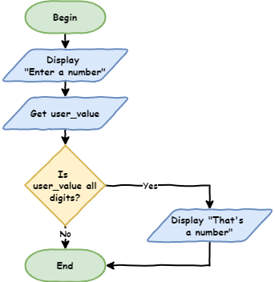
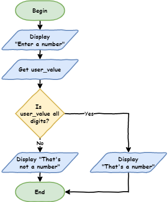
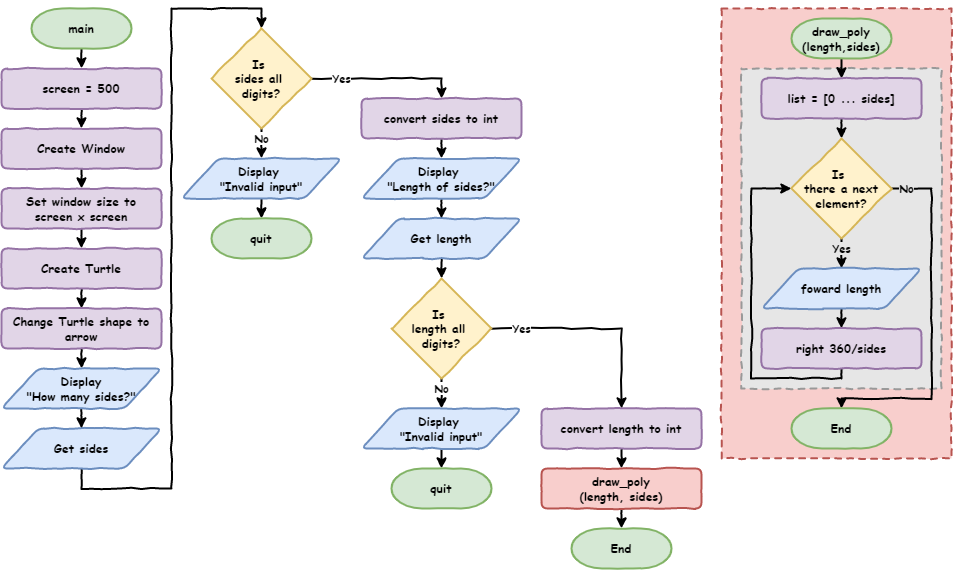

# Python Turtle - Lesson 5

```{topic} In this lesson you will learn:

- how to capturing errors
- what are branching control structures (`if` statements)
- how and when to use `if` ... `elif` ... `else` in Python
- the difference between definite and indefinite iteration
- how and when to use `where` loops in Python
- how to generate random numbers in Python
```

## Part 1: Branching

<iframe width="560" height="315" src="https://www.youtube.com/embed/fGEz4QNXpEE" title="YouTube video player" frameborder="0" allow="accelerometer; autoplay; clipboard-write; encrypted-media; gyroscope; picture-in-picture" allowfullscreen></iframe>

[Video link](https://youtu.be/fGEz4QNXpEE)

### Branching control structure

The branching control structure allows the program's flow it take alternative paths. Let's use a practical example to better understand this. 

We're going to use the **lesson_4_pt_2.py** file. You can either save it as **lesson_5_pt_1a.py** or download and use the **{download}`lesson_5_pt_1a.py<./python_files/lesson_5_pt_1a.py>`** file.

```{literalinclude} ./python_files/lesson_5_pt_1a.py
:linenos:
```

Run the program, and at the prompt, instead of providing a number, provide a word, for example `dog`.

This will raise the following error:

```{code-block}
:linenos:
Traceback (most recent call last):
  File "<string>", line 19, in <module>
ValueError: invalid literal for int() with base 10: 'dog'
```

This error occurs because in `line 19` we are trying to convert the literal (string) `dog` into an integer. Since `dog` is not a whole number, it causes an error.

What we need to do is check that user has entered a whole number before converting it into an integer.

---

Create a new file in, enter the code below then save it as **lesson_5_pt_1b.py**.

```{code-block} python
:linenos:
user_value = input("Enter a number: ")

print(user_value.isdigit())
```

PRIMM:

- **Predict** what you think will happen when you run the code twice:
  - first time enter the value `10`
  - second time enter the value `dog`
- **Run** the code. Did it follow your predictions?
- Let's **investigate** that code.

Remember that Python inputs are strings. Strings have special operations called **methods**. One of those is the `isdigit` method. `isdigit` returns the Boolean value of `True` if all the characters in a string are digits.

```{admonition} String Methods
:class: seealso
Python has many useful string methods. If you want to explore them [**W3Schools' Python String Methods**](https://www.w3schools.com/python/python_ref_string.asp) is a good place to start.
```

We can tell if the user's input is a number or not. Now we need to tell the computer how to respond to this information.

### The `if` statement

Adjusts your  **lesson_5_pt_1b.py** code so it is the same as the code below.

```{code-block} python
:linenos:
:emphasize-lines: 3-4
user_value = input("Enter a number: ")

if user_value.isdigit():
    print("That's a number")
```

PRIMM

- **Predict** what you think will happen when you run the code twice:
  - first time enter the value `10`
  - second time enter the value `dog`
- **Run** the code. Did it follow your prediction?
- Let's **investigate** that code.

#### Flowcharts

Flowcharts are great at demonstrating how selection works. We have already used the condition symbol (diamond) in our `for` loops. They are also used for the conditions in `if` statements.

Code flowchart:



Code breakdown:

- `Line 3`: `if user_value.isdigit():`
  - This defines the `if` statement.
  - The `if` tells Python that this is an `if` statement.
  - The next part is called a **conditional**.
    - Conditionals are operations that return a Boolean value (`True` or `False`).
    - This specific **conditional** is `user_value.isdigit()`
    - We already know the results from our previous work:
      - `10` &rarr; `True`
      - `dog` &rarr; `False`
  - Ends with `:`
    - This has the same use as `for` loops and functions. It indicates that an indented code block follows.
  - The indented code block, will only run if the condition returns `True`. In our example:
    - `10` &rarr; `user_value.isdigit()` returns `True` &rarr; run indented code block
    - `dog` &rarr; `user_value.isdigit()` returns `False` &rarr; don't run indented code block
- `Line 4`: `print("That's a number")`
  - This is the indented code block that will run if `user_value.isdigit()` is `True`

We can now respond to a digit being entered. But what if we want to provide a different response when `user_value.isdigit()` is `False`?

### The `if` ... `else` statement

Adjust your **lesson_5_pt_1b.py** code by adding `lines 5` and `6` in the code below.

```{code-block} python
:linenos:
:emphasize-lines: 5-6
user_value = input("Enter a number: ")

if user_value.isdigit():
    print("That's a number")
else:
    print("That's not a number")
```

PRIMM

- **Predict** what you think will happen when you run the code twice:
  - first time enter the value `10`
  - second time enter the value `dog`
- **Run** the code. Did it follow your prediction?
- Let's **investigate** that code.

Code flowchart:



Code breakdown:

- `Lines 3` and `4` operate the same as the previous code.
- `Line 5` - `else:`
  - The `else` statement uses the `if` statement's condition.
  - In this case, it says: if `user_value.isdigit()` is `False` then run the following indented code block.
  - The `:` tells Python that an indented code block follows.
- `Line 6` - `print("That's not a number")`
  - This is the indented code block that will run if `user_value.isdigit()` is `False`

To check out what is happening in detail stepping through the code with the **debugger**. Use the inputs of `10` and `dog`.

### Using `if` ... `else` to capture errors

Go back to **lesson_5_pt_1a.py** and adjust the code by replacing `line 19` with the following code:

```{code-block} python
:linenos:
# get user input
num_sides = input("How many sides?> ")
if num_sides.isdigit():
    num_sides = int(num_sides)
else:
    print("Invalid input")
    quit()
```

Your code should look like the code below:

```{code-block} python
:linenos:
:emphasize-lines: 19-25
import turtle


def draw_poly(length, sides):
    for i in range(sides):
        my_ttl.forward(length)
        my_ttl.right(360 / sides)


# setup window
screen = 500
window = turtle.Screen()
window.setup(screen, screen)

# create instance of turtle
my_ttl = turtle.Turtle()
my_ttl.shape("turtle")

# get user input
num_sides = input("How many sides?> ")
if num_sides.isdigit():
    num_sides = int(num_sides)
else:
    print("Invalid input")
    quit()

size = input("Length of sides?> ")

draw_poly(size, num_sides)
```

---

Then replace `line 27` with this code:

```{code-block} python
:linenos:
size = input("Length of sides?> ")
if size.isdigit():
    size = int(size)
else:
    print("Invalid input")
    quit()
```

Your code should look like the code below:

```{code-block} python
:linenos:
:emphasize-lines: 27-32
import turtle


def draw_poly(length, sides):
    for i in range(sides):
        my_ttl.forward(length)
        my_ttl.right(360 / sides)


# setup window
screen = 500
window = turtle.Screen()
window.setup(screen, screen)

# create instance of turtle
my_ttl = turtle.Turtle()
my_ttl.shape("turtle")

# get user input
num_sides = input("How many sides?> ")
if num_sides.isdigit():
    num_sides = int(num_sides)
else:
    print("Invalid input")
    quit()

size = input("Length of sides?> ")
if size.isdigit():
    size = int(size)
else:
    print("Invalid input")
    quit()

draw_poly(size, num_sides)
```

Let's test this code to see if it works.

PRIMM

- **Predict** what you think will happen when you run the code in the following scenarios:
  - valid `sides` value and valid `size` value
  - valid `sides` value and invalid `size` value
  - invalid `sides` value and valid `size` value
  - invalid `sides` value and invalid `size` value
- **Run** the code. Did it follow your prediction?
- Let's **investigate** that code.

```{admonition} More testing tips
:class: hint

- When testing branching code you need to test all possible paths.
- Test `if` statements for both `True` conditions and `False` conditions.
- This code had four possible branches so we needed to test all four of them
```

Code flowchart:



Code breakdown:

- `Line 19`: `# get user input` &rarr; a comment used to structure the code
- `Line 20`: `num_sides = input("How many sides?> ")` &rarr; accepts user input and assigns it to `num_sides`
- `Line 21`: `if num_sides.isdigit():` &rarr; tests if `num_sides` only contains numbers
  - if `num_sides.isdigit()` is `True` then run the code block from `line 20`
- `Line 22`: `num_sides = int(size)` takes the value assigned to `num_sides` converts it to an integer, then reassigns it to `num_sides`
- `Line 23`: `else:` &rarr; if `num_sides` is not all numbers execute following code block (`lines 22` to `23`)
- `Line 24`: `print("Invalid input")` &rarr; informs the user of their mistake
- `Line 25`: `quit()` &rarr; exits the program
- `Line 27`: `size = input("Length of sides?> ")` &rarr; accepts user input and assigns it to `size`
- `Line 28`: `if size.isdigit():` &rarr; tests if `size` only contains numbers
  - If `size.isdigit()` is `True` then run the code block from `line 27`
- `Line 29`: `size = int(size)` takes the value assigned to `size` converts it to an integer, then reassigns it to `size`
- `Line 30`: `else:` &rarr; if `size` is not all numbers execute following code block (`lines 29` to `30`)
- `Line 31`: `print("Invalid input")` &rarr; informs the user of their mistake
- `Line 32`: `quit()` &rarr; exits the program

### Refactor Code - DRY

Looking at our code, does it pass the DRY test?

The `# get user input` section from `line 17` to `30` definitely has repetition in it. Twice the code:

1. asks the user for input
2. checks if that input is all numbers
3. either converts or quits the program depending on the `if` statement.

During all this, the only parts of the code that differs are:

- `Line 20` and `27` the `input` prompt is different:
  - `Line 20` &rarr; `"How many sides?> "`
  - `Line 27` &rarr; `"Length of sides?> "`
- in their respective sections different variable names are used:
  - `Lines 20` to `25` &rarr; `num_sides`
  - `Lines 27` to `32` &rarr; `size`

This looks like a prefect opportunity to **refactor** the code using a function.

```{admonition} What is refactoring?

Refactoring is changing your code **without changing the way it works**. This is normally done to make code more efficient or more maintainable.

- Efficient code uses less computing resources (processing power, storage, internet bandwidth etc.).
- Maintainable code is easier for programmers to understand, fix, update and enhance.
```

To refactor our code we need to add the following function at `line 10` of your code:

```{code-block} python
def get_number(prompt):
    num = input(prompt)
    if num.isdigit():
        return int(num)
    else:
        print("Invalid input")
        quit()
```

Then remove the code under `# get user input` from `lines 19` to `32`, and replace it with two calls to the function:

```{code-block} python
# get user input
num_sides = get_number("How many sides?> ")
size = get_number("Length of sides?> ")
```

In the end your code should look like the code below:

```{code-block} python
:linenos:
:emphasize-lines: 10-16, 28-30
import turtle


def draw_poly(length, sides):
    for i in range(sides):
        my_ttl.forward(length)
        my_ttl.right(360 / sides)


def get_number(prompt):
    num = input(prompt)
    if num.isdigit():
        return int(num)
    else:
        print("Invalid input")
        quit()


# setup window
screen = 500
window = turtle.Screen()
window.setup(screen, screen)

# create instance of turtle
my_ttl = turtle.Turtle()
my_ttl.shape("turtle")

# get user input
num_sides = get_number("How many sides?> ")
size = get_number("Length of sides?> ")

draw_poly(size, num_sides)
```

When you refactor code, it is important to ensure the code still works the same. So **run** the code to ensure that it still works the same way. 

Remember to test all 4 possible branches:

- valid `sides` value and valid `size` value
- valid `sides` value and invalid `size` value
- invalid `sides` value and valid `size` value
- invalid `sides` value and invalid `size` value

If your code still works the same, let's **investigate** the code we added.

Code flowchart:


Code breakdown:

- The `get_number` function:
  - `def get_number(prompt):` &rarr; defines our new function with one argument `prompt`:
    - we observed that the prompt was one of the differences between our two blocks of similar code
    - using this argument means we can provide a different prompt each time we call the function
  - `num = input(prompt)` &rarr; uses the `prompt` argument and assigns the user input to `num`
  - `if num.isdigit():` &rarr; checks if `num` only contains numbers
  - `return int(num)` &rarr; converts the value assigned to `num` then sends it to the main program:
    - `return` is new
    - `return` sends a value back to the main program and then ends the function.
  - `else:` &rarr; if `num` does not contain only numbers, run the following code block
  - `print("Invalid input")` &rarr; informs the user their input is not correct
  - `quit()` &rarr; exits the program
- `num_sides = get_number("How many sides?> ")` &rarr; calls the `get_number` function
  - `get_number()` &rarr; calls the function
  - `"How many sides?> "` &rarr; provides the prompt string to the function
  - `num_sides =` takes the value returned by the function and assigns it to `num_sides`
- `size = get_number("Length of sides?> ")` &rarr; calls the `get_number` function
  - `get_number()` &rarr; calls the function
  - `"Length of sides?> "` &rarr; provides the prompt string to the function
  - `size =` takes the value returned by the function and assigns it to `size`

### Playing with colour

Let's keep adding features to our program. Turtle allows you to also change the colour of your shapes and lines using the method `color`:

`color` accepts two arguments:

- first argument &rarr; line colour
- second argument &rarr; fill colour

```{admonition} Spelling colour / color
:class: hint

Like most programming languages, Python uses US spelling. Using Australian spelling (eg. colour) will generate an error.

It up to the programmer to decide what spelling to follow in their naming of variables and functions. I choose to use the US spelling. The consistent spelling reduces the likelihood of errors.
```

Now let's change the colour of our shape.

Make the changes in code the code below to:

- `Line 5`
- `Line 6`
- `Line 35`

```{code-block} python
:linenos:
:emphasize-lines: 4-6, 10, 35
import turtle


def draw_poly(length, sides, color):
    my_ttl.color("black", color)
    my_ttl.begin_fill()
    for i in range(sides):
        my_ttl.forward(length)
        my_ttl.right(360 / sides)
    my_ttl.end_fill()


def get_number(prompt):
    num = input(prompt)
    if num.isdigit():
        return int(num)
    else:
        print("Invalid input")
        quit()


# setup window
screen = 500
window = turtle.Screen()
window.setup(screen, screen)

# create instance of turtle
my_ttl = turtle.Turtle()
my_ttl.shape("turtle")

# get user input
num_sides = get_number("How many sides?> ")
size = get_number("Length of sides?> ")

draw_poly(size, num_sides, "red")
```

PRIMM

- **Predict** what you think will happen when you run the code:
- **Run** the code. Did it follow your prediction?
- Let's **investigate** that code.

Code breakdown:

- `def draw_poly(length, sides, color):` &rarr; accepts a third argument `color`
- `my_ttl.color("black",color)` &rarr; sets the turtle colour
  - line colour &rarr; `"black"`
  - fill colour &rarr; the value in the `color` argument

```{admonition} Turtle colours
:class: seealso

Turtle allows the use of named colours. It also allows RBG and Hexadecimal colours, but named colours are enough for our needs.

**[Here is a list of all the named colours](https://cs111.wellesley.edu/labs/lab02/colors)**.
```

Now that we can change colour, can we let the user choose between `red`, `blue` and `green` for the fill colour?

We will need to capture the error when the user enters anything other than `"red"`, `"blue"` or `"green"`. That means using an `if` statement, but the `if` ... `else` statement only allows two branches. We need to have four.

To choose between three or more branches we need to learn about the last part of the `if` statement: `elif`.

### The `if` ... `elif` ... `else` statement

The `elif` statement is effectively a `else` + `if` statement. It allows branching between multiple blocks of code. The best way to explore this is by using it in our code.

Create a function so the user can choose between `red`, `blue` and `green` for the fill colour.

Adjust your code so it is the same as the code below. 

Changes are in:

- `Lines 22` to `32`
- `Line 47`
- `Line 49`

```{code-block} python
:linenos:
:emphasize-lines: 22-32, 47, 49
import turtle


def draw_poly(length, sides, color):
    my_ttl.color("black", color)
    my_ttl.begin_fill()
    for i in range(sides):
        my_ttl.forward(length)
        my_ttl.right(360 / sides)
    my_ttl.end_fill()


def get_number(prompt):
    num = input(prompt)
    if num.isdigit():
        return int(num)
    else:
        print("Invalid input")
        quit()


def get_color():
    color = input("Fill colour (red, blue, green)?> ").lower()
    if color == "red":
        return color
    elif color == "blue":
        return color
    elif color == "green":
        return color
    else:
        print("Invalid input")
        quit()


# setup window
screen = 500
window = turtle.Screen()
window.setup(screen, screen)

# create instance of turtle
my_ttl = turtle.Turtle()
my_ttl.shape("turtle")

# get user input
num_sides = get_number("How many sides?> ")
size = get_number("Length of sides?> ")
fill = get_color()

draw_poly(size, num_sides, fill)
```

PRIMM

- **Predict** what you think will happen when you run the code:
- **Run** the code. Did it follow your prediction?
- Let's **investigate** that code.

There are a few new concepts for us to breakdown:

- `Line 23`: `color = input("Fill colour (red, blue, green)?> ").lower()` &rarr; `lower()` is new
  - `lower()` is another string method
  - it converts all the letters in a string to their lowercase version
- `Line 24`: `if color == "red":` &rarr; tests if the user inputted `"red"`
- `Line 25`: `return color`
  - sends the value of `color` (in this case `"red"` back to the main program)
  - ends the function
- `Line 26`: `elif color == "blue":`
  - is only executed when the condition in `line 21` is `False`
  - checks if the value of `color` is `"blue"`
- `Line 27`: `return color`
  - sends the value of `color` (in this case `"blue"` back to the main program)
  - ends the function
- `Line 28`: `elif color == "green":`
  - is only executed if the conditions in `line 21` and `line 23` are both `False`
  - checks if the value of `color` is `"green"`
- `Line 29`: `return color`
  - sends the value of `color` (in this case `"green"` back to the main program)
  - ends the function
- `Line 30`: `else:`
  - is only executed if the conditions in `line 21`, `line 23` and `line 24` are all `False`
- `Line 31` and `line 32` are the same as the `get_number` function

Code flowchart:


The `if` ... `elif` ... `else` statement is very useful and flexible. You will use it in various configurations, so let look at it's rules.

```{admonition} if...elif...else structure
The structure of a full `if` ... `elif` ... `else` statement is:

- the `if` component
  - always at the beginning of an `if` ... `elif` ... `else` statement
  - the only compulsory component
  - there can only be one `if` per `if` ... `elif` ... `else` statement
- the `elif` component
  - must come after the `if` statement and before the `else` statement
  - is optional
  - there can be as many `elif` components as needed
  - it is only used when all the conditions before it are `False`
- the `else` component
  - must be at the end of an an `if` ... `elif` ... `else` statement
  - it is optional
  - there can only be one per `if` ... `elif` ... `else` statement
  - it is only used when all the conditions before it are `False`
```

## Part 1 Exercises

In this course, the exercises are the **make** component of the PRIMM model. So work through the following exercises and make your own code.

### Exercise 1

Download **{download}`lesson_5_ex_1.py<./python_files/lesson_5_ex_1.py>`** file and save it to your lesson folder. Below is its code.

```{literalinclude} ./python_files/lesson_5_ex_1.py
:linenos:
:emphasize-lines: 3-7
```

Follow the instructions in the comments and use your Python knowledge to create a password checker. Remember to apply the DRY principle

### Exercise 2

Download **{download}`lesson_5_ex_2.py<./python_files/lesson_5_ex_2.py>`** file and save it to your lesson folder. Below is its code.

```{literalinclude} ./python_files/lesson_5_ex_2.py
:linenos:
:emphasize-lines: 5-10
```

Follow the instructions in the comments and use your Python knowledge to create an enhanced password checker. Remember to apply the DRY principle

### Exercise 3

Download **{download}`lesson_5_ex_3.py<./python_files/lesson_5_ex_3.py>`** file and save it to your lesson folder. Below is its code.

```{literalinclude} ./python_files/lesson_5_ex_3.py
:linenos:
:emphasize-lines: 41
```

Follow the instructions in the comments (check `line 41`) and use your Python knowledge to enhance our shape drawing code. Remember to apply the DRY principle.

## Part 2: While Loop

<iframe width="560" height="315" src="https://www.youtube.com/embed/A9j7N6kLL1U" title="YouTube video player" frameborder="0" allow="accelerometer; autoplay; clipboard-write; encrypted-media; gyroscope; picture-in-picture" allowfullscreen></iframe>

[Video link](https://youtu.be/A9j7N6kLL1U)

In Python we have two forms of iteration. We have already looked at the for loop. In the section we will look at the other iteration control structure, the while loop.

The two types of loops map to two different types of iteration:

- **definite iteration**
  - Is used when you **do know** how many times the loop will need to run.
  - definite iteration uses `for` loops since they loop for a set number of times.
- **indefinite iteration**
  - Is used when you **don't know** how many times the loop will need to run.
  - indefinite iteration uses `while` loops since they will loop as long as the condition is `True`

Card dealing is a good analogy of the definite and indefinite loops distinction:

- Dealing for Uno:
  - How many cards does each player get?
  - The rules say seven.
  - So, we need to deal around the players seven times.
  - This is **definite** iteration as you know how many times you have to go around the group.
- Dealing for Snap:
  - How many cards does each player get?
  - Depends on how many players, you need to keep going until you have dealt the whole deck.
  - This **indefinite** iteration as you will need to go around the group While there are still cards left in the deck.

In summary:

- `for` loop is count controlled &rarr; we know how many times to run it.
- `while` loop is condition controlled &rarr; we don't know how many times to run it.

To understand `while` loops, let's look at a number guessing game.

### Number guessing game

Download the **{download}`lesson_5_pt_2.py<./python_files/lesson_5_pt_2.py>`** file and save it to your lesson folder. Below is its code.

```{literalinclude} ./python_files/lesson_5_pt_2.py
:linenos:

```

PRIMM

- **Predict** what you think will happen when you run the code:
- **Run** the code. Did it follow your prediction?
- Let's **investigate** that code.

```{admonition} What is the random module?

The **random** module gives us access to a range of functions that produce random results.

To see all the commands, you can go the [**W3Schools Python Random Module page**](https://www.w3schools.com/python/module_random.asp).
```

Code breakdown:

- `Line 1`: `import random`:
  - We will be using the random function called `randint`, so we need to `import random`.
- `Lines 4` to `10` are the same `get_number` function we have used previously.
- `Line 13`: `number = random.randint(1,100)`
  - `random.randint(1,100)`
    - use the `randint` function from the `random` module
    - generate a random integer between `1` and `100` (inclusive)
  - `number =` &rarr; assign the returned integer to the variable `number`
- `Line 15`: `guess = get_number("Guess a number between 1 and 100> ")`
  - `get_number("Guess a number between 1 and 100> ")` &rarr; calls the `get_number` function to ask the user for a number
  - `guess =` &rarr; assigns the returned integer to the variable `guess`
- `Line 17`: `if guess == number:`
  - checks if the user's guess and the random number are the same
  - the `==` symbol is a **comparison operator** (see below). It checks if two values are the same
  - if the two values are the same &rarr; run the code block on `line 16`
- `Line 19`: `else:` &rarr; if the user's guess and the random number are not the same &rarr; run the code block on `line 18`.

```{admonition} Comparison operators

A **comparison operator** compares two values and returns either `True` or `False`.

Python's condition testing uses many comparison operators:

| Operator | Meaning |
| :--: | --|
| `==` | checks if two values are the same (equal to) |
| `!=` | checks if two values are not the same (not equal to) |
| `>` | checks if the left value is greater than the right value |
| `<` | checks if the left value is less than the right value |
| `>=` | checks if the left value is greater than or equal to the right value |
| `<=` | checks if the left value is less than or equal to the right value |
```

---

So, we've made a simple game, but it is not a good one. A one-in-one-hundred chance of guessing a number is not going to keep the user entertained for too long. How about we adjust the code to allow the user to have ten guesses?

Now that sounds like iteration, but what kind? Since we know how many times this will need to loop (10), it's definite iteration. Definite iteration requires a `for` loop.

Change your code so it looks like the code below. Specifically:

- `line 15` &rarr; provide user instructions
- `lines 17` to `23` &rarr; place the guessing process within a `for` loop
- `line 23` &rarr; make sure you remove the number reveal
- `line 25` &rarr; reveal the number after all 10 guesses have finished

```{code-block} python
:linenos:
:emphasize-lines: 15, 17-23, 25
import random


def get_number(prompt):
    num = input(prompt)
    if num.isdigit():
        return int(num)
    else:
        print("Invalid input")
        quit()


number = random.randint(1, 100)

print("You have 10 turns to guess a number between 1 and 100")

for turn in range(10):
    guess = get_number("Guess a number between 1 and 100> ")

    if guess == number:
        print("Correct!")
    else:
        print("Incorrect. Try again")

print("The number was", number)
```

PRIMM

- **Predict** what you think will happen when you run the code:
- **Run** the code. Did it follow your prediction?
- We won't worry about **investigating** as there is nothing new in this code.

---

This is better, but still isn't great. There is a one-in-ten chance of getting the right number. Each guess is a stab in the dark with no knowledge gained from the previous guesses. How about we give the user hints and let them know that their guess is too high or too low?

Change the `if` ... `else` statement into the `if` ... `elif` ... `else` statement on `lines 20` to `25` in the code below:

```{code-block} python
:linenos:
:emphasize-lines: 20-25
import random


def get_number(prompt):
    num = input(prompt)
    if num.isdigit():
        return int(num)
    else:
        print("Invalid input")
        quit()


number = random.randint(1, 100)

print("You have 10 turns to guess a number between 1 and 100")

for turn in range(10):
    guess = get_number("Guess a number between 1 and 100> ")

    if guess > number:
        print("Guess is too high")
    elif guess < number:
        print("Guess is too low")
    else:
        print("Correct!")

print("The number was", number)
```

We've done a fair bit of coding without any serious testing. So this time lets keep running our code until we cover all four branches:

1. guess is too high
2. guess is too low
3. guess is correct
4. all 10 guess used up without guessing the number

This might be easier to do if we know the random number. Feel free to add a line that prints the random number, but make sure you comment it out after testing.

PRIMM

- **Predict** what you think will happen when you run the code:
- **Run** the code. Did it follow your predictions?
- We won't worry about **investigating** as there is nothing new in this code.

Did you identify a problem when the user guesses the number before using all ten guesses? The game prints `Correct!` but then continues to ask them to guess numbers. This is because we created a definite iteration using `for` which is set to always give ten guesses.

What we want is an indefinite iteration that loops until the user guesses the number. To do this we will use a `while` loop.

### Using a `while` loop

Change your code so it is the same as the code below. Specifically:

- `line 15` &rarr; add `guess = 0`
- `line 17` &rarr; change the `for` statement to `while guess != number:`

```{code-block} python
:linenos:
:emphasize-lines: 15, 17
import random


def get_number(prompt):
    num = input(prompt)
    if num.isdigit():
        return int(num)
    else:
        print("Invalid input")
        quit()


number = random.randint(1, 100)

guess = 0

while guess != number:
    guess = get_number("Guess a number between 1 and 100> ")

    if guess > number:
        print("Guess is too high")
    elif guess < number:
        print("Guess is too low")
    else:
        print("Correct!")

print("The number was", number)
```

Again you want to run this code enough time that you have covered all four possible branches:

1. guess is too high
2. guess is too low
3. guess is correct
4. all 10 guess used up without guessing the number

PRIMM

- **Predict** what you think will happen when you run the code:
- **Run** the code. Did it follow your predictions?
- Let's **investigating** the new code to see how a `while` loop works.

Code breakdown:

- `Line 17`: `while guess != number:`
  - `guess != number` &rarr; this is the loop condition
  - It tests if `guess` and `number` are the same:
    - It will return `True` when `guess` and `number` are **not** the same.
    - It will return `False` when `guess` and `number` are the same.
  - `while` tells Python to loop the following code block if the loop condition returns `True`
- `Line 15`: `guess = 0`
  - In our `while` statement we use the variable `guess` before getting an input from the user &rarr; this will raise an error.
  - We need to assign value to `guess` before the `while` statement
    - The problem is the value we assign to `guess` cannot be the same as the value assigned to `number`. If it is, the `while` loop will not run at all, and the user will not provide input.
    - To solve this, we assign `0` because it is outside the range of `random.randint` (1-100).
    - This way, `guess != number` will always return `True` the first time the condition is tested.

Code flowchart:


### Using `while` to enhance our error capture

We now have a somewhat fun game where the user has a good chance of guessing the number. We can also use `while` to improve our error capture in the `get_number` function.

At the moment, if the user provides an input which isn't an integer, the game ends. This is a bit harsh, especially if they have already made three or four guesses.

Adjust your `get_number` function so that it is the same as in the code below.

```{code-block} python
:linenos:
:emphasize-lines: 5-10
import random


def get_number(prompt):
    while True:
        num = input(prompt)
        if num.isdigit():
            return int(num)
        else:
            print("Invalid input")


number = random.randint(1, 100)

guess = 0

while guess != number:
    guess = get_number("Guess a number between 1 and 100> ")

    if guess > number:
        print("Guess is too high")
    elif guess < number:
        print("Guess is too low")
    else:
        print("Correct!")

print("The number was", number)
```

Again you want to run this code enough time that you have covered all four possible branches:

1. guess is too high
2. guess is too low
3. guess is correct
4. all 10 guess used up without guessing the number

PRIMM

- **Predict** what you think will happen when you run the code:
- **Run** the code. Did it follow your predictions?
- Let's **investigating** the new code to see how this use of a `while` loop works

Code breakdown:

- `Line 5`: `while True:`
  - This is called an **infinite loop**, since the condition will always be `True`, the loop will always run.
  - Infinite loops are frequently cause by errors, although not in this case.
  - Infinite loops can be 'broken out' of by using the `break` statement.
  - If the Infinite loop is in a function, it can also be 'broken out' of by using the `return` statement.
- `Lines 6` to `10` are the same as before, except they form a code block inside of the `while` loop.
- It is worth noting the importance of `line 8`.
  - Since the `while` loop is infinite, the program will keep asking for input until it executes `line 8`.
  - In `line 8` the value assigned to `num` is converted into an integer and then returned to the main program
  - In this situation the `return` statement ends the function. In ending the function, it also exits the `while` loop.

Code flowchart:


The end effect of these changes is the program that will ask the user for a number until the user enters an integer. 

## Part 2 Exercise

In this course, the exercises are the **make** component of the PRIMM model. So work through the following exercises and make your own code.

### Exercise 4

Download **{download}`lesson_5_ex_4.py<./python_files/lesson_5_ex_4.py>`** file and save it to your lesson folder. Below is its code.

```{literalinclude} ./python_files/lesson_5_ex_4.py
:linenos:
:emphasize-lines: 13-16, 28-31
```

Follow the instructions in comments and make changes to the `get_number` and `get_colour` functions so they capture user input errors.
