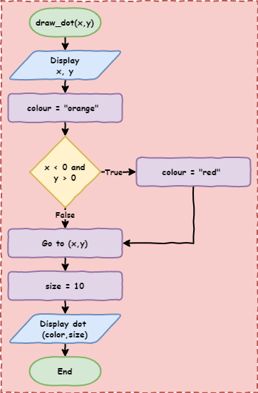

# Python Turtle - Lesson 6

```{topic} In this lesson you will learn:
* what Boolean logic is and how Python uses it to make decisions
* how to compare values in Python (like checking if two things are the same or different)
* how to use Boolean operators like **and**, **or**, and **not** to join ideas together
* how to combine comparisons and operators to build more complex **if statements** that control what your program does
```

## Part 1: Boolean logic

<iframe width="560" height="315" src="https://www.youtube.com/embed/5GrokwhCXXM" title="YouTube video player" frameborder="0" allow="accelerometer; autoplay; clipboard-write; encrypted-media; gyroscope; picture-in-picture" allowfullscreen></iframe>

[Video link](https://youtu.be/5GrokwhCXXM)

### Boolean Introduction

In programming, **Boolean** means working with two possible values: `True` and `False`.

* A Boolean variable can only store `True` or `False`
* Comparison operators (`==`, `!=`, `>`, `<`, `>=`, `<=`) check something and give back either `True` or `False`
* Boolean operators (you will learn these soon) also give back either `True` or `False`

The values `True` and `False` are special in Python.
If you type them into your code editor, they will look different (highlighted) to show they are important.

In Python, checking if something is `True` or `False` is called testing its **truthiness**.
When you compare two values, you are checking whether the statement is true or not.

---

### Comparison operators

The conditions in `if` and `while` statements check if something is **True** or **False**.
They do this using **comparison operators**.

Let’s quickly review these.

There are six comparison operators you can use.
Create a new file called `lesson_6_pt_1.py` and type in the code below.

```{code-block} python
:linenos:
print("jeff" == "jeff")  # equal to
print(1 != 1)  # not equal to
print(500 > 300)  # greater than
print(100 >= 250)  # greater than or equal to
print("a" < "q")  # less than
print(-30 <= 3)  # less than or equal to
```

```{note} Predict and Run
* **Predict** what the six results will be (hint: each one will be either `True` or `False`)
* **Run** your code and check if your predictions were correct
```

```{note} Modify
Try changing the values in each comparison to make the result switch.

* If a line gives `True`, change the values so it gives `False`
* If a line gives `False`, change the values so it gives `True`
```

It does not matter if the values are written directly (like numbers in the code) or stored in a variable — the result will still work the same way.

Change your code so it matches the code below.

```{code-block} python
:linenos:
score = 10
print(score > 5)
```

```{note} Predict and Run
* **Predict** whether the code will print `True` or `False`
* **Run** the code and check if you were correct
```

---

### Boolean Operations

You can also do operations using Boolean values by using **Boolean operators**.

These work a bit like maths, but instead of numbers, they use `True` and `False`.
The result will always be either `True` or `False`.

They are useful when you want to check more than one condition at the same time.

There are three Boolean operators:

* `and`
* `or`
* `not`

#### The `not` operator

The easiest operator to understand is `not`.
It simply flips the value:

* `not True` becomes `False`
* `not False` becomes `True`

Change your code so it matches the code below.

```{code-block} python
:linenos:
print("not True is:", not True)
print("not False:", not False)
```

```{note} Predict and Run
* **Predict** what you think will be printed in the **Shell** when you run the code
* **Run** the code and check if your prediction was correct
```

#### The `and` operator

The `and` and `or` operators are a bit more tricky.

The `and` operator will only return `True` if **every** value is `True`.

Change your code so it matches the code below.

```{code-block} python
:linenos:
print("True and True is:", True and True)
print("True and False is:", True and False)
print("False and True is:", False and True)
print("False and False is:", False and False)
print("True and True and True is:", True and True and True)
print("True and True and False is:", True and True and False)
```

```{note} Predict and Run
* **Predict** what you think will be printed in the **Shell** when you run the code
* **Run** the code and check if your prediction was correct
```

```{note} Investigate - Code breakdown
* `Line 1`: `print("True and True is:", True and True)`

  * Both values are `True`
  * `and` checks if **everything is True** → this is `True`
  * It prints: `True and True is: True`

* `Line 2`: `print("True and False is:", True and False)`

  * One value is `False`
  * `and` needs everything to be `True`, so this is `False`
  * It prints: `True and False is: False`

* `Line 3`: `print("False and True is:", False and True)`

  * One value is `False`
  * Not everything is `True`, so this is `False`
  * It prints: `False and True is: False`

* `Line 4`: `print("False and False is:", False and False)`

  * Both values are `False`
  * Not everything is `True`, so this is `False`
  * It prints: `False and False is: False`

* `Line 5`: `print("True and True and True is:", True and True and True)`

  * All values are `True`
  * So the result is `True`
  * It prints: `True and True and True is: True`

* `Line 6`: `print("True and True and False is:", True and True and False)`

  * One value is `False`
  * Not everything is `True`, so this is `False`
  * It prints: `True and True and False is: False`
```

#### The `or` operator

The `or` operator works in the opposite way to `and`.

The `or` operator will return `True` if **at least one** value is `True`.

Change your code so it matches the code below.

```{code-block} python
:linenos:
print("True or True is:", True or True)
print("True or False is:", True or False)
print("False or True is:", False or True)
print("False or False is:", False or False)
print("True or True or True is:", True or True or True)
print("True or False or False is:", True or False or False)
```

```{note} Predict and Run
* **Predict** what you think will be printed in the **Shell** when you run the code
* **Run** the code and check if your prediction was correct
```

```{note} Investigate - Code breakdown
* `Line 1`: `print("True or True is:", True or True)`

  * At least one value is `True` (both are!)
  * `or` returns `True`
  * It prints: `True or True is: True`

* `Line 2`: `print("True or False is:", True or False)`

  * One value is `True`
  * `or` returns `True`
  * It prints: `True or False is: True`

* `Line 3`: `print("False or True is:", False or True)`

  * One value is `True`
  * `or` returns `True`
  * It prints: `False or True is: True`

* `Line 4`: `print("False or False is:", False or False)`

  * No values are `True`
  * `or` returns `False`
  * It prints: `False or False is: False`

* `Line 5`: `print("True or True or True is:", True or True or True)`

  * All values are `True`
  * `or` returns `True`
  * It prints: `True or True or True is: True`

* `Line 6`: `print("True or True or False is:", True or True or False)`

  * At least one value is `True`
  * `or` returns `True`
  * It prints: `True or True or False is: True`
```

#### Using Boolean operators

So far, we have only used `True` and `False` with other `True` and `False` values.
That is not very useful on its own.

But remember, **comparison operators** give us `True` or `False`.

We can use **Boolean operators** to join multiple comparisons together.
This lets us build more complex conditions for our `if` and `while` statements.

Consider the following code:

```{code-block} python
:linenos:
print(7 < 8 and "a" < "o")
```

```{note} Predict and Run
* **Predict** what you think will be printed in the **Shell** when you run the code
* **Run** the code and check if your prediction was correct
```

```{note} Investigate - Code breakdown
* `Line 1`: `print(7 < 8 and "a" < "o")`
  * first Python will complete the comparison operations from left to right
    * `7 < 8` returns `True`
    * `"a" < "o"` returns `True`
  * the code is now: `print(True and True)`
    * `True and True` returns `True`
  * Python prints `True` to the **Shell**
```

```{hint} Combining multiple comparison operations
When you use more than one comparison, you must have a comparison on **both sides** of the Boolean operator.

* `10 > 5 and 10 > 13`

  * Both sides are full comparisons
  * This is correct

* `10 > 5 and 13`

  * The second part (`13`) is **not** a comparison
  * This is not the same and will not work the way you expect
```

---

## Part 2: Mouse input in Turtle

To help you understand Boolean logic better, we are going to try something new with Turtle.

So far, you have only typed input into the **Shell**.
But Turtle can also take input from the mouse (and even the keyboard).

We will use the code below for this activity, but first we need to explore how it works.

Download **{download}`lesson_6_pt_2.py<./python_files/lesson_6_pt_2.py>`** file and save it in your lesson folder.

```{literalinclude} ./python_files/lesson_6_pt_2.py
:linenos:
```

```{note} Predict and Run
* **Predict** what you think will happen when you run the code (hint: you will need to click in the Turtle window)
* **Run** the code and check if your prediction was correct
```

```{note} Investigate - Code breakdown
We will look at this code in three parts, in the order Python uses them.

1. `Lines 29` to `31`: the main part of the program

  * `Line 29`: `my_ttl = turtle.Turtle()` → creates a Turtle object and names it `my_ttl`
  * `Line 30`: `set_scene()` → runs the `set_scene()` function
  * `Line 31`: `my_ttl.hideturtle()` → hides the turtle so you cannot see it

2. `Lines 4` to `16`: the `set_scene()` function

  * `Line 4`: `def set_scene():`

    * creates a function called `set_scene`
    * this function does not need any arguments
  * `Line 5`: `turtle.setup(800, 600)` → makes a window that is `800` pixels wide and `600` pixels tall
  * `Line 8`: `turtle.onscreenclick(draw_dot)` → this part is new

    * when the mouse is clicked in the Turtle window:

      * Python runs the `draw_dot` function
      * Python also sends the `x` and `y` position of the mouse click to that function
  * `Line 11`: `my_ttl.speed(0)` → a speed of `0` means the turtle moves instantly, so you do not see it moving
  * `Lines 12` to `15`: draw four lines out from `(0, 0)` to make four sections on the screen
  * `Line 16`: `penup()`

    * this stops the turtle drawing a line when it moves to the mouse click position
    * try commenting it out to see what changes

3. `Lines 20` to `25`: the `draw_dot()` function

  * `Line 20`: `def draw_dot(x, y):`

    * creates a function called `draw_dot`
    * it uses two arguments: `x` and `y`
    * these are sent from `line 8` when the mouse is clicked
    * `turtle.onscreenclick()` always sends the click position as `x` and `y`
  * `Line 21`: prints the `x` and `y` position into the **Shell** so you can see where you clicked
  * `Line 22`: stores `"orange"` in the variable `color`
  * `Line 23`: stores `10` in the variable `size`
  * `Line 24`: moves the turtle to the `x` and `y` position
  * `Line 25`: `my_ttl.dot(size, color)` → draws a dot where the turtle is, using the size in `size` and the colour in `color`
```

## Exercises

In this course, the exercises are the **make** part of the PRIMM model. Work through the following tasks and write your own code.

Right now, every dot is orange. In these exercises, the part of the screen you click in will decide the dot’s colour.

To do this, you will need to use:

* `if`, `elif`, and `else` statements
* Boolean comparisons
* Boolean operators

You will also need to remember how Turtle coordinates work.


````{question} Exercise 1
Download **{download}`lesson_6_ex_1.py<./python_files/lesson_6_ex_1.py>`** file and save it in your lesson folder. 

Follow the instructions in the comments from `line 24` to `line 42`.

To help, here is the flowchart for the `draw_dot` function:



The starting code is shown below:

```{literalinclude} ./python_files/lesson_6_ex_1.py
:linenos:
:emphasize-lines: 24-42
```
````

---

````{question} Exercise 2
Download **{download}`lesson_6_ex_2.py<./python_files/lesson_6_ex_2.py>`** file and save it in your lesson folder. 

Follow the instructions in the comments from `line 24` to `line 35`.

The starting code is shown below:

```{literalinclude} ./python_files/lesson_6_ex_2.py
:linenos:
:emphasize-lines: 24-35
```
````

---

````{question} Exercise 3

Download **{download}`lesson_6_ex_3.py<./python_files/lesson_6_ex_3.py>`** file and save it in your lesson folder. 

Follow the instructions in the comments from `line 24` to `line 36`.

The starting code is shown below:

```{literalinclude} ./python_files/lesson_6_ex_3.py
:linenos:
:emphasize-lines: 24-36
```
````
