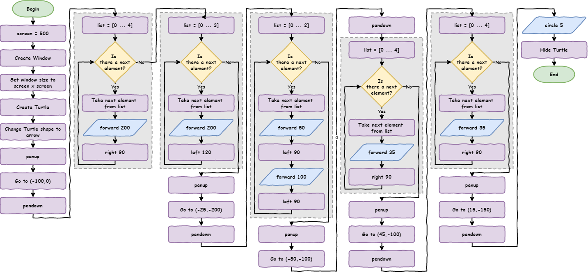

# Python Turtle 

Lesson 4

---

Topics

- about coding modularisation
- when and how to use functions in Python
- how to accept user's input into your code
- about data types
- how to convert between data types

---

## Part 1

*Functions*

---

### What are functions?

**Functions** &rarr; code block that can be run numerous times

So far &rarr; code are only run once

Functions:

- named code block outside of the main program
- main program uses function by **calling** the name

Explore functions using **a** solution for **lesson_3_ex_4.py**

---



---

``` python
import turtle

# set up screen
screen = 500
window = turtle.Screen()
window.setup(screen, screen)

# create turtle instance
my_ttl = turtle.Turtle()
my_ttl.shape("arrow")

##################################
## Using the tutrle command you ##
## have learnt, draw a house.   ##
##################################

# move pen
my_ttl.penup()
my_ttl.goto(-100, 0)
my_ttl.pendown()

# draw square
for index in range(4):
    my_ttl.forward(200)
    my_ttl.right(90)
```

---

``` python
# draw triangle
for index in range(3):
    my_ttl.forward(200)
    my_ttl.left(120)

# move pen
my_ttl.penup()
my_ttl.goto(-25, -200)
my_ttl.pendown()

# draw rectangle
for index in range(2):
    my_ttl.forward(50)
    my_ttl.left(90)
    my_ttl.forward(100)
    my_ttl.left(90)

# move pen
my_ttl.penup()
my_ttl.goto(-80, -100)
my_ttl.pendown()
```

---

``` python
# draw square
for index in range(4):
    my_ttl.forward(35)
    my_ttl.right(90)

# move pen
my_ttl.penup()
my_ttl.goto(45, -100)
my_ttl.pendown()

# draw square
for index in range(4):
    my_ttl.forward(35)
    my_ttl.right(90)

# move pen
my_ttl.penup()
my_ttl.goto(15, -150)
my_ttl.pendown()

# draw circle
my_ttl.circle(5)
my_ttl.hideturtle()
```

**Predict** type of house then **run** the code.

---

Is the code **DRY**?

Look at comments

Two types of repetition:

- moving the pen
- drawing the shape

Writing code &rarr; copied and pasted code &rarr; changed magic numbers

Copying and pasting &rarr; should use a function

---

### Creating functions

Let's look at how this works.

1. Move the **move pen code** to one spot
2. Turned code function
3. Replace original code with **call** to function

---

``` python
import turtle


def move_pen():
    my_ttl.penup()
    my_ttl.goto(-100, 0)
    my_ttl.pendown()

...

##################################
## Using the tutrle command you ##
## have learnt, draw a house.   ##
##################################

move_pen()
```

**Predict** and **run** the code

---

### Investigate the code

- `def move_pen():` &rarr; **defines** the function
  - `def` &rarr; key word
  - `move_pen` &rarr; the name
  - `()` &rarr; deal with soon
  - `:` &rarr; indented code block follows
- function code block indented
- `move_pen()` &rarr; calls function

---

### Passing arguments

Only works for first pen movement &rarr; each pen move needs a function 

**Arguments** &rarr; way to send values to a function when called

Need to get rid of magic numbers in function

``` python
def move_pen():
    my_ttl.penup()
    my_ttl.goto(-100, 0)
    my_ttl.pendown()
```

---

Magic numbers &rarr; `x` and `y` the coordinates

``` python
def move_pen():
    my_ttl.penup()
    my_ttl.goto(x, y)
    my_ttl.pendown()
```

How to assign values to `x` and `y` &rarr; **arguments**

---

1. Change function definition &rarr; `def move_pen(x, y):`
2. Change function call &rarr; `move_pen(-100,0)`

``` python
import turtle


def move_pen(x, y):
    my_ttl.penup()
    my_ttl.goto(x, y)
    my_ttl.pendown()

...

##################################
## Using the tutrle command you ##
## have learnt, draw a house.   ##
##################################

move_pen(-100, 0)
```

---

### Investigate the code

- `def move_pen(x, y):`
  - `move_pen` function call &rarr; two values
  - first value &rarr; `x`
  - second value &rarr; `y`
- `move_pen(-100,0)`:
  - call `move_pen` function
  - `-100` &rarr; first value (`x`)
  - `0` &rarr; second value (`y`)

- **Predict** and **run** the code
- **Investigate** using the debugger

---

### Arguments vs Parameters

**Arguments** and **Parameters** are often swapped around

Safe to use either term

Do have distinct meanings:

- arguments &rarr; the values passed to function
- parameters &rarr; the variables named in function definition

---

Replace the remaining `# move pen` blocks with a `move_pen()` call

``` python
import turtle


def move_pen(x, y):
    my_ttl.penup()
    my_ttl.goto(x, y)
    my_ttl.pendown()


# set up screen
screen = 500
window = turtle.Screen()
window.setup(screen, screen)

# create turtle instance
my_ttl = turtle.Turtle()
my_ttl.shape("arrow")

##################################
## Using the tutrle command you ##
## have learnt, draw a house.   ##
##################################
```

---

``` python
move_pen(-100, 0)

# draw square
for index in range(4):
    my_ttl.forward(200)
    my_ttl.right(90)

# draw triangle
for index in range(3):
    my_ttl.forward(200)
    my_ttl.left(120)

move_pen(-25, -200)

# draw rectangle
for index in range(2):
    my_ttl.forward(50)
    my_ttl.left(90)
    my_ttl.forward(100)
    my_ttl.left(90)
```

---

``` python
move_pen(-80, -100)

# draw square
for index in range(4):
    my_ttl.forward(35)
    my_ttl.right(90)

move_pen(45, -100)

# draw square
for index in range(4):
    my_ttl.forward(35)
    my_ttl.right(90)

move_pen(15, -150)

# draw circle
my_ttl.circle(5)
my_ttl.hideturtle()
```

**Run** the code &rarr; testing

Line count: 71 &rarr; 63

---

### Testing tips

- Good to test frequently
- Change code &rarr; test it
  - Too many changes between testing &rarr; harder to debug
- Function passes test
  - don't need have to testing again (unless changed)
  - error elsewhere in code

---

### Functions in Flowcharts

Flowcharts don't represent whole programs &rarr; represent algorithms

Algorithms &rarr; set of rules to follow to solve a problem

Each function is an algorithm

Representing functions in flowcharts:

- create flowchart for each function
- show where main calls functions
- show function name terminator symbol
  - **main** &rarr; name of main program

---


---

### Shape functions

Also identified repetition in drawing shapes. 

Make function to draw squares:

1. copy first `# draw square` blocks to top of code
2. change into function called `draw_square`
3. add `length` parameter in `def` statement
4. replace the `# draw square` blocks with `draw_square` call including argument

---

### Where should I place functions?

Place function definitions:

- the top of the code
- right after `import` statements

Reasons:

- function not defined before call &rarr; generates `NameError`
- easier to find &rarr; improves maintainability

---

``` python
import turtle


def move_pen(x, y):
    my_ttl.penup()
    my_ttl.goto(x, y)
    my_ttl.pendown()


def draw_square(length):
    for index in range(4):
        my_ttl.forward(length)
        my_ttl.right(90)


# set up screen
screen = 500
window = turtle.Screen()
window.setup(screen, screen)

# create turtle instance
my_ttl = turtle.Turtle()
my_ttl.shape("arrow")

##################################
## Using the tutrle command you ##
## have learnt, draw a house.   ##
##################################
```

---

``` python
move_pen(-100, 0)
draw_square(200)

# draw triangle
for index in range(3):
    my_ttl.forward(200)
    my_ttl.left(120)

move_pen(-25, -200)

# draw rectangle
for index in range(2):
    my_ttl.forward(50)
    my_ttl.left(90)
    my_ttl.forward(100)
    my_ttl.left(90)

move_pen(-80, -100)
draw_square(35)
move_pen(45, -100)
draw_square(35)
move_pen(15, -150)

# draw circle
my_ttl.circle(5)
my_ttl.hideturtle()
```

Line count: 63 &rarr; 55

---

There is no more repetition in the main code, but there is still three code blocks remaining. Notice how the rest of the code is easier to read? Therefore, we will transform the `# draw triangle`, `# draw rectangle` and `# draw circle` code blocks into functions.

This will provide two benefits:

- It will improve maintainability by making the code more readable.
- If we want to extend the drawing we can easily add more rectangles, triangle and circles.

See if you can change all three blocks into functions. Remember to test each function when you create it.

---

``` python
import turtle


def move_pen(x, y):
    my_ttl.penup()
    my_ttl.goto(x, y)
    my_ttl.pendown()


def draw_square(length):
    for index in range(4):
        my_ttl.forward(length)
        my_ttl.right(90)


def draw_triangle(length):
    for index in range(3):
        my_ttl.forward(length)
        my_ttl.left(120)


def draw_rectangle(long, short):
    for index in range(2):
        my_ttl.forward(short)
        my_ttl.left(90)
        my_ttl.forward(long)
        my_ttl.left(90)


def draw_circle(rad):
    my_ttl.circle(rad)
```

---

``` python
# set up screen
screen = 500
window = turtle.Screen()
window.setup(screen, screen)

# create turtle instance
my_ttl = turtle.Turtle()
my_ttl.shape("arrow")

##################################
## Using the tutrle command you ##
## have learnt, draw a house.   ##
##################################

move_pen(-100, 0)
draw_square(200)
draw_triangle(200)
move_pen(-25, -200)
draw_rectangle(100, 50)
move_pen(-80, -100)
draw_square(35)
move_pen(45, -100)
draw_square(35)
move_pen(15, -150)
draw_circle(5)
my_ttl.hideturtle()
```

- Line count: 71 &rarr; 59
- Easier to read, test and debug

---


---

## Exercises

Exercises are the **make** component of the PRIMM model

Complete exercises 1 and 2

---

## Part 2

*User Input*

---

**New file** &rarr; **Save as** `lesson_4_pt_2.py`

``` python
import turtle


def draw_poly(length, sides):
    for index in range(sides):
        my_ttl.forward(length)
        my_ttl.right(360 / sides)


# setup window
screen = 500
window = turtle.Screen()
window.setup(screen, screen)

# create instance of turtle
my_ttl = turtle.Turtle()
my_ttl.shape("turtle")

sides = 9
length = 100

draw_poly(length, sides)

```

---

PRIMM

- **Predict** &rarr; what will happen
- **Run** &rarr; how close is your prediction
- **Modify** &rarr; shape fits within the window

Part of shape &rarr; off the screen

- change length `100` &rarr; `80`
- how could non programmer do this

**How do we make our programs interactive?**

---

### Making your program interactive

Use `input` command &rarr; **Shell** asks for user input

To do this change:

- `sides = 9` &rarr; `sides = input("How many sides?> ")`
- `length = 100` &rarr; `length = input("How long are the sides?> ")`

---

``` python
import turtle


def draw_poly(length, sides):
    for index in range(sides):
        my_ttl.forward(length)
        my_ttl.right(360 / sides)


# setup window
screen = 500
window = turtle.Screen()
window.setup(screen, screen)

# create instance of turtle
my_ttl = turtle.Turtle()
my_ttl.shape("turtle")

sides = input("How many sides?> ")
length = input("How long are the sides?> ")

draw_poly(length, sides)
```

- **Predict** and **run** code

---

Did you predict:


```
Traceback (most recent call last):
  File "<string>", line 22, in <module>
  File "<string>", line 5, in draw_poly
TypeError: 'str' object cannot be interpreted as an integer
```

---

Unpacking the changed code 

- `sides = input("How many sides?> ")`
  - `input` &rarr; wait and get input user via the **Shell**
  - `("How many sides?> ")` &rarr; what to write before waiting for input
  - `sides =` user input &rarr; assign to `sides`

Explaining the error

- `TypeError` &rarr; need to understand **data types**

---

### Data types

Variables can hold different types of data

The four data types we will use:

- integer numbers (`int`)
- floating point numbers (`float`)
- strings (`str`)
- Booleans (`bool`)

Data types used for:

- what operations can be done the variable
- which special operations (**methods**) can be used

---

```
Traceback (most recent call last):
  File "<string>", line 22, in <module>
  File "<string>", line 5, in draw_poly
TypeError: 'str' object cannot be interpreted as an integer
```

- `TypeError: 'str' object cannot be interpreted as an integer`:
  - trying to use string when integer is expecting
- `Traceback`:
  - error occurred `line 5` &rarr;  `for index in range(sides):`
    - using `sides` in a `range` function &rarr; but `sides` is a string
  - `Line 19` &rarr; `sides = input("How many sides?> ")`
    - assigned used input (`3`) to `sides`
    - `3` is integer but Python think it's a string

`input` function always accepted the input as a string

---

### Converting data types

Variable called `var`:

- convert `var` &rarr; string, use `str(var)`
- convert `var` &rarr; integer, use `int(var)`
- convert `var` &rarr; a float, use `float(var)`

---

``` python
import turtle


def draw_poly(length, sides):
    for index in range(sides):
        my_ttl.forward(length)
        my_ttl.right(360 / sides)


# setup window
screen = 500
window = turtle.Screen()
window.setup(screen, screen)

# create instance of turtle
my_ttl = turtle.Turtle()
my_ttl.shape("turtle")

sides = int(input("How many sides?> "))
length = int(input("Length of sides?> "))

draw_poly(length, sides)
```

---


---


PRIMM

- **Predict** and **run** the code
- **Investigate**
  - draw different shapes
  - draw a circle
  - enter a float or a string?
- **Modify** &rarr; use different prompts

---

## Exercises

Exercises are the **make** component of the PRIMM model

Complete exercise 3
