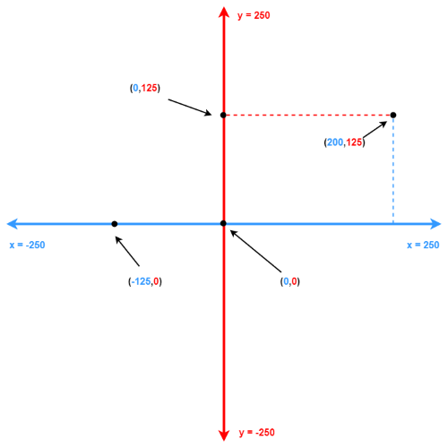
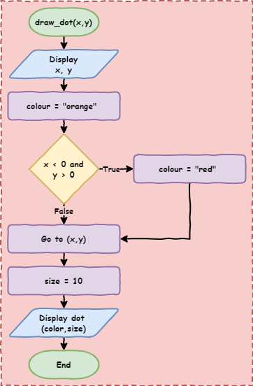

---

marp: true

---

# Python Turtle

Lesson 6

---

Topics

- Boolean logic and how it is used in Python
- Boolean comparisons and how to use then
- Boolean operators and how to use them
- complex conditional statements

---

## Part 1: 

*Boolean logic*

---

### Boolean Introduction

Boolean all about `True` and `False` values:

- Boolean variables &rarr; either `True` or `False`
- Comparison operators &rarr; return `True` or `False`
- Boolean operators &rarr; return either `True` or `False`

`True` and `False` special values

Testing **turthiness** &rarr; testing if something is `True` or `False`

---

### Comparison operators

Conditions test truthiness using comparison operators

| Operator | Meaning |
| :--: | --|
| `==` | checks if two values are the same (equal to) |
| `!=` | checks if two values are not the same (not equal to) |
| `>` | checks if the left value is greater than the right value |
| `<` | checks if the left value is less than the right value |
| `>=` | checks if the left value is greater than or equal to the right value |
| `<=` | checks if the left value is less than or equal to the right value |

---

New file &rarr; Save as `lesson_6_pt_1.py`

``` python
print("jeff" == "jeff")  # equal to
print(1 != 1)  # not equal to
print(500 > 300)  # greater than
print(100 >= 250)  # greater than or equal to
print("a" < "q")  # less than
print(-30 <= 3)  # less than or equal to
```

PRIMM:

- **Predict** the six values then **run** the code

---

Literals (magic numbers) or variables does not matter

``` python
score = 10
print(score > 5)
```

- **Predict** if &rarr; `True` or `False`
- **Run** the code and check

---

### Boolean Operations

Boolean operators &rarr; complete operations on Boolean values

Return a single `True` or `False` value

Useful for creating complex condition tests

There are three Boolean operators:

- `and`
- `or`
- `not`

---

### `not` operator

`not` operator reverses the Boolean value

- `not True` &rarr; `False`
- `not False` &rarr; `True`


``` python
print("not True is:", not True)
print("not False:", not False)
```

- **Predict** and **run** the code

---

### `and` operator

`and` operators &rarr; `True` if **all** values are `True`

``` python
print("True and True is:", True and True)
print("True and False is:", True and False)
print("False and True is:", False and True)
print("False and False is:", False and False)
print("True and True and True is:", True and True and True)
print("True and True and False is:", True and True and False)
```

- **Predict** and **run** the code

---

- `print("True and True is:", True and True)`
  - `True and True` &rarr; all values are `True` &rarr; `True`
- `print("True and False is:", True and False)`
  - `True and False` &rarr; not all values are `True` &rarr; `False`
- `print("False and True is:", True and False)`
  - `False and True` &rarr; not all values are `True` &rarr; `False`
- `print("False and False is:", True and False)`
  - `False and False` &rarr; not all values are `True` &rarr; `False`
- `Line 5`: `print("True and True and True is:", True and True and True)`
  - `True and True and True` &rarr; all values are `True` &rarr; `True`
- `print("True and True and False is:", True and True and False)`
  - `True and True and False` &rarr; not all values are `True` &rarr; `False`

---

### The `or` operator

`or` &rarr; the inverse of `and` operator

`or` operator &rarr; `True` if **any one** value is `True`

``` python
print("True or True is:", True or True)
print("True or False is:", True or False)
print("False or True is:", False or True)
print("False or False is:", False or False)
print("True or True or True is:", True or True or True)
print("True or False or False is:", True or False or False)
```

- **Predict** and **run** the code

---

- `print("True or True is:", True or True)`
  - `True or True` &rarr; at least one value is `True` &rarr; `True`
- `Line 2`: `print("True or False is:", True or False)`
  - `True or False` &rarr; at least one value is `True` &rarr; `True`
- `Line 3`: `print("False or True is:", True or False)`
  - `False or True` &rarr; at least one value is `True` &rarr; `True`
- `Line 4`: `print("False or False is:", True or False)`
  - `False or False` &rarr; no values are `True` &rarr; `False`
- `Line 5`: `print("True or True or True is:", True or True or True)`
  - `True or True or True` &rarr; at least one value is `True` &rarr; `True`
- `Line 6`: `print("True or True or False is:", True or True or False)`
  - `True or True or False` &rarr; at least one value is `True` &rarr; `True`

---

#### Using Boolean operators

Returning `True` or `False` from other `True` and `False` values &rarr; not that useful

Comparison operators return Boolean values

Boolean operators + comparison operators &rarr; complex conditionals

``` python
print(7 < 8 and "a" < "o")
```

- **Predict** and **run** the code

---

- `print(7 < 8 and "a" < "o")`
  - first &rarr; complete the comparison operations from left to right
    - `7 < 8` &rarr; `True`
    - `"a" < "o"` &rarr; `True`
  - code is now &rarr; `print(True and True)`
    - `True and True` &rarr; `True`
  - prints `True` to **Shell**

Combining multiple comparison operations:

- need comparisons on **both sides** of the Boolean operator
- `10 > 5 and 10 > 13` is **not** the same as `10 > 5 and 13`.

---

## Part 2

*Mouse input in Turtle*

---

Something new with Turtle &rarr; help understand Boolean logic

Accepted mouse input from user

Following code will be used for exercise

Need to explore it first.

---
``` python
import turtle

## Prepare the windows and turtle ##
def set_scene():
    turtle.setup(800, 600)

    ## Respond to mouse click (signal) ##
    turtle.onscreenclick(draw_dot)

    ## Set up the grid ##
    my_ttl.speed(0)
    for i in range(4):
        my_ttl.forward(400)
        my_ttl.back(400)
        my_ttl.right(90)
    my_ttl.penup()
```

---

``` python
## Reaction to signal (slot) ##
def draw_dot(x, y):
    print(x, y)
    color = "orange"
    size = 10
    my_ttl.goto(x, y)
    my_ttl.dot(size, color)


## Main Program
my_ttl = turtle.Turtle()
set_scene()
my_ttl.hideturtle()
```

**Predict** and **run** the code

---

Code breakdown in in the order executed:

- `## Main Program`
  - `my_ttl = turtle.Turtle()` &rarr; create a Turtle object and names it `my_ttl`
  - `set_scene()` calls the `set_scene()` function
  - `my_ttl.hideturtle()` make the turtle invisible
- `set_scene` function
  - `def set_scene()` &rarr; defines `set_scene` function
  - `turtle.setup(800, 600)` &rarr; creates a `800` x `600` window
  - `turtle.onscreenclick(draw_dot)` &rarr; if a mouse click is detected:
    - calls the `draw_dot` function and coordinates of mouse click
  - `my_ttl.speed(0)` &rarr; turtle speed `0` &rarr; don't see the turtle move
  - `for i in range(4):` &rarr; `for` loop to draw four lines making the quadrants
  - `penup` &rarr; prevents drawing line to mouse click coordinates

---

- `draw_dot` function
  - `def draw_dot(x, y):` &rarr; defines the `draw_dot` function
    - accepts two arguments `x` and `y`
    - `turtle.onscreenclick()` always passes coordinates as `x` and `y`
  - `print(x, y)` &rarr; prints coordinates to help you plan your code)
  - `color = "orange"` &rarr; assigns `"orange"` to `color`
  - `Line 23`: assigns `10` to the variable `size`
  - `Line 24`: sends the turtle to the `x` and `y` coordinates
  - `Line 25`: `my_ttl.dot(size, color)` draws a dot at the turtle position of size `size` and colour `color`

---

## Exercises

Exercises are the **make** component of the PRIMM model

Complete exercises 1 to 3

To do this your will need to use:

- `if` ... `elif` ... `else` statements
- Boolean comparisons
- Boolean operations

---

You will need to remember how coordinates work in Turtle



---
To help, here is the flowchart for the `draw_dot` function:


